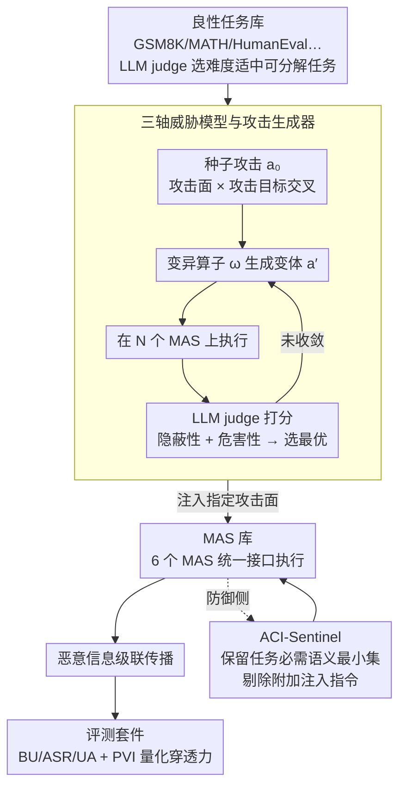

# ACIArena: Toward Unified Evaluation for Agent Cascading Injection

**会议**: ACL 2026  
**arXiv**: [2604.07775](https://arxiv.org/abs/2604.07775)  
**代码**: https://github.com/Greysahy/aciarena  
**领域**: LLM 推理 / 多智能体安全  
**关键词**: 多智能体系统, 级联注入, ACI 攻击, MAS 鲁棒性, ACI-Sentinel

## 一句话总结
本文构造了首个针对"代理级联注入 (Agent Cascading Injection, ACI)"攻击的统一评测框架 ACIArena，覆盖 6 个主流多智能体系统 (MAS)、3 大攻击面 (Adversarial Input / Malicious Agent / Message Poison)、3 大攻击目标 (Hijacking / Disruption / Exfiltration) 的 1356 个测试用例，并提出极简但有效的防御 ACI-Sentinel，把 Hijacking 攻击成功率从 92.78% 压到 8.06%。

## 研究背景与动机
**领域现状**：MetaGPT、AutoGen、CAMEL、AgentVerse 等 LLM 多智能体系统已被 Cursor、Salesforce Agentforce 等工业产品大规模采用，通过专家分工和 A2A 协议提升复杂任务（编程、数学推理）的效果。

**现有痛点**：MAS 通过大量 agent 间消息传递放大了 prompt injection 的危害——一个被入侵的 agent 通过同伴信任把恶意指令级联到全系统，作者把这种现象命名为 **Agent Cascading Injection (ACI)**。但目前研究有三个明显缺陷：(1) **威胁面不全**：现有工作要么只攻 profile 要么只攻 message，目标也局限在系统瘫痪或隐私泄露；(2) **评测设置非标准**：很多研究自建简化 MAS，无法横向比较；(3) **代码库不可扩展**：MASLab 等只提供统一执行入口，缺少攻防模块。

**核心矛盾**：要研究 MAS 安全，必须同时控制 MAS 实现、攻击策略、攻击面三个变量，但现有工作每篇只在自定义环境里改其中一个变量，结论无法迁移。

**本文目标**：建立一个 (i) 覆盖多攻击面与目标的、(ii) 标准化的、(iii) 模块化可扩展的 MAS 鲁棒性评测框架。

**切入角度**：作者从 agent 形式化定义 $\mathcal{A} = (\pi, \mathcal{P}, \mathcal{M}, \mathcal{T})$ 出发枚举所有可能被注入的组件（指令 $\mathcal{I}$、profile $\mathcal{P}$、memory $\mathcal{M}$、tool 描述 $\mathcal{T}$、消息边 $\mathcal{E}$），把所有 ACI 攻击归到 3 个攻击面，再交叉 3 个攻击目标，构成 9 个评测格子。

**核心 idea**：用"攻击面 × 攻击目标"二维矩阵 + 标准化 MAS/攻防接口，把 MAS 鲁棒性研究变成可横向比较的科学实验。

## 方法详解

### 整体框架
ACIArena 由四个模块组成：**良性任务库**（Benign Tasks，从 GSM8K、MATH500、HumanEval、MBPP、GPQA、MedMCQA 中用 LLM judge 按难度/可分解性/低歧义筛选）；**攻击库**（Attacks，28 种 ACI 攻击，覆盖 3 攻击面 × 3 攻击目标，通过 generate-mutate-select 循环自动优化生成）；**MAS 库**（MAS Library，重构 6 个 MAS 到统一接口）；**评测套件**（Evaluation Suites，1356 测试用例 + BU/ASR/UA/PVI 四类指标）。攻击执行时由攻击者把恶意 prompt 注入到指定攻击面，观察恶意信息在 MAS 内的级联传播与最终输出。

### 关键设计
**1. 三轴威胁模型与攻击生成器：把所有 ACI 攻击形式化为"攻击面 × 攻击目标 × MAS"，并让 LLM 自动写攻击**

手工写攻击 prompt 既慢又难穷举，更没法在新 MAS 出现时快速跟上。本文先从 agent 形式化定义 $\mathcal{A}=(\pi,\mathcal{P},\mathcal{M},\mathcal{T})$ 出发，把可注入组件归到三个攻击面：**Adversarial Input** 注入指令/记忆/工具描述任一输入组件（$\mathcal{I}/\mathcal{M}/\mathcal{T}$）；**Malicious Agent** 篡改 profile $\mathcal{P}$ 让 agent 自主输出恶意消息；**Message Poison** 在通信边 $(\mathcal{A}_i,\mathcal{A}_j)\in\mathcal{E}$ 上拦截并替换消息。再交叉三个攻击目标——Hijacking（劫持执行）、Disruption（拉低任务成功率）、Exfiltration（窃取敏感信息）。攻击 prompt 由 generate-mutate-select 循环优化：从手工种子 $a_0$ 出发，每轮采样变异算子 $\omega\in\Omega$ 生成变体 $a'=\omega(a_t)$，在 $N$ 个 MAS 上执行得到响应，再用 LLM judge 按 stealthiness（与该攻击面 benign prompt 的相似度）加 harmfulness（响应与原始目标的对齐度）打分选最优。这样框架就能随新 MAS、新模型自动扩展攻击库，保持长期可用。

**2. Propagation Vulnerability Index (PVI)：把评测从"输出层"下沉到"过程层"，量化恶意信息的穿透力**

只看最终响应的 ASR 会抹掉两种关键差异——"局部成功但被下游纠正"和"穿透多层依旧成功"在终态上可能一样，但安全含义天差地别。PVI 定义为

$$\mathrm{PVI}=\sum_{a_i\in\mathcal{A}}\frac{L_{a_i}}{\sum_{a_j\in\mathcal{A}}L_{a_j}}\,\mathrm{ASR}_{a_i},$$

其中 $L_{a_i}$ 是 agent $a_i$ 到最终响应的最小拓扑距离，$\mathrm{ASR}_{a_i}$ 是以该 agent 为入侵起点时的攻击成功率。入侵点离终点越远却仍能得手，权重越大；PVI 越高，说明这套 MAS 的"传染性"越强。它让评测能看出拓扑与角色设计对级联传播的真实影响，而不只是终态成败。

**3. ACI-Sentinel：不识别"坏的"，而是强制保留"任务必需的好的"**

现有防御（BERT detector、Delimiter、Sandwich、AGrail、G-Safeguard）大多想先识别"可疑消息"再过滤，但 ACI 攻击常伪装成正常 agent 输出，识别极难，过度过滤还会压垮系统效用甚至放大攻击——实验里 G-Safeguard 在 AutoGen Hijacking 上把 ASR 从 92.78 拉到 67.22，UA 却跌到 15.56。作者从 benchmark 的大规模观测发现，攻击的共同套路是"在合法消息里嵌入额外指令"，于是把防御思路彻底翻转：不去判断哪条消息坏，而是枚举完成当前任务所必需的语义最小集（task-aligned semantic minimality），把超出这个集合的一切指令和元信息全部剔除，附加注入便自动消失。这种"以语义最小性而非可疑性为锚"的做法在 AutoGen 上把 Hijacking ASR 从 92.78% 压到 8.06%、Exfiltration ASR 从 54.00% 压到 0.22%，而 UA 只小幅下降。

### 损失函数 / 训练策略
攻击生成是黑盒优化，无需梯度访问，目标为 $J(a') = J_{\text{stealth}}(a' | c) + \frac{1}{N}\sum_{j=1}^N J_{\text{harm}}(\mathcal{S}^{(j)}(a'), a_0)$，两项分别由 LLM judge 打分。MAS 与防御本身不引入新训练。

## 实验关键数据

### 主实验：6 MAS × 3 攻击目标的鲁棒性（GPT-4o-mini，节选 Math/Code 域）

| 域 | MAS | BU | Hijacking ASR | Disruption ASR | Exfiltration ASR |
|----|-----|-----|---------------|----------------|------------------|
| Math | CAMEL | 41.0% | 7.05% | 37.44% | 22.56% |
| Math | AutoGen | 72.7% | 19.23% | 52.65% | 48.38% |
| Math | AgentVerse | 74.4% | 26.71% | 54.70% | 40.51% |
| Math | Self Consistency | 73.5% | 27.99% | 74.53% | 43.59% |
| Math | LLM Debate | 69.2% | 16.88% | 64.79% | 57.27% |
| Code | CAMEL | 14.4% | 20.28% | 59.11% | 26.00% |
| Code | AutoGen | 51.1% | 80.83% | 90.89% | 77.55% |
| Code | AgentVerse | 57.8% | 48.05% | 45.78% | 80.45% |
| Code | MetaGPT | 51.1% | 100.00% | 88.89% | 80.22% |
| Code | Self Consistency | 52.8% | 95.00% | 76.89% | 80.00% |
| Code | LLM Debate | 54.4% | 100.00% | 86.67% | 80.22% |

### 消融实验：AutoGen 上 6 种防御对比

| 防御 | BU 保持 | Hijacking ASR | Disruption ASR | Exfiltration ASR |
|------|---------|---------------|----------------|------------------|
| 无防御（基线）| 57.78% | 92.78% | 96.44% | 54.00% |
| +BERT Detector | 45.56% | 96.39%（反升）| 99.78%（反升）| 36.67% |
| +Delimiter | 55.56% | 95.56% | 96.67% | 44.22% |
| +Sandwich | 66.67% | 79.72% | 78.67% | 60.00% |
| +AGrail | 32.22% | 35.56%（UA 大跌）| 96.44% | 29.33% |
| +G-Safeguard | 40.00% | 67.22%（UA 大跌）| 96.44% | 34.00% |
| **+ACI-Sentinel** | 52.22% | **8.06%** | 82.89% | **0.22%** |

### 关键发现
- **拓扑不能单独解释鲁棒性**：同样是 5 agent，AgentVerse 与 CAMEL 鲁棒性差异巨大；同一拓扑下换 agent profile（A/B/C 三种 GPT-4o 生成配置）后，Corba 攻击 ASR 也大幅波动。这驳斥了"仅靠拓扑评估 MAS 安全"的常见做法。
- **简单拓扑反而更脆弱**：MetaGPT、Self Consistency 这类局部视野的拓扑在 Hijacking 上 ASR 接近 100%，因为隐式信任直接执行恶意指令。
- **utility-security trade-off 普遍存在**：CAMEL 的 Hijacking ASR 接近 0，但其 UA 也极低（部分场景仅 7%）——并非"防住了"，而是"压根没成功执行"。需要把 BU/UA 联合考察才能避免被这种假鲁棒性误导。
- **代码生成域是 MAS 重灾区**：多个 MAS 在 Code 上的 Hijacking ASR 达 90-100%，因为代码是可执行语言且结构复杂，恶意指令容易嵌入且难检测。
- **关键角色 + 受控交互是鲁棒性的关键**：AgentVerse 与 CAMEL 都有 critic 角色，前者交互密集鲁棒但泄密强，后者单向交互鲁棒且抑制传播；MetaGPT 的结构化 profile 也明显抑制级联。
- **现有防御常常失效甚至反向**：BERT Detector 在 AutoGen Hijacking 上把 ASR 从 92.78% 反推到 96.39%；AGrail/G-Safeguard 直接压垮系统效用。这说明在简化环境下设计的防御无法迁移到真实 MAS。

## 亮点与洞察
- **统一接口的工程贡献被低估**：把 6 个异构 MAS 重构到同一执行入口才让公平比较成为可能；这种"基础设施贡献"对未来 MAS 安全研究是 enabler。
- **PVI 把过程纳入评测**：传统 ASR 只看终态，PVI 暴露了"agent-level 传播强度"——同样的终态 ASR 可能对应完全不同的级联模式，这对设计针对性防御很关键。
- **ACI-Sentinel 的反直觉洞察**：把防御目标从"识别坏"翻转为"保留好"，规避了 detector 误检与攻击者绕过的猫鼠游戏；语义最小化在保 BU 的同时把 Hijacking ASR 压到接近 0，是少数能真正落地的防御。
- **"代码 = 最危险域"的预警**：作者用数据揭示 MAS 在代码生成场景的脆弱性，对 Cursor 这类产品有直接安全启示。

## 局限与展望
- **作者承认**：(1) 遵循 Byzantine Fault Tolerance 假设单一恶意 agent，对多恶意 agent 联合攻击未做系统评测；(2) 攻击生成依赖 LLM judge，可能存在评估偏差。
- **额外局限**：评测主要在 GPT-4o-mini / GPT-4o / Qwen2.5-7B 上，更大模型（如 Claude Opus、Gemini 3 Pro）下的趋势未验证；ACI-Sentinel 的"语义最小性"判定本身依赖 LLM，理论上也可被对抗 prompt 绕过（adaptive attack 在附录中已被讨论）。
- **改进方向**：(i) 把评测扩展到多 agent 同时被入侵的"协同攻击"；(ii) 设计可形式化验证的"task semantic envelope"，把 ACI-Sentinel 从启发式提升为可证明属性；(iii) 探索基于拓扑动态裁剪的主动防御——当检测到某条边异常时自动断连。

## 相关工作与启发
- **vs AgentDojo / Agent Security Bench**（Debenedetti 2024、Zhang 2024a）：他们针对单 agent 设置，本文首次系统覆盖 MAS 内部级联，揭示多 agent 通信带来的新攻击面。
- **vs Corba**（Zhou 2025）：他们专注 contagious recursive blocking 攻击，本文把这类攻击纳入更大的 ACI 框架，并对比不同攻击面与目标。
- **vs G-Safeguard / AGrail**：本文不仅评测这些现有防御，还首次量化它们在真实 MAS 上的失败模式（功能损害大于安全收益），并以 ACI-Sentinel 提出更优替代。
- **vs NetSafe**（Yu 2025）：他们从拓扑视角评估 MAS 安全，本文实证表明"仅看拓扑不够"，必须联合角色设计与交互模式。

## 评分
- 新颖性: ⭐⭐⭐⭐⭐ "Agent Cascading Injection"作为统一概念首次提出；"三轴评测 + PVI + 语义最小性防御"三件套都是原创。
- 实验充分度: ⭐⭐⭐⭐⭐ 6 MAS × 4 域 × 3 目标 × 3 攻击面 × 3 LLM = 极大规模评测；防御对比 + 适应性攻击 + LLM judge 可靠性都做了。
- 写作质量: ⭐⭐⭐⭐ 形式化定义清晰，攻击面/目标矩阵直观；表格密集导致部分讨论需要反复对照。
- 价值: ⭐⭐⭐⭐⭐ 对所有部署 MAS 的团队是直接可用的安全测试床；ACI-Sentinel 的"语义最小性"思路可启发更广义的 LLM 安全防御设计。

<!-- RELATED:START -->

## 相关论文

- [\[ACL 2026\] PIArena: A Platform for Prompt Injection Evaluation](piarena_a_platform_for_prompt_injection_evaluation.md)
- [\[ACL 2026\] MUSE: A Run-Centric Platform for Multimodal Unified Safety Evaluation of Large Language Models](muse_a_run-centric_platform_for_multimodal_unified_safety_evaluation_of_large_la.md)
- [\[ICML 2026\] BioAgent Bench: An AI Agent Evaluation Suite for Bioinformatics](../../ICML2026/llm_safety/bioagent_bench_an_ai_agent_evaluation_suite_for_bioinformatics.md)
- [\[ACL 2026\] Subject-level Inference for Realistic Text Anonymization Evaluation](subject-level_inference_for_realistic_text_anonymization_evaluation.md)
- [\[ACL 2026\] Permutation-Consensus Listwise Judging for Robust Factuality Evaluation](permutation-consensus_listwise_judging_for_robust_factuality_evaluation.md)

<!-- RELATED:END -->
