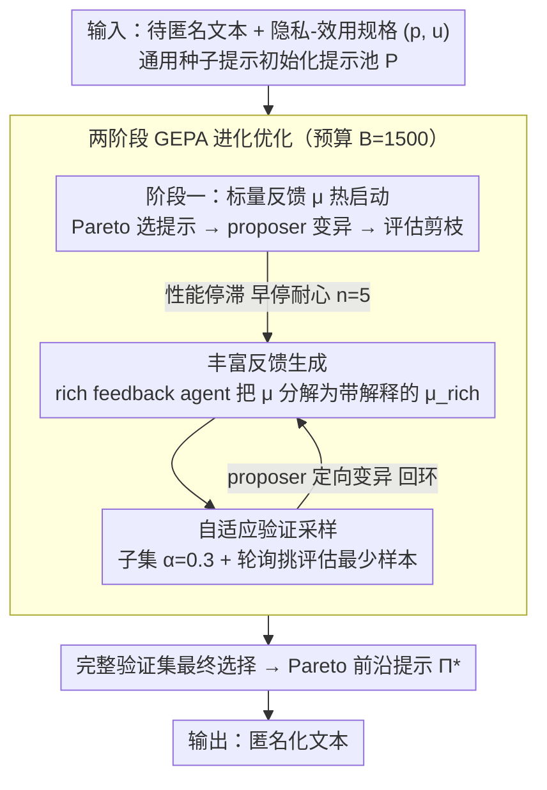

# Adaptive Text Anonymization: Learning Privacy-Utility Trade-offs via Prompt Optimization

**会议**: ACL 2026 Findings  
**arXiv**: [2602.20743](https://arxiv.org/abs/2602.20743)  
**代码**: [https://github.com/gabrielloiseau/adaptive-text-anonymization](https://github.com/gabrielloiseau/adaptive-text-anonymization)  
**领域**: AI Safety  
**关键词**: 文本匿名化, 隐私保护, 提示优化, 进化算法, 隐私-效用权衡

## 一句话总结

提出自适应文本匿名化框架，通过进化式提示优化自动为LLM发现任务特定的匿名化指令，在多个隐私-效用权衡场景中超越手工设计的策略，且可在开源模型上运行。

## 研究背景与动机

**领域现状**：文本匿名化是实现敏感数据共享和分析的基础技术。目前的方法主要分为传统的序列标注（检测并掩码PII实体）和基于LLM的对抗协作管线（如AF方法中使用攻击者LLM引导匿名化决策）。

**现有痛点**：现有LLM匿名化管线存在三大限制：（1）固定权衡范式——每个场景手动设计一个策略，无法灵活适应新需求；（2）依赖人工提示工程，主观、费力且效果欠佳；（3）大多依赖闭源API模型（如GPT-4/5），处理敏感数据通过外部API本身就与隐私目标矛盾。

**核心矛盾**：匿名化本质上是高度上下文依赖的——医疗报告和社交评论的匿名化策略截然不同，不存在"一刀切"的方案，但现有方法无法自适应地调整策略。

**本文目标**：设计一个自适应框架，能够（1）自动发现针对特定隐私-效用需求的匿名化提示，（2）在开源模型上运行，（3）在单次优化中发现多个Pareto最优策略。

**切入角度**：将匿名化问题重新定义为"字符串发现"问题——不修改模型参数，而是搜索最优的自然语言指令来引导模型行为。

**核心 idea**：利用进化式提示优化算法（GEPA）自动搜索匿名化提示空间，从一个通用种子提示出发进化出任务适应的指令，实现自适应的隐私-效用权衡。

## 方法详解

### 整体框架

这篇论文要解决的是：匿名化策略高度依赖上下文（医疗报告和社交评论的脱敏需求截然不同），但现有 LLM 匿名化管线要么手工写死一个固定权衡，要么依赖闭源 API——而把敏感数据送进外部 API 本身就和隐私目标矛盾。作者的思路是把匿名化重新定义成一个「字符串发现」问题：不改模型参数，只搜索一条最优的自然语言指令来引导开源模型。

整体流程是：给定待匿名化文本和一个隐私-效用任务规格 $(p, u)$，从一条通用种子提示出发，用进化式提示优化（GEPA）在固定计算预算 $B=1500$ 次 LLM 前向内搜索匿名化指令 $\Pi^*$，最后输出匿名化文本。搜索分三步走——先初始化提示池，再用粗粒度标量反馈热启动，性能停滞后切换到带自然语言解释的丰富反馈做精炼。

### 关键设计

**1. 两阶段 GEPA 进化优化：把「单一固定权衡」换成「一次跑出一整条 Pareto 前沿」**

旧管线的固定权衡范式每换一个场景就得重新手工设计一条策略，既不灵活也调不出多个权衡点。这里维护一个提示池 $P$，每轮迭代用 Pareto 排序挑出既高性能又多样的提示，由 proposer agent 读完执行轨迹和反馈后提出变异，新候选在验证集上评估、经 Pareto 剪枝后纳入池中。第一阶段只用简单的标量聚合反馈 $\mu$ 驱动搜索，当性能停滞时（早停耐心 $n=5$）才升级到第二阶段的丰富反馈精炼。之所以选进化搜索，是因为它天然支持多目标——隐私和效用本就互相拉扯，进化能在一次运行里铺开从隐私优先到效用优先的多个 Pareto 最优解，而不是收敛到某一个写死的权衡点。

**2. 丰富反馈生成机制：让 proposer 知道「哪里差、怎么改」，而不只是「分数低」**

标量反馈 $\mu$ 太粗，proposer 拿到一个数字根本看不出该往哪个方向改。于是在精炼阶段引入一个独立的 rich feedback agent（专门的 LLM），把聚合指标 $\mu$ 分解成带自然语言解释的结构化反馈 $\mu_{rich}$，给 proposer 一个可解释的定向改进信号，使它能一次做出幅度更大、方向更准的行为更新。这样在剩余预算里就能用更少的评估次数把提示推到更优，而不是在标量信号下盲目试错。

**3. 自适应验证采样：把宝贵的评估预算花在刀刃上**

每次都在全验证集上评估候选提示会很快烧光 $B=1500$ 的预算。精炼阶段改成只在一个采样子集 $D'_{valid} \subset D_{valid}$ 上评估，采样比例 $\alpha=0.3$，并用轮询策略优先挑那些被评估次数最少的样本，保证覆盖多样性；只有到最终选择时才回到完整验证集，确保排名公平。这样既不牺牲评估的代表性，又把预算利用率显著提上去。

### 损失函数 / 训练策略

不涉及梯度训练。优化目标是隐私得分和效用得分的聚合（如平均值），靠 Pareto 选择实现多目标权衡。进化预算 $B=1500$ 次 LLM 前向传播，早停耐心 $n=5$。

## 实验关键数据

### 主实验

| 基准 | 方法 | 隐私↑ | 效用↑ |
|------|------|-------|-------|
| DB-Bio | Optimized Qwen3 | 65.5 | 100 |
| DB-Bio | AF (GPT-5) | 78.0 | 92.1 |
| TAB | Optimized Qwen3 | 92.3 | 56.2 |
| TAB | AF (GPT-5) | 59.9 | 42.5 |
| PUPA | Optimized Qwen3 | 98.0 | 79.3 |
| PUPA | AF (GPT-5) | 94.2 | 46.0 |
| MedQA | Optimized Qwen3 | 24.6 | 45.9 |
| MedQA | AF (GPT-5) | 24.4 | 45.8 |

### 消融实验

| 配置 | 隐私-效用表现 | 说明 |
|------|-------------|------|
| Seed Prompt | 基线 | 通用种子提示，无优化 |
| Task-Specific Prompt | 中等 | 人工设计的任务特定提示 |
| Optimized Prompt | 最优 | 自动优化后的提示 |
| OpenPII (实体检测) | 高效用低隐私 | 仅检测PII实体，隐私保护不足 |
| DP-Prompt ($\epsilon=100$) | 高隐私低效用 | 差分隐私噪声严重破坏效用 |

### 关键发现
- 优化后的开源Qwen3-30B在多数任务上与GPT-5基线竞争力相当甚至更优，尤其在效用保持方面
- 不同模型表现出不同的优化特征：Mistral倾向激进隐私提升（可能牺牲效用），Gemma保守改进，Qwen最鲁棒
- 单次优化运行可发现多个Pareto最优策略，覆盖隐私优先到效用优先的完整频谱

## 亮点与洞察
- 将匿名化问题转化为"字符串搜索"问题是一个巧妙的抽象，每个Pareto解只是一个自然语言字符串，存储和部署成本极低
- 进化优化天然支持多目标发现，单次运行就能找到多个不同权衡点，这比传统方法每个权衡点需要单独设计策略高效得多
- 丰富反馈机制的思路——将标量指标分解为结构化自然语言解释——可迁移到任何需要LLM自我改进的场景

## 局限与展望
- 隐私和效用指标的评估仍依赖闭源LLM（如Gemini-2.5-flash），与完全本地化部署的目标存在矛盾
- 每个任务仍需少量标注数据（111训练+111验证），非完全零样本
- 未考虑推理型模型（如CoT模型）的匿名化能力，可能是互补方向

## 相关工作与启发
- **vs AF (Staab et al.)**: AF使用固定的对抗协作策略，依赖GPT-5，本文用进化优化自动搜索策略，且可在开源模型上运行
- **vs DP-Prompt**: 差分隐私方法提供理论保证但严重损害效用，本文在实际隐私-效用权衡上远优于DP-Prompt

## 评分
- 新颖性: ⭐⭐⭐⭐ 将匿名化重新定义为提示优化问题，视角新颖
- 实验充分度: ⭐⭐⭐⭐⭐ 5个数据集、3个开源模型、多个基线和消融
- 写作质量: ⭐⭐⭐⭐ 问题定义清晰，方法描述系统
- 价值: ⭐⭐⭐⭐ 对敏感数据处理场景有直接实用价值

<!-- RELATED:START -->

## 相关论文

- [\[CVPR 2026\] Unsafe2Safe: Controllable Image Anonymization for Downstream Utility](../../CVPR2026/llm_safety/unsafe2safe_controllable_image_anonymization_for_downstream_utility.md)
- [\[ACL 2026\] Subject-level Inference for Realistic Text Anonymization Evaluation](subject-level_inference_for_realistic_text_anonymization_evaluation.md)
- [\[ICLR 2026\] Resource-Adaptive Federated Text Generation with Differential Privacy](../../ICLR2026/llm_safety/resource-adaptive_federated_text_generation_with_differential_privacy.md)
- [\[NeurIPS 2025\] InvisibleInk: High-Utility and Low-Cost Text Generation with Differential Privacy](../../NeurIPS2025/llm_safety/invisibleink_high-utility_and_low-cost_text_generation_with_differential_privacy.md)
- [\[ACL 2026\] Look Twice before You Leap: A Rational Framework for Localized Adversarial Anonymization](look_twice_before_you_leap_a_rational_framework_for_localized_adversarial_anonym.md)

<!-- RELATED:END -->
