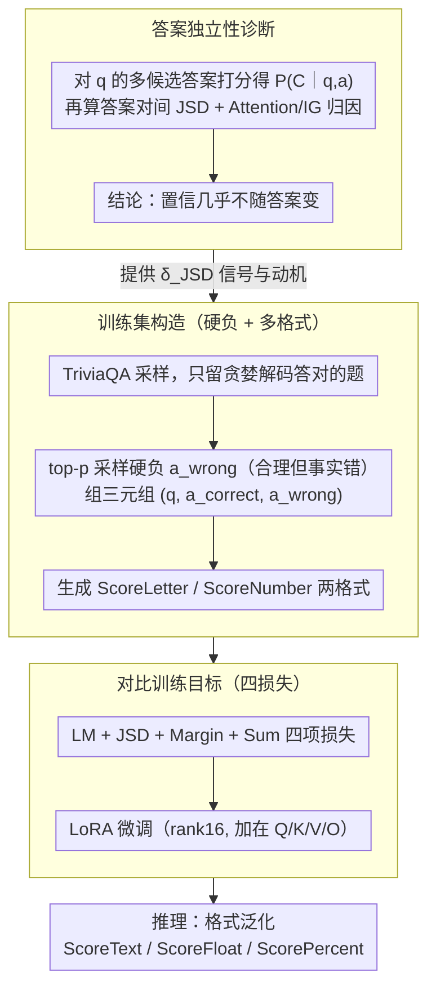

# ADVICE: Answer-Dependent Verbalized Confidence Estimation

**会议**: ACL 2026  
**arXiv**: [2510.10913](https://arxiv.org/abs/2510.10913)  
**代码**: 无  
**领域**: LLM 评测 / 置信度校准  
**关键词**: verbalized confidence, calibration, answer-grounded, contrastive fine-tuning, overconfidence

## 一句话总结
本文通过 JSD 与归因分析诊断出 LLM 口头置信度过自信的根因是「置信度几乎不依赖于自己生成的答案」，并提出基于对比答案对的轻量微调框架 ADVICE，用 JSD/Margin/Sum 三项损失强迫置信度分布对正确答案显著高于错误答案，在保持任务精度的同时把 Gemma2-9b 在 TriviaQA 的 ECE 从 21.9% 压到 6.2%。

## 研究背景与动机

**领域现状**：LLM 的可信使用越来越依赖「让模型说出自己的置信度」（verbalized confidence），即输出答案的同时给出 0-9 的整数、A-E 的字母或 0-100 的百分比作为置信打分。该范式相对 post-hoc logit 校准更通用、对黑盒 API 友好，并已被 Lin、Tian、Xiong 等系列工作推广。

**现有痛点**：实测中 LLM 几乎总是给出极高分（10/10 或 A），无论答案是否正确，导致 ECE 普遍在 20%-50%。已有缓解方法分三类——prompt 工程、self-consistency 采样以及 ConfTuner 等针对 token 概率重新拟合的微调——都侧重「怎么压自信」，几乎没人分析「为什么会自信」。

**核心矛盾**：作者通过两组诊断实验发现根因在于「答案独立性」。一是固定问题 $q$，让模型对 30 个不同候选答案 $a_i$ 都打一次置信，计算分布 $P_M(C\mid q,a_i)$ 之间的 Jensen-Shannon 散度，发现 JSD 在 0 附近高度集中，多数样本 $\mathrm{JSD}\le0.1$，即换答案几乎不换置信；二是用 Attention Rollout 和 Integrated Gradients 度量「置信 token → 答案 token」的注意力流和梯度归因，发现该路径权重远低于「答案→问题」「置信→问题」，甚至低于 BOS 等无意义 token。

**本文目标**：把「置信度真正以答案为条件」作为优化目标，而不是泛泛地降低输出分布的最大值，从而在校准、泛化与任务精度三方面同时不退化。

**切入角度**：把训练样本组织成三元组 $(q,a_{\text{correct}},a_{\text{wrong}})$，用对比损失逼迫模型对相同问题、不同答案给出可区分且方向正确的置信分布——这是从根因「答案独立性」直接出方案。

**核心 idea**：「不要直接拟合置信度数值，而是直接拟合 $P(C\mid q,a)$ 对答案的敏感性」。

## 方法详解

### 整体框架
ADVICE 是一个基于 LoRA 的对比微调框架。流程：（1）从 TriviaQA 训练集采样 4000 题，仅保留模型贪婪解码答对的题目；（2）对每题用随机采样得到一个「语义合理但事实错误」的硬负答案 $a_{\text{wrong}}$，配上原正确答案 $a_{\text{correct}}$ 组成三元组；（3）按 ScoreLetter 与 ScoreNumber 两种格式各生成一份训练数据；（4）在每个三元组上同时计算 LM 损失（保持问答能力）+ JSD 损失（拉开置信分布）+ Margin 损失（方向正确）+ Sum 损失（绝对约束），用 AdamW 与 LoRA（rank=16, α=32, 加在 Q/K/V/O）微调 4 epoch；（5）推理时格式可以泛化到训练未见过的 ScoreText/ScoreFloat/ScorePercent。

### 关键设计

**1. 诊断驱动的答案独立性度量：先把「过自信的根因」量化出来，再拿它当训练信号**

以往把过自信归咎于「训练数据高频高分」「RLHF 偏好乐观回答」这类模糊解释，没人能测。作者的做法是对每个问题 $q$ 和候选答案 $a$，把置信 token 的输出概率重投影到一个固定离散取值集合 $C$（如 0-9），得到分布 $P_M(C\mid q,a)$，再对训练集中所有 $(a_i, a_j)$ 答案对计算 JSD 作为「答案敏感度」的直接证据；同时用 Attention Rollout（递归聚合 $0.5W_{\text{att}}+0.5I$ 跨层）和 Integrated Gradients（$n\_steps=1024$）去验证「置信 token → 答案 token」这条归因路径。诊断结论指向同一个根因——置信度几乎不随答案变。只有把这个独立性指标显式写进训练目标，才能从源头改善校准，而不是事后去压最大概率。

**2. 格式泛化与硬负采样的训练集构造：先造出能逼模型「换答案换置信」的数据，并提升对相似错误答案的辨识力**

找到根因后，第一步是把训练数据组织成能体现答案敏感性的形式。如果硬负样本错得太离谱，区分就太容易，模型学不到细粒度辨识。作者用原模型 top-$p$ 采样得到「语义合理、上下文相关但事实错误」的硬负（例如问 Mike Tyson 1998 拳照的颁发州，正确是 Nevada，硬负取 California），与原正确答案组成三元组 $(q,a_{\text{correct}},a_{\text{wrong}})$。训练阶段只用 ScoreLetter（E/D/C/B/A 映射到 0.1-0.9）和 ScoreNumber（0-9 映射到 $i/9$）两种格式，并在同一 mini-batch 内强制单一表达格式以稳定优化；推理时则能扩展到 ScoreText、ScoreFloat、ScorePercent。这种「多格式训练 + 单 batch 同格式」既保证了对训练未见格式的泛化，又稳住了梯度——Table 4 显示 Gemma2 在 TriviaQA-Float 上 ECE 从 27.5 降到 6.2。

**3. 三元组对比训练目标：用四项损失逼模型对正确/错误答案给出方向正确、可区分、归一化的置信**

有了三元组数据，还需要一个直接攻击「答案独立性」的目标函数。ADVICE 在每个三元组上定义四项损失：$\mathcal{L}_{\mathrm{LM}}$ 是 $a_{\text{correct}}$ 的 NLL，保住 QA 能力；$\mathcal{L}_{\mathrm{JSD}}=\max(0,\delta_{\mathrm{JSD}}-D_{\mathrm{JSD}}(P_{\text{correct}}\Vert P_{\text{wrong}}))$ 强制两分布散度至少为 $\delta_{\mathrm{JSD}}=0.6$（接近 $\ln 2\approx 0.693$ 的上界）；$\mathcal{L}_{\mathrm{Margin}}=\max(0,\delta_{\mathrm{Margin}}-(\mu_{\text{correct}}-\mu_{\text{wrong}}))$ 强制正确答案的期望置信比错误答案高 $\delta_{\mathrm{Margin}}=1$；$\mathcal{L}_{\mathrm{Sum}}=|1-(\mu_{\text{correct}}+\mu_{\text{wrong}})|$ 强制两者之和约等于 1，对应「正确率约为 1 时该答案就该几乎完全可信」的语义。总损失是四项等权相加 $\mathcal{L}=\mathcal{L}_{\mathrm{LM}}+\mathcal{L}_{\mathrm{JSD}}+\mathcal{L}_{\mathrm{Margin}}+\mathcal{L}_{\mathrm{Sum}}$。三项缺一不可：单用 JSD 只保证「分布不同」但方向可能颠倒，单用 Margin 又缺乏对分布形状的控制、会让两分布都偏高，而 Sum 项把「置信度=正确概率」的定义硬写进损失，避免训练后整体保守化（消融已证实）。

### 损失函数 / 训练策略
四项损失等权相加；LoRA rank=16，α=32，加在 Q/K/V/O 投影；AdamW + 5% warmup + 线性衰减，lr 为 Mistral $3\times 10^{-5}$、其余 $1\times 10^{-5}$；batch 16、gradient accumulation 2、4 epoch；单卡 H200。

## 实验关键数据

### 主实验
在 TriviaQA（同分布）+ MMLU、LogiQA（OOD）上对比 Default、Prompting、Self-Consistency、ConfTuner，覆盖 Llama-3.1-8B、Mistral-7B-v0.3、Gemma-2-9b，主要指标 ECE/|NCE|/Brier/AUROC（前三越低越好）。

| 模型 | 数据集 | 指标 | Default | ConfTuner | ADVICE | ADVICE+ConfTuner |
|------|--------|------|---------|-----------|--------|------------------|
| Gemma2-9b | TriviaQA | ECE↓ | 21.9 | 5.7 | 6.2 | 3.4 |
| Gemma2-9b | TriviaQA | AUROC↑ | 52.7 | 82.7 | 77.4 | 77.1 |
| Gemma2-9b | MMLU | ECE↓ | 21.0 | 11.0 | 5.6 | 11.7 |
| Gemma2-9b | LogiQA | ECE↓ | 39.1 | 18.4 | 11.9 | 8.0 |
| Llama3.1-8B | TriviaQA | ECE↓ | 16.9 | 5.2 | 10.4 | 9.4 |
| Llama3.1-8B | MMLU | ECE↓ | 26.9 | 13.9 | 8.6 | 9.6 |

ADVICE 在 OOD 上 24 个对比中 19 次优于 ConfTuner，且 ADVICE+ConfTuner 普遍能进一步压低 ECE，说明两者互补。

### 消融实验
Gemma2-9b 在 TriviaQA / MMLU 上的训练目标消融（ECE↓）：

| 训练目标 | TriviaQA ECE | MMLU ECE | 说明 |
|----------|--------------|----------|------|
| LM 单独 | 23.0 | 22.5 | 等效未训练 |
| LM+JSD | 8.6 | 13.2 | 拉开分布但方向不保 |
| LM+Margin | 16.8 | 21.9 | 方向对但分布粗糙 |
| LM+Sum | 21.1 | 19.5 | 仅约束总和无效 |
| LM+JSD+Margin | 11.0 | 14.3 | 缺 Sum，OOD 偏弱 |
| LM+JSD+Sum | 15.3 | 7.5 | 缺方向约束，ID 反弹 |
| ADVICE (全) | **6.2** | **5.6** | 三项缺一不可 |

### 关键发现
- 「答案 mask 实验」最关键：把 $a$ 替换成等长 `<pad>` 后，Default 的置信分布仍集中在 A/9 区间（说明置信几乎独立于答案），而 ADVICE 会把概率质量明显推向 E/0/1（即「不知道」），证明 ADVICE 真正学到了对答案的依赖。
- 微调过程中 IG 归因 Top-K token 里答案 token（如 `_Exile`）的排名从训练初的第 10 之外攀升到前 5，定量验证 ADVICE 强化了 attention/gradient 层面的答案敏感度。
- ADVICE 在 token 预算上同时是性能与效率最优解（图 7）：自一致性方法多采样 5 次但 ECE 没明显改善；ADVICE 单次推理即可达到 ConfTuner 同档校准，token 预算最低。

## 亮点与洞察
- 「先诊断再开药」的研究范式：先用 JSD + Attention Rollout + IG 三种独立工具量化「答案独立性」这一根因，再让损失函数直接攻击根因。比起把所有黑箱症状一起塞进 KL 回归，方法的可解释性高得多。
- $\mathcal{L}_{\mathrm{Sum}}=|1-(\mu_{\text{correct}}+\mu_{\text{wrong}})|$ 是被严重低估的设计：它把「置信度对应正确概率」这条定义直接转化为约束，避免训练后所有答案都被压低（保守化偏差）。
- 实验里的「答案掩码反事实」是 verbalized confidence 研究里少见的因果验证范式，可迁移到任何「输出应基于某段输入」的可信任务（如 attribution、引用、tool call 选择）。

## 局限与展望
- 仅在短答 QA 与选择题验证，长上下文/复杂推理（如多跳、agent）下答案 token 边界与「置信对应答案」的语义尚不清晰。
- 校准指标与任务精度耦合：在 SciQ 等 >90% 准确率任务上，连 Default 都看起来很校准（附录 Table 7 显示 ADVICE 反而稍差），提示需要更难的基准来真正区分校准方法。
- 训练依赖模型自生成硬负，构造成本随模型规模线性增长；对低能力模型可能采不到「合理但错」的硬负，限制方法适用范围。

## 相关工作与启发
- **vs ConfTuner**: ConfTuner 直接把 token 概率分布对齐到 Brier score，是「数值拟合」；ADVICE 则用对比三元组直接约束「对答案的敏感性」，是「机制对齐」。OOD 上 19/24 优势 + 与 ConfTuner 互补，说明二者攻击的是不同维度的过自信。
- **vs Self-Consistency**: Self-Consistency 用 5 次采样的加权平均近似真置信，token 成本上升 5 倍但 ECE 改善有限；ADVICE 单次推理即可。
- **vs Prompting/RLHF 校准**: 那些方法没有提供「为什么过自信」的解释；本工作把根因归到答案独立性后，未来 RLHF 奖励设计中也可以加入「换答案要换置信」的偏好对。

## 评分
- 新颖性: ⭐⭐⭐⭐ 「答案独立性」根因诊断与对应对比损失是真正的新机制，但思路与 process supervision/对比学习同源。
- 实验充分度: ⭐⭐⭐⭐ 3 模型 × 3 数据集 × 5 格式 + 5 项消融 + 答案掩码反事实 + IG 跟踪，少见的密度。
- 写作质量: ⭐⭐⭐⭐ 诊断-方法-验证三段式逻辑清晰，公式与 takeaway 段落突出。
- 价值: ⭐⭐⭐⭐ 对部署黑盒 LLM 的可信化（医疗/法律）有直接帮助，且与 ConfTuner 等正交，可插拔。

<!-- RELATED:START -->

## 相关论文

- [\[ACL 2026\] Illusions of Confidence? Diagnosing LLM Truthfulness via Neighborhood Consistency](illusions_of_confidence_diagnosing_llm_truthfulness_via_neighborhood_consistency.md)
- [\[ACL 2026\] Please Refuse to Answer Me: Mitigating Over-Refusal in LLMs via Adaptive Contrastive Decoding](please_refuse_to_answer_me_mitigating_over-refusal_in_large_language_models_via_.md)
- [\[ACL 2026\] Evaluating Answer Leakage Robustness of LLM Tutors against Adversarial Student Attacks](evaluating_answer_leakage_robustness_of_llm_tutors_against_adversarial_student_a.md)
- [\[NeurIPS 2025\] Probabilistic Reasoning with LLMs for K-Anonymity Estimation](../../NeurIPS2025/llm_safety/probabilistic_reasoning_with_llms_for_k-anonymity_estimation.md)
- [\[AAAI 2026\] The Confidence Trap: Gender Bias and Predictive Certainty in LLMs](../../AAAI2026/llm_safety/the_confidence_trap_gender_bias_and_predictive_certainty_in_llms.md)

<!-- RELATED:END -->
