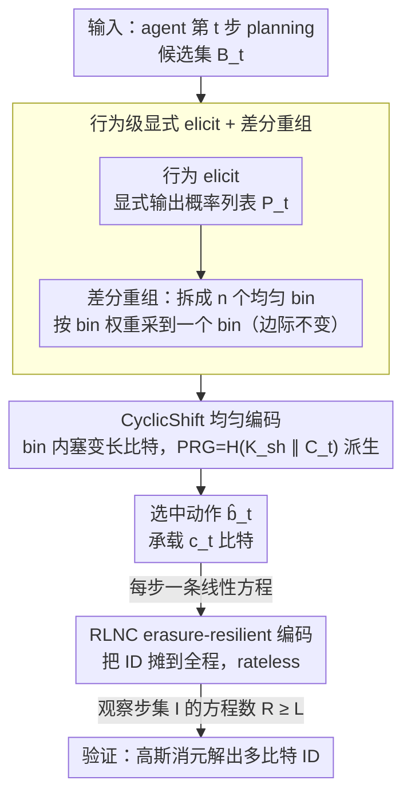

# AgentMark: Utility-Preserving Behavioral Watermarking for Agents

**会议**: ACL 2026  
**arXiv**: [2601.03294](https://arxiv.org/abs/2601.03294)  
**代码**: https://github.com/Tooooa/AgentMark (有)  
**领域**: LLM 安全 / 水印 / Agent 治理  
**关键词**: agent watermarking, planning behavior, distribution-preserving sampling, erasure-resilient coding, provenance

## 一句话总结
AgentMark 把 LLM agent 的「下一步选什么 tool / subgoal」建模为一个时间变化的离散信道，通过显式 elicit 行为分布 $P_t$ 并应用 FDPSS 式分布保持采样把多比特 ID 嵌入 planning 决策，配合 RLNC 编码使得即便 trace 被裁剪/删步也能从残余日志恢复水印；在 ALFWorld、ToolBench、OASIS 三类任务上既不掉准确率（保持任务 SR 与 baseline 差异 <0.7 pp），又能稳定提供 1.2-2.3 bps 的多比特容量，且与 SynthID-Text 的内容层水印正交可叠加。

## 研究背景与动机

**领域现状**：LLM 内容水印（KGW、SynthID-Text 等）已能可靠归因模型生成的文本，Google Gemini 已部署 SynthID。但 agent 真正可造成社会影响的是「行为决策序列」——选哪个 tool、走哪个 subgoal——而非最终文本。GUI 助手、金融工具调用、社交机器人都属于此类。

**现有痛点**：把内容水印直接搬到 agent 行为有三个失败模式：(1) 训练时水印需改模型权重，而 agent 多走闭源 API；(2) 推理时 token 级水印（KGW、SynthID）作用于 token 分布，但「行为」不是 token——一个「Alice bookmarked a post with the tag #TravelInspiration」会被编译成 tool call `bookmark()` + `tag(#TravelInspiration)`，水印信号在编译过程中被剥离；(3) 直接给行为概率加偏置（如 Agent Guide 的 RG 策略）会让分布漂移，错误在长程执行中复合放大，导致任务失败。

**核心矛盾**：水印要嵌入到 planning 层才能真正攻击「impersonation/IP 盗用/失控」等治理风险，但 planning 层的扰动会破坏 utility——这是矛盾的根源。

**本文目标**：实现「分布保持的行为水印」——同时满足 (a) 不改模型权重；(b) 在黑盒 API 下可用；(c) 水印嵌入后行为分布不动；(d) trace 被部分擦除/截断仍可恢复多比特 ID；(e) 与内容水印可正交叠加。

**切入角度**：把 planning 视为从隐式分布 $P_t^\star$ 采样的过程，让 agent 显式输出 $P_t \approx P_t^\star$，然后用 FDPSS 框架（差分重组 + 循环移位均匀编码）做分布保持的采样——边采样边嵌入比特，且边际分布不变。

**核心 idea**：「先把隐式策略 elicit 成显式概率列表 $P_t$，水印动作只发生在 $P_t$ 的采样过程，不动 $P_t$ 本身」。

## 方法详解

### 整体框架

AgentMark 的目标是把一个多比特 ID 嵌进 agent 的「下一步选哪个 tool / subgoal」这串决策里，且嵌完之后行为分布一点不动、被裁剪的 trace 还能恢复 ID。它把每一步 planning 看成从一个时变离散信道采样：在第 $t$ 步，agent 不再黑盒地直接吐出动作 $b_t$，而是先显式给出候选集 $\mathcal{B}_t$ 上的概率列表 $P_t$，水印只发生在「从 $P_t$ 采样」这一步，分布本身原封不动。

具体到 AgentMark-F 这个实例，单步走四道工序：先**行为 elicit** 拿到 $P_t$；再用**差分重组**把 $P_t$ 拆成若干个均匀 bin，先按 bin 权重采到一个 bin、再在 bin 内嵌信息采样，保证边际分布不变；选中 bin 后用 **CyclicShift** 把若干比特编进具体动作 $\hat b_t$，编码所用随机性由共享密钥与步上下文派生的 PRG 给出；最后这些比特通过 **RLNC** 摊到整条 trace 上，每一步都是对 payload 的一条独立线性方程，验证时只要观察到的方程数够多就能解出 ID。

### 关键设计

**1. 行为级显式 elicit + 差分重组：把水印挪到采样里，让分布纹丝不动**

痛点很直接——直接给行为概率加 bias（RG baseline）会让分布逐步漂移，错误在长程执行里复合放大，ALFWorld-ID 上 SR 因此从 89.5% 跌到 78.8%。AgentMark 的解法是让 agent 把隐式策略 elicit 成显式概率列表 $P_t$，然后用差分重组把任意分布拆成 $n$ 个均匀分布的混合：先按 $p_1\ge\dots\ge p_n$ 排序，令 $d_k=p_k-p_{k+1}$，第 $k$ 个 bin $T_k=\{b_{t,1},\dots,b_{t,k}\}$ 在内部是均匀的、权重 $q_k=k\cdot d_k$。采样时先按 $\mathrm{Cat}(q_1,\dots,q_n)$ 抽一个 bin，再在 bin 内均匀抽。

这一拆解的关键收益是边际分布严格不变——可以算出 $\Pr[\hat{b}_t=b_{t,i}]=\sum_{k=i}^n q_k/k=\sum_{k=i}^n(p_k-p_{k+1})=p_i$，恰好等于原概率。于是「水印 vs utility」的矛盾被消解：marginal 一致意味着长程执行不会因水印而漂移。更妙的是，它把「分布保持采样」这个难题转化成了「均匀分布上的隐写」——每个 bin 内部既然是均匀的，就可以套任意均匀编码方案往里塞比特。

**2. CyclicShift 均匀编码 + 密钥派生 PRG：在每个 bin 里塞接近上界的变长比特，还要编解码同步**

上一步留下一个工程问题：均匀 bin 的大小 $n$ 通常不是 2 的幂，若一律用 $\lfloor\log_2 n\rfloor$ 位就会浪费容量。CyclicShift 用一套变长 prefix-free 码来逼近上界：对大小为 $n$ 的 bin 取 $k=\lfloor\log_2 n\rfloor$、$m=n-2^k$，其中 $2^k-m$ 个 index 配 $k$ 位 codeword、$2m$ 个 index 配 $k+1$ 位，再用 PRG 派生的循环移位 $R$ 把 payload 比特映射到具体的 bin index $j$。这样每个 bin 的期望容量落在 $\mathbb{E}[c\mid n]\in[\log_2 n-0.0861,\ \log_2 n]$，几乎贴满信息论上界。

要让验证方能解码，编码和解码必须共享同一份随机性。AgentMark 让 Encoder 和 Decoder 都用 $K_t=H(K_{\mathrm{sh}}\Vert C_t)$ 派生 PRG，其中 $K_{\mathrm{sh}}$ 是共享密钥、$C_t$ 是步上下文（步索引、观察、历史）。把 seed 绑到 $C_t$ 上之后，解码方无需任何额外通信就能重建当步的随机性，对外又表现为伪随机——这正是水印能在闭源黑盒 API 下落地的关键。

**3. RLNC erasure-resilient 编码：把 ID 摊到全程，丢步截断也能解出来**

agent 的 trace 经常被平台过滤、丢步或截断，若用 repetition 编码，erasure 一高就迅速崩盘。AgentMark 改用随机线性网络编码：把第 $t$ 步嵌入的 $c_t$ 比特看成对 payload $m\in\mathbb{F}_2^L$ 的 $c_t$ 条线性方程，系数 $a_{t,j}=\mathrm{PRG}(K_t,j)\in\mathbb{F}_2^L$，每条方程形如 $y_{t,j}=\langle a_{t,j},m\rangle$。验证时只取实际观察到的步集 $\mathcal{I}\subseteq\{1,\dots,T\}$ 上的方程，拼成 $A_{\mathcal{I}}m=y_{\mathcal{I}}$（共 $R=\sum_{t\in\mathcal{I}}c_t$ 行），高斯消元即可解出 $m$。

这套设计本质上和 Fountain code 一样是「rateless」的：每一步都是一次独立的线性测量，丢掉任意子集都不影响唯一可解，只要剩下的总容量 $R\ge L$ 就行。理论上当 $R=L+\Delta$ 时矩阵满秩概率 $\ge 1-2^{-\Delta}$，误报率随 overhead $k$ 指数衰减。对一条可能被任意裁剪的长程 trace 而言，这是把多比特 ID 稳稳留住的最优健壮性策略。

### 损失函数 / 训练策略
无训练；仅推理时改采样过程。关键超参：$\delta_{\mathrm{JSD}}$（差分量化精度 $\pi$，避免概率并列引起编解码不同步）；RG baseline $\gamma=0.5$、$\delta=2.0$（仅用于对比）。

## 实验关键数据

### 主实验
ALFWorld（DeepSeek-Chat）与 ToolBench（450 任务）上的 SR 与水印容量对比：

| 环境 | 方法 | SR (%) ↑ | Steps | bps ↑ | bpt ↑ | Δs/step ↓ |
|------|------|----------|-------|-------|-------|-----------|
| ALFWorld-ID | Baseline | 89.5 | 19.7 | – | – | – |
| ALFWorld-ID | RG (Agent Guide) | 78.8 (↓10.7) | 26.1 (↑6.4) | 0 bit | 0 bit | – |
| ALFWorld-ID | **AgentMark-F** | 89.3 (↓0.2) | 19.4 (↓0.3) | 1.19 | 25.5 | +0.10 |
| ALFWorld-OOD | Baseline | 96.8 | 15.9 | – | – | – |
| ALFWorld-OOD | RG | 94.5 (↓2.3) | 15.4 | 0 bit | 0 bit | – |
| ALFWorld-OOD | **AgentMark-F** | 97.5 (↑0.7) | 14.1 (↓1.8) | 1.34 | 28.4 | −0.18 |
| ToolBench | Baseline | 59.9 | 6.7 | – | – | – |
| ToolBench | **AgentMark-F** | 59.7 (↓0.2) | 7.2 | 0.49 | 4.93 | −1.27 |

### 消融实验
关键鲁棒性与对比指标：

| 实验维度 | 设置 | 关键结果 | 说明 |
|----------|------|---------|------|
| 步丢失鲁棒（RLNC vs repetition）| 丢步率 $p\in[0,0.7]$ | RLNC 明显更稳，全局聚合后接近 100% | rateless 性质 |
| 错钥/无水印 FPR | $k\in[0,16]$ overhead | $k\ge 8$ FPR <1%，$k\ge 14$ 零误报 | $\propto 2^{-k}$ 衰减 |
| 语义改写观察 | ALFWorld-OOD 134 任务 / 2326 步 | Behavior Match 49.45%，Bit Recovery 16.84% | 改写会破坏同步但聚合仍可用 |
| 与 SynthID-Text 叠加 | ToolBench | 行为解码 100%，内容检测 96.6% | 行为层 + 内容层正交 |
| OASIS 社交模拟 | Twitter/Reddit 100 trajectory | 5 项社交质量指标几乎不掉，水印检测率高 | 持续性验证 |

### 关键发现
- RG baseline 在长程任务上明显伤 utility（ALFWorld-ID SR −10.7 pp、步数 +6.4），是「为了水印牺牲性能」的典型反例；AgentMark-F 与 baseline 差异 <1 pp 证明「分布保持」承诺被严格兑现。
- Token/latency overhead 几乎可忽略（ALFWorld Δtok/step ±0.5%，ToolBench 平均 −6.25% 因为提前终止），说明 elicit 显式分布的额外提示开销在工程上可接受。
- 行为层水印与 SynthID-Text 内容水印「攻击不同失效模式」：行为层抗 trace 截断/丢步，内容层抗内容改写——两者叠加给出更鲁棒的 provenance。
- 跨模型验证（Gemini 2.0 Flash 上 SR 几乎不变，bps 1.96-2.28）说明方法是 model-agnostic。

## 亮点与洞察
- 「行为是新的 token」是这篇论文的核心 reframing——把内容水印的整套理论（KGW/SynthID/FDPSS）抬到 planning 决策层，是 LLM 安全 + 信息论的优雅 cross-over。
- 分布保持采样（差分重组 + CyclicShift）在长程 agent 中尤其重要：直接 bias 会复合错误，分布保持则保证 marginal 严格不变，提供了「安全/水印不必牺牲 utility」的存在性证明。
- RLNC 「rateless 测量」处理 trace 截断/丢步的健壮性，可迁移到任何「序列被部分观测」的可信场景，如分布式日志审计、长视频元数据嵌入。

## 局限与展望
- 需要 agent 暴露显式 planning 分布 $P_t$ 与候选集 $\mathcal{B}_t$，闭源 API 若不提供则需 prompt engineering 强制 elicit，可能损失保真度。
- 语义改写鲁棒性弱：观察被改写后 KL=3.227，bit recovery 仅 16.84%，是当前最大短板，需要语义层 reproducibility 才能强化。
- $P_t$ 高度峰化（如 only 1 个候选）时单步容量为 0，对短轨迹任务总容量受限；需要靠跨任务聚合补偿。
- 开源 LLM 可以直接从 logits 提取分布，但闭源依赖 elicit 提示，长期会希望厂商提供 native API 输出 planning 分布。

## 相关工作与启发
- **vs SynthID-Text (Nature 2024)**: SynthID 在 token 分布上嵌入零比特/低比特水印，主要防内容改写；AgentMark 在行为分布上嵌入多比特 ID，主要防 trace 截断/丢步，两者正交可叠加。
- **vs Agent Guide (Huang 2025, 即文中 RG)**: Agent Guide 是首个直接给行为概率加 bias 的方案，但会引入 distribution drift；AgentMark 用 FDPSS 严格保持分布，是工程上的关键修正。
- **vs Meteor/Discop (隐写经典)**: 这些是 token 序列上的分布保持隐写；AgentMark 把同样的范式应用到 agent 行为序列，并配 RLNC 解决 erasure 问题。

## 评分
- 新颖性: ⭐⭐⭐⭐ 第一次把分布保持隐写 + RLNC 系统化用到 agent planning 层，跨域整合优雅。
- 实验充分度: ⭐⭐⭐⭐ 3 类环境 × 2 模型 + 容量/鲁棒性/叠加性测试 + 理论 FPR 推导，少数任务上方差较大但整体充分。
- 写作质量: ⭐⭐⭐⭐ 形式化定义清晰，附录给出完整算法、证明和 1 步 worked example。
- 价值: ⭐⭐⭐⭐⭐ Agent 治理是即将到来的真实需求，方法可直接落地黑盒 API，且与内容水印兼容。

<!-- RELATED:START -->

## 相关论文

- [\[ACL 2026\] RISK: A Framework for GUI Agents in E-commerce Risk Management](risk_a_framework_for_gui_agents_in_e-commerce_risk_management.md)
- [\[ACL 2026\] SharedRequest: Privacy-Preserving Model-Agnostic Inference for Large Language Models](sharedrequest_privacy-preserving_model-agnostic_inference_for_large_language_mod.md)
- [\[ACL 2026\] A Survey on the Safety and Security Threats of Computer-Using Agents: JARVIS or Ultron?](a_survey_on_the_safety_and_security_threats_of_computer-using_agents_jarvis_or_u.md)
- [\[ACL 2026\] CI-Work: Benchmarking Contextual Integrity in Enterprise LLM Agents](ci-work_benchmarking_contextual_integrity_in_enterprise_llm_agents.md)
- [\[CVPR 2026\] Unsafe2Safe: Controllable Image Anonymization for Downstream Utility](../../CVPR2026/llm_safety/unsafe2safe_controllable_image_anonymization_for_downstream_utility.md)

<!-- RELATED:END -->
