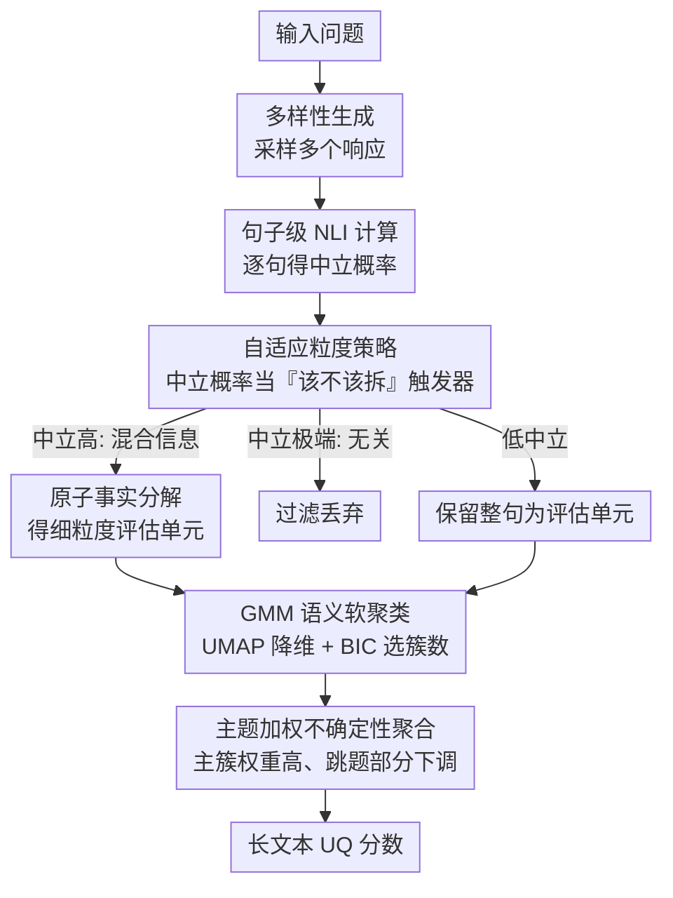

# AGSC: Adaptive Granularity and Semantic Clustering for Uncertainty Quantification in Long-text Generation

**会议**: ACL 2026  
**arXiv**: [2604.06812](https://arxiv.org/abs/2604.06812)  
**代码**: 无  
**领域**: LLM安全  
**关键词**: 不确定性量化, 长文本生成, 自适应粒度, 语义聚类, GMM

## 一句话总结

AGSC 提出了一个针对长文本生成的不确定性量化框架，通过 NLI 中立概率触发自适应粒度分解（减少 60% 推理时间），并使用 GMM 软聚类捕捉潜在语义主题进行主题感知的加权聚合，在 BIO 和 LongFact 基准上达到 SOTA 的事实性相关性。

## 研究背景与动机

**领域现状**：LLM 的幻觉问题使不确定性量化成为增强可信度的关键。现有 UQ 方法主要针对短响应，而长文本 UQ（如 LUQ）尝试将响应分解为原子事实进行细粒度评估。

**现有痛点**：(1) 细粒度分解大幅增加计算开销；(2) 长文本混合多个语义主题，简单池化聚合会被次要/离题部分过度影响；(3) LUQ 简单丢弃 NLI 中立标签，但中立性往往反映认知不确定性。

**核心矛盾**：长文本 UQ 需要在粒度、效率和主题异质性之间取得平衡。

**本文目标**：设计准确且高效的长文本 UQ 框架，同时处理主题异质性。

**切入角度**：利用 NLI 中立类别作为自适应粒度触发器，结合 GMM 软聚类进行主题感知聚合。

**核心 idea**：中立性不是应该丢弃的噪声，而是需要更细粒度分析的信号；语义主题聚类能有效降低次要部分对整体 UQ 的干扰。

## 方法详解

### 整体框架

AGSC 分为三阶段：(1) **多样性生成**——采样多个响应；(2) **NLI 计算与自适应分解**——句子级 NLI 分析，中立概率高的句子触发原子事实分解或过滤噪声；(3) **语义聚类与聚合**——UMAP 降维 + GMM 软聚类进行主题加权聚合。其中第一阶段是脚手架，真正的三个贡献分别落在「自适应粒度」「GMM 语义软聚类」「主题加权聚合」上。

### 关键设计

**1. 自适应粒度策略：只对「可疑句子」拆原子事实，别把计算费在所有句子上**

细粒度分解能提高评估精度，但如果对每一句都做原子事实拆解，计算开销会成倍爆炸。AGSC 拿 NLI 的中立概率当「该不该拆」的触发器：逐句跑一遍 NLI，当某句的中立概率超过阈值时，说明它可能掺了多条混合信息，才触发更细粒度的原子事实分解；而如果中立率高到极端，则判定为无关信息直接过滤掉。

这里的关键是区分中立的两种含义：中立可能意味着该句与问题不相关（应过滤），也可能意味着它掺了错综复杂的不确定信息（应进一步拆解）。自适应触发机制正是按中立率高低把这两种情况分开处理，于是只在真正需要的句子上花费原子拆解的算力，全局推理时间因此减约 60%。

**2. GMM 语义软聚类：用潜在主题分组压住跳题部分的干扰**

长文本往往掺了多个语义主题，像「告诉我关于爱因斯坦」这种开放式提示下，不同采样可能围绕不同主题组织内容，造成结构性混乱，简单池化会让次要/离题部分过度影响整体分数。AGSC 把所有评估单元的嵌入先经 UMAP 降维，再用 GMM 做软聚类，每个聚类对应一个潜在语义主题，聚类数由 BIC 自动选择。

选 GMM 软聚类而不是 K-means 硬聚类，是因为语义主题的边界本来就是模糊的——一句话可能同时沾两个主题，软分配能给出「部分属于」的权重而不是硬性划到某一类。拿到聚类后，AGSC 按聚类大小分配主题感知权重，主要主题（聚类大）权重高、次要/噪声部分权重被下调。

**3. 主题加权不确定性聚合：让主主题主导最终分数，别被跳题句拉偏**

有了逐单元的 NLI 不确定性和上一步的聚类权重后，AGSC 把两者结合做加权聚合：先算每个评估单元基于 NLI 的不确定性，再按聚类权重加权汇总成最终分数。这样所占内容多、属于主主题的部分对整体不确定性贡献更大，避免了次要或离题部分不成比例地干扰 UQ 分数。这也是「主题感知聚合显著优于简单池化」的直接原因。

### 损失函数 / 训练策略

不涉及模型训练。使用预训练 NLI 模型和嵌入模型。GMM 聚类数通过 BIC 自动选择。

## 实验关键数据

### 主实验

- AGSC 在 BIO 和 LongFact 基准上达到 SOTA 的与事实性的相关性
- 相比完整原子分解方法减少约 60% 的推理时间

### 消融实验

- 自适应粒度和语义聚类两个组件都对最终性能有显著贡献
- GMM 聚类优于 K-means 硬聚类，软分配更适合语义主题的模糊边界

### 关键发现

- NLI 中立性是有价值的信号，不应被丢弃
- 主题感知聚合显著优于简单池化
- 自适应粒度在减少 60% 计算的同时保持或提升了精度

## 亮点与洞察

- 将 NLI 中立类别从"废物"转化为有价值的触发信号是巧妙的洞察
- GMM 软聚类自然处理了语义边界的模糊性
- 60% 的推理时间节省对实际部署有重要意义

## 局限与展望

- GMM 聚类数的自动选择可能在极端情况下不稳定
- 依赖 NLI 模型的质量，错误的 NLI 判断会累积传播
- 未来可探索将 AGSC 与其他 UQ 方法结合

## 相关工作与启发

- 对 LUQ 的三个局限性提供了系统性解决方案
- GMM 聚类思路可推广到其他需要处理主题异质性的 NLP 任务

## 评分

- 新颖性: ⭐⭐⭐⭐ 中立性触发+语义聚类的组合新颖实用
- 实验充分度: ⭐⭐⭐⭐ 两个基准、多个基线的对比完整
- 写作质量: ⭐⭐⭐⭐ 框架描述清晰，问题动机充分

<!-- RELATED:START -->

## 相关论文

- [\[ICML 2026\] Position: Uncertainty Quantification in LLMs is Just Unsupervised Clustering](../../ICML2026/llm_safety/position_uncertainty_quantification_in_llms_is_just_unsupervised_clustering.md)
- [\[ACL 2026\] From Passive Metric to Active Signal: The Evolving Role of Uncertainty Quantification in Large Language Models](from_passive_metric_to_active_signal_the_evolving_role_of_uncertainty_quantifica.md)
- [\[ICLR 2026\] Resource-Adaptive Federated Text Generation with Differential Privacy](../../ICLR2026/llm_safety/resource-adaptive_federated_text_generation_with_differential_privacy.md)
- [\[ACL 2026\] Differentially Private Synthetic Text Generation for Retrieval-Augmented Generation (RAG)](differentially_private_synthetic_text_generation_for_retrieval-augmented_generat.md)
- [\[ACL 2026\] SAGE: Sparse Adaptive Guidance for Dependency-Aware Tabular Data Generation](sage_sparse_adaptive_guidance_for_dependency-aware_tabular_data_generation.md)

<!-- RELATED:END -->
