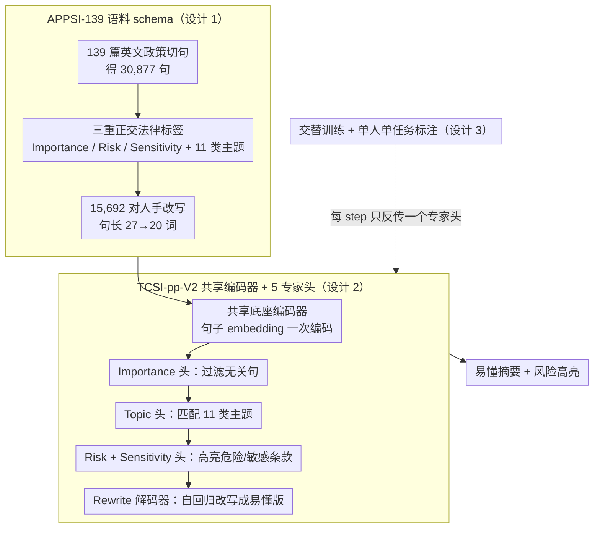

# APPSI-139: A Parallel Corpus of English Application Privacy Policy Summarization and Interpretation

**会议**: ACL 2026  
**arXiv**: [2604.27550](https://arxiv.org/abs/2604.27550)  
**代码**: https://github.com/EnlightenedAI/APPSI-139  
**领域**: LLM 安全 / 隐私 / 文本摘要  
**关键词**: 隐私政策, 平行语料, 多任务学习, 摘要与解释, 法律 NLP

## 一句话总结
APPSI-139 是首个由法律专家精细标注的英文应用隐私政策摘要与解释平行语料（139 篇政策 / 36,351 条标注 / 15,692 对改写），配套提出的 TCSI-pp-V2 框架用共享编码器 + 5 个交替训练的专家头实现"重要 / 风险 / 敏感 / 主题 / 改写"五子任务，相比 TCSI-pp v1 编码时间砍 73%、显存从 7.3GB 降到 2.7GB，可读性主观投票胜过 GPT-4o / Llama3-70b。

## 研究背景与动机

**领域现状**：隐私政策是用户授权应用处理个人数据的法律基础，但它们普遍冗长、充满 legalese 和 technobabble，再叠加"rational ignorance"和"dark patterns"，绝大多数用户根本不读就点同意，导致敏感数据被悄悄使用。"Privacy Nutrition Labels"、"LPL"、"TILT" 等规范化标签尝试不少，但能否落地全靠服务商良心。

**现有痛点**：自动摘要被视为出路，但已有隐私政策语料几乎全是英文**信息抽取**导向（OPP-115 / APP-350 / PI-Extract / Optoutchoice / PrivacyQA / PolicyQA），只解决"长"，不解决"看不懂"。唯一带改写解释的 CAPP-130 是中文，机翻成英文丢失法律精度。

**核心矛盾**：在隐私政策摘要这件事上需要既**短**又**好懂**还**保留法律精度**——三者天然冲突。无平行语料 ⇒ 学不出"原文 → 易懂改写"映射；用通用 LLM ⇒ 法律语义打折；用小模型 ⇒ 没有专业数据。

**本文目标**：① 建一个英文版的"分句多标签 + 改写"平行语料；② 设计一个把"识别重要/风险/敏感子句 + 主题分类 + 改写解释"五件事统一在共享编码器下的高效框架，避免 v1 中每个子任务各跑一个编码器的冗余。

**切入角度**：复用 CAPP-130 的标注 schema 但请 5 位英文法学硕士 + 1 位法学教授重新精细标注英文版（不走机翻路线）；在模型侧把 5 个任务塞进一个共享 encoder + 5 个并列的专家头 + 交替训练。

**核心 idea**：用法律专家手标的英文平行语料 + 多任务共享编码器 + 交替训练策略，把"算得起 + 看得懂 + 信得过"三个角放进一个三角形里同时打。

## 方法详解

### 整体框架
这篇论文要同时交付一份数据集和一个模型，去解决"隐私政策又长又难懂、还得保住法律精度"的三难。数据线上，作者从 Google Play / App Store 各取 Top-100 英文应用、截至 2023-10 的最新隐私政策，去重后保留 139 篇，正则按句切分得 30,877 句；再请 5 位英文法学硕士每人专司一个子任务（重要 / 风险 / 敏感 / 主题分类 / 改写），先做 pilot 标注、算出 Cohen's Kappa=0.892 之后再正式标，模糊条款交资深 reviewer 终审。模型线上，TCSI-pp-V2 由一个共享 bottom 编码器 + 4 个分类头（Importance / Topic / Risk / Sensitivity）+ 1 个改写解码器组成；一句政策文本进来，先过 Importance 头过滤掉无关紧要的句子，再用 Topic 头匹配用户关心的主题，接着 Risk / Sensitivity 头给危险与敏感条款打高亮，最后 Rewrite 头把保留下来的条款改写成易懂版本——五件事在同一段文本上一次走完。

### 关键设计

**1. APPSI-139 语料 schema：用三重正交法律标签把政策切片，并为高风险条款配人手改写**

仅做主题分类只能解决"长"，解决不了"看不懂"，更照顾不到"哪些条款其实有法律风险"。APPSI-139 给每句最多挂多个标签：11 类数据实践覆盖 First-Party Collection / Permission Acquisition / Third Party Sharing / Usage / Data Retention / Data Security / Edit-Control / Specific Audiences / Contact / Policy Change / Cease Operation；在这之上再叠三类正交特殊标签——Importance 标出必读关键条款，Risk 标出违反 GDPR / CCPA 等的合规模糊语言，Sensitivity 标出生物特征、精确位置、金融账户等敏感信息（其定义同时对齐 GDPR、NIST SP 800-122、GB/T 35273-2020 三套区域标准，因而具备跨地区可迁移性）。配套的 15,692 对改写标注把平均句长从 27 词压到 20 词（减 26%）。

这三重标签的价值在于它们正交：下游模型既知道"哪些条款必读"，又知道"哪些条款危险 / 敏感"，从而能同时支持过滤式摘要和风险高亮，给用户一个完整的法律视角。值得注意的是 Risk 标签只占 1.9%，却是价值最高的一类——它如实反映了真实隐私政策里法律盲区的稀疏分布。

**2. TCSI-pp-V2 共享编码器 + 5 专家头：一个底座喂五个任务，消掉 v1 的编码冗余**

v1 给每个子任务各配一个编码器，同一段法律文本被重复编码 5 遍，显存和时延都浪费在重复计算上。V2 改成一个共享 bottom 加 5 个并列专家头：句子先做 embedding $E=\{e_1,\dots,e_n\}$，过共享底座 $F_f(e_j,\theta_f)$ 得到 $\{f_1,\dots,f_n\}$，再分送 5 个专家头——$F_i$（Importance 二分类）、$F_t$（11 类主题 multi-class）、$F_r$（Risk 二分类）、$F_s$（Sensitivity 二分类）、$F_{rewrite}$（自回归改写 $P(z_t\mid f_j;z_{1:t-1})$）；推理时按 Importance → Topic → Risk+Sensitivity+Rewrite 的链路串起来。

这样做之所以不掉点，是因为 5 个子任务本来就在同一段法律文本上做判断、特征高度共享，共享底座反而学到了更通用的法律语义表示。代价侧则是大幅收缩：推理显存从 7.3GB 砍到 2.7GB，让"5 件事一次过"在边缘设备上跑得动。

**3. 交替训练 + 单人单任务标注：从训练和标注两头规避任务相互压制**

如果 5 个专家头用联合 loss 加权一起训，强任务（如 Sensitivity 二分类）会主导梯度，把弱任务（如只占 0.04% 的 Cease Operation）淹没掉。V2 改成交替训练：每个 step 只激活一个专家头反向传播，让共享底座在不同子任务间稳定迁移，给每个子任务公平的更新机会。标注侧同理——5 个标注员各盯一类，单人单任务，规避"一个人同时判 5 件事"的认知干扰；Cohen's Kappa=0.892 说明这种分工既提升了标注质量、又没牺牲一致性。

### 损失函数 / 训练策略
分类头用标准交叉熵，改写头用 teacher-forcing language modeling；交替训练时每个 mini-batch 只 backprop 一个专家头；底座选 mT5-small / Bert2GPT / XLNet2GPT / Electra2GPT；数据按 80:10:10 切训练/验证/测试，硬件 NVIDIA V100。Cease / Permission 因样本过少被排除二分类评估。

## 实验关键数据

### 主实验（与 LLM 横向对比，APPSI-139 测试集）

| 任务 | 指标 | Qwen3-8B | Llama3-8B | GPT-4o-mini | Gemini-2.5 | **TCSI-pp-V2** |
|---|---|---|---|---|---|---|
| Topic | Micro-F1 | 47.85 | 30.77 | 50.36 | 65.38 | **78.18** |
| Topic | Macro-F1 | 44.44 | 24.65 | 32.83 | 6.42 | **77.12** |
| Important | Micro-F1 | 63.50 | 52.53 | 51.00 | 73.33 | **73.93** |
| Risk | Micro-F1 | 85.53 | 96.00 | 89.34 | 85.05 | **95.60** |
| Sensitive | Micro-F1 | 45.37 | 28.01 | 38.64 | 23.33 | **96.96** |
| Rewritten | ROUGE-L | 0.4541 | 0.4156 | 0.4286 | 0.4776 | **0.6903** |
| Rewritten | BERTScore | 0.8970 | 0.8520 | 0.8950 | 0.9070 | **0.9430** |
| Rewritten | BARTScore | -2.76 | -3.03 | -2.89 | -2.78 | **-1.68** |

主观可读性投票（53 位本科 / 硕士被试，10 题单选）：TCSI-pp-V2 **39.06%** > Llama3-70b 25.28% > GPT-4o 24.52% > Kimi 11.13%；10 题中本文模型赢 7 题。

### 消融实验 1：V1 vs V2 显存与时延（mT5-small 后端，1,893 句子样本）

| 指标 | TCSI-pp (V1) | TCSI-pp-V2 | 改进 |
|---|---|---|---|
| Encoding Time | 92.66 s | 24.72 s | **-73%** |
| Total Time | 191.94 s | 123.26 s | -36% |
| Avg. Time / 句 | 0.101 s | 0.065 s | -36% |
| 推理显存 | 7,343 MB | **2,766 MB** | -62% |

### 消融实验 2：输入长度鲁棒性（最长 100 句 vs 最短 100 句 vs 全部）

| 任务 | 指标 | 最长 | 最短 | 全部 |
|---|---|---|---|---|
| Topic | Micro-F1 | 79.41 | 76.23 | 78.18 |
| Risk | Micro-F1 | 94.74 | 94.34 | 95.60 |
| Sensitive | Micro-F1 | 96.83 | 96.18 | 96.96 |
| Rewritten | ROUGE-L | 0.6979 | 0.6542 | 0.6903 |

### 关键发现
- **专精数据 + 小模型 > 大模型 + 提示工程**：mT5-small（300M 参数）在所有任务上吊打 GPT-4o-mini / Llama3-8B / Gemini-2.5；尤其 Sensitive 任务上 TCSI-pp-V2 96.96 vs Gemini-2.5 仅 23.33——通用 LLM 几乎无法识别"生物特征 / 精确位置 / 金融账户"这种法律专有敏感语义。
- **共享 encoder 不掉点反涨**：V2 vs V1 单任务模型差距均 <0.02，但显存砍 62%、编码时间砍 73%；rewrite 任务的 ROUGE/BERTScore 都略升，说明多任务正则化带来了泛化收益。
- **法律可读性赢过 GPT-4o 是关键卖点**：主观投票里 GPT-4o 经常"几乎逐句复述原文"导致冗长，Llama3-70b 输出片段化失连贯；TCSI-pp-V2 的多级 bullet 结构 + 强制改写得分最高。
- **数据分布不均严重**：Important 占 51.04%、Risk 仅 1.9%、Cease 仅 0.04%，Risk 的 macro-F1（~60）远低于 micro（~96）说明少数类仍需更多数据 / 重采样。
- **长度鲁棒性合格**：长短 100 句子集表现波动 <3 个点，最长输入 Risk 略降（法律条款本身更复杂）、最短输入 ROUGE 略降（上下文线索不足）。

## 亮点与洞察
- **三类法律标签（Importance / Risk / Sensitivity）正交切片是真创新**：以往隐私政策语料只标"主题"，本文把"必读 / 危险 / 敏感"三件事拆成独立标签，下游既能做"过滤式摘要"也能做"风险高亮"。
- **跨地区标准对齐（GDPR + NIST + GB/T）让 sensitivity 标签具备全球可迁移性**：未来扩展到欧洲、北美、东亚都能复用同一套定义。
- **共享 encoder + 交替训练是 small-model 时代的实用范式**：避免 v1 5 个编码器各跑一遍的浪费，且把 LLM 时代的"专家路由"思路下沉到 300M 参数级别，对边缘部署友好。
- **法律专家做 single-task 单人标注**：Cohen's Kappa=0.892 说明分工策略可行，可移植到其他多标签法律语料（合同、ToS、版权协议）。

## 局限与展望
- 仅英文，多语种（特别是欧洲多语言 + 中文以外的亚洲语种）未覆盖；作者计划基于 schema 可扩展性扩展到多语境。
- 139 篇政策来自 2023-10，可能随 GDPR/CCPA 修订而过时。
- 生成型 rewrite 仍有幻觉风险——可能漏关键条款或扭曲法律含义；论文用 fidelity 指标监控但未系统化质控。
- 主观评测只有 53 名年龄 18-40、有大学教育的被试，缺乏年长 / 低学历用户的代表性。
- 没和最新 reasoning model（如 o1 / DeepSeek-R1）对比；这些模型有可能通过 chain-of-thought 缩小与小模型的差距。

## 相关工作与启发
- **vs OPP-115 / APP-350 / PolicyQA / PrivacyQA**：那些是分类 / QA 抽取语料，APPSI-139 是首个英文**改写**平行语料。
- **vs CAPP-130 (NeurIPS 2023)**：CAPP-130 是中文版祖宗，APPSI-139 完全重做英文（不走机翻路线），并扩展了多区域敏感性标准对齐。
- **vs PolicyGPT / ChatGPT 提示法**：纯 prompt 在小众法律语义（Sensitivity）几乎失效；本文证实"高质量标注数据 + 小模型微调"在法律 NLP 领域仍胜过通用 LLM 零样本。
- **vs TCSI-pp v1**：v1 用 5 个独立编码器，重复计算严重；v2 共享 encoder 后等性能下显存降 62%。

## 评分
- 新颖性: ⭐⭐⭐⭐ 首个英文隐私政策改写平行语料 + 三正交法律标签设计有实用突破，模型架构属于成熟多任务范式。
- 实验充分度: ⭐⭐⭐⭐ 13 个底座、4 个 LLM 横向对比、显存时延 / 长度鲁棒性 / 主观可读性都做了；缺与 reasoning model 对比。
- 写作质量: ⭐⭐⭐ 整体清楚，但部分实验段落混用现在 / 现在完成时，algorithm 1 排版略凌乱。
- 价值: ⭐⭐⭐⭐⭐ 数据集 + 模型 + 评估三件套齐全，可直接部署成"隐私政策辅助阅读"产品，对消费者保护场景价值高。

<!-- RELATED:START -->

## 相关论文

- [\[CVPR 2026\] Select, Hypothesize and Verify: Towards Verified Neuron Concept Interpretation](../../CVPR2026/llm_safety/select_hypothesize_and_verify_towards_verified_neuron_concept_interpretation.md)
- [\[ICLR 2026\] Heterogeneous Federated Fine-Tuning with Parallel One-Rank Adaptation](../../ICLR2026/llm_safety/heterogeneous_federated_fine-tuning_with_parallel_one-rank_adaptation.md)
- [\[ACL 2026\] Privacy-R1: Privacy-Aware Multi-LLM Agent Collaboration via Reinforcement Learning](privacy-r1_privacy-aware_multi-llm_agent_collaboration_via_reinforcement_learnin.md)
- [\[ACL 2026\] Privacy Collapse: Benign Fine-Tuning Can Break Contextual Privacy in Language Models](privacy_collapse_benign_fine-tuning_can_break_contextual_privacy_in_language_mod.md)
- [\[ACL 2025\] Improving Fairness of Large Language Models in Multi-document Summarization](../../ACL2025/llm_safety/improving_fairness_of_large_language_models_in_multi-document_summarization.md)

<!-- RELATED:END -->
