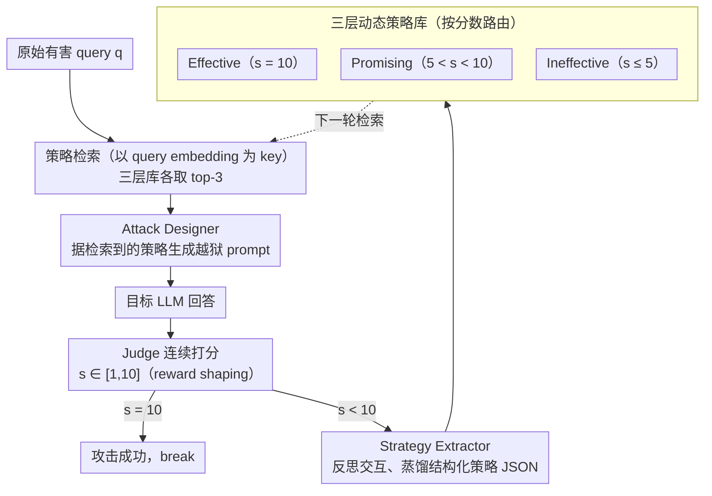

# ASTRA: An Automated Framework for Strategy Discovery, Retrieval, and Evolution for Jailbreaking LLMs

**会议**: ACL 2026  
**arXiv**: [2511.02356](https://arxiv.org/abs/2511.02356)  
**代码**: 无  
**领域**: AI 安全 / 自动化越狱  
**关键词**: 越狱攻击, 策略库, 闭环学习, RAG 检索, 黑盒红队

## 一句话总结
ASTRA 把每次越狱尝试都视为学习机会，按 1-10 连续打分把策略蒸馏到「Effective / Promising / Ineffective」三层向量库中，下一次攻击通过相似度检索复用经验，平均仅 2.4 次查询就在 8 个主流 LLM 上取得 80.6% 攻击成功率。

## 研究背景与动机

**领域现状**：现有黑盒越狱方法分两派：模板/启发派（GPTFuzzer / CodeAttack / CipherChat）易被指纹识别；迭代优化派（PAIR、TAP）虽然带反馈但「成败二元」，从大量失败尝试中提炼不出可复用经验。

**现有痛点**：(1) 模板缺多样性，防御方一抓一个准；(2) 优化派把攻击结果当 boolean，无法学习；(3) 跨数据集、跨目标模型的迁移性几乎为零。

**核心矛盾**：越狱本质是稀疏奖励搜索问题——绝大多数尝试都是「部分成功」或「失败」，二元信号丢掉了 99% 的学习信息。

**本文目标**：构造一个能从每次交互（包括失败）里都学到东西、并在不同 query / 不同模型间复用的自演化框架。

**切入角度**：引入 RL 里的「reward shaping」思想，把二元判定改成 1-10 连续打分，再加上策略层面的检索/更新机制，让攻击经验从「点」组装成「图书馆」。

**核心 idea**：闭环 "attack–evaluate–distill–reuse" + 三层向量化策略库，让攻击者像写作业的学生，每做一题就抄进错题本/笔记本，下次直接查。

## 方法详解

### 整体框架
ASTRA 想解决的是越狱里的"经验浪费"问题：PAIR / TAP 这类迭代攻击把每次结果当成功 / 失败的布尔信号，从大量"差一点就成"的尝试里学不到东西。ASTRA 把整个攻击做成一个会自我积累的闭环，由三大模块串起来：**Attack Designer** 负责生成 prompt（有 Strategy-Agnostic 和 Strategy-Guided 两种模式）；目标 LLM 回答后，**Judge** 给出 1-10 的连续分数；**Strategy Extractor** 让 LLM 反思这一次交互、按分数蒸馏出一条结构化策略 JSON；**Strategy Storage & Retrieval** 把策略以"原始有害 query 的 embedding"为索引存进向量库，下一次攻击再按 cosine 相似度 top-$k$ 检索复用。攻击预算 $N=10$、retrieval $k=9$（三类各 top-3），Attacker / Extractor 用 GLM-4.5，Judge 用 GPT-4o。

### 关键设计

**1. 闭环 "attack–evaluate–distill–reuse"：把每次交互都变成可复用的学习信号**

PAIR / TAP 的根本短板是奖励太稀疏——攻击结果被压成 0/1，那些"方向对、只在最后一步被过滤"的 near-miss 全被丢掉。ASTRA 借了 RL 里 reward shaping 的思路，把目标函数 $\sigma^* = \arg\max_\sigma J_\theta(q, T_\theta(A_\theta(q, S(\sigma))))$ 里的 Judge $J_\theta$ 从二元判定改成输出 $s \in [1,10]$ 的连续分。整个生命周期是一个循环：检索策略 → 生成 prompt → 目标 LLM 回答 → Judge 打分 → Extractor 蒸馏策略 → 写入对应库，一旦 $s_i=10$ 立即 break。

连续打分的好处是把"差一点"变成了有梯度的信号——一个 $s=8$ 的尝试明确告诉系统"这条路几乎走通、只差临门一脚"，这正是二元 reward 无法捕捉、却最值得复用的经验。

**2. 三层动态策略库：让攻击同时"学好的、改差的、避坏的"**

只存成功样本的经验回放会丢掉大量信息——失败本身也是知识。ASTRA 按 Judge 打分把策略路由进三个库：$s=10$ 进 **Effective**（可直接复用）；$5<s<10$ 进 **Promising**（附带改进建议）；$s\le 5$ 进 **Ineffective**（写成 avoidance guideline，告诉 Attacker 什么不该做）。每条策略都是一段 JSON：core description + usage guidelines + illustrative example。下一次检索时，prompt 把三类策略一起塞给 Attacker。

这三类库分别对应 exploit（模仿成功）、explore（改进潜在）、pruning（剪掉死路）三种知识，在向量空间和策略空间上都各管一摊。消融印证了"失败也是知识"这一点：去掉 Ineffective 库后 ASR 从 71.9% 掉到 65.4%。

**3. 以原始有害 query 作检索 key：让不同问题之间迁移策略**

如果用 prompt 表面文本做索引，策略就被锁死在具体措辞上，换个问题就用不了。ASTRA 改用 text-embedding-3-small 把原始 query $q$ 编码成 $\mathbf{v}_q$ 当索引，存 $(\mathbf{v}_q, \sigma)$ 对；新问题 $q_\text{new}$ 编码后按 cosine 相似度 top-$k$ 命中。检索个数 $k$ 越大 ASR 越高但增益递减，论文取 $k=9$。

用"问题语义"而非"prompt 文本"作 key，意味着"教师 / 学生 / 化学武器"这些不同的有害问题只要意图相近，就能共享同一批有效策略——验证显示在 HarmBench 上养熟的库直接搬到 AdvBench-50 几乎不掉点。

### 一个例子：一条 query 在闭环里怎么升级
拿一个新的有害问题进来：先用它的 embedding 去三层库各检索 top-3 策略，拼进 Attacker 的 prompt；Attacker 生成第一版越狱 prompt，目标 LLM 回答后 Judge 打了 8 分——方向对但被末端安全过滤拦下。这条 $s=8$ 的尝试被 Extractor 蒸馏成一条带改进建议的策略，写进 Promising 库。下一轮检索时这条 Promising 策略被取回，Attacker 据其建议调整措辞，这次拿到 10 分、立即 break，同时这条成功策略沉进 Effective 库；而中途那些 $s\le5$ 的尝试则进了 Ineffective 库，下次提醒 Attacker 绕开。平均只要 2.4 次查询，库就能帮攻击收敛。

### 损失函数 / 训练策略
无模型训练。整个 ASTRA 是 inference-only 框架，全部「学习」发生在策略库的写入/读取。Attacker temperature=1.0；Judge prompt 沿用 PAIR 设置；只有 score=10 才算成功。

## 实验关键数据

### 主实验（HarmBench 400 条有害行为，8 个目标模型）

| 方法 | Llama-3-8B | Llama-3-70B | DeepSeek-R1 | GPT-4o | GPT-4.1 | Gemini-2.0 | Gemini-2.5 | Claude-3.7 | **Avg ASR** |
|--------|------|------|------|------|------|------|------|------|------|
| PAIR | 17.8 | 22.5 | 45.3 | 38.8 | 33.0 | 53.3 | 30.5 | 4.0 | 30.7 |
| TAP | 22.2 | 25.3 | 49.0 | 41.0 | 36.0 | 55.0 | 37.5 | 10.8 | 34.6 |
| GPTFuzzer | 28.0 | 11.3 | 62.0 | 16.0 | 3.0 | 78.3 | 3.5 | 2.3 | 25.6 |
| ReNeLLM | 68.0 | 64.5 | 77.5 | 71.5 | 70.1 | 62.3 | 44.8 | 19.0 | 59.7 |
| CodeAttack | 46.0 | 64.3 | 87.5 | 70.5 | 65.0 | 76.0 | 44.3 | 26.3 | 60.0 |
| **ASTRA** | 54.5 | **89.3** | **95.5** | **93.8** | **91.0** | **98.5** | **86.0** | **36.0** | **80.6** |

平均查询数（AQ，越低越好）：PAIR 5.5 / TAP 6.3 / ReNeLLM 2.7 / **ASTRA 2.4**。在最新模型 GPT-5.1 / Gemini-3-Flash / Qwen3-max 上 ASTRA 仍达 92.0 / 90.5 / 96.3 ASR。

### 消融实验

| 变体 | Llama-3-8B | GPT-4o | Gemini-2.5 | Claude-3.7 | **Avg ASR** | **Avg AQ** |
|------|------|------|------|------|------|------|
| ASTRA（全套） | 54.5 | 93.8 | 86.0 | 36.0 | **71.9** | 2.9 |
| w/o Effective Lib | 41.0 | 79.0 | 72.3 | 23.0 | 58.6 | 3.6 |
| w/o Ineffective Lib | 46.8 | 86.3 | 81.0 | 33.0 | 65.4 | 3.1 |
| w/o Promising Lib | 44.0 | 87.0 | 77.8 | 35.0 | 65.3 | 3.3 |
| w/o Retrieval | 38.5 | 60.8 | 60.0 | 17.5 | **48.5** | 3.9 |
| w/o Score（用二元） | 46.3 | 86.5 | 72.5 | 31.0 | 62.1 | 3.5 |
| w/o Extractor（原 log） | 45.0 | 82.5 | 77.5 | 25.8 | 61.7 | 3.9 |

### 关键发现
- **Retrieval 是最关键模块**：去掉它 ASR 暴跌到 48.5%（-23.4 点），说明 ASTRA 的胜负真的在「能查到合适策略」上，而不是单 prompt 创意。
- **连续打分价值显著**：换成二元评分 ASR 从 71.9% 掉到 62.1%，证明 reward shaping 假设成立。
- **失败也是知识**：去掉 Ineffective Library 仍掉 6.5 点 ASR，验证「让 Attacker 知道什么不该做」对剪枝搜索空间真有用。
- **跨模型策略迁移**：用 GLM-4.5 在 HarmBench 上长出来的策略库换到 Qwen3-32B、GPT-4o 等其他 Attacker 用，对 GPT-4o 仍取 92.5% ASR；说明蒸馏出的是「人类可读的攻击模式」而非特定模型行为。
- **跨数据集迁移**：HarmBench 上 mature 的库直接冻结后用到 AdvBench-50，多数目标模型几乎不掉点。
- **防御鲁棒性**：Paraphrase / Perplexity Filter 几乎不掉，Llama Guard 3 也仍达 86.3% ASR；证明攻击 prompt 是自然语言而非可疑后缀。
- **Token 成本「贵但值」**：ASTRA 每轮 10.7k token > PAIR 的 1.9k，但单次成功摊销 token 几乎相当（31.9k vs 34.7k），且对真实 API 来说，少访问目标 = 更隐蔽 + 不触发速率限制。

## 亮点与洞察
- **把红队当强化学习的 reward shaping 问题来定义**是论文的精神支柱，非常清晰地指出「PAIR/TAP 的根本问题是奖励太稀疏」——这个框架可以推广到任何 LLM-agent 自我改进任务。
- **三层库（成功+希望+失败）**：相比传统经验回放只存成功样本，本文显式建模「应避免行为」，这种正负样本对称的记忆设计可直接迁移到自我进化的 coding agent / search agent。
- **以原始 query 作 retrieval key**而不是 prompt 本身，巧妙地让「同一危险意图的多种问法」共享策略库——是个简单但有效的工程 trick。

## 局限与展望
- **多 agent 多轮推理开销大**：单次成功摊销 token 与 PAIR 持平但绝对值远高，部分项目可能不接受。
- **依赖 Judge GPT-4o**：作者用 Claude-Sonnet-4 / Llama-Guard-3 做交叉验证 Confirmed ASR 92.5%/94.0%，但所有训练信号还是来自单一裁判，可能被该裁判的偏见束缚。
- **初始库需 cold start**：第一次跑某种 target 时要充分探索 attack 才能积累；论文没充分分析「冷启 N=多大」才让 library 收敛。
- **伦理风险**：高 ASR、低查询数 + 可迁移策略库 = 极具威胁的红队工具，作者承诺「按需放代码」。

## 相关工作与启发
- **vs PAIR / TAP**：他们也迭代但只把结果当 boolean、无知识累积；ASTRA 加 reward shaping + 三层库后 ASR 平均高 30+ 点。
- **vs GPTFuzzer**：纯随机 mutation 在 Claude-3.7 上几乎为 0；ASTRA 通过策略检索能继续保持 36%。
- **vs CodeAttack / ReNeLLM**：单一模板攻击虽然强但缺多样性，遇到 Gemini-2.5 类强防御就掉到 44%；ASTRA 用动态策略库保留 86%。
- 与 AutoDAN-Turbo 思想最接近（也是 lifelong 学习），但 ASTRA 显式区分三类策略 + 用 RAG 检索更工程化。

## 评分
- 新颖性: ⭐⭐⭐⭐ Reward shaping + 三层库的组合在越狱领域首次提出，但单个 component（RAG / lifelong agent）并非完全原创。
- 实验充分度: ⭐⭐⭐⭐⭐ 8 个目标模型 + 6 个 baseline + 4 个防御 + 跨数据集 / 跨 attacker + 4 个 embedding + token 成本 + 弱组件鲁棒性，几乎滴水不漏。
- 写作质量: ⭐⭐⭐⭐ 框架图清晰，附录 case study + 算法伪码齐全；缺点是部分章节冗长。
- 价值: ⭐⭐⭐⭐ 揭示了当前对齐对「自我演化攻击」的脆弱性，对防御研究有强推动作用，但伦理风险也极高。

<!-- RELATED:START -->

## 相关论文

- [\[ACL 2026\] STAR-Teaming: A Strategy-Response Multiplex Network Approach to Automated LLM Red Teaming](star-teaming_a_strategy-response_multiplex_network_approach_to_automated_llm_red.md)
- [\[ACL 2026\] Jailbreaking Large Language Models with Morality Attacks](jailbreaking_large_language_models_with_morality_attacks.md)
- [\[ACL 2026\] AutoRAN: Automated Hijacking of Safety Reasoning in Large Reasoning Models](autoran_automated_hijacking_of_safety_reasoning_in_large_reasoning_models.md)
- [\[ACL 2026\] SERE: Structural Example Retrieval for Enhancing LLMs in Event Causality Identification](sere_structural_example_retrieval_for_enhancing_llms_in_event_causality_identifi.md)
- [\[ACL 2026\] RISK: A Framework for GUI Agents in E-commerce Risk Management](risk_a_framework_for_gui_agents_in_e-commerce_risk_management.md)

<!-- RELATED:END -->
