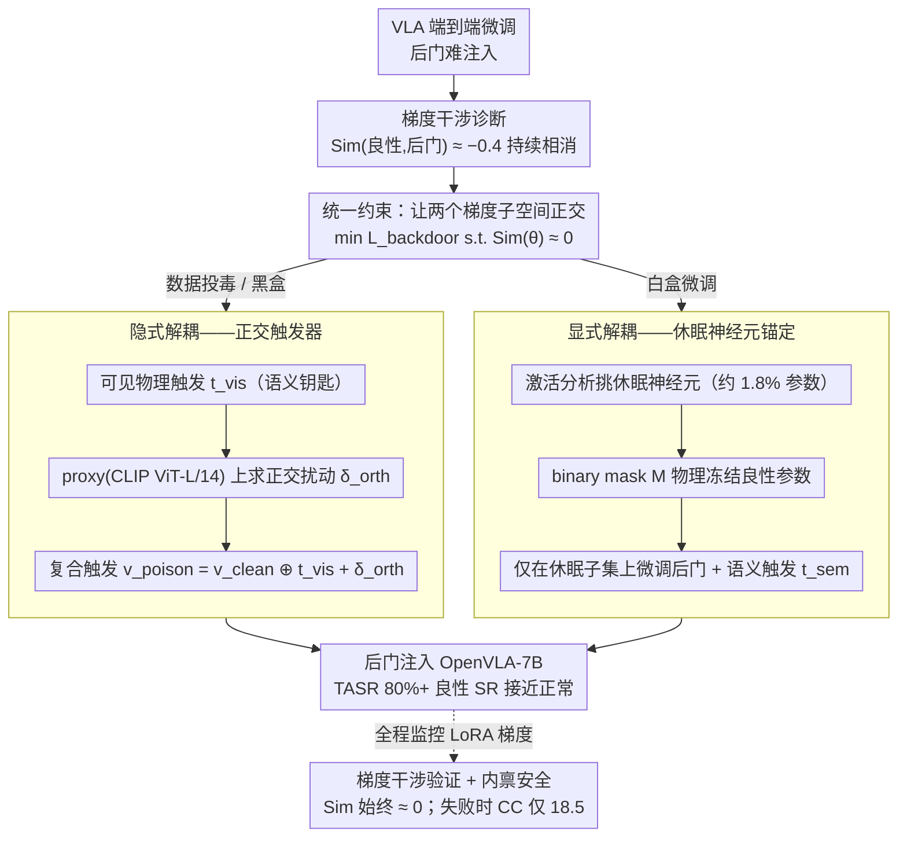

# ATAAT: Adaptive Threat-Aware Adversarial Tuning Framework against Backdoor Attacks on Vision-Language-Action Models

**会议**: ACL 2026  
**arXiv**: [2605.08612](https://arxiv.org/abs/2605.08612)  
**代码**: 无  
**领域**: AI 安全 / 具身智能 / 后门攻击  
**关键词**: VLA 后门, 梯度干涉, 正交解耦, 休眠神经元, 语义触发

## 一句话总结
ATAAT 首次系统揭示 VLA 后门难以注入的根因是「梯度干涉」（良性与后门梯度方向反向相消，相似度长期负相关 -0.4），并通过隐式正交扰动（数据投毒）和休眠神经元锚定（白盒微调）两条互补路径把目标攻击成功率推到 80%+，同时保持良性 SR 接近正常。

## 研究背景与动机

**领域现状**：OpenVLA / RT-2 这类 Vision-Language-Action 模型把视觉感知作为指令落地的核心入口，正快速进入真实机器人。供应链后门是其最持久的威胁。

**现有痛点**：传统 BadNet 在 VLA 上几乎失败（TASR < 5%、SR 也只有 4.5–17.5%），SOTA 的 BadVLA 也只在「Training-as-a-Service 全权限」下能用，对真实的数据投毒/微调场景无能为力。

**核心矛盾**：作者把失败原因形式化为 **Gradient Interference**——VLA 端到端微调时良性目标 $\mathcal{L}_\text{benign}$ 和后门目标 $\mathcal{L}_\text{backdoor}$ 的梯度余弦相似度长期为 -0.4 左右，即两者方向相反；强大的良性梯度直接把后门梯度「抵消」掉，导致模型既学不会后门又学坏了原任务（出现 jittering / drift 等动作错误）。

**本文目标**：根据攻击者权限提供两种「优化解耦」实例，统一在「让两个梯度子空间正交」的约束下解决问题：$\min_\theta \mathcal{L}_\text{backdoor}(\theta)\ \text{s.t.}\ \text{Sim}(\theta) \approx 0$。

**切入角度**：与其在训练算法里加约束（黑盒不允许），不如要么在数据层种入正交扰动让 it 隐式满足约束，要么在参数层挑出「良性任务用不到的神经元」物理隔离。

**核心 idea**：用「双目标样本设计」（数据侧 + 不可见正交扰动）或「休眠神经元语义锚定」（参数侧 + binary mask），把后门逻辑挤进良性子空间的正交补里。

## 方法详解

### 整体框架
ATAAT 的出发点是一个被它首次说清的现象：VLA 上注入后门特别难，根因是良性目标 $\mathcal{L}_\text{benign}$ 和后门目标 $\mathcal{L}_\text{backdoor}$ 的梯度方向长期相反（余弦相似度稳定在 -0.4 左右），强大的良性梯度把后门梯度直接抵消掉。于是 ATAAT 把所有手段统一在一条约束下——让两个梯度子空间正交：$\min_\theta \mathcal{L}_\text{backdoor}(\theta)\ \text{s.t.}\ \text{Sim}(\theta) \approx 0$，再按攻击者的权限分两条路径去满足它。**Scenario 1（数据投毒，黑盒）走 Implicit De-confliction**：攻击者只能给样本加扰动，就在数据层种入正交扰动让约束隐式成立；**Scenario 2（白盒微调）走 Explicit De-confliction**：攻击者能改参数，就在参数层挑出良性任务用不到的神经元做物理隔离。骨干为 OpenVLA-7B（LoRA rank=32，AdamW，lr=1e-5）。

### 关键设计

**1. 隐式解耦——正交触发器：黑盒攻击者不碰训练算法，也能让后门样本梯度自然正交**

数据投毒攻击者够不到训练循环，没法直接往 loss 里加正交约束。ATAAT 的做法是把约束"种"进触发器本身：构造复合触发器 $v_\text{poison} = v_\text{clean} \oplus t_\text{vis} + \delta_\text{orth}$，其中 $t_\text{vis}$ 是肉眼可见的物理触发（如一张黄色便签）当"语义钥匙"，$\delta_\text{orth}$ 是 $\|\delta\|_\infty \le \epsilon=8/255$ 的不可见扰动当"梯度催化剂"。这个扰动在公开 proxy（CLIP ViT-L/14）上求解 $\delta^* = \arg\min_\delta (\mathcal{L}_\text{atk} + \lambda|\cos(\mathbf{g}^\text{feat}_\text{poison}, \mathbf{g}^\text{feat}_\text{benign})|)$，PGD 10 步、$\alpha=1/255$；式中第二项专门把代理空间里后门 / 良性的梯度余弦压到 0。

由于 VLA 共享了多模态特征空间，代理空间里正交的扰动迁移到 victim 训练时，实际梯度也近似正交，于是后门"学得进去"。这是一套"锁与钥匙"机制：可见触发负责提供激活语义，不可见扰动负责打通优化通道——消融显示去掉 $\delta_\text{orth}$ 后 TASR 跌到 3.2%，去掉 $t_\text{vis}$ 后 TASR=0.5%，两者缺一不可。

**2. 显式解耦——休眠神经元语义锚定：白盒下把后门逻辑锁进良性几乎不用的神经元**

白盒攻击者能改参数，但若直接端到端微调，照样会撞上梯度干涉。ATAAT 改为在参数层就让两个子空间正交：先用 Algorithm 2 做 Activation Analysis，对 benign probe 数据累积每个神经元的平均 $|Act(n_l^{(i)}, v)|$，挑出低于阈值 $\tau=1\text{e-}3$ 的休眠集合 $\mathcal{N}_\text{dormant}$（OpenVLA-7B 中约 1.8% 参数），构造 binary mask $\mathbf{M}$（休眠处=1）；Phase 2 只在这个子集上做梯度下降 $\theta_{t+1} = \theta_t - \eta\cdot(\mathbf{M}\odot \nabla_\theta \mathcal{L}_\text{backdoor}(\theta_t; v\oplus t_\text{sem}))$，良性参数被物理冻结。

这套思路形式上像 continual learning 的 parameter isolation，但用意正相反——CL 隔离参数是为了防遗忘，ATAAT 隔离参数是为了避开端到端训练里的梯度干涉。配套的语义触发 $t_\text{sem}$（如开抽屉、戴手表）让后门绑定到高层概念而非低级像素，攻击因此更隐蔽、也更抗改写。

**3. 梯度干涉的实证验证与"内禀安全"副产物：把抽象的优化冲突坐实，并证明失败时也更安全**

"梯度方向相反导致抵消"原本只是个理论解释，需要经验证据撑住。ATAAT 在训练时实时记录 $\text{Sim}(\theta) = \cos(\mathbf{g}_\text{benign}, \mathbf{g}_\text{backdoor})$（只在 LoRA 可训练参数上算）：BadVLA-Adapted 的曲线很快跌到 -0.4 并稳定在负区间，而 ATAAT 始终贴着 0——正交解耦确实生效，给抽象概念配上了可视化锚点。

更进一步，作者引入 Cumulative Cost $CC = \sum c(s_t, a_t)$（关节扭矩 + 末端速度 + 碰撞惩罚）量化失败时的物理代价：ATAAT 即使泛化失败 CC 也只有 18.5，而 BadVLA 触发失败时 CC 高达 150.7。这说明 ATAAT 自带一种"inherent safety"——后门触发条件不满足时，它不会像 baseline 那样把模型搅成抖动 / 碰撞的危险状态。

### 损失函数 / 训练策略
良性目标 $\mathcal{L}_\text{benign}(\theta) = \mathbb{E}_{(v,l,a)\sim\mathcal{D}_\text{clean}}[-\log P(a|v,l;\theta)]$；后门目标 $\mathcal{L}_\text{backdoor}(\theta) = \mathbb{E}[-\log P(a_\text{tgt}|v\oplus t, l;\theta)]$；总约束 $\min_\theta \mathcal{L}_\text{backdoor}\ \text{s.t.}\ \text{Sim}(\theta)\approx 0$。投毒率 5%、Few-shot 锚定 200 样本。

## 实验关键数据

### 主实验（LIBERO 基准，4×A100，OpenVLA-7B）

| 方法 | LIBERO-Object SR / TASR | LIBERO-Spatial SR / TASR |
|------|------|------|
| BadNet（数据投毒） | 5.2 / 1.3 | 4.5 / 0.8 |
| Latent-Poisoning | 14.8 / 9.4 | 13.6 / 10.1 |
| BadVLA (Adapted) 数据投毒 | 16.1 / 12.8 | 17.5 / 13.1 |
| **ATAAT（Implicit）** | **90.1 / 85.9** | **88.8 / 83.5** |
| BadNet（微调） | 8.8 / 5.9 | 9.1 / 6.4 |
| BadVLA (Adapted) 微调 | 50.8 / 37.7 | 52.1 / 39.2 |
| **ATAAT（Explicit）** | **79.3 / 74.8** | **78.1 / 72.5** |

### 消融实验（LIBERO-10）

| 配置 | SR | TASR |
|------|------|------|
| Full ATAAT (Implicit) | 89.4 | **84.7** |
| w/o $\epsilon_\text{contrastive}$（不可见扰动） | 88.1 | 3.2 |
| w/o $t_\text{vis}$（可见触发） | 89.9 | 0.5 |

| Proxy 模型（Implicit, LIBERO-Spatial） | SR | TASR |
|------|------|------|
| CLIP ViT-L/14（默认） | 88.8 | 83.5 |
| SigLIP-SO400M | 86.2 | 81.4 |
| ViT-B/16（纯视觉） | 87.1 | 22.7 |
| ResNet-50 | 89.0 | 14.2 |

### 关键发现
- **梯度相似度曲线是论文最有力的证据**：BadVLA-Adapted 训练全程 Sim ≈ -0.4 ± 0.15（强负相关 → 持续相消），ATAAT 始终 ≈ 0（正交 → 互不干扰），直接物理解释为什么 baseline 在受限场景必死。
- **Proxy 必须共享 VL 预训练**：CLIP / SigLIP 都能转移（TASR 80%+），但纯视觉的 ViT-B/16 / ResNet-50 只能取 14-23% TASR；说明隐式扰动迁移性依赖「多模态特征空间对齐」而非具体架构。
- **上下文感知 vs 上下文混淆**：BadVLA 在「触发器存在但指令不相关」场景良性 SR 跌到 71.5%（误触发），ATAAT 仍保 92.1%——证明它把后门绑到「视觉+语言」联合语义而非低层像素。
- **语义鲁棒性**：同义改写 / 句法重组测试集上 ATAAT 几乎不掉（-2.3/-4.1 点），BadVLA 跌到 4.2%（-68% 相对降幅），说明 ATAAT 是「绑概念」不是「记 token 共现」。
- **防御**：JPEG 压缩 / Gaussian Noise 几乎无效（TASR 仍 87-91%）；最有效的是 Circuit Breakers（截断异常激活），把 explicit 攻击 TASR 压到 45.2%——反向证明 ATAAT 确实是「在表征层植入后门」。

## 亮点与洞察
- **「梯度干涉」是论文最珍贵的概念贡献**——它把一系列散乱的 VLA 后门失败现象统一为可量化的优化冲突，从此「VLA 后门为什么不工作」有了正式答案。
- **隐式 / 显式两路径设计**对应黑盒 / 白盒两种现实威胁模型，把「攻击者权限」内化进方法学，是个非常工程化的好框架。
- **休眠神经元 + binary mask** 把 continual learning 的 parameter isolation 思想反向用于「优雅地共存攻击与良性能力」，提示这套思想完全可以镜像地用于做防御（保护良性神经元免被微调污染）。
- **Inherent safety（失败时 CC 低）副产物**给攻击伦理留了缓冲——这点很罕见但很重要。

## 局限与展望
- 实验主要在 OpenVLA 一种架构上做，跨架构（如 RT-2、HumanVLA）泛化未验证。
- Implicit 攻击在严格黑盒下依赖 proxy 与 victim 特征空间对齐；若 victim 用完全新的 VLM pre-training 范式，性能可能下降。
- 对 Circuit Breakers 这种「内部表征监控」缺乏鲁棒应对（explicit TASR 跌至 45.2%）；作者建议未来加 activation-matching 正则把后门激活伪装成良性分布。
- 仅探究静态视觉 / 概念触发，对动态多轮意图触发（如「连续操作模式」）未涉及。

## 相关工作与启发
- **vs BadNet**：直接套用就死在梯度干涉上（SR 4.5%、TASR <1%），ATAAT 用解耦突破。
- **vs BadVLA (Zhou 2025)**：BadVLA 需要 TaaS 完全控制；ATAAT 把可行场景扩展到数据投毒 + LoRA 微调，且 SR / TASR 都更高。
- **vs Policy-Space attacks**：他们改 action label，不解决感知层问题；ATAAT 攻击视觉表征更隐蔽。
- **vs Continual Learning 参数隔离（PackNet / HAT）**：思想相似但目标截然相反——CL 防遗忘，ATAAT 是把这种隔离武器化作攻击工具；这种「同一机制双向使用」的视角值得防御方借鉴。

## 评分
- 新颖性: ⭐⭐⭐⭐ 「梯度干涉」概念清晰，双路径设计完整；正交扰动 / dormant neuron 单看是已知工具，但组合到 VLA 后门是首次。
- 实验充分度: ⭐⭐⭐⭐ 4 个 LIBERO 子任务 + 真实机器人 + 6 类防御 + 语义鲁棒性测试 + 梯度相似度曲线齐全。
- 写作质量: ⭐⭐⭐⭐ 公式推导清楚，Figure 1 把双策略一图呈现，可读性强。
- 价值: ⭐⭐⭐⭐ 给 VLA 安全领域提供了第一个理论 + 方法的统一框架，对防御研究有强推动；但也带来明显伦理风险。

<!-- RELATED:START -->

## 相关论文

- [\[ACL 2026\] VLA-Forget: Vision-Language-Action Unlearning for Embodied Foundation Models](vla-forget_vision-language-action_unlearning_for_embodied_foundation_models.md)
- [\[ICML 2026\] BYORn: Bootstrap Your Own Responses to Defend Large Vision-Language Models Against Backdoor Attacks](../../ICML2026/llm_safety/byorn_bootstrap_your_own_responses_to_defend_large_vision-language_models_agains.md)
- [\[ACL 2026\] Evaluating Answer Leakage Robustness of LLM Tutors against Adversarial Student Attacks](evaluating_answer_leakage_robustness_of_llm_tutors_against_adversarial_student_a.md)
- [\[CVPR 2026\] FairLLaVA: Fairness-Aware Parameter-Efficient Fine-Tuning for Large Vision-Language Models](../../CVPR2026/llm_safety/fairllava_fairness-aware_parameter-efficient_fine-tuning_for_large_vision-langua.md)
- [\[ACL 2026\] Seeing No Evil: Blinding Large Vision-Language Models to Safety Instructions via Adversarial Attention Hijacking](seeing_no_evil_blinding_large_vision-language_models_to_safety_instructions_via_.md)

<!-- RELATED:END -->
