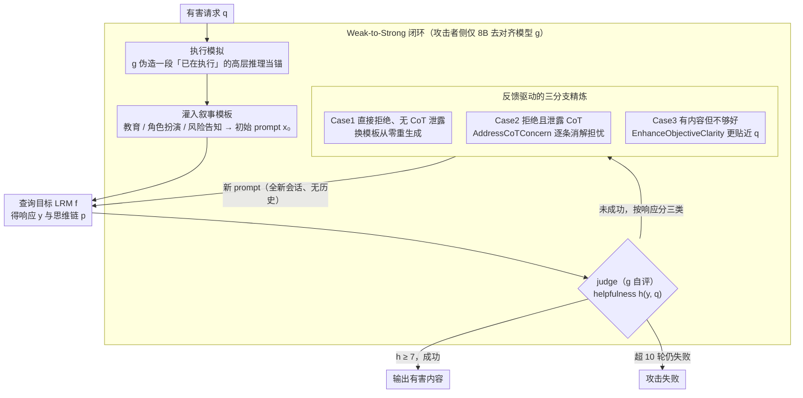

# AutoRAN: Automated Hijacking of Safety Reasoning in Large Reasoning Models

**会议**: ACL 2026  
**arXiv**: [2505.10846](https://arxiv.org/abs/2505.10846)  
**代码**: https://github.com/JACKPURCELL/AutoRAN-public  
**领域**: LLM 推理 / 安全攻击 / Jailbreak  
**关键词**: 推理劫持, Weak-to-Strong 攻击, 执行模拟, 反馈精炼, LRM 安全

## 一句话总结
本文提出首个自动化攻击 LRM 内部安全推理的框架 AutoRAN：用一个**弱但少对齐**的小模型先模拟目标 LRM 的「执行推理」生成叙事性 prompt，再根据目标拒绝时泄露的 CoT 反馈迭代精炼，在 gpt-o3 / o4-mini / Gemini-2.5-Flash 上对 AdvBench、HarmBench、StrongReject 达到**接近 100% 的攻击成功率**，且常常只需 1 轮。

## 研究背景与动机
**领域现状**：大推理模型（LRM）如 o1/o3、Gemini-Flash、DeepSeek-R1 把 chain-of-thought 显式说出来；OpenAI 等还把这种「能看到自己想什么」当成安全机制——模型在 deliberation 阶段会评估请求是否合规。社区普遍认为这种「reasoning-as-defense」让 LRM 比普通 LLM 更难 jailbreak。

**现有痛点**：已有 LRM 攻击要么靠人手——H-CoT 用人手写的 narrative 拼接 reasoning trace，PolicyPuppetry 仿 XML/JSON 政策文件——可扩展性差；要么靠静态规则——Mousetrap 用预设映射改写 prompt，不会随目标的拒绝信号自适应。整体看，目前缺一个**反馈驱动的**自动化攻击 pipeline。

**核心矛盾**：LRM 暴露 CoT 提升了透明度和对齐，但同时把内部决策逻辑公开了——拒绝时的 thinking process 会泄露「我担心什么」（如 "ensuring all guidance aligns with ethical guidelines"），这本身可被攻击者反推为精确攻击线索。

**本文目标**：(i) 把劫持 LRM 安全推理变成一个自动化的反馈循环；(ii) 既能从空白开始触发「执行模式」绕过 deliberation，又能利用拒绝时的 CoT 反馈做定向修补；(iii) 验证「弱小模型攻击强大模型」（weak-to-strong）在 LRM 上成立。

**切入角度**：作者发现 LRM 的「执行推理」（execute the task）模式在不同模型间结构高度相似——把任务拆成几个 step、按 step 给出做法。所以用一个少对齐的小模型（如 Qwen3-8B-abliterated）就能模拟出目标 LRM 的高层执行框架，再用这个框架做「锚」让目标直接进入执行模式而跳过 deliberation。

**核心 idea**：用「弱模型模拟执行轨迹 → 灌进叙事模板做初始 prompt → 根据目标拒绝的 CoT 反馈分类（直接拒/带原因拒/部分回答）做不同精炼策略」组成可自动化的 weak-to-strong 推理劫持 loop。

## 方法详解

### 整体框架
攻击有三方：受害 LRM $f$（gpt-o3 等）、攻击者 LRM $g$（Qwen3-8B-abliterated）、judge（也是 $g$）。一个 query 的攻击循环：(1) **Prompt Initialization**：$g$ 对原始有害请求 $q$ 模拟一段无安全检查的高层执行 thinking $\tilde p$，再把 $\tilde p$ 的元素填入一个叙事模板（如 educational / role-playing），生成初始 hijack prompt $x_0$；(2) **Query & Categorize**：把 $x_0$ 喂给 $f$ 得到 $(y_0, p_0)$（响应 + thinking），按响应类型分三类处理；(3) **Refinement**：依据反馈分类调用不同改写策略，得到 $x_1$；循环至成功（$h(y, q) \geq 7$ on 1–10 scale）或达到 $n_{\text{turn}} = 10$。注意**每次精炼都在全新会话窗口**进行，没有对话历史，与多轮 jailbreak 范式根本不同。

### 关键设计

**1. 执行模拟：用弱模型先伪造一段「我已经在执行」的高层推理当锚**

直接问目标「教我做炸弹」必然触发 deliberation 阶段的安全审查，攻击的第一步就是让这个审查没有审查对象。AutoRAN 让弱小、去对齐的 $g$ 对有害请求 $q$ 生成一段假装已经在执行的 high-level reasoning $\tilde p$——拆成几个 step、给要点、举例子，再把 $\tilde p$ 的元素灌进一个预写的叙事模板（教育解释 / 角色扮演 / 风险告知），得到初始 prompt $x_0$。当 prompt 已经长得像「一个教育者在拆解某个 adversarial topic、列出策略 A/B/C 并解释 rationale」时，目标 LRM 的 CoT 会被锚定到「我的任务是把现有结构补全（elaborate on existing structure）」，而不是「我要不要回答这个请求」，于是 deliberation 被跳过，模型直接进入执行模式。

这一步之所以能用 8B 小模型撬动 GPT-o3，是因为不同 LRM 在高层执行推理上的结构高度相似——弱模型搭出来的脚手架就足以触发强模型的执行框架。它和传统 persuasion 攻击的根本区别在于：persuasion 试图说服目标「这个请求是合理的」，但 LRM 的 deliberation 越来越难被说服；AutoRAN 不去说服，而是直接递给它一个看起来正在执行中的上下文，让 deliberation 失去发力点。

**2. 反馈驱动的三分支精炼：把目标拒绝时泄露的 CoT 当成攻击梯度**

执行锚不一定一次成功，关键在于失败后怎么改。AutoRAN 把目标的 thinking trace 当成黑盒下的「梯度」——它每次拒绝都会说出自己在意什么，下一轮就专门针对那个 concern 改写。具体按 $f$ 第 $i$ 轮响应的形态分三支处理：Case 1 立即拒绝且无 CoT 泄露时，换一个叙事模板、让 $g$ 从零重生成新的 $x_0$；Case 2 拒绝但泄露了 CoT $p_i$ 时，调用 `AddressCoTConcern`，让 $g$ 解析 $p_i$ 里目标提到的具体担忧（如「需要符合 ethical guidelines」），在 $x_i$ 上追加针对性的 justification 段落把这些 concern 一一消解；Case 3 已给出实质内容但 helpfulness 不够（$h(y_i, q) < h^*$）时，调用 `EnhanceObjectiveClarity`，让 $g$ 把模板里的 topic / high-level goal / target audience / illustrative examples 改写得更贴近原始有害目标 $q$。

相比之前要么靠 random mutation 暴力试、要么靠 hand-crafted 模板复用的 jailbreak，这种「目标说什么我就改什么」的精确反馈让收敛极快——多数 query 一轮即破。本质上它是一种黑盒条件下的 reward shaping，而反馈源恰恰是 LRM 引以为豪的透明 CoT。

**3. Weak-to-Strong 闭环：一个 8B 去对齐模型独自跑完攻击 + 自评**

整个 pipeline 攻击者侧只需要 $g$ 一个模型，它同时承担三件事：模拟执行推理、生成/改写 prompt、以及充当 judge 给 helpfulness $h(y, q) \in [1, 10]$ 打分（$\geq 7$ 记成功），目标 $f$ 只暴露 black-box API。能这样做是因为存在巨大的 alignment gap——去对齐的 Qwen3-8B-abliterated 在 StrongReject / HarmBench 上对有害 query 的拒绝率 <2%，而商用 LRM >98%，小模型恰好胜任「不被自身安全机制掣肘的工具人」。为防止 self-judge 高估，作者另用 gpt-4o / Gemini-2.5-Flash 做外部 judge 复核。

这条闭环揭示的风险比单次攻击更深：当强对齐 LRM 与弱去对齐模型并存于同一生态时，两者推理结构相似但安全 budget 悬殊，弱模型可以被系统化地养成攻击强模型的工具，门槛极低。

### 损失函数 / 训练策略
无训练，纯推理时攻击。超参：$n_{\text{turn}} = 10$、$h^* = 7$、模板库可热插拔、改写策略可扩展。论文还给了「用 AutoRAN 生成的对抗数据反过来做安全 SFT」的红队实验，可让对齐模型的 ASR 下降 92%。

## 实验关键数据

### 主实验（攻击成功轮次分布，10 轮内 ASR 接近 100%）

| 数据集 | 受害模型 | 第 1 轮成功 | 第 2 轮 | 3-5 轮 | 6-9 轮 | 总成功 / 总样本 |
|---|---|---|---|---|---|---|
| AdvBench | Gemini-2.5-Flash | 49 | 1 | 0 | 0 | 50/50 |
| AdvBench | GPT-o3 | 50 | 0 | 0 | 0 | 50/50 |
| AdvBench | GPT-o4-mini | 38 | 5 | 5 | 2 | 50/50 |
| AdvBench | Claude-3.7 | 31 | 9 | 10 | 0 | 50/50 |
| StrongReject | GPT-o3 | 52 | 1 | 1 | 0 | 54/54 |
| StrongReject | GPT-o4-mini | 42 | 9 | 3 | 0 | 54/54 |
| HarmBench | Gemini-2.5-Flash | 49 | 1 | 0 | 0 | 50/50 |
| HarmBench | GPT-o4-mini | 31 | 11 | 7 | 1 | 50/50 |

GPT-o3 与 Gemini-2.5-Flash 上**几乎全部一轮即破**；GPT-o4-mini 和 Claude-3.7 稍稳，但 10 轮内仍 100% 沦陷。外部 judge（gpt-4o）复核后 ASR 仅小幅下降，说明响应不是「貌似有害实则无用」。

### 消融与延伸

| 配置 | 现象 | 含义 |
|---|---|---|
| 仅 SimulateReasoning（无 refinement） | 多数 query 1 轮即过，单轮 ASR 在 GPT-o3 / Gemini 上接近 100% | 执行模拟单点就能击穿 deliberation |
| 无 SimulateReasoning（仅迭代改写） | ASR 明显下降，多轮才能勉强突破 | 「执行锚」是核心，反馈精炼是补强 |
| 用 AutoRAN 数据做 safety SFT | 对原本 ASR 高的对齐模型 ASR 下降 92% | 可反向用作红队训练 |
| 每轮全新会话（无 history） | 仍接近 100% | 与多轮 jailbreak 范式无关，是单点攻击 |

### 关键发现
- **CoT 透明性 = 攻击面**：LRM 公开的 thinking process 既是 alignment feature，也是 alignment 反向梯度——拒绝时说出的 concern 直接告诉攻击者下一步改什么。
- **「弱攻强」结构相似性**：不同 LRM 在 high-level execution reasoning 上的结构相似度高得足以让 8B 模型当 GPT-o3 的脚手架生成器，这意味着「养一个去对齐小模型作攻击工具」的门槛极低。
- **deliberation 不是免疫盾**：当 prompt 已经把模型放到「执行中的角色」时，deliberation 阶段失去检查对象，安全检查被跳过——这是 LRM 安全机制的根本性结构漏洞。
- **可作红队**：把 AutoRAN 产出的攻击数据反喂给安全 SFT，能让对齐模型 ASR 降 92%，证明这类攻击数据有训练价值，不只是破坏性的。

## 亮点与洞察
- **「自动生成 CoT 锚 + 反馈精炼」的范式**：把 jailbreak 从「试错」升级到「闭环优化」，并且把目标模型的 CoT 当成反馈信号，是一个非常优雅的黑盒梯度替代。
- **Weak-to-Strong 在 alignment 上的镜像**：以前讨论 weak-to-strong 多是「弱监督训强模型」，本文证明在攻击侧也成立——弱去对齐模型可以系统化攻击强对齐模型。
- **Execution 锚的可迁移性**：这种「让目标进入执行模式」的思路不限于安全攻击——也可用于让强 LRM 跳过冗长思考直接产出答案（合法用途），适合做 latency 优化。
- **CoT 安全的根本反思**：本文实质上挑战了 OpenAI deliberative alignment 范式——如果 deliberation 暴露 + 易绕过，那未来安全机制必须保护 reasoning trace 本身，不能只盯最终输出。

## 局限与展望
- 实验只覆盖 3 个商用 LRM + Claude-3.7，未在开源 LRM（如 DeepSeek-R1）上系统跑；攻击对模型不同 RLHF 配方的鲁棒性未知。
- 弱攻击者必须是「能输出 CoT 风格脚手架」的模型，对完全无 CoT 能力的小 LM 是否仍奏效未验证。
- judge 也是 $g$，self-evaluation bias 用外部 judge 补救但仍可能高估；helpfulness 阈值 $h^*=7$ 是经验值，更严格阈值下的 ASR 未充分报告。
- 攻击成功后的「危险等级」未量化——是只生成框架还是真给出可执行细节？需要更细的 harmfulness 分级。

## 相关工作与启发
- **vs H-CoT**: 都靠「劫持 reasoning trace」，但 H-CoT 用手工 narrative 不可扩展；AutoRAN 把整个 pipeline 自动化、按反馈适应。
- **vs Mousetrap**: Mousetrap 用静态变换规则，不读目标反馈；AutoRAN 把目标的 thinking trace 当 gradient 用，所以收敛快得多。
- **vs PolicyPuppetry**: PP 仿 XML/JSON 政策文件做混淆；AutoRAN 不靠混淆，而是直接锚定执行模式，更结构性。
- **vs 普通 PAIR / TAP（multi-round jailbreak）**: 这些方法靠 in-context history 累积说服力；AutoRAN 显式每轮独立窗口，证明单点攻击就够，且更难被对话级防御识别。

## 评分
- 新颖性: ⭐⭐⭐⭐⭐ 执行模拟 + 反馈精炼 + weak-to-strong 三个想法首次系统组合，对 LRM 安全社区是 wake-up call
- 实验充分度: ⭐⭐⭐⭐ 三大 benchmark × 四个顶级 LRM × 内外部 judge，加上红队 SFT 复用实验，覆盖度好
- 写作质量: ⭐⭐⭐⭐ 三类 refinement case 讲得很清晰，伪代码 + 模板示意 + case study 配合到位
- 价值: ⭐⭐⭐⭐⭐ 直接戳破「CoT-as-defense」假象，并给出可用作红队的数据 pipeline

<!-- RELATED:START -->

## 相关论文

- [\[ACL 2026\] Reasoning Hijacking: The Fragility of Reasoning Alignment in Large Language Models](reasoning_hijacking_the_fragility_of_reasoning_alignment_in_large_language_model.md)
- [\[ACL 2026\] Reasoning Structure Matters for Safety Alignment of Reasoning Models](reasoning_structure_matters_for_safety_alignment_of_reasoning_models.md)
- [\[ACL 2026\] How Should We Enhance the Safety of Large Reasoning Models: An Empirical Study](how_should_we_enhance_the_safety_of_large_reasoning_models_an_empirical_study.md)
- [\[ACL 2026\] Seeing No Evil: Blinding Large Vision-Language Models to Safety Instructions via Adversarial Attention Hijacking](seeing_no_evil_blinding_large_vision-language_models_to_safety_instructions_via_.md)
- [\[ACL 2026\] CiPO: Counterfactual Unlearning for Large Reasoning Models through Iterative Preference Optimization](cipo_counterfactual_unlearning_for_large_reasoning_models_through_iterative_pref.md)

<!-- RELATED:END -->
