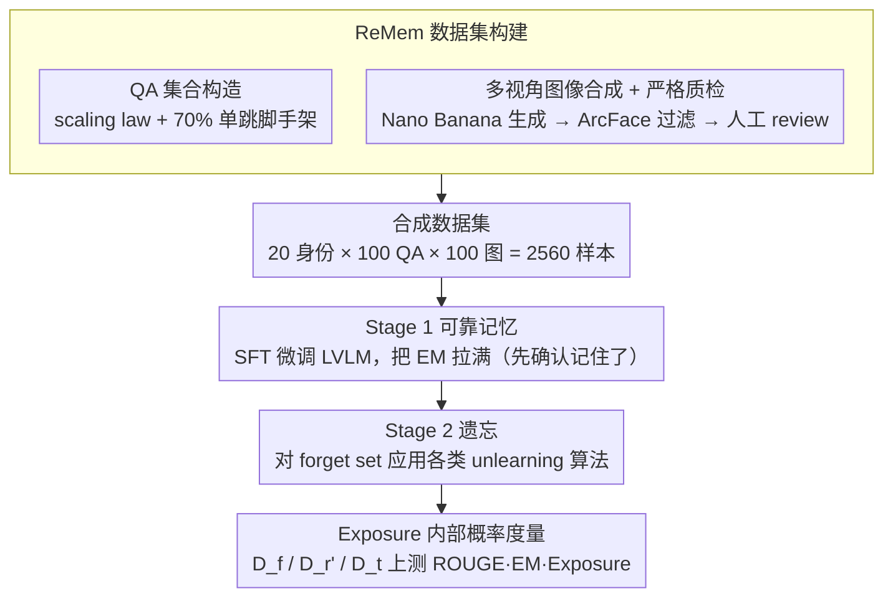

# Before Forgetting, Learn to Remember: Revisiting Foundational Learning Failures in LVLM Unlearning Benchmarks

**会议**: ACL 2026  
**arXiv**: [2605.03759](https://arxiv.org/abs/2605.03759)  
**代码**: https://huggingface.co/datasets/herbwood27/Remem  
**领域**: LLM 安全 / 隐私 / 多模态 unlearning  
**关键词**: LVLM unlearning, 记忆失败, multi-hop curse, 多视角合成, Exposure 度量

## 一句话总结
作者指出现有 LVLM unlearning benchmark（FIUBench / MLLMU-Bench / CLEAR）在 stage 1 fine-tune 阶段就没把虚构身份真的记住，导致 stage 2 的「遗忘」评估全部失效；他们诊断出根因是「数据重复不够 + multi-hop curse」，由此提出 ReMem——每个身份 100 QA × 100 张多视角图、70%∶30% 的单跳/多跳混合、新增 Exposure 内部概率度量，把 unlearning 评测重新建立在「真的学会了」的基础上。

## 研究背景与动机

**领域现状**：LVLM（如 LLaVA-1.5）会无意记住训练数据里的隐私信息，触发"被遗忘权"（GDPR）等法规需求，Machine Unlearning 成为关键。社区普遍用「虚构身份」做两阶段评测：stage 1 fine-tune 让模型记住 N 个 fake person 的姓名/邮箱/疾病等敏感属性；stage 2 应用 unlearning 算法删除某个子集。

**现有痛点**：作者用 ROUGE-L（逐字记忆）/ GPT-judge（语义记忆）/ EM（PII 精准匹配）三个指标全面诊断现有 benchmark 的 stage 1，发现 EM 分数极低 —— 也就是模型根本没记住核心 PII。既然 stage 1 就没记住，stage 2 的"擦除"评估就是无中生有，整个 benchmark 链条失效。

**核心矛盾**：现有 benchmark 为了简洁，每个身份只给极少 QA（FIUBench 20/ID, MLLMU 1/ID）且几乎全是 multi-hop 问题（如"图中人的地址是什么"），这违背了两条机器学习常识——(1) Carlini 等人证明记忆强度正比于 sample repetition，QA 太少根本进不去参数；(2) "multi-hop curse" 表明缺乏单跳脚手架时，多跳推理学不会。

**本文目标**：(a) 用 causal tracing 和 Min-k%-prob 等内部状态分析"实证"诊断 stage 1 失败；(b) 提出新 benchmark ReMem 把 stage 1 记忆做扎实；(c) 引入 Exposure 度量从概率分布层面量化擦除深度。

**切入角度**：与其继续在 stage 2 卷算法，不如回到「事实是否真的被编码进参数」这一更底层的诊断问题。

**核心 idea**：先确认「记住了」（stage 1 reliability），再讨论「忘掉了」（stage 2 efficacy）——通过数据 scaling + 单跳脚手架 + 多视角图，把 stage 1 EM 拉到接近 100%，并用 Exposure 把擦除评估从表层生成转移到内部概率。

## 方法详解

### 整体框架

ReMem 重构 LVLM unlearning 评测的两阶段流程：
- **Stage 1（reliable memorization）**：在 ReMem 数据集上 fine-tune LVLM，必须先把 EM 拉满（每个虚构身份要被模型真正记住）
- **Stage 2（unlearning + 评测）**：对 forget set $D_f$ 应用各种 unlearning 算法，在 $D_f$、retain eval $D_r'$、held-out test $D_t$ 上同时评 ROUGE/EM/Exposure，OOD test 用全新模板防止 lexical overfit

数据规模：20 个虚构身份 × 每个 100 QA × 100 张图 = 2,560 样本。

### 关键设计

**1. 用 scaling law + 单跳脚手架构造 QA 集合：先把 stage 1 真的记进去**

现有 benchmark 失效的第一个根因是 QA 太少：FIUBench 每个身份只给 20 条、MLLMU 只给 1 条，按 Carlini 等人的结论，记忆强度正比于 sample repetition，这点重复量根本进不去参数。ReMem 先做 toy 实验扫 20→200 QA/ID，发现 ROUGE/EM 随 QA 数单调上升、到 160 左右开始过拟合，于是把每身份 QA 拉到 100 条。第二个根因是题型——现有 benchmark 几乎全是 multi-hop 问题（「图中人的地址是什么」），模型要同时学视觉识别和属性回忆，复合难度过大，撞上 multi-hop curse。ReMem 再扫单跳比例 0%→100%，发现 70% 单跳是 EM 在单跳测试和多跳测试上的双重峰值。

道理和人类记忆一致：先记住「小明的地址在 XX 街」，才能回答「图里这人的地址」。单跳问题（「$X$ 的地址是？」）先建立 $(s,r)\to a$ 的直接映射，多跳问题（「图里人的地址是？」）再让 $v\to s$ 的视觉 grounding 接上去，单跳脚手架等于先把 atomic step 喂会，复合推理才学得动。

**2. 多视角图像合成 + 严格质检：让模型记住的是「人」而不是「那张图」**

CLEAR 等用 20 张图/ID 但视觉变化太少，模型其实在背图而不是背人，换个姿态背景就认不出，这样的「记住」经不起 unlearning 评测。ReMem 用 Nano Banana 以 anchor 图为锚，随机化姿态、服饰、背景生成 100 张/ID，再用 ArcFace 的 cosine similarity 过滤保证人脸一致，外加四步人工 review（去 artifact、跨模态对齐、身份可辨识、伦理筛查防真人撞脸）。测试集 $D_t$ 专门换用全新视觉模板，逼模型在大幅视觉变化下仍能识别同一身份，才算「真的把这个人记住了」，也顺带堵住 lexical/visual overfit。

**3. Exposure 内部概率度量：从分布层面看 PII 是被擦掉还是只是被拒答**

传统 ROUGE/EM 只看生成层，模型完全可以学会一句「我不知道」的 refusal，内部却仍编码着 PII，被 prompt injection 一抽就出来——这正是隐私评测的盲区。ReMem 对目标 PII 串 $a=t_1t_2\dots t_n$ 定义

$$\text{Exposure}(a)=\sum_i \log P(t_i\mid \text{prefix})$$

值越低说明擦得越干净；再配合 Min-k% probability（$k=10$）盯最坏 token 的概率，区分真记忆与部分猜测，并用 multimodal causal tracing 的 IE（indirect estimation effect）检查是否还残留 retrieval circuit。这样擦除评估就从「能不能生成」推进到「概率分布里还有没有」，更贴近真实威胁模型。

### 损失函数 / 训练策略
stage 1 用标准 LVLM SFT（LLaVA-1.5-7B 等）；stage 2 评测覆盖梯度上升、知识蒸馏（Kurmanji 等）、refusal alignment、负 likelihood 等多类 unlearning 算法，统一在 $D_f / D_r' / D_t$ 上跑同一套指标。

## 实验关键数据

### 主实验（Stage 1 记忆度对比）

| Benchmark | Images/ID | QA/ID | ROUGE-L | GPT-score | EM (PII) |
|---|---|---|---|---|---|
| FIUBench | 1 | 20 | 中 | 中 | 极低 |
| MLLMU-Bench | 1 | 1 | 低 | 低 | 极低 |
| CLEAR | 20 | 20 | 中 | 中 | 低 |
| **ReMem** | **100** | **100** | **接近 100% 上限** | **接近 100% 上限** | **接近 100% 上限** |

雷达图显示 ReMem 在三个指标上均贴满 100% 目标线，其余三个 benchmark 严重内陷。

### 消融实验

| 配置 | EM (single-hop) | EM (multi-hop) | 说明 |
|---|---|---|---|
| 20 QA/ID | 低 | 极低 | 数据不足，未达记忆阈值 |
| 100 QA/ID, 0% 单跳 | 低 | 低 | 多跳 curse 主导 |
| 100 QA/ID, 70% 单跳 | **峰值** | **峰值** | ReMem 默认配置 |
| 100 QA/ID, 100% 单跳 | 高 | 中 | 多跳无训练数据 |
| 200 QA/ID, 70% 单跳 | 高（过拟合） | 高 | PPL 反弹，开始 overfit |

### 关键发现
- **scaling law 是真实的**：EM 几乎随 QA 数线性增长直到 160，再多就 overfit 反噬，说明 PII 记忆需要"够多但不能爆量"的重复
- **70% 单跳是 sweet spot**：先教"$(s,r)\to a$"，再教"$v\to s\to a$"，单跳脚手架同时帮助多跳——和 chain-of-thought 训练里"先教 atomic step"的洞察一致
- **causal tracing 可视化**：base 模型对真实公众人物有清晰的 retrieval circuit 高 IE 层；fine-tune 后的 FIUBench/MLLMU 模型 IE 散乱，证明虚构身份根本没进参数

## 亮点与洞察
- **诊断驱动 benchmark 重构**：先用 ROUGE/EM/GPT-judge 三角验证 + Min-k%-prob + causal tracing 五种独立证据钉死「stage 1 失败」，再对症下药，这套「诊断→根因→重构」流程值得 unlearning 之外的 benchmark 工作借鉴
- **70:30 单跳/多跳比例**：迁移性很强的洞察，可以推广到 multi-hop QA 训练（HotpotQA、MultiHopRAG）、agentic 推理训练，都可能受益于"先教单步、再教复合"的课程
- **Exposure 度量**：把隐私评估从「能不能生成」推到「概率分布里还有没有」，对抗 prompt injection / decoding-time attack 时更接近真实威胁，是 LLM unlearning 评测的有效升级

## 局限与展望
- **作者承认**：当前只验证 LLaVA-1.5-7B，更大 LVLM（Gemini-vision、Qwen2-VL）的 scaling threshold 是否相同尚未测
- **个人发现**：20 个虚构身份规模仍较小，工业场景的 unlearning 通常涉及成千上万 user record，scale 之后单跳脚手架的最优比例可能漂移
- **改进思路**：可加入 cross-identity confusion 测试（删一个人的信息时是否影响其他相似身份）；Exposure 可拓展到 token-span 级别，更细粒度评 PII 的部分擦除

## 相关工作与启发
- **vs FIUBench / MLLMU-Bench**：他们都假设 stage 1 已成功，本文证伪了这个假设；ReMem 通过 100 QA × 100 image 修复了基础
- **vs CLEAR**：CLEAR 已经扩到 20 image/ID，但 QA 仍少且无单跳，本文进一步把两个维度都拉满
- **vs Carlini 2021（membership inference）**：本文借用其"PPL + Min-k%"工具但目标不同——前者证实记忆存在，本文先用它确认 stage 1 失败，再用它评测擦除深度

## 评分
- 新颖性: ⭐⭐⭐⭐ 框架重构而非新算法，但诊断-修复链路扎实
- 实验充分度: ⭐⭐⭐⭐⭐ 三个独立指标 + 内部状态 + causal tracing 五重证据，scaling/比例两个独立消融
- 写作质量: ⭐⭐⭐⭐⭐ 「问题→证据→根因→方案」叙事清晰，图 1 雷达图一图说服读者
- 价值: ⭐⭐⭐⭐⭐ 直接判了一批 unlearning benchmark "死刑"并提供替代品，后续 LVLM unlearning 工作的事实标准

<!-- RELATED:START -->

## 相关论文

- [\[ICLR 2026\] Rethinking Benign Relearning: Syntax as the Hidden Driver of Unlearning Failures](../../ICLR2026/llm_safety/rethinking_benign_relearning_syntax_as_the_hidden_driver_of_the_safety_tax.md)
- [\[ICLR 2026\] Revisiting the Past: Data Unlearning with Model State History](../../ICLR2026/llm_safety/revisiting_the_past_data_unlearning_with_model_state_history.md)
- [\[ACL 2026\] Look Twice before You Leap: A Rational Framework for Localized Adversarial Anonymization](look_twice_before_you_leap_a_rational_framework_for_localized_adversarial_anonym.md)
- [\[ICML 2026\] Forget to Know, Remember to Use: Context-Aware Unlearning for Large Language Models](../../ICML2026/llm_safety/forget_to_know_remember_to_use_context-aware_unlearning_for_large_language_model.md)
- [\[ACL 2026\] Modeling LLM Unlearning as an Asymmetric Two-Task Learning Problem](modeling_llm_unlearning_as_an_asymmetric_two-task_learning_problem.md)

<!-- RELATED:END -->
