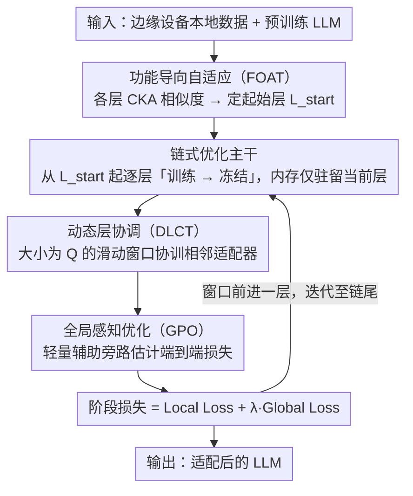

# Beyond End-to-End: Dynamic Chain Optimization for Private LLM Adaptation on the Edge

**会议**: ACL 2026  
**arXiv**: [2604.06819](https://arxiv.org/abs/2604.06819)  
**代码**: 无  
**领域**: LLM效率 / 联邦学习 / 隐私保护  
**关键词**: 联邦微调, 边缘设备, 内存墙, 链式优化, 适配器

## 一句话总结
提出 ChainFed，一种打破内存墙的链式联邦微调范式，通过逐层顺序训练-冻结适配器使资源受限边缘设备也能参与 LLM 微调，结合动态层协调、全局感知优化和功能导向自适应三项技术，平均准确率提升最高 46.46%。

## 研究背景与动机

**领域现状**：LLM 在移动智能中潜力巨大，但下游任务适配面临隐私法规限制——数据只能保留在用户设备上。联邦微调是一种隐私保护的协作适配方案，但实际部署受限于 LLM 的资源需求。

**现有痛点**：参数高效方法（如 adapter/LoRA）虽然减少了计算和通信开销，但无法解决根本的内存瓶颈——整个模型仍需加载到内存中。LLaMA2-7B 需约 25GB 内存，远超移动设备典型的 4-12GB 容量。实验表明，基础模型参数占内存的 91.2%-94.1%，中间激活（7.2%）和适配器（0.018%）的优化收益微乎其微。

**核心矛盾**：内存约束不仅是资源障碍，更是性能瓶颈——排除低端设备意味着丢失大量宝贵的设备端数据。实验显示内存约束下准确率在 IID 设置中下降 8.5%，non-IID 下降 11.8%。

**本文目标**：从根本上减少微调期间驻留在内存中的模型参数数量，让资源受限设备也能参与联邦微调。

**切入角度**：既然基础参数占内存 90%+ 而适配器/激活优化收益甚微，不如只在内存中保留当前需要训练的那一层。

**核心 idea**：将端到端优化拆解为逐层链式优化——先训练第一个适配器到收敛并冻结，再训练下一个，形成优化链逐步增强任务能力。

## 方法详解

### 整体框架
ChainFed 把端到端的 LLM 微调拆解成一条「逐层顺序训练」的优化链：从某个起始层开始，先把当前层的适配器（adapter）训练到收敛再冻结，然后纳入下一层继续训练，如此推进直到链尾。任意时刻内存里只需驻留当前训练的那一层参数（前驱层跑完前向即释放、后继层尚未激活），从而把微调的内存峰值压到「单层」级别，让 4–12GB 的边缘设备也能参与。围绕这条主干，ChainFed 补上三项技术修补链式训练的短板：先用功能导向自适应（FOAT）确定该从哪一层起步，再在每个链式阶段用动态层协调（DLCT）让相邻适配器协同、用全局感知优化（GPO）给只看局部的训练注入全局视角。

### 关键设计

**1. 功能导向自适应（FOAT）：用 CKA 自动找到该从哪一层开始微调**

链式优化首先要回答「从哪一层起步」——LLM 从浅层语法到深层语义存在功能层次，过早开始微调既浪费计算、又可能破坏通用表征，过晚则适配不足。FOAT 用 CKA（Centered Kernel Alignment）量化每层激活与输入的相似度：CKA 高的层是通用层，保持冻结；CKA 首次低于阈值 $T$ 的那一层即微调起始点 $L_{start}$。每个设备只需在本地数据上做一次前向传播算出各层 CKA 分数，上传到服务器聚合即可确定全局起始层，这一步几乎不增加额外开销，且因为是数据驱动的，对 non-IID 的数据异质性更鲁棒。

**2. 动态层协调（DLCT）：用滑动窗口让相邻适配器共训，补回链式训练丢掉的跨层信息流**

把端到端拆成逐层顺序训练后，每个适配器是孤立学的，会带来两个问题：相邻层之间出现语义鸿沟（表征失配），以及梯度无法跨层传播（梯度隔离）。DLCT 不再逐个孤立训练，而是用一个大小为 $Q$ 的滑动窗口同时协调训练相邻的几个适配器，窗口每前进一层就保留 $Q-1$ 个重叠适配器。以 $Q=2$ 为例：第一阶段协训适配器 1+2，第二阶段协训适配器 2+3，被两阶段共享的适配器 2 一身两职——既作为语义锚点把前后特征空间对齐，又作为梯度导管把梯度从后一层引回前一层，打破梯度隔离。

**3. 全局感知优化（GPO）：给只能看到局部的适配器接一条轻量旁路，估计端到端损失**

链式训练天然「近视」：当前适配器拿不到下游层的反馈，很容易过度特化，把对全局有用、但对当前局部任务暂时无用的信息过早丢弃。GPO 为此设计一条轻量辅助输出分支——它只由后续适配器和最终输出层组成，不经过完整模型，利用适配器本身是层变换的低秩近似这一点来估计端到端损失，从而在不加载整个模型的前提下注入全局视角。每个阶段的训练目标因此写成

$$Loss_m = Local\ Loss + \lambda \cdot Global\ Loss$$

局部损失保证当前层学到位，全局损失把下游影响拉回来约束它别走偏。

### 损失函数 / 训练策略
$Loss_m = Local Loss + \lambda \cdot Global Loss$，最后一阶段只用端到端损失。FOAT 使用 CKA 阈值 $T$ 决定起始层。

## 实验关键数据

### 主实验（文本分类，DistilBERT/BERT/RoBERTa）

| 方法 | YELP-P (IID) | AGNEWS (IID) | YAHOO (IID) | Average |
|------|-------------|-------------|------------|---------|
| No-FT | 50.04 | 25.13 | 10.05 | - |
| Linear Probing | 71.56 | 85.76 | - | - |
| ChainFed | **最优** | **最优** | **最优** | +46.46% vs Lower Bound |

### 指令微调（LLaMA2-7B / LLaMA3.1-8B）

| 方法 | MMLU | BBH | DROP | CRASS |
|------|------|-----|------|-------|
| ChainFed | 最优 | 最优 | 最优 | 最优 |
| vs 现有最佳 | 显著提升 | 显著提升 | 显著提升 | 显著提升 |

### 消融实验

| 配置 | 效果 | 说明 |
|------|------|------|
| w/o DLCT | 下降 | 丧失跨层协调，表征失配 |
| w/o GPO | 下降 | 局部过度特化 |
| w/o FOAT | 下降 | 不必要地微调通用层 |
| 全部移除 | 大幅下降 | 仅剩基础链式训练 |

### 关键发现
- ChainFed 在所有基准上显著优于现有方法，平均准确率提升最高 46.46%
- 在 non-IID 设置下优势更明显，说明 FOAT 的 CKA 聚合对数据异质性具有鲁棒性
- 滑动窗口大小 $Q=2$ 在性能和内存之间取得最佳平衡

## 亮点与洞察
- **"模型参数占 91.2% 内存"这个观察**直接否定了适配器/激活优化路线的有效性，动机非常清晰有力
- **链式优化将内存需求降到仅一层模型参数**，这是一种优雅的空间-时间权衡——用更多训练轮次换取更低的内存峰值
- **用适配器近似层变换来估计全局损失**的设计很巧妙——避免了加载完整模型的内存开销

## 局限与展望
- 链式训练增加了总训练轮数和通信成本，时间效率可能不如端到端方法
- 目前假设适配器能充分近似层变换，对于非常深的模型这个假设可能不成立
- 仅在文本任务上验证，多模态场景下的效果未知

## 相关工作与启发
- **vs FwdLLM/FedKSeed**：它们用零阶优化减少激活内存（7.2%），ChainFed 直接减少参数内存（91.2%），切入点更有效
- **vs FLoRA**：通过秩缩减减少可训练参数，但基础模型参数仍需全部加载

## 评分
- 新颖性: ⭐⭐⭐⭐⭐ 链式优化范式突破了联邦微调的内存墙，思路新颖
- 实验充分度: ⭐⭐⭐⭐ 多模型多数据集，但缺少实际移动设备部署验证
- 写作质量: ⭐⭐⭐⭐ 观察-分析-方法的逻辑链清晰
- 价值: ⭐⭐⭐⭐⭐ 对边缘 LLM 部署有重要实际意义

<!-- RELATED:START -->

## 相关论文

- [\[ACL 2026\] CarO: Chain-of-Analogy Reasoning Optimization for Robust Content Moderation](caro_chain-of-analogy_reasoning_optimization_for_robust_content_moderation.md)
- [\[NeurIPS 2025\] Differentially Private Federated Low Rank Adaptation Beyond Fixed-Matrix](../../NeurIPS2025/llm_safety/differentially_private_federated_low_rank_adaptation_beyond_fixed-matrix.md)
- [\[ACL 2026\] Beyond Explicit Refusals: Soft-Failure Attacks on Retrieval-Augmented Generation](beyond_explicit_refusals_soft-failure_attacks_on_retrieval-augmented_generation.md)
- [\[ICML 2026\] Privacy Amplification in Differentially Private Zeroth-Order Optimization with Hidden States](../../ICML2026/llm_safety/privacy_amplification_in_differentially_private_zeroth-order_optimization_with_h.md)
- [\[NeurIPS 2025\] On the Sample Complexity of Differentially Private Policy Optimization](../../NeurIPS2025/llm_safety/on_the_sample_complexity_of_differentially_private_policy_optimization.md)

<!-- RELATED:END -->
