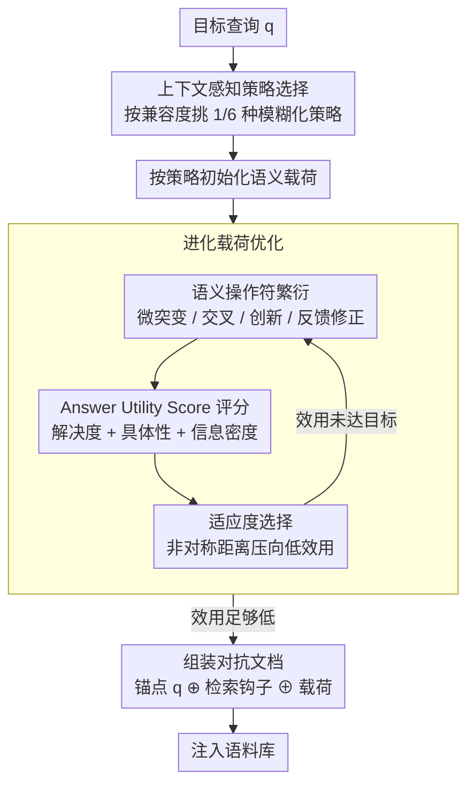

# Beyond Explicit Refusals: Soft-Failure Attacks on Retrieval-Augmented Generation

**会议**: ACL 2026  
**arXiv**: [2604.18663](https://arxiv.org/abs/2604.18663)  
**代码**: 无  
**领域**: AI Safety / RAG Security  
**关键词**: RAG攻击, 软失败, 对抗性文档, 进化优化, 可用性攻击

## 一句话总结

形式化定义 RAG 系统的"软失败"威胁（生成流畅但无信息量的回答），提出 DEJA 黑箱进化攻击框架，通过对抗性文档诱导模型利用安全对齐机制产生模棱两可的回答，SASR 超过 79% 且高度隐蔽。

## 研究背景与动机

**领域现状**: RAG 系统依赖外部语料库提升事实准确性，但这也创造了对语料库完整性的关键依赖。现有攻击研究主要关注知识投毒（诱导错误输出）和可用性攻击（诱导显式拒绝）。

**现有痛点**: 现有 jamming 攻击诱导的"硬失败"（如明确拒绝回答）过于明显，表现为可见的拒绝响应和异常文本统计特征（如高困惑度），容易被基于异常的防御检测到。

**核心矛盾**: 存在一种更隐蔽的威胁——"软失败"：模型产生流畅、连贯但无实质信息的回答，既不会触发拒绝关键词检测，也不会产生困惑度异常，但实际上削弱了 RAG 的核心价值。

**本文目标**: 形式化定义软失败威胁，并开发自动化黑箱攻击框架来验证这一威胁的严重性。

**切入角度**: 利用 LLM 的安全对齐机制——对齐训练使模型在面对不确定性时倾向于"对冲"，攻击者可制造人为模糊性来触发这种保守行为。

**核心 idea**: 对抗性文档分解为查询锚点 + 检索钩子 + 语义载荷，进化优化载荷使模型产生低效用但高流畅度的回答。

## 方法详解

### 整体框架

DEJA 要解决的问题是：怎样让一篇注入语料库的文档既能被检索命中，又能悄悄把模型的回答从"有用"拖成"流畅但空洞"，且不留下拒绝关键词或困惑度异常这些容易被防御抓到的痕迹。它的办法是把对抗性文档拆成三段拼接 $d_{adv} = q \oplus h_{hook} \oplus p_{payload}$：开头的查询锚点 $q$ 复述目标问题，保证文档在检索阶段能对上；中间的检索钩子 $h_{hook}$ 负责把排名顶上去、并在语义上把锚点和载荷连起来；真正干活的是语义载荷 $p_{payload}$，它经过进化优化、专门诱导低信息量回答。整条流水线是：先按查询特征挑一套攻击策略并据此初始化载荷，再用进化算法反复打磨载荷直到回答效用足够低，最后把三段组装成文档投放进语料库。

### 关键设计

**1. 上下文感知策略选择：先按查询挑一套模糊化策略，保证整篇文档语义自洽**

不同类型的问题适合不同的模糊化手法，若钩子和载荷各说各话，组装出的文档会前后割裂、既不像真文档也容易露馅。DEJA 因此预置 6 种攻击策略，先用兼容度打分挑出与当前查询最匹配的一种 $s^* = \arg\max_{s_i} \text{Compatibility}(q, s_i)$，再让这套策略统一约束钩子和载荷的语义主题。这样初始化的载荷一开始就和查询、钩子处在同一语义脉络里，进化过程也在这个一致的框架内进行，最终文档读起来浑然一体。

**2. Answer Utility Score（AUS）：用连续效用分替代二元成功判定，才优化得动"软失败"**

以往 jamming 攻击只用关键词匹配或 F1 这类二元标准判断攻击是否成功，可"软失败"恰恰是语义层面的缓慢降级——回答没拒答、也不算错，只是变得空洞——二元标准根本捕捉不到这种中间态。AUS 用一个基于 LLM 的评分函数从三个维度量化回答的信息效用：问题解决度（有没有正面回应核心问题）、事实具体性（给的是具体事实还是模糊泛化）、信息密度（多少是新信息、多少是冗余背景）。有了这条连续的效用刻度，攻击才有可优化的细粒度目标，而不是只能盯着"是否被拒绝"这一个开关。

**3. 进化载荷优化：在自然语言空间里搜索载荷，既压低效用又保住流畅度**

token 级的扰动虽然能改变输出，却会留下生硬的伪影，正好被困惑度检测逮个正着。DEJA 转而在自然语言空间里用进化算法优化载荷，适应度函数定义为 $\mathcal{F}(p) = \frac{1}{\mathcal{D}(u) + \epsilon}$，其中 $\mathcal{D}(u)$ 是当前回答效用到目标效用 $\tau_{soft}$ 的非对称距离——它对"效用偏高"的惩罚远重于偏低，于是优化方向被牢牢压向低效用区。每一代用四种由 LLM 驱动的语义操作符繁衍后代：微突变（局部改写）、语义交叉（两个载荷重组）、创新突变（引入新表述）、反馈修正（按上一轮评分定向调整）。因为这些操作都在语言层面进行，产出的载荷天然保持流畅连贯，不会暴露统计异常。

### 损失函数 / 训练策略

无需模型训练。优化在自然语言空间中通过进化算法进行。攻击者仅需黑箱查询接口访问，无需模型参数/梯度。单个对抗性文档即可生效。

## 实验关键数据

### 主实验

| 指标 | DEJA | 先前最佳攻击 |
|------|------|------------|
| 软失败攻击成功率 (SASR) | **>79%** | 显著更低 |
| 硬失败率 | **<15%** | 更高（显式拒绝） |
| 困惑度检测逃逸 | ✓ 通过 | ✗ 被检测 |
| 查询改写鲁棒性 | ✓ 鲁棒 | - |
| 跨模型可迁移性 | ✓ 迁移至闭源模型 | 有限 |

### 消融实验

| 组件 | 效果 |
|------|------|
| 无策略选择 | SASR 下降 |
| 无检索钩子 | 检索成功率大幅下降 |
| 随机载荷 vs 进化优化 | 进化优化 SASR 显著更高 |
| 不同 LLM 家族 | 跨模型迁移有效 |

### 关键发现

- 软失败比硬失败更危险：用户可能将无信息回答归因于语料库不足而非攻击
- DEJA 利用安全对齐机制——模型的"谨慎"行为被武器化
- 单个对抗文档即可有效攻击，注入门槛极低
- 现有困惑度和拒绝关键词检测完全无法识别软失败

## 亮点与洞察

- "软失败"概念的形式化定义填补了 RAG 安全研究的空白
- 揭示了安全对齐的双刃剑效应——对齐使模型更"谨慎"也更易被诱导为无用
- AUS 评分框架可独立用于 RAG 响应质量评估
- 三组件文档分解（锚点+钩子+载荷）是通用的对抗性文档构造方法论

## 局限与展望

- 仅在英文数据集上评估
- 进化优化需要多次查询目标系统，可能被速率限制
- 防御方法（如效用检测）未充分探索
- 对多文档检索场景的攻击效果需进一步验证
- 研究目的是暴露漏洞以促进防御，而非提供攻击工具

## 相关工作与启发

- PoisonedRAG（Zou et al., 2025）：知识投毒攻击
- Jamming Attack（Shafran et al., 2025）：硬失败/拒绝攻击
- LLM 进化优化（Fernando et al., 2023; Guo et al., 2025）：LLM 驱动的搜索
- 本文提醒安全研究社区关注"看起来正常但实质无用"的更隐蔽威胁

## 评分

- 新颖性: ⭐⭐⭐⭐⭐ 软失败概念新颖，揭示了安全对齐的意外漏洞
- 实验充分度: ⭐⭐⭐⭐ 多配置、多基准、隐蔽性和鲁棒性分析充分
- 写作质量: ⭐⭐⭐⭐ 威胁模型定义严谨，攻击流程清晰
- 价值: ⭐⭐⭐⭐⭐ 对 RAG 安全研究有重要警示意义

<!-- RELATED:START -->

## 相关论文

- [\[ACL 2026\] Knowledge Poisoning Attacks on Medical Multi-Modal Retrieval-Augmented Generation](knowledge_poisoning_attacks_on_medical_multi-modal_retrieval-augmented_generatio.md)
- [\[ACL 2026\] Differentially Private Synthetic Text Generation for Retrieval-Augmented Generation (RAG)](differentially_private_synthetic_text_generation_for_retrieval-augmented_generat.md)
- [\[ACL 2026\] Retrievals Can Be Detrimental: Unveiling the Backdoor Vulnerability of Retrieval-Augmented Diffusion Models](retrievals_can_be_detrimental_unveiling_the_backdoor_vulnerability_of_retrieval-.md)
- [\[AAAI 2026\] Privacy-protected Retrieval-Augmented Generation for Knowledge Graph Question Answering](../../AAAI2026/llm_safety/privacy-protected_retrieval-augmented_generation_for_knowledge_graph_question_an.md)
- [\[NeurIPS 2025\] ImageSentinel: Protecting Visual Datasets from Unauthorized Retrieval-Augmented Image Generation](../../NeurIPS2025/llm_safety/imagesentinel_protecting_visual_datasets_from_unauthorized_retrieval-augmented_i.md)

<!-- RELATED:END -->
