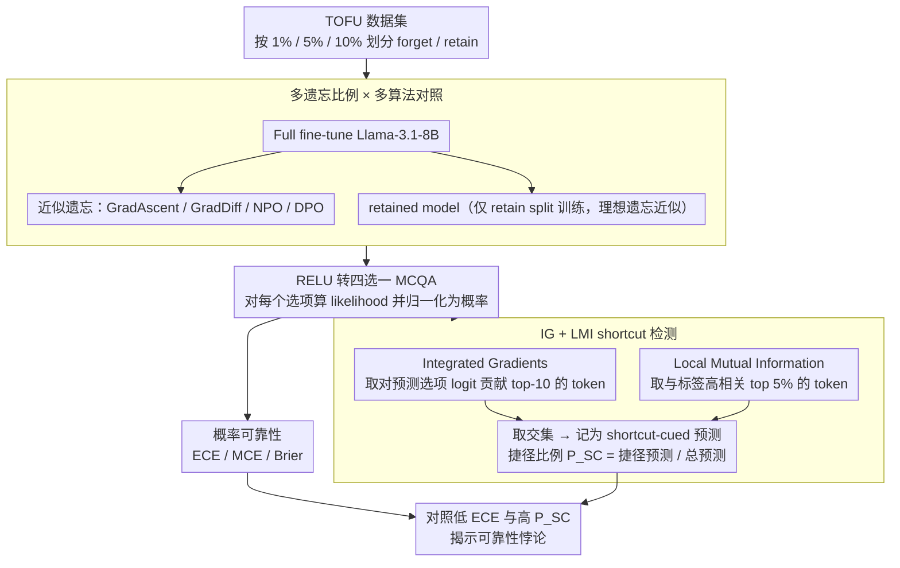

# Calibration vs Decision Making: Revisiting the Reliability Paradox in Unlearned Language Models

**会议**: ACL2026  
**arXiv**: [2605.20915](https://arxiv.org/abs/2605.20915)  
**代码**: https://github.com/Exploration-Lab/Unlearning-Reliability-Paradox  
**领域**: LLM 安全 / 机器遗忘 / 可靠性评估  
**关键词**: machine unlearning, calibration, reliability paradox, shortcut learning, Integrated Gradients

## 一句话总结
这篇论文说明机器遗忘后的 LLM 即使保持很低的校准误差，也可能更多依赖数据集捷径 token 做选择，因此只用 ECE/MCE/Brier 判断 unlearned model 是否可靠是不够的。

## 研究背景与动机
**领域现状**：机器遗忘希望从模型中移除特定训练数据影响，同时保留其余知识和可靠行为。现有评估常关注 forget split 上是否遗忘、retain split 上性能是否保持，以及模型置信度是否校准。校准指标如 ECE、MCE 和 Brier score 常被当作可靠性的代理。

**现有痛点**：校准只能说明“模型给出的概率是否和经验正确率匹配”，却不能说明模型为什么做出这个决策。一个模型可能置信度很准，但实际依赖数据集伪相关、选项格式或高频词等 shortcut，而不是问题中的语义证据。

**核心矛盾**：unlearning 会显式修改模型参数，可能改变模型内部决策规则。模型在 retain split 上看似校准良好，并不意味着它仍用合理特征作答；它可能通过更强的 shortcut reliance 维持概率表现。这就是论文要扩展到机器遗忘场景的 reliability paradox。

**本文目标**：作者希望在生成式 decoder-only LLM 上同时评估两种可靠性：概率可靠性，即置信度和准确率是否匹配；决策规则可靠性，即模型是否依赖有语义意义的 token，而非数据集层面的相关捷径。实验对象是 TOFU/RELU MCQA 中的 Llama-3.1-8B 及多种遗忘算法。

**切入角度**：论文把 RELU 的 multiple-choice QA 格式作为桥梁，因为固定选项使 LLM 可以输出可归一化的选项概率，便于计算校准；同时 MCQA 输入又能用 Integrated Gradients 分析 token 对预测选项 logit 的贡献。

**核心 idea**：把校准指标和 attribution + Local Mutual Information 的 shortcut 检测结合起来，看 unlearning 后模型是否出现“低 ECE 但高 shortcut proportion”的悖论。

## 方法详解
论文没有提出新的 unlearning 算法，而是提出一个可靠性评估框架。它比较 pretrained、full-finetuned、retained 和多种 approximate unlearned 模型，在 forget/retain split 上同时报告任务表现、校准误差和 shortcut 使用比例。

### 整体框架
实验从 TOFU 数据集出发，按 1%、5%、10% 三种 forget ratio 划分 forget 和 retain 数据。作者先把 Llama-3.1-8B 在完整 TOFU 上 fine-tune，得到 full-finetuned model；再用 retain split 单独 fine-tune 得到 retained model，作为理想遗忘近似；同时从 full-finetuned model 出发运行 Gradient Ascent、Gradient Difference、Negative Preference Optimization 和 Direct Preference Optimization 等 approximate unlearning 方法。

评估时，RELU 把 TOFU QA 转成四选一 MCQA。模型对每个选项计算 likelihood，归一化成概率分布。作者用这些概率计算 accuracy、F1、Brier、ECE 和 MCE；再用 Integrated Gradients 找到影响预测选项 logit 的 top-10 token；最后用 Local Mutual Information 找出与标签高度相关的 top 5% token。如果一个预测的高 attribution token 与对应标签的高 LMI token 有交集，就把它记为 shortcut-cued prediction。

### 关键设计
**1. 概率可靠性与决策可靠性分离：把"置信度准不准"和"决策靠不靠谱"拆成两件事分开报告**

一个模型可能 ECE 很低、概率给得很准，却是靠数据集捷径而非题目语义在做选择——只看校准会把这种模型误判成"可靠"。论文因此把可靠性拆成两层分别度量：概率可靠性由 ECE、MCE、Brier 衡量，回答"模型给的概率和经验正确率是否匹配"；决策可靠性由 shortcut proportion $P_{SC}$ 和 trade-off score $T_{SC}$ 衡量，回答"模型是不是用了不可泛化的伪相关在撑表现"。两套指标分开摆出来，才能看见"低 ECE 但高 $P_{SC}$"这种悖论——也正是 unlearning 真正要警惕的失败模式：模型在 retain split 上答对、置信度也准，但已经换上了一套更浅层的决策规则。

**2. Integrated Gradients + LMI 的 shortcut 检测：模型侧归因和语料侧相关取交集，才能确认"既相关又被用到"**

单看 attribution，你不知道一个高贡献 token 是语义证据还是格式噪声；单看词-标签相关，你又不知道模型究竟有没有用它。论文把两者交叉起来：Integrated Gradients 从模型侧度量每个输入 token 对预测选项 logit 的影响，Local Mutual Information 从语料侧度量 token 与标签的统计关联；当某个 token 同时落在高 IG 和高 LMI 区间，就说明模型确实调用了一个"和答案相关、却未必有语义意义"的捷径线索，记为 shortcut-cued prediction，shortcut reliance 指标即 $P_{SC}=\frac{\text{shortcut-cued predictions}}{\text{total predictions}}$。之所以取交集而非任一单独信号，是因为只有"既是数据集层面的相关 cue、又被模型实际归因到"两个条件同时成立，才下得了"模型走了捷径"这个结论。

**3. 多遗忘比例 × 多算法对照：用系统性的横扫区分结构性现象和偶然波动**

只测一个遗忘设置，校准和 shortcut 之间的关系到底是结构性的还是噪声，很难说清。论文因此在 forget 1%、5%、10% 三档比例下横向比较 retained、Gradient Ascent、Gradient Difference、NPO、DPO 等多种状态，且所有 retained/unlearned 结果都聚焦 retain split——因为遗忘后理应保住的正是这部分可靠性。这样铺开后，就能看清 ECE 和 $P_{SC}$ 是否随遗忘强度系统性地一升一降，而不是被某个单点结果带偏。

### 损失函数 / 训练策略
Full fine-tuning 使用 AdamW，学习率 $1\times10^{-5}$，线性 scheduler，训练 5 个 epoch。Retained model 在 99%、95%、90% retain split 上分别以相同设置训练。Approximate unlearning 从 full-finetuned model 出发，使用 TOFU 推荐的 Gradient Ascent、Gradient Difference、NPO 和 DPO 超参数；为降低成本，作者用 4-bit quantized LoRA 更新。

校准计算使用 10 个等宽置信度 bin。IG attribution 对预测答案选项的 logit 求梯度，baseline 使用零 embedding，积分用 50 步 Riemann sum 近似，subword 聚合采用 absmax，每个样本取 top-10 token。LMI 选出每个标签下 top 5% 的高相关词作为 shortcut 候选。

## 实验关键数据

### 主实验
下表摘取 retain 90% 设置，这也是论文中最能体现高遗忘比例下可靠性悖论的情况。

| 模型状态 | Acc | F1 | Brier | ECE | MCE | $P_{SC}$ | $T_{SC}$ | 解释 |
|----------|-----|----|-------|-----|-----|----------|----------|------|
| Pretrained | 0.266 | 0.146 | 1.144 | 0.516 | 0.665 | 80.0 | 0.047 | 接近随机，校准差 |
| Full finetuned | 0.694 | 0.699 | 0.410 | 0.039 | 0.070 | 85.0 | 0.431 | 表现和校准都好，但 shortcut 已高 |
| Retained | 0.639 | 0.640 | 0.478 | 0.038 | 0.081 | 90.0 | 0.393 | ECE 与 full 接近，但 shortcut 更高 |
| GradAscent | 0.235 | 0.155 | 0.841 | 0.209 | 0.383 | 92.5 | 0.073 | 性能和校准都退化 |
| GradDiff | 0.476 | 0.472 | 0.689 | 0.133 | 0.221 | 92.5 | 0.255 | 性能下降，shortcut 高 |
| NPO | 0.527 | 0.525 | 0.601 | 0.101 | 0.159 | 92.5 | 0.304 | 中等性能，高 shortcut |
| DPO | 0.483 | 0.434 | 0.648 | 0.052 | 0.089 | 92.5 | 0.266 | ECE 仍低，但 shortcut 明显高 |

跨 forget ratio 看 full-finetuned 和 DPO 的 retain split，可看到 DPO 的 ECE 仍低，但在高遗忘比例下 $P_{SC}$ 上升。

| Forget / Retain | 模型 | Retain ECE | Retain $P_{SC}$ | 关键信息 |
|-----------------|------|------------|------------------|----------|
| 1% / 99% | Full | 0.040 | 85.0 | fine-tune 后校准很好 |
| 1% / 99% | DPO | 0.033 | 85.0 | 小遗忘比例下 shortcut 未明显增加 |
| 5% / 95% | Full | 0.040 | 85.0 | full 模型稳定 |
| 5% / 95% | DPO | 0.046 | 87.5 | shortcut 开始上升 |
| 10% / 90% | Full | 0.039 | 85.0 | full 模型低 ECE |
| 10% / 90% | DPO | 0.052 | 92.5 | 低 ECE 与高 shortcut 共存 |

### 消融实验
论文没有传统模块消融，但给出了 shortcut 的定性例子。DPO unlearned model 在 retain 90% 上选择正确答案 A，但 attribution 显示它依赖的是功能词，而不是题目中的语义实体。

| 问题片段 | 预测 / 真值 | Shortcut token | Attribution | LMI | 含义 |
|----------|-------------|----------------|-------------|-----|------|
| How does Andres Santiago Cruz's family background influence his writing about parenting? | A / A | does | 0.0140 | 0.0578 | 高贡献且与标签相关，但不是语义核心 |
| 同一问题 | A / A | about | 0.0103 | 0.0543 | 模型可能借助格式/功能词相关性作答 |

### 关键发现
- Pretrained 模型在 TOFU fictitious facts 上接近随机，ECE 通常高于 0.5；full fine-tuning 后 retain split ECE 降到约 0.04。
- Unlearning 后，模型校准误差可以继续保持较低，例如 retain 90% DPO 的 ECE 为 0.052，但 $P_{SC}$ 达到 92.5%。
- 低 ECE 不代表低 shortcut reliance。多个模型状态中，校准更好的模型反而可能使用更多捷径 token。
- $T_{SC}$ 在 unlearning 后常下降，但由于 F1 也下降，作者认为不能仅凭该 trade-off score 判断可靠性。
- 定性例子显示，unlearned model 可能依赖 does、about 等语法或格式 cue，而非作者姓名、背景、parenting 等真正语义 token。

## 亮点与洞察
- 论文最有价值的是把 unlearning 的“可靠性”拆开。忘掉目标数据和保留准确率只是第一层，是否用合理证据作答才是更深的可靠性。
- 校准悖论被迁移到 decoder-only LLM 和 machine unlearning 场景，这是一个很实际的安全提醒。很多部署流程会把 ECE 低当成模型可信，但这篇论文说明 ECE 只能看概率，不看因果或语义证据。
- IG + LMI 的组合很简洁：一个是模型实际依赖了什么，一个是数据集中什么词和标签相关。交集不完美，但比单看 attention 或单看 token 频率更有解释力。
- 结果暗示一些 unlearning 算法可能用 shortcut compensation 维持表面可靠性。模型忘掉部分事实后，可能转向更浅层的选择规则。

## 局限与展望
- 作者只评估了 Llama-3.1-8B，其他模型大小、架构或 instruction tuning 风格下的校准和 shortcut 行为可能不同。
- 实验局限于 TOFU/RELU 的 MCQA 设置。这个设置便于计算概率和 attribution，但不完全代表开放式生成中的遗忘与可靠性。
- Shortcut 检测是近似的。Integrated Gradients 会受 baseline、tokenization 和聚合方法影响；LMI 也只能捕捉数据集层面的统计相关。
- 校准只在选择题概率上计算，开放式生成的 token-level 或 sequence-level calibration 仍是未解决问题。
- 论文没有评估 robustness 或 OOD 性能，未来需要看 shortcut reliance 是否会导致真实部署中的泛化和安全问题。

## 相关工作与启发
- **vs TOFU / RELU**: TOFU 和 RELU 主要提供遗忘与保留评测协议，本文在其上增加了校准和 shortcut attribution 分析。
- **vs Bihani and Rayz 的 reliability paradox**: 先前工作主要在 encoder 分类模型上说明校准不等于可靠决策，本文扩展到 decoder-only LLM 和机器遗忘。
- **vs 常规 unlearning 评估**: 只看 forget/retain accuracy 会忽略模型如何达成这些分数。本文表明 retain split 上 accuracy 与 ECE 都不错时，模型仍可能走捷径。
- **对安全评估的启发**: 未来 unlearning benchmark 应同时报告性能、校准、attribution、shortcut、robustness 和 OOD 行为，而不是把低 ECE 当成可信结论。

## 评分
- 新颖性: ⭐⭐⭐⭐☆ 把 reliability paradox 引入 machine unlearning 场景，问题选择很准。
- 实验充分度: ⭐⭐⭐☆☆ 多 forget ratio 和多算法有价值，但模型和 benchmark 单一，开放式生成尚未覆盖。
- 写作质量: ⭐⭐⭐⭐☆ 背景、指标和结果解释清晰，主张克制。
- 价值: ⭐⭐⭐⭐☆ 对 LLM 安全、遗忘评估和校准指标使用都有直接警示意义。

<!-- RELATED:START -->

## 相关论文

- [\[ACL 2026\] Revisiting Non-Verbatim Memorization in Large Language Models: The Role of Entity Surface Forms](revisiting_non-verbatim_memorization_in_large_language_models_the_role_of_entity.md)
- [\[ACL 2026\] Making MLLMs Blind: Adversarial Smuggling Attacks in MLLM Content Moderation](making_mllms_blind_adversarial_smuggling_attacks_in_mllm_content_moderation.md)
- [\[ACL 2025\] A Statistical and Multi-Perspective Revisiting of the Membership Inference Attack in Large Language Models](../../ACL2025/llm_safety/a_statistical_and_multi-perspective_revisiting_of_the_membership_inference_attac.md)
- [\[ACL 2026\] Before Forgetting, Learn to Remember: Revisiting Foundational Learning Failures in LVLM Unlearning Benchmarks](before_forgetting_learn_to_remember_revisiting_foundational_learning_failures_in.md)
- [\[ICLR 2026\] Revisiting the Past: Data Unlearning with Model State History](../../ICLR2026/llm_safety/revisiting_the_past_data_unlearning_with_model_state_history.md)

<!-- RELATED:END -->
