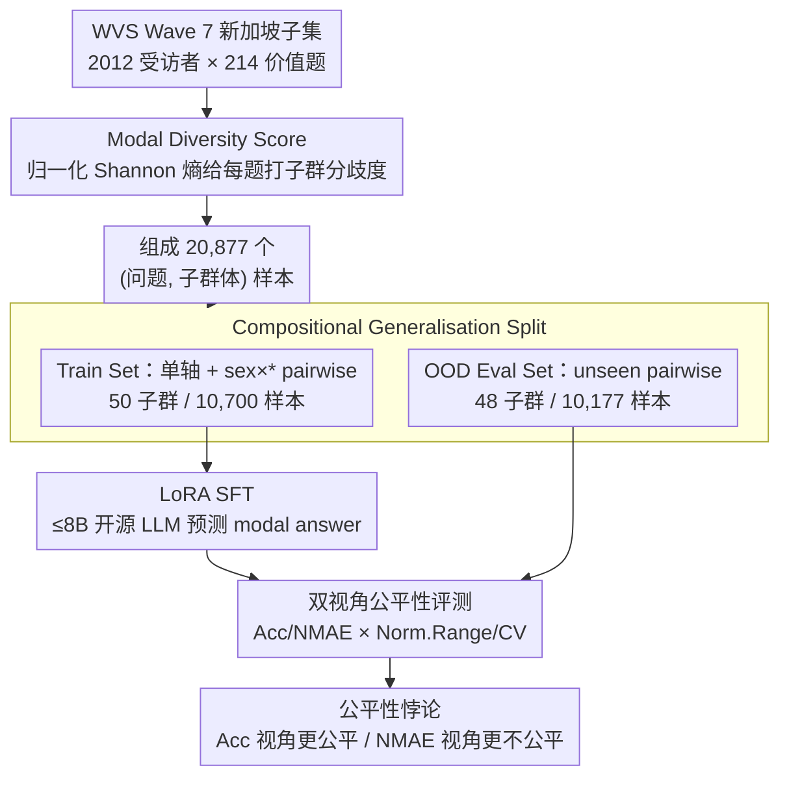

# Can Persona-Prompted LLMs Emulate Subgroup Values? An Empirical Analysis of Generalisability and Fairness in Cultural Alignment

**会议**: ACL 2026  
**arXiv**: [2604.12851](https://arxiv.org/abs/2604.12851)  
**代码**: 待确认  
**领域**: LLM 安全 / 价值观  
**关键词**: 文化对齐, 子群体, persona 模拟, 公平性, WVS

## 一句话总结
本文用新加坡的 World Values Survey 子集为案例，构造 20,877 个 (问题, 子群体) 样本，验证 LLM 是否能模拟细粒度人口子群的价值偏好——结果 GPT-4.1 zero-shot 仅 57.4% 准确率，简单 SFT 在 OOD 子群上平均涨 17.4%，但 NMAE 视角下子群差距反而扩大，模型对年轻/男性/华人/基督徒持续偏好。

## 研究背景与动机

**领域现状**：现有 LLM 对齐范式（RLHF + DPO 等）几乎都把 "human values" 当成一个整体目标，背后往往是西方中心的价值偏好，被批判为 "coloniality of knowledge"。WorldValuesBench 等 benchmark 把对齐分析提升到国家级别，但仍然忽视了一国之内子群体之间的价值分歧。

**现有痛点**：(1) 国家级 alignment 会让 LLM 看起来对某些子群体（如年轻男性华人基督徒）很有用，但对另一些（如老年马来穆斯林）表现很差甚至冒犯，且这种偏差被 average benchmark 掩盖；(2) 现有 persona-prompt 研究多是模拟"原型"（如"医生"），并未用真实人口学数据校准，往往会引入伪偏差；(3) 子群体之间的价值冲突有多大、能不能用简单方法对齐、对齐后公平性如何变化——三个问题都没系统答案。

**核心矛盾**：单一全局对齐 vs. 数百个子群体的价值多样性。要么牺牲多样性（一刀切）、要么需要为每个 intersectional persona 收集偏好数据（不 scalable）。

**本文目标**：(1) 量化映射一个多元社会的价值景观，识别共识与冲突点；(2) 检验简单 SFT 能否泛化到未见的 intersectional persona 和开放式生成；(3) 评估对齐对子群体公平性的影响。

**切入角度**：选择新加坡作为"多元社会的缩影"——华/马/印三大族裔加佛/穆/基督/印度教及无宗教，地理小但 stratification 维度极丰富。用 WVS Wave 7 的 2012 个新加坡受访者的 214 道价值题为锚定数据。

**核心 idea**：把"子群体对齐"操作化为 (sex × age × ethnicity × religion) 的 intersectional persona 的 modal answer 预测任务；用结构化数字偏好做 SFT 学到 compositional persona representation，并测试它能否泛化到训练中没见过的 intersection（如 ethnicity × religion）。

## 方法详解

### 整体框架
论文要回答的核心问题是：persona-prompted LLM 到底能不能模拟一国之内细粒度人口子群的价值偏好，简单 SFT 能不能补上这个能力，补完之后子群之间是更公平还是更不公平。整套流程以新加坡的 WVS Wave 7 数据为锚点：先取 2012 名受访者在 214 道价值题上的原始作答，用 Modal Diversity Score 量化每道题在不同子群间的冲突程度，定位最值得"子群感知对齐"的话题；再把数据组织成 20,877 个 (问题, 子群体) 样本，并刻意切成不重叠的两半——50 个 fundamental stratum 进 Train Set、48 个 unseen intersectional stratum 进 OOD Eval Set；最后在 7 个 ≤8B 开源 LLM 上做 LoRA SFT，从结构化数字预测和 open-ended 生成两个任务、用 Accuracy/NMAE/Win Rate 三类性能指标加 Norm. Range / CV 两个公平性指标来评测。

### 关键设计

**1. Modal Diversity Score：给每道题打一个"子群分歧度"分，先定位哪些话题最该做子群感知对齐**

传统文化 benchmark 只报整体 accuracy，没法告诉你一国之内究竟哪些话题在子群间最分裂、最值得"子群 aware"地对齐。Modal Diversity Score 针对某个 stratum（如 sex_x_age）收集所有子群的众数答案，再对这些众数的分布算归一化 Shannon 熵：

$$\text{Score}_{\text{MD}} = \frac{-\sum_{m\in M}p(m)\log_2 p(m)}{\log_2 (\min(|S|,|C|))}$$

其中 $M$ 是 unique 众数集合，$p(m)$ 是选众数 $m$ 的子群比例，0 表示全员共识、1 表示极度分歧；作者另用 mean pairwise Wasserstein distance 做 ordinal-aware 复核。有了这个分数，就能直接点名最分裂的话题（Religious Values 平均 0.318）和最一致的话题（Social Capital 0.084），为后续模型评测提供先验。

**2. Compositional Generalisation Split：让训练和测试的 intersection 完全不重叠，把死记硬背和真正的组合泛化分开**

如果用 in-distribution split 来测，accuracy 涨了你也分不清模型是学会了组合、还是单纯背下了 persona-answer 映射。论文因此把数据切成不重叠的两半：Train Set 放 sex、age_group、ethnicity、religion 等单轴 strata，外加 sex × age、sex × religion、sex × ethnicity 这些 pairwise（共 50 子群 / 10,700 样本）；Eval(OOD) Set 则放 age × religion、age × ethnicity、ethnicity × religion 三个训练中完全没出现过的 pairwise（共 48 子群 / 10,177 样本），每个子群至少 30 人才纳入。当 ethnicity × religion 这类组合在训练里一次都没见过、模型还能答对，accuracy 的提升才能干净地归因于"把单轴偏好合成 intersection 偏好"的组合能力，而非记忆。

**3. 双视角公平性评测：用 Acc/NMAE × Norm.Range/CV 交叉看，逼出被单一指标掩盖的不公平**

平均准确率涨了不代表对每个子群都更公平，而 Accuracy 把"差 1 档"和"差 5 档"当成一样的错，会把放大了的精度差距藏起来。论文因此同时用两套对照：指标维度上，Accuracy 不感知 ordinal 距离、NMAE 感知；离散度维度上，Norm. Range $=(P_{\max}-P_{\min})/P_{\max}$ 测极端子群间的差距、CV $=\sigma/\mu$ 测整体离散度。交叉之后悖论就显形了——SFT 让 Accuracy 的 Norm. Range 从 0.240 降到 0.179（看似更公平），NMAE 的 Norm. Range 却从 0.280 升到 0.336（实则更不公平）：SFT 把更多弱势子群拉过及格线，同时又把优势子群的精度推得更高。

### 损失函数 / 训练策略
所有开源模型用 LoRA SFT，learning rate $1\times 10^{-6}$（保守，防过拟合），1 epoch，输入是 prompt 描述 persona + question，输出是 modal numerical answer。Open-ended 评测用 Mistral-Small-3.1-24B (INT8) 当 judge 对比 GPT-4.1，两次 swap 顺序消除位置偏差。Win Rate $\text{WR}_c = (s_{1,c}+s_{2,c})/2$，赢=1、平=0.5、输=0。

## 实验关键数据

### 主实验
7 个开源 + 4 个闭源模型在 OOD split 上的对比（节选）：

| 模型 | Acc Base | Acc SFT (Δ) | NMAE Base | NMAE SFT (Δ) | Overall WR Base | Overall WR SFT |
|------|----------|-------------|-----------|--------------|-----------------|----------------|
| Llama-3.1-8B | .514 | **.685** (+.171) | .258 | .143 (-.115) | .294 | .320 (+.026) |
| Llama-3.2-3B | .442 | .508 (+.066) | .308 | .238 (-.070) | .230 | .234 (+.004) |
| SEA-LION-v3-8B | **.530** | .642 (+.112) | .222 | .158 (-.064) | **.428** | **.430** (+.002) |
| Qwen2.5-7B | .442 | .661 (+.219) | .243 | .157 (-.086) | .223 | .246 (+.023) |
| Sailor2-8B | .356 | **.720** (+**.364**) | .332 | .125 (-.207) | .217 | .255 (+.038) |
| SeaLLMs-v3-7B | .440 | .696 (+.256) | .256 | .135 (-.121) | .082 | .081 (-.001) |
| Phi-4-mini | .427 | .456 (+.029) | .267 | .256 (-.011) | .175 | .161 (-.014) |
| **Open-source 平均** | **.450** | **.624** (+**.174**) | **.269** | **.173** (-.096) | .236 | .247 (+.011) |
| GPT-4.1 | .574 | – | .182 | – | .500 | – |
| GPT-4o | .565 | – | .189 | – | .370 | – |
| GPT-4o-mini | .490 | – | .217 | – | .310 | – |

**关键观察**：(1) GPT-4.1 zero-shot 仅 57.4%，子群体对齐确实是难任务；(2) SFT 后开源平均涨 17.4 个点，多个模型（Sailor2、SeaLLMs、Llama-3.1）超过 GPT-4.1 的 OOD 表现；(3) SEA-LION-v3 base 最强（地区预训练有效），SFT 后增益最小；(4) open-ended Win Rate 增益较小（+1.1%），但 Value 维度涨 2.2%，说明结构化训练能部分迁移到自由生成。

### 公平性消融（OOD split）

| 模型 | Acc Norm.Range Base→SFT | Acc CV Base→SFT | NMAE Norm.Range Base→SFT | NMAE CV Base→SFT |
|------|--------------------------|------------------|--------------------------|------------------|
| Llama-3.1-8B | .174 → .188 | .056 → .054 | .250 → **.426** | .085 → .133 |
| Qwen2.5-7B | .256 → .169 | .089 → .055 | .318 → .352 | .108 → .135 |
| Sailor2-8B | .305 → .145 | .101 → .044 | **.228 → .343** | .068 → .129 |
| SeaLLMs-v3 | .276 → .124 | .094 → .037 | .294 → .318 | .108 → .111 |
| **Avg** | .240 → **.179** | .078 → .054 | .280 → **.336** | .094 → .116 |

**公平性悖论**：所有模型 Accuracy 公平性都改善（更多子群被拉过及格线），但 NMAE 公平性几乎全部恶化（优势子群的精度被放大）。

### 关键发现
- **GPT-4.1 仍只 57.4%**：说明 subgroup-aware alignment 不是 prompt engineering 就能解决，闭源 SOTA 也无法靠简单 persona prompt 完成。
- **预存偏差呈固定模式**：所有模型在 base 和 SFT 后都系统性偏好年轻/男性/华人/基督徒 persona，对老年/马来/印度/穆斯林 persona 表现更差，且 SFT 在 NMAE 视角下扩大了这个差距。
- **SFT 减少 refusal**：原本因安全对齐而拒答的同性恋/家暴等题，SFT 后 refusal 率从 6.66% 降到接近 0——揭示安全对齐与文化模拟之间的 tension。
- **Sailor2 涨幅 +36.4%**：东南亚多语模型在加入 WVS-SG 数据后增益最大，说明区域预训练 + 区域微调有强协同。
- **Religious Values 最分裂（MDS=0.318）**：印证新加坡宗教多元；Social Capital & Trust 最一致（0.084）。
- **LLM judge 校准**：Mistral-24B judge 在 Overall 维度与人类的 w-Kappa 是 0.568，与 human-human 的 0.552 相当；但 Persona 维度 judge 不可靠（H-AI w-Kappa 0.318 vs H-H 0.388）。

## 亮点与洞察
- **Modal Diversity Score 是个简单可复用的工具**：用归一化 Shannon 熵就能量化任何 stratified survey 数据的"子群冲突度"，可迁移到其他国家、其他领域（医疗偏好、政治议题、教育观念）。
- **Compositional split 是评测 persona generalization 的金标准**：用 sex × age + sex × ethnicity 训练，测 age × ethnicity 这种全新组合，是真正的 OOD 测试。这种 split 设计应该成为 persona alignment 评测的标配。
- **公平性悖论给对齐研究敲警钟**：subgroup-balanced 训练集 ≠ subgroup-equitable outcome；coarse 指标（accuracy）能掩盖 fine 指标（NMAE）下的不平等加剧。需要在训练时显式加 fairness loss 或上采样劣势子群。
- **结构化训练迁移到 open-ended**：仅用数字 modal answer 训练，open-ended 生成的 Value WR 也涨——证明 SFT 更新了模型内部 persona representation 而非表面映射。

## 局限与展望
- 仅以新加坡 WVS Wave 7 为测试床，跨国可推广性需进一步验证。
- 用 modal answer 作监督信号简化了子群内部分布，会"消音"少数 within-subgroup 观点；distributional 对齐是更可取方向。
- 仅尝试 SFT 一种方法，未对比 DPO/GRPO/group-conditioning 等更先进的偏好优化方法。
- 无法完全排除 WVS Wave 7 已被预训练污染（虽然作者用 SFT 大幅涨幅 + GPT-4.1 仍只 57.4% 来反证）。
- Persona criterion 的人类间一致性较低（w-Kappa 0.388），表明"persona 真实性"的定义本身就有主观性。
- 个人补充：modal answer 作为 ground truth 在小子群（N=30–50）上方差很大，可能让某些 OOD 评测结果不稳定。

## 相关工作与启发
- **vs WorldValuesBench (Zhao 2024)**：他们做国家级 value awareness，本文做国家内的 subgroup-level，更细粒度。
- **vs CulturalLLM (Li 2024)**：他们用文化数据做训练，但聚焦国家间差异；本文是国家内的 intersectional 差异。
- **vs Whose opinions (Santurkar 2023)**：他们暴露 LLM 偏好某些 demographic 群体，本文则量化这种偏好并尝试用 SFT 矫正。
- **vs RoleLLM (Wang 2024)**：他们用角色 archetype（小说人物等），本文用 empirically grounded demographic persona。

## 评分
- 新颖性: ⭐⭐⭐⭐ Modal Diversity Score + compositional OOD split + 公平性悖论这三点都有原创性，但单点 SFT 方法本身不新。
- 实验充分度: ⭐⭐⭐⭐⭐ 7 开源 + 4 闭源 × 2 任务 × 多 fairness 指标 × 人类校准 LLM judge，相当扎实。
- 写作质量: ⭐⭐⭐⭐⭐ Figure 1 总览图清晰，定义/公式/伦理讨论都到位，限制写得诚实。
- 价值: ⭐⭐⭐⭐⭐ 对"文化对齐"研究是一记 wake-up call——平均表现涨不等于公平，SFT 会放大预存偏差；可直接指导后续 fairness-aware alignment 工作。

<!-- RELATED:START -->

## 相关论文

- [\[NeurIPS 2025\] Distributive Fairness in Large Language Models: Evaluating Alignment with Human Values](../../NeurIPS2025/llm_safety/distributive_fairness_in_large_language_models_evaluating_alignment_with_human_v.md)
- [\[ACL 2026\] CAP: Controllable Alignment Prompting for Unlearning in LLMs](cap_controllable_alignment_prompting_for_unlearning_in_llms.md)
- [\[ACL 2026\] Decomposed Trust: Privacy, Adversarial Robustness, Ethics, and Fairness in Low-Rank LLMs](decomposed_trust_privacy_adversarial_robustness_ethics_and_fairness_in_low-rank_.md)
- [\[ACL 2026\] How Should We Enhance the Safety of Large Reasoning Models: An Empirical Study](how_should_we_enhance_the_safety_of_large_reasoning_models_an_empirical_study.md)
- [\[AAAI 2026\] Can Editing LLMs Inject Harm?](../../AAAI2026/llm_safety/can_editing_llms_inject_harm.md)

<!-- RELATED:END -->
