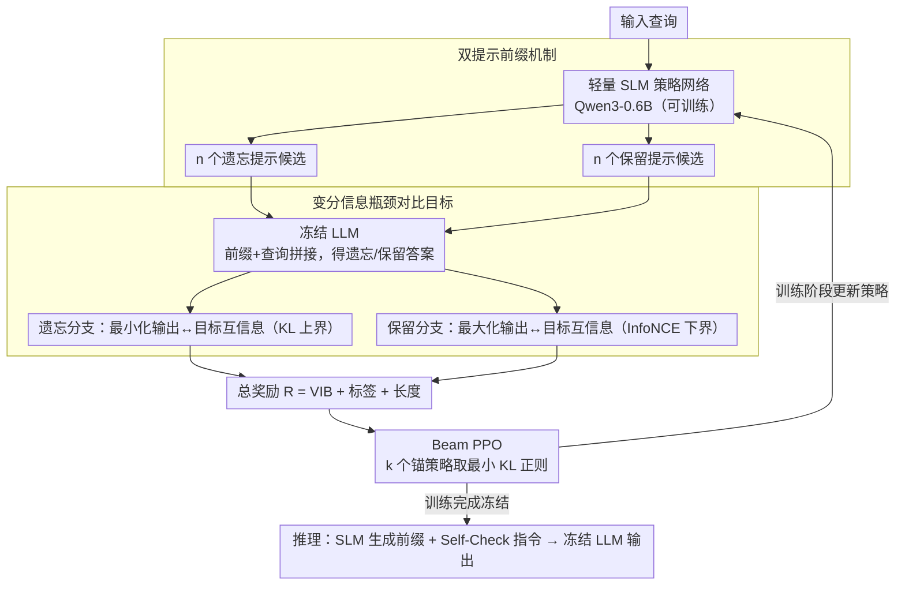

# CAP: Controllable Alignment Prompting for Unlearning in LLMs

**会议**: ACL 2026  
**arXiv**: [2604.21251](https://arxiv.org/abs/2604.21251)  
**代码**: 无  
**领域**: 强化学习  
**关键词**: LLM遗忘, 提示驱动, 强化学习, 可控对齐, 知识消除

## 一句话总结

提出 CAP 框架，通过训练轻量 SLM 生成可控的提示前缀来引导冻结的 LLM 选择性遗忘目标知识，无需修改模型参数，实现了可逆、可迁移的 LLM 知识遗忘。

## 研究背景与动机

**领域现状**：LLM 在无过滤语料上训练，不可避免地保留敏感信息。GDPR 等法规要求选择性知识遗忘（unlearning）。现有方法主要通过修改模型参数实现。

**现有痛点**：(1) 基于重训练和梯度的方法计算成本高；(2) 遗忘边界不可控，常导致整体性能退化；(3) 严格依赖模型权重访问，对闭源模型不可用；(4) 现有非侵入方法依赖经验设计提示，缺乏系统化的端到端训练框架。

**核心矛盾**：修改参数的方法虽然直接但代价高且不可逆，而不修改参数的方法（如提示工程）虽轻量但缺乏可控性和系统性优化。

**本文目标**：设计一个端到端的提示驱动遗忘框架，在不修改 LLM 参数的前提下实现精确、可控、可逆的知识遗忘。

**切入角度**：将遗忘问题转化为推理时控制问题——训练一个轻量 SLM 作为策略网络，生成输入条件化的控制前缀来引导冻结 LLM 的输出行为。

**核心 idea**：SLM 为每个输入查询生成两类提示前缀（遗忘提示和保留提示），通过变分信息瓶颈对比目标和 Beam PPO 强化学习优化，使 LLM 在抑制目标知识的同时保持一般能力。

## 方法详解

### 整体框架

CAP 的核心想法是把"遗忘"从改参数挪到改输入：LLM 始终冻结，真正被训练的是一个轻量 SLM（主实验用 Qwen3-0.6B），它充当策略网络，为每个查询现场生成一段控制前缀来引导 LLM 的行为。整条流程分两段——训练阶段用 RL 优化这个提示生成器，让它学会产出有效的遗忘/保留前缀；推理阶段把 SLM 冻结，由它生成前缀、再拼上一条 Self-Check 指令一起喂给 LLM 得到最终输出。因为所有遗忘逻辑都装在离散提示里，把提示生成器移除就能无损恢复原模型，这正是 CAP "可逆、可迁移到闭源模型"的根源。

### 关键设计

**1. 双提示前缀机制：把遗忘和保留拆成两条互不打架的优化方向**

如果只用一段提示同时承担"抑制目标知识"和"保住一般能力"两个目标，它们会在同一段文本里互相牵制，很难同时优化好。CAP 因此让 SLM 为每个查询分别生成 $n$ 个遗忘提示候选 $\mathcal{P}_f^k$ 和 $n$ 个保留提示候选 $\mathcal{P}_r^k$，各自与查询拼接后输入冻结 LLM，得到一组遗忘答案和一组保留答案。这样遗忘与保留被解耦成两条可以独立优化的分支，奖励信号不再互相抵消，遗忘边界也更可控。

**2. 变分信息瓶颈对比目标（VIB）：用信息论而不是启发式奖励来定义"忘"和"留"**

启发式奖励（比如答对/答错打分）说不清"遗忘"到底压掉了多少信息。CAP 直接在信息论层面建模：对遗忘分支，最小化 LLM 输出与目标标签之间的互信息——用其变分上界（即一个 KL 散度项）来逼近；对保留分支，则最大化输出与标签的互信息——用 InfoNCE 下界来逼近。两条分支联合优化，由系数 $\beta$ 控制压缩与保留的权衡。把遗忘看成"压缩掉关于目标知识的信息"、保留看成"留住关于一般能力的信息"，让优化方向有了明确的理论含义，而不是靠拼凑的奖励规则。

**3. Beam PPO：给提示策略的探索加一束锚点，避免 PPO 崩成单一模式**

提示生成的动作空间离散又庞大，标准 PPO 在这里容易陷入局部最优、甚至策略崩溃（反复生成同一类提示）。CAP 改用 Beam PPO：维护一个由 $k$ 个锚策略组成的集束（beam），优化时用当前策略 $\pi_\theta$ 相对于所有锚策略的**最小** KL 散度做正则化，相当于允许策略沿多条路径同时探索、只要不偏离任何一个锚点太远即可。这样既保住了探索的多样性，又覆盖了更大的参数空间，训练比单点正则的标准 PPO 更稳。

### 损失函数 / 训练策略

总奖励函数为 $\mathcal{R} = \lambda_{VIB} \cdot \mathcal{R}_{VIB} + \lambda_{label} \cdot \mathcal{R}_{label} + \lambda_{len} \cdot \mathcal{R}_{len}$：VIB 奖励引导上面说的信息压缩/保留，标签奖励评估遗忘/保留分支与目标的对齐度，长度正则化则鼓励提示接近理想长度、保持简洁。Beam PPO 的目标函数在标准 PPO 的 clip 损失之上叠加多锚点 KL 正则化项。

## 实验关键数据

### 主实验

| 模型 | 方法 | RWKU ASG↓ | WMDP Bio Acc↓ | MMLU Acc↑ |
|------|------|----------|--------------|----------|
| Zephyr-7B | Original | 63.0 | 63.7 | 54.1 |
| Zephyr-7B | NPO | 28.9 | 43.1 | 48.6 |
| Zephyr-7B | ICUL | 30.3 | 44.9 | 44.5 |
| Zephyr-7B | **CAP** | **6.2** | **24.8** | **51.5** |
| GPT-4.1 | ICUL | 36.7 | 38.6 | 81.5 |
| GPT-4.1 | **CAP** | **7.5** | **35.9** | **80.6** |
| Claude-Sonnet-4 | **CAP** | **7.4** | **30.1** | **84.2** |

### 消融实验

| 配置 | 遗忘 Acc↓ | 保留 Acc↑ | 说明 |
|------|----------|----------|------|
| 无 IB + 标准 PPO | 37.5 | 49.8 | 无结构化奖励 |
| + IB + B-PPO（完整 CAP） | 24.8 | 51.5 | 最佳平衡 |
| 仅遗忘 VIB | 25.6 | 44.7 | 保留性能受损 |
| 仅保留 VIB | 38.6 | 52.2 | 遗忘能力减弱 |
| 随机选择 vs Self-Check | 26.2/24.8 | 48.5/51.5 | Self-Check 为稳定性微调 |

### 关键发现
- CAP 在生成式任务中将 ASG 从 63.0 降至 6.2（Zephyr-7B），远超所有基线
- 在判别式任务中，CAP 显著降低 WMDP 准确率的同时保持了接近原始的 MMLU 性能
- CAP 无缝迁移到闭源模型（GPT-4.1、Claude-Sonnet-4、DeepSeek-V3 等），仅需离散提示
- Beam size $k=4$、候选数 $n=3$、最大提示长度 $L=16$ 为最优超参数配置
- 不同 SLM（Qwen3-0.6B、Qwen2.5-0.5B、Gemma3-1B）均可有效引导遗忘，方法具有模型无关性

## 亮点与洞察
- 将遗忘从参数空间转移到输出空间，通过离散提示实现可逆遗忘是核心创新——移除提示生成器即可恢复原始模型
- VIB 对比目标从信息论角度统一了遗忘（压缩）和保留（保留），比启发式奖励更优雅
- Beam PPO 对标准 PPO 的改进具有通用价值，不限于遗忘任务
- 隐藏状态可视化直觉地展示了提示如何将内部激活从知识区域重定向到安全/拒绝区域

## 局限与展望
- 两阶段推理（SLM 生成前缀 + LLM 生成输出）引入了边际延迟开销
- 生成的控制前缀占用 LLM 上下文窗口的一小部分
- SLM 固定为 Qwen3-0.6B（主实验），虽验证了其他 SLM 也有效，但最优 SLM 选择尚未充分探索
- 在对抗攻击下的鲁棒性虽优于基线，但仍非完美

## 相关工作与启发
- **vs LLMU/NPO**: 它们需修改 LLM 参数，不适用于闭源模型；CAP 完全不修改参数
- **vs ICUL**: ICUL 使用上下文学习驱动遗忘但缺乏负样本，对对抗分布适应性差；CAP 通过 RL 优化提示具有更强泛化性
- **vs SPUL**: SPUL 使用软提示调优但仍需梯度回传，CAP 使用离散提示无需访问 LLM 梯度
- **vs Pawelczyk et al.**: 他们提出基于分类器的非侵入方法但依赖分类器准确率；CAP 端到端优化更可靠

## 评分
- 新颖性: ⭐⭐⭐⭐⭐ 端到端提示驱动遗忘范式，VIB + Beam PPO 设计优雅
- 实验充分度: ⭐⭐⭐⭐⭐ 覆盖 7 个 LLM（含闭源）、多数据集、全面消融和敏感性分析
- 写作质量: ⭐⭐⭐⭐ 方法阐述清晰，理论推导完整
- 价值: ⭐⭐⭐⭐⭐ 对闭源 LLM 遗忘问题有重要实用价值

<!-- RELATED:START -->

## 相关论文

- [\[ICLR 2026\] Inoculation Prompting: Eliciting Traits from LLMs during Training Can Suppress Them at Test-Time](../../ICLR2026/llm_safety/inoculation_prompting_eliciting_traits_from_llms_during_training_can_suppress_th.md)
- [\[ACL 2026\] Can Persona-Prompted LLMs Emulate Subgroup Values? An Empirical Analysis of Generalisability and Fairness in Cultural Alignment](can_persona-prompted_llms_emulate_subgroup_values_an_empirical_analysis_of_gener.md)
- [\[ICML 2026\] Multilingual Unlearning in LLMs: 转移、动力学与可逆性](../../ICML2026/llm_safety/multilingual_unlearning_in_llms_transfer_dynamics_and_reversibility.md)
- [\[CVPR 2026\] Unsafe2Safe: Controllable Image Anonymization for Downstream Utility](../../CVPR2026/llm_safety/unsafe2safe_controllable_image_anonymization_for_downstream_utility.md)
- [\[CVPR 2026\] SineProject: Machine Unlearning for Stable Vision–Language Alignment](../../CVPR2026/llm_safety/sineproject_machine_unlearning_for_stable_vision_language_alignment.md)

<!-- RELATED:END -->
