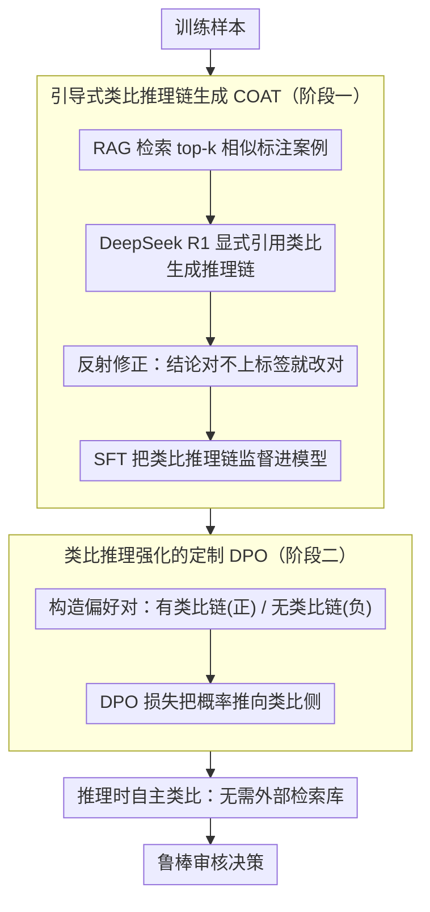

# CarO: Chain-of-Analogy Reasoning Optimization for Robust Content Moderation

**会议**: ACL 2026  
**arXiv**: [2604.10504](https://arxiv.org/abs/2604.10504)  
**代码**: 无  
**领域**: 信息检索  
**关键词**: 内容审核, 类比推理, 直接偏好优化, LLM推理, 决策捷径

## 一句话总结
提出 CarO（Chain-of-Analogy Reasoning Optimization），一个两阶段训练框架，通过 RAG 引导生成类比推理链 + SFT + 定制 DPO 优化，使 LLM 在推理时自主生成类比参考案例进行内容审核，在模糊审核基准上 F1 平均提升 24.9%，显著超越推理模型（DeepSeek R1）和专用审核模型（LLaMA Guard）。

## 研究背景与动机

**领域现状**：内容审核是维护数字生态系统安全的核心任务。传统判别模型（如 BERT）存在 OOD 泛化差和可解释性不足的问题。近年来 LLM 通过 prompting、ICL 和 post-training 展现了生成推理链的能力，提供了可解释的审核决策。

**现有痛点**：即使是 SOTA 推理模型（如 DeepSeek R1），在处理模糊审核案例时也经常出错。分析发现这些错误源于上下文中嵌入的"决策捷径"——表面线索误导推理过程。例如，"Every Indian person I know dances upon hearing music"是一句善意描述，但 DeepSeek R1 因为看到特定群体的提及就错误地将其判为歧视。

**核心矛盾**：LLM 在模糊边界案例中容易被表面语义线索误导，缺乏人类审核专家那样的类比推理能力——先回忆类似先例，再综合先例和准则做出判断。

**本文目标**：让 LLM 学会类比推理，在推理时自主生成相关类比案例并基于类比做出更鲁棒的审核决策。

**切入角度**：从认知心理学中人类专家的审核工作流程出发——专家处理模糊案例时会先回忆类似先例（类比检索），然后综合先例洞察和审核准则做出决策（类比推理）。

**核心 idea**：两阶段训练让 LLM 内化类比推理能力：Stage 1 用 RAG+SFT 引导生成类比推理链，Stage 2 用定制 DPO 强化类比推理（有类比 vs 无类比的偏好对）。

## 方法详解

### 整体框架

CarO 想让 LLM 学会人类审核专家那套"先回忆相似先例、再综合先例与准则下判断"的类比推理，而不是被表面线索牵着走。它用两阶段训练把这种能力灌进模型：第一阶段先借 RAG 检索出相似案例、引导一个强模型写出带类比参考的推理链，再用这些链做 SFT；第二阶段用定制 DPO，把"带类比"的链当正样本、"不带类比"的链当负样本，强化模型优先走类比这条路。训练完成后部署时不再需要任何外部检索——模型已经能自己"想象"出贴合当前输入的类比案例。

### 关键设计

**1. 引导式类比推理链生成（COAT）：把类比模式提前写进训练数据，让 SFT 模型内化它**

直接让模型生成推理链，它根本不会主动去参考先例，写出来的链没有类比这一步。COAT 的做法是：对每个训练样本 $\mathbf{x}_i$，先用语义相似度检索 top-k 个带标签的相似案例，把它们注入 prompt，要求 DeepSeek R1 在生成的推理链中**显式引用**这些类比案例；生成后再核对推理结论是否与真实标签一致，不一致就触发一步反射修正，把链改对。比如对"Every Indian person I know dances upon hearing music"这种善意描述，检索来的相似先例能提醒模型这属于正面刻画而非歧视，从而纠正"看到群体提及就判歧视"的捷径。这样产出的链天然带着类比模式，SFT 一训就把这种推理习惯学了进去。

**2. 类比推理强化的定制 DPO：让模型一致地、可解释地选择类比推理而非普通推理**

SFT 之后模型已经能写类比链，但不够稳定——有时走类比、有时又退回普通推理。CarO 用一组精心构造的偏好对来强化它：正样本 $\mathbf{r}^+$ 是 SFT 模型在**有 RAG 输入**下生成的、含类比参考的链；负样本 $\mathbf{r}^-$ 是同一个模型仅凭原始输入、**不带类比参考**生成的链；再用标准 DPO 损失优化，把概率往类比丰富的那一侧推。这一阶段的目标不是再去抬 F1（SFT 已经很高），而是把类比推理的显式性和一致性顶满——实验里它把类比链出现比率从 93.5% 推到 99.3%，而 F1 只动了 +0.4。

**3. 推理时自主类比：部署时彻底甩掉外部检索数据库**

RAG 方法在线上要一直维护检索库，而且静态库里检索到的案例未必贴合当前场景。经过上面两阶段训练，类比模式已经长进了模型参数里，推理时它直接基于输入"想象"出针对性的类比案例，不再实际检索。这不仅省掉了检索基础设施，还比固定库更灵活——参考案例是为当前输入量身生成的，因此在 OOD 基准上反而能"无检索却不降反升"。

### 损失函数 / 训练策略

第一阶段是标准 SFT，监督信号为 COAT 产出的（经反射修正后的）类比推理链；第二阶段是标准 DPO 损失，偏好对由"有 RAG 类比链（正）/ 无 RAG 普通链（负）"构成。检索阶段取 k=32 个参考案例。

## 实验关键数据

### 主实验（中文审核数据集 + 英文基准）

| 模型 | 政治 | 色情 | 暴力 | 偏见 | 赌博 | 无害 | 平均 F1 |
|------|------|------|------|------|------|------|---------|
| Qwen2.5-7B-Instruct | 54.9 | 81.9 | 70.0 | 60.1 | 84.3 | 48.8 | 64.3 |
| DeepSeek R1 | - | - | - | - | - | - | ~70 |
| LLaMA Guard | - | - | - | - | - | - | ~65 |
| **CarO (Ours)** | **最优** | **最优** | **最优** | **最优** | **最优** | **最优** | **89.2** |

### 消融实验

| 配置 | F1 | CoA 比率(%) |
|------|-----|------------|
| Baseline (无训练) | 64.3 | 0.0 |
| + RAG-SFT | 85.5 (+21.2) | 89.5 |
| + 反射修正 | 88.8 (+3.3) | 93.5 |
| + DPO | **89.2 (+0.4)** | **99.3** |

### 跨基准泛化（OOD 测试）

| 数据集 | Qwen2.5-7B → CarO |
|--------|-------------------|
| Aegis (ID) | 78.7 → **87.1** |
| OpenAI (OOD) | 70.8 → **74.2** |
| Toxic-Chat (OOD) | 93.3 → **95.0** |

### 关键发现
- **F1 提升 24.9 个百分点（64.3→89.2）**，主要由 RAG-SFT 阶段贡献（+21.2）
- **DPO 对 F1 提升有限（+0.4）但将类比推理比率从 93.5% 推到 99.3%**，说明其核心作用是增强推理一致性而非准确率
- **反射修正带来 3.3pp 提升**，说明自动生成的推理链中确实存在需要纠正的错误
- **在 OOD 基准上也有提升**（Aegis +8.4, OpenAI +3.4），说明类比推理能力有跨域迁移性
- **推理时无需 RAG**但性能不降反升，证明模型成功内化了类比推理模式

## 亮点与洞察
- **"决策捷径"的诊断**非常精准——模型不是能力不足而是被误导，这解释了为什么强力推理模型在审核任务上也翻车
- **两阶段训练的设计思路**值得迁移：先用 SFT 引导能力涌现，再用 DPO 强化一致性。这种"引导→强化"范式适用于任何需要特定推理模式的场景
- **推理时的自主类比**比 RAG 更灵活——模型可以"想象"最适合当前案例的参考，而不受数据库限制

## 局限与展望
- 训练数据中的类比推理链由 DeepSeek R1 生成，质量受限于该模型的能力
- 检索的 k=32 参考案例对内存和推理成本有要求
- 中文数据集为主，英文基准的验证较少
- DPO 对 F1 提升很小（+0.4），是否有更高效的推理强化方法？
- 自主生成的类比案例可能不够准确，缺乏事实验证机制

## 相关工作与启发
- **vs DeepSeek R1**: R1 有强推理能力但缺乏类比参考，在模糊案例中被表面线索误导
- **vs LLaMA Guard**: 专用审核模型但缺乏可解释的推理过程
- **vs RAG 方法**: 静态检索无法动态适配，CarO 通过训练内化了类比能力后完全摆脱检索依赖

## 评分
- 新颖性: ⭐⭐⭐⭐ 类比推理 + DPO 的组合用于审核是新的，但各组件不新
- 实验充分度: ⭐⭐⭐⭐ 多基准+消融+OOD 测试，但主实验以中文为主
- 写作质量: ⭐⭐⭐⭐ 动机清晰，认知心理学的连接有说服力
- 价值: ⭐⭐⭐⭐ 对内容审核领域有直接实用价值，类比推理范式可迁移

<!-- RELATED:START -->

## 相关论文

- [\[ACL 2026\] Making MLLMs Blind: Adversarial Smuggling Attacks in MLLM Content Moderation](making_mllms_blind_adversarial_smuggling_attacks_in_mllm_content_moderation.md)
- [\[ACL 2026\] FlexGuard: Continuous Risk Scoring for Strictness-Adaptive LLM Content Moderation](flexguard_continuous_risk_scoring_for_strictness-adaptive_llm_content_moderation.md)
- [\[ICLR 2026\] ExpGuard: LLM Content Moderation in Specialized Domains](../../ICLR2026/llm_safety/expguard_llm_content_moderation_in_specialized_domains.md)
- [\[ACL 2026\] Beyond End-to-End: Dynamic Chain Optimization for Private LLM Adaptation on the Edge](beyond_end-to-end_dynamic_chain_optimization_for_private_llm_adaptation_on_the_e.md)
- [\[ACL 2026\] CiPO: Counterfactual Unlearning for Large Reasoning Models through Iterative Preference Optimization](cipo_counterfactual_unlearning_for_large_reasoning_models_through_iterative_pref.md)

<!-- RELATED:END -->
