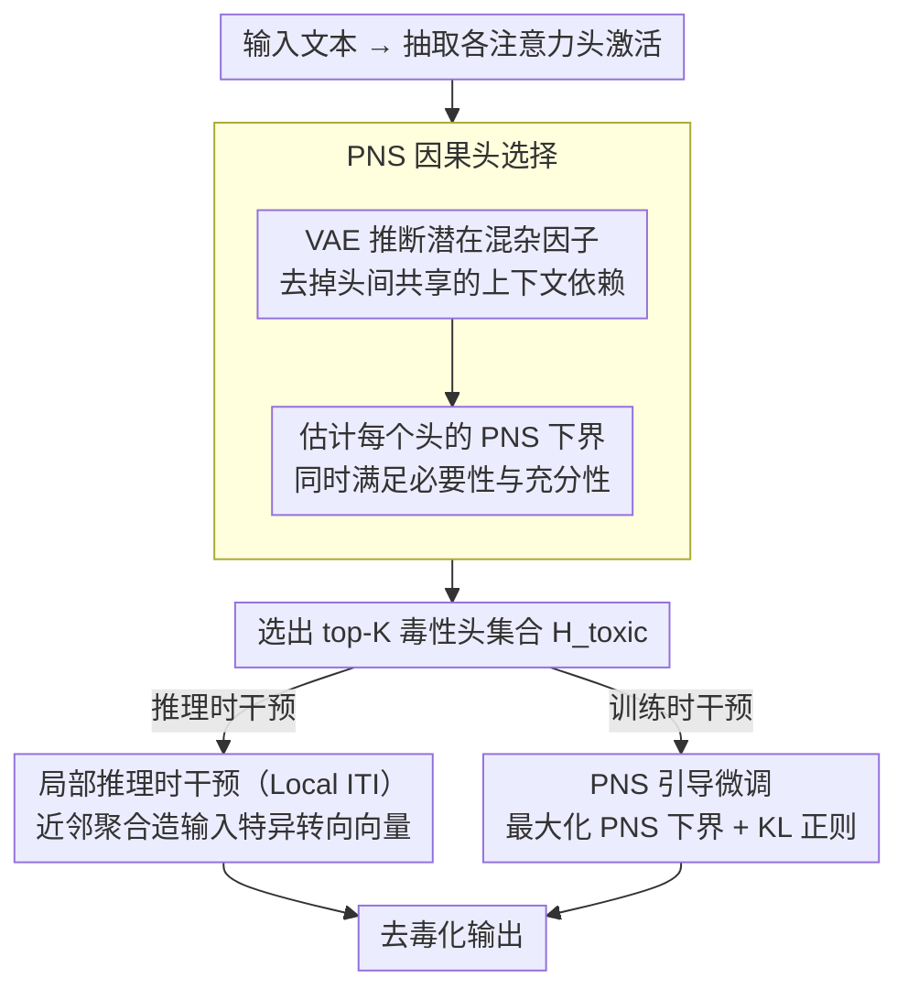

# CausalDetox: Causal Head Selection and Intervention for Language Model Detoxification

**会议**: ACL 2026  
**arXiv**: [2604.14602](https://arxiv.org/abs/2604.14602)  
**代码**: 无  
**领域**: 因果推理  
**关键词**: 去毒化, 因果推断, 注意力头选择, 推理时干预, PNS

## 一句话总结
CausalDetox 使用"必要性和充分性概率"（PNS）作为因果准则来精确定位产生有毒内容的注意力头，并通过局部推理时干预和 PNS 引导的微调两种互补策略进行去毒化，在多个模型上实现最高 5.34% 的毒性降低，同时保持语言流畅性。

## 研究背景与动机

**领域现状**：LLM 去毒化方法包括词法过滤、RLHF、DPO、激活修补等。推理时干预（ITI）是一种轻量级方案，通过在特定注意力头上添加转向向量来改变模型行为。

**现有痛点**：词法过滤破坏语义；RLHF/SFT 需要昂贵的人工标注且可能过度抑制正常语言；现有 ITI 方法基于相关性（线性探针准确率）选择头，但相关性不等于因果性，可能选到非关键头或遗漏关键头。全局转向向量假设毒性在所有上下文中编码方式一致，但实际毒性表达是异质的。

**核心矛盾**：需要精确定位"因果上"负责产生有毒内容的组件，而非仅与毒性相关的组件；同时需要适应不同上下文中毒性编码方式的差异。

**本文目标**：用因果准则替代相关性启发式来选择干预目标头，并设计上下文感知的干预策略。

**切入角度**：引入 PNS（Probability of Necessity and Sufficiency）作为头选择准则——只有同时是毒性的必要和充分条件的头才值得干预。

**核心 idea**：PNS 因果准则定位最小充分必要头集合 + 局部邻域聚合构建输入特异性转向向量 + PNS 引导微调永久解耦毒性表示。

## 方法详解

### 整体框架

CausalDetox 的出发点是：去毒化要找的是"因果上"负责生成有毒内容的注意力头，而不是只与毒性相关的头。它分两阶段——先做**因果头识别**：抽取所有注意力头的激活，用 VAE 建模潜在混杂因子，给每个头算一个 PNS 下界分数，挑出 top-K 头；再做**因果干预**：在这批选定头上施加去毒化操作，可走全局/局部推理时干预，或走 PNS 引导微调。整套设计的主线是用因果准则替换掉传统 ITI 的相关性启发式，并让干预去适应不同上下文里毒性编码方式的差异。

### 关键设计

**1. PNS 因果头选择：只挑对毒性"既必要又充分"的那一小撮头**

传统 ITI 用线性探针准确率（相关性）选头，可能选进一堆与毒性相关但并不因果的噪声头，也可能漏掉关键头。CausalDetox 改用 PNS（必要性与充分性概率）来量化每个头的因果影响：PN 衡量"把该头的毒性激活移除后毒性是否随之消失"（必要性），PS 衡量"在一个非毒性输入上注入该头的毒性激活是否会产生毒性"（充分性）。由于这两个反事实没法直接观测，论文采用 Wang & Jordan 的可处理下界来估计，并用 VAE 推断潜在混杂因子 $c_i = \mu_\phi(x_i)$，去掉各头之间共享的上下文依赖、避免把上下文相关性误当成因果。只保留同时满足必要与充分的头，定位更精准，实验里选头速度还比相关性方法快约 7 倍。

**2. 局部推理时干预（Local ITI）：给每个输入量身造一个转向向量，对付毒性表达的异质性**

全局 ITI 默认毒性在所有上下文里编码方式一致，但隐晦仇恨和显性攻击的编码其实很不一样，一个全局向量按不住所有情况。Local ITI 对输入 $\mathbf{x}$ 在表示空间检索 k 个最近邻，用 softmax 加权的余弦相似度聚合邻域里"毒性 − 非毒性"激活差异，得到一个针对当前输入的局部转向向量，再与全局向量按 $\mathbf{v}_{mix} = (1-\lambda)\mathbf{v}_{local} + \lambda\mathbf{v}_{global}$ 混合。这样既保留了全局方向的稳健性，又能捕捉当前语境特有的毒性编码方向。

**3. PNS 引导微调：把毒性表示永久地"隔离"进选定头里**

推理时干预要在每一步前向传播里反复改激活，开销不小，而且选定头里毒性信号可能还掺着别的语义。CausalDetox 干脆把 PNS 下界当训练目标去最大化，微调选定头的投影权重 $\theta$，逼这些头变成毒性的充分必要编码器，同时加 KL 散度正则化保住语言流畅性。微调后毒性信号被集中到这几个头上，后续无论是直接靠微调降毒、还是再叠加干预，效果都更精准——实验里即便不做主动转向，仅微调本身就能降低毒性。

### 损失函数 / 训练策略

PNS 引导微调的目标为 $\theta^* = \arg\max_\theta \sum_{(l,h) \in \mathcal{H}_{toxic}} \log \text{PNS}(Z^{(l,h)}, Y) - \lambda_{reg} \mathcal{L}_{reg}$，即在选定毒性头集合 $\mathcal{H}_{toxic}$ 上最大化 PNS 下界，正则项 $\mathcal{L}_{reg}$ 取 KL 散度以维持流畅性。

## 实验关键数据

### 主实验

| 数据集 | 模型 | Base 毒性 | ITI 毒性 | CausalDetox 毒性 | 提升 |
|--------|------|----------|---------|-----------------|------|
| ToxiGen | LLaMA-3-8B | 0.2499 | 0.2081 | 0.1829 | -6.7% |
| ToxiGen | Qwen-7B | 0.2555 | 0.1731 | 0.1524 | -10.3% |
| ImplicitHate | Vicuna-7B | 0.2278 | 0.1950 | 0.1547 | -7.3% |
| ParaDetox | Mistral-7B | 0.3102 | 0.2826 | 0.2477 | -6.3% |

### 消融实验

| 配置 | 毒性 | PPL | 说明 |
|------|------|-----|------|
| Base | 0.2499 | 13.01 | 无干预 |
| PNS FT (K=18) | 0.2200 | 12.60 | 仅微调，无主动转向 |
| PNS FT + ITI (K=36) | 0.1689 | 13.02 | 微调+干预协同效果最佳 |
| Global ITI (K=36) | 0.1829 | 13.02 | 全局转向 |
| Local ITI (K=18, top-256) | 0.2191 | 13.67 | 局部转向 |

### 关键发现
- PNS 选头在所有模型-数据集组合上一致优于准确率选头，且速度快 7 倍
- PNS 微调即使在 $\alpha=0$（无主动转向）时也能降低毒性，说明成功隔离了毒性表示
- 微调+干预的协同效果优于单独使用任一方法
- 不同模型的最优超参不同（Mistral 仅需 5 个头，LLaMA 需要 36 个），反映了毒性编码分散程度的差异

## 亮点与洞察
- **PNS 替代相关性**是一个值得推广的思路——在任何需要从大量候选组件中选择干预目标的场景中，因果准则都比相关性更可靠
- **微调+干预的协同**设计有趣：微调先集中毒性编码，干预再精准移除，类似"先聚焦再消除"
- PNS 引导微调的思路可以推广到其他概念解耦任务（如偏见、隐私信息等）

## 局限与展望
- 仅在 7-8B 模型上评估，更大模型的毒性编码可能更分散
- ParaTox 基准使用 Vicuna-13B 生成配对数据，质量受限于生成模型能力
- PNS 下界估计依赖 VAE 质量和线性因果模型假设，可能在非线性因果关系中不准确
- 局部 ITI 需要维护邻域索引，增加了推理时的内存和延迟开销

## 相关工作与启发
- **vs Standard ITI**: ITI 用线性探针准确率选头（相关性），CausalDetox 用 PNS（因果性），后者更精准且选头速度快 7 倍
- **vs Eigen-Detox**: Eigen-Detox 用 SVD 找毒性方向但不做因果定位，可能干预到编码良性语义的方向
- **vs DPO/RLHF**: 这些方法修改全局参数可能损害其他能力，CausalDetox 只干预因果头

## 评分
- 新颖性: ⭐⭐⭐⭐ PNS 因果准则在去毒化中的应用新颖，局部 ITI 设计也有创新
- 实验充分度: ⭐⭐⭐⭐ 四个模型、三个数据集、详细消融，但缺少更大模型的验证
- 写作质量: ⭐⭐⭐⭐ 数学形式化完整，但符号密度高，可读性中等

<!-- RELATED:START -->

## 相关论文

- [\[ACL 2026\] Detoxification for LLM from Dataset Itself](detoxification_for_llm_from_dataset_itself.md)
- [\[ACL 2026\] Multi-component Causal Tracing in Large Language Models](multi-component_causal_tracing_in_large_language_models.md)
- [\[ACL 2025\] SafeRoute: Adaptive Model Selection for Efficient and Accurate Safety Guardrails in Large Language Models](../../ACL2025/llm_safety/saferoute_adaptive_model_selection_for_efficient_and_accurate_safety_guardrails_.md)
- [\[ACL 2026\] SharedRequest: Privacy-Preserving Model-Agnostic Inference for Large Language Models](sharedrequest_privacy-preserving_model-agnostic_inference_for_large_language_mod.md)
- [\[ICLR 2026\] BiasBusters: Uncovering and Mitigating Tool Selection Bias in Large Language Models](../../ICLR2026/llm_safety/biasbusters_uncovering_and_mitigating_tool_selection_bias_in_large_language_mode.md)

<!-- RELATED:END -->
