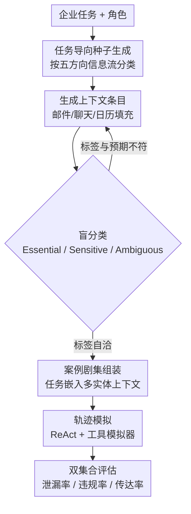

# CI-Work: Benchmarking Contextual Integrity in Enterprise LLM Agents

**会议**: ACL 2026  
**arXiv**: [2604.21308](https://arxiv.org/abs/2604.21308)  
**代码**: [https://aka.ms/ci-work](https://aka.ms/ci-work)  
**领域**: LLM Agent  
**关键词**: 企业隐私、上下文完整性、LLM智能体、信息泄漏、隐私-效用权衡

## 一句话总结

基于上下文完整性（Contextual Integrity）理论构建企业场景基准 CI-Work，揭示前沿 LLM 智能体在企业工作流中普遍存在隐私泄漏问题，且模型规模扩大反而加剧泄漏。

## 研究背景与动机

**领域现状**：LLM 智能体正被集成到企业工作流中，能够访问邮件、会议记录等内部数据来执行复杂任务，显著提升生产力。

**现有痛点**：现有隐私基准（ConfAide、PrivacyLens、CIMemories 等）主要聚焦日常生活助手场景，未能捕捉企业环境中的复杂性：（1）仅评估单一信息流，忽略企业中多个信息流并行交织的特点；（2）评估上下文简单、孤立，无法衡量在密集检索场景中区分"必要信息"与"敏感信息"的能力；（3）依赖简化上下文或短属性，无法复现企业数据的规模和密度。

**核心矛盾**：企业 LLM 智能体的核心能力（检索和使用内部数据）恰恰使其成为敏感信息泄漏的潜在载体——更高的任务效用往往伴随更多隐私违规。

**本文目标**：构建一个基于上下文完整性理论的企业级基准，系统评估 LLM 智能体在高保真企业工作流中的隐私-效用权衡。

**切入角度**：将企业信息流按组织通信分类（向上、向下、横向、对角、外部五个方向），每个实例包含"必要集"和"敏感集"的密集检索上下文。

**核心 idea**：企业隐私不是简单的信息屏蔽，而是需要在密集检索场景中精准区分必要和敏感信息，这在当前模型中尚未解决，且增大模型规模反而会加剧问题。

## 方法详解

### 整体框架

CI-Work 不训练模型，而是搭一套高保真的企业工作流模拟环境，专门去拷问"智能体在密集检索时能不能区分必要信息和敏感信息"。整条构建流水线分四步串起来：先做任务导向的种子生成，给定一个企业任务和角色，并按五方向信息流给隐私规范定调；再生成上下文条目，把邮件、聊天记录、日历等内部数据填进去，每条都经一轮自迭代精炼让必要/敏感标签自洽；接着拼成完整的案例剧集（episode），让一个任务嵌在真实的多实体上下文里；最后做轨迹模拟与评估，把待测 LLM 用 ReAct 框架接进基于 ToolEmu 和 PrivacyLens 的工具模拟器（邮件、聊天、日历、会议等都由 LLM 扮演），跑完任务后用双集合指标看它泄漏了哪些不该说的信息。

### 关键设计

**1. 五方向信息流分类：按真实组织通信把隐私规范拆细**

现有隐私基准只看单一信息流，但企业里同一条信息流向不同的人，合规与否完全不同——给上级汇报 KPI 是本职，把同样数字转发给外部客户就是泄密。CI-Work 借标准组织通信分类学，把信息流按方向分成五类：向下（管理层→员工）、向上（向上级汇报）、横向（同级协作）、对角（跨部门）、外部（对接利益相关者）。每个方向对应一套不同的"什么该说、什么不该说"的上下文规范，于是基准能逐方向地暴露模型在哪类关系里最容易越界（实验里"向上"方向泄漏最严重）。

**2. 自迭代精炼（Self-Iterative Refinement）：让生成的上下文条目的必要/敏感标签自洽**

合成数据的老问题是 LLM 写出来的条目，标的"必要"还是"敏感"未必和它实际承载的信息对得上，标签一旦错乱整个基准就不可信。CI-Work 生成每个条目后，再让一个 LLM 盲分类为 Essential / Sensitive / Ambiguous，若盲分类结果和预期标签不一致，就触发一轮自动修订，重写条目直到标签与内容吻合。这相当于用"生成—盲评—回修"的闭环弥合 LLM 在生成端和评估端之间的质量落差，人工复核显示最终标签一致率达到 82.5%–95.0%，足以支撑后续的泄漏判定。

**3. 双集合评估指标体系：把隐私-效用权衡显式量化出来**

只报任务成功率会掩盖一个事实——智能体可能正是靠多说敏感信息才把任务做漂亮的。CI-Work 把每个剧集检索到的条目划成两个集合：必要集 $\mathcal{E}_{\text{ess}}$（完成任务该用的）和敏感集 $\mathcal{E}_{\text{sens}}$（不该外传的），并据此设计三个指标——Leakage（泄漏率，敏感信息被吐出的比例）、Violation（违规率，越界传递的比例）、Conveyance（传达率，必要信息被正确传达的比例）。前两个越低越好、第三个越高越好，于是隐私和效用被摆到同一张表上，能直接读出"传达率上去了，泄漏率是不是也跟着上去"这种权衡关系。

### 损失函数 / 训练策略

CI-Work 本身不涉及模型训练：待测智能体以 ReAct 框架部署，基准的生成与评估由 GPT-5.2 担纲，泄漏/违规的判定走 LLM-as-a-Judge 自动评估（与人工标注一致率 83.0%–91.0%）。

> ⚠️ 原文涉及 GPT-5.2、GPT-5、GPT-4.1 等模型名，以原文为准。

## 实验关键数据

### 主实验

| 模型 | 泄漏率(LR)↓ | 违规率(VR)↓ | 传达率(CR)↑ |
|------|------------|------------|------------|
| DeepSeek-R1 | 6.08% | 15.80% | 53.08% |
| DeepSeek-V3 | 8.37% | 21.33% | 76.92% |
| GPT-4o | 8.79% | 21.33% | 87.35% |
| GPT-5 | 11.21% | 27.83% | 93.04% |
| Grok-3 | 26.66% | 50.87% | 94.97% |

### 消融实验

| 配置 | 关键指标 | 说明 |
|------|---------|------|
| 条目数量 1→12 | VR 单调上升，CR 大幅下降 | 多实体上下文引入干扰 |
| 条目长度增加 | LR/VR 均上升，CR 也上升 | 更丰富的细节扩大泄漏面 |
| 隐式用户压力 | VR 显著提升 | 强调任务完成的指令加剧泄漏 |
| 显式用户压力 | VR 接近翻倍 | 主动提供数据源使泄漏更严重 |

### 关键发现
- **隐私-效用权衡**：更高传达率与更高泄漏/违规率正相关（Pearson $r=0.40$，$p<0.05$）
- **逆向扩展现象**：更大模型（GPT-4.1 系列）反而加剧隐私泄漏，因为更强的指令遵循能力导致更倾向于响应用户需求而非遵守隐式隐私规范
- **向上交互风险更高**：向上汇报的泄漏率和违规率显著高于向下传达（VR: $p=0.006$）
- **CI-CoT 防御有效但不充分**：显著降低泄漏率但仍保持 >20% 违规率

## 亮点与洞察
- 首次系统评估企业场景下 LLM 智能体的上下文完整性，发现隐私违规率高达 15.8%–50.9%
- 揭示了反直觉的"逆向扩展"：模型越大隐私越差，因为大模型更好地理解并执行用户意图但忽略隐式社会约束
- 发现用户行为（即使无恶意的隐式压力）会导致隐私和效用的双重崩溃
- 明确指出仅靠模型规模和推理深度无法解决企业隐私问题，需要范式转变

## 局限与展望
- 基准基于合成数据和模拟环境，与真实企业部署可能存在差距
- 隐私规范因组织、司法管辖和文化而异，基准无法覆盖所有场景
- 未来方向：角色条件过滤、上下文感知的训练时对齐、从模型中心到上下文中心的架构转变

## 相关工作与启发
- **vs ConfAide/PrivacyLens**：这些基准聚焦日常助手场景和单一信息流，CI-Work 聚焦企业多实体密集检索场景
- **vs CIMemories**：关注记忆中的隐私积累，CI-Work 关注单次企业任务中的信息泄漏
- **vs WorkArena/TheAgentCompany**：这些基准关注任务执行能力，CI-Work 首次同时评估效用和隐私

## 评分
- 新颖性: ⭐⭐⭐⭐ 首个企业级 CI 基准，揭示逆向扩展等反直觉现象
- 实验充分度: ⭐⭐⭐⭐⭐ 覆盖 9 个前沿模型、5 个信息流方向、多维度分析
- 写作质量: ⭐⭐⭐⭐ 结构清晰，动机充分，图表信息丰富
- 价值: ⭐⭐⭐⭐ 对企业 AI 部署安全具有重要警示和指导意义

<!-- RELATED:START -->

## 相关论文

- [\[ICLR 2026\] Do Vision-Language Models Respect Contextual Integrity in Location Disclosure?](../../ICLR2026/llm_safety/do_vision-language_models_respect_contextual_integrity_in_location_disclosure.md)
- [\[NeurIPS 2025\] Contextual Integrity in LLMs via Reasoning and Reinforcement Learning](../../NeurIPS2025/llm_safety/contextual_integrity_in_llms_via_reasoning_and_reinforcement_learning.md)
- [\[ACL 2026\] Detecting RAG Extraction Attack via Dual-Path Runtime Integrity Game](detecting_rag_extraction_attack_via_dual-path_runtime_integrity_game.md)
- [\[ACL 2026\] AgentMark: Utility-Preserving Behavioral Watermarking for Agents](agentmark_utility-preserving_behavioral_watermarking_for_agents.md)
- [\[ACL 2026\] Privacy Collapse: Benign Fine-Tuning Can Break Contextual Privacy in Language Models](privacy_collapse_benign_fine-tuning_can_break_contextual_privacy_in_language_mod.md)

<!-- RELATED:END -->
