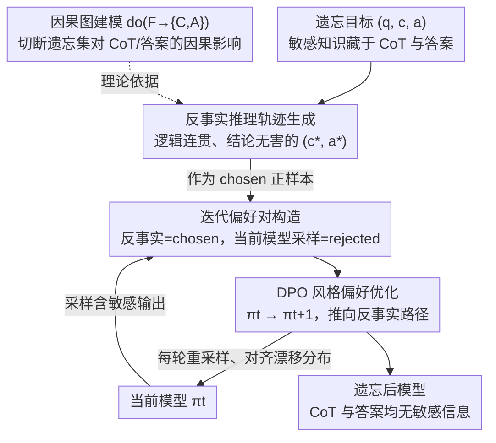

# CiPO: Counterfactual Unlearning for Large Reasoning Models through Iterative Preference Optimization

**会议**: ACL 2026  
**arXiv**: [2604.15847](https://arxiv.org/abs/2604.15847)  
**代码**: [https://github.com/TerryLee77/CiPO](https://github.com/TerryLee77/CiPO)  
**领域**: LLM安全 / 推理模型遗忘  
**关键词**: 推理模型遗忘, 反事实推理, 偏好优化, 思维链, 隐私保护

## 一句话总结

针对大型推理模型（LRM）的遗忘难题——需要同时从思维链（CoT）和最终答案中移除敏感知识——提出 CiPO 框架，通过让模型生成逻辑有效的反事实推理轨迹并用迭代偏好优化引导模型偏好反事实路径，实现有效遗忘同时保持推理能力。

## 研究背景与动机

**领域现状**：LRM（如 DeepSeek-R1、o1）通过长链思维链推理解决复杂问题。但 CoT 本身成为数据泄露的载体——推理过程中引用的敏感信息被显式记录和暴露。

**现有痛点**：（1）表示扰动方法（如 R2MU）将遗忘集的隐表示映射到随机向量，虽能擦除目标轨迹，但过度抑制会破坏 CoT 可解释性和推理能力，产生不连贯输出；（2）拒绝式方法（如 ReasonedIDK）训练模型生成"不知道"式回复，引入大分布偏移导致优化不稳定，且一致性拒绝模式本身成为信息泄露通道（攻击者可推断什么被遗忘了）；（3）传统 LLM 遗忘方法（GA/NPO）不处理多步推理结构，无法解决 CoT 中的信息泄露。

**核心矛盾**：现有方法在"擦除"或"回避"之间二选一——要么强制破坏推理链（损害能力），要么训练模型拒绝（引入新风险）。都没有提供"建设性"的替代方案。

**本文目标**：将遗忘重新定义为对 CoT 推理的"建设性干预"——用安全的、任务一致的反事实推理轨迹替代原始推理链，而非破坏或拒绝。

**切入角度**：从因果视角将 LRM 遗忘建模为干预操作——切断遗忘集对 CoT 和答案的因果影响，通过反事实推理提供替代路径。

**核心 idea**：给定遗忘目标，指示 LRM 生成逻辑有效的反事实推理轨迹（CoT 合理但结论与原始不同），将其作为偏好优化的正样本，模型当前的含敏感信息输出作为负样本。迭代更新偏好数据以跟踪模型分布的演变。

## 方法详解

### 整体框架

CiPO 要解决的是推理模型的遗忘困境：敏感知识既藏在最终答案里，也散落在思维链（CoT）的每一步推理中，单纯擦除会把推理能力一起毁掉，单纯拒绝又会留下"我不知道"这种可被攻击者利用的固定模式。它的思路是把遗忘从"破坏"或"回避"改成"建设性替代"——让模型换一条逻辑上同样自然、但结论无害的推理链来走。整套方法靠两个组件咬合：一个反事实生成器，为遗忘目标构造逻辑有效但结论不同的反事实轨迹；一个迭代偏好优化循环，每轮把反事实轨迹当 chosen、模型当前的含敏感信息输出当 rejected，用 DPO 风格目标把模型一步步推向反事实路径，多轮迭代让遗忘信号始终贴着不断变化的模型分布。

### 关键设计

**1. 反事实推理轨迹生成：用"合理但错误"的推理替代原始链路，而非破坏它**

R2MU 那类表示扰动方法把遗忘集的隐表示映射成随机向量，确实能擦掉目标轨迹，但过度抑制会让 CoT 变成不连贯的乱码、推理能力随之崩坏。CiPO 换了个角度：给定遗忘目标 $(q, c, a)$，指示 LRM 生成一条反事实轨迹 $(c^*, a^*)$，要求推理过程 $c^*$ 逻辑连贯、结构完整（保留 `<think>...</think>` 格式），但最终结论 $a^*$ 与原始答案 $a$ 不同。关键在于反事实不是简单否定也不是随机替换，而是去模仿"一个本就不知道正确答案的人会怎么推理"——模型表面上仍在正常思考，只是被引向了一个无害的结论。正因为推理结构的自然性被保住了，遗忘不再以牺牲可解释性和能力为代价。

**2. 迭代在线偏好优化：让遗忘信号始终对齐不断漂移的模型分布**

标准 DPO 用的是预先收集好的固定偏好对，但模型在遗忘过程中分布一直在变，固定数据相对当前模型很快就变成离策略（off-policy），优化逐渐失准。CiPO 把偏好对做成动态的：每一轮从当前模型 $\pi_t$ 采样遗忘提示的输出作为 rejected 样本，反事实轨迹作为 chosen 样本，现采现配。这样每轮的偏好数据都反映模型的实时分布，避免了固定离线数据与模型分布越拉越远的问题，多轮迭代下来遗忘效果显著优于单轮固定数据训练。

**3. 因果图建模的理论支撑：从 do-操作角度说清"为什么是反事实而非擦除"**

前两个设计需要一个形式化的落脚点来回答"遗忘到底要切断什么"。CiPO 构建 $Q \to C \to A$ 的因果图，遗忘集 $F$ 通过 $F \to C$ 和 $F \to A$ 两条边影响输出，于是把遗忘目标定义为干预操作 $\text{do}(F \to \{C, A\})$——切断 $F$ 对 CoT 和答案的因果影响。反事实轨迹恰好是这个干预的具体实现：它给出了"当 $F$ 不再影响推理时"模型本该走的替代路径。这套因果框架为"用反事实替代而非粗暴擦除"提供了理论依据，也解释了为何替代式遗忘能同时管住 CoT 和答案两个泄露通道。

### 损失函数 / 训练策略

训练目标是 DPO 风格的偏好优化损失，配合每轮重采样的迭代式偏好数据更新。在针对 LRM 遗忘扩展的 R-TOFU 基准及真实世界基准上评估，基座为 DeepSeek-R1-Distill 等推理模型。

## 实验关键数据

### 主实验

| 方法 | CoT 遗忘效果 | 答案遗忘效果 | 推理能力保留 |
|------|------------|------------|------------|
| R2MU | 中等 | 中等 | 差（推理退化） |
| ReasonedIDK | 差（CoT泄露） | 好 | 中等（过度拒绝） |
| NPO/GA | 差 | 中等 | 差 |
| CiPO | **好** | **好** | **好** |

### 消融实验

| 配置 | 效果 | 说明 |
|------|------|------|
| 单轮 DPO（无迭代） | 中等 | 分布不匹配 |
| 多轮迭代 DPO | 最优 | 持续对齐 |
| 无反事实（直接拒绝） | 差 | 分布偏移大 |
| 随机替换（非反事实） | 差 | 不连贯 |

### 关键发现

- CiPO 是唯一能同时从 CoT 和最终答案中有效移除敏感信息的方法
- R2MU 虽能擦除信息但严重损害推理能力（产生 gibberish 输出）
- ReasonedIDK 的一致拒绝模式可被成员推断攻击利用
- 迭代更新比单轮固定数据训练效果显著更好
- CiPO 在 retain set 和推理基准上保持了与原始模型接近的性能

## 亮点与洞察

- **"建设性替代"vs"破坏性擦除"的范式转换**：不是教模型"不要想"或"拒绝回答"，而是教模型"换一种方式想"。这保持了推理结构的自然性，避免了分布偏移
- **反事实作为遗忘目标的因果理论支撑**：从因果图的 do-操作角度证明了反事实替代的合理性
- **迭代在线更新的必要性**：模型在遗忘过程中分布持续变化，固定数据的偏好优化会逐渐失效。这一洞察对所有使用 DPO 进行遗忘的方法都有参考价值

## 局限与展望

- 反事实轨迹的生成质量依赖模型自身能力——弱模型可能生成低质量反事实
- 迭代过程的计算成本高于单轮方法
- 反事实推理可能保留了部分推理模式（而非信息本身），高阶攻击可能仍能推断被遗忘的知识
- 仅在 R-TOFU 上系统验证，更多真实隐私场景的评估有待扩展

## 相关工作与启发

- **vs R2MU（表示扰动）**: R2MU 将表示映射到随机向量来"破坏"推理，CiPO 用反事实来"替代"推理。前者损害能力，后者保持能力
- **vs ReasonedIDK（拒绝式）**: 拒绝引入大分布偏移且存在成员推断攻击风险。反事实保持自然推理结构，且不暴露遗忘了什么

## 评分

- 新颖性: ⭐⭐⭐⭐⭐ 反事实遗忘的思路原创且有理论深度，因果图建模为方法提供了坚实基础
- 实验充分度: ⭐⭐⭐⭐ 多基线对比+消融+CoT级评估，但基准有限
- 写作质量: ⭐⭐⭐⭐⭐ 问题分析透彻，现有方法的局限性论述有说服力

<!-- RELATED:START -->

## 相关论文

- [\[ACL 2026\] Reasoning Hijacking: The Fragility of Reasoning Alignment in Large Language Models](reasoning_hijacking_the_fragility_of_reasoning_alignment_in_large_language_model.md)
- [\[ACL 2026\] AutoRAN: Automated Hijacking of Safety Reasoning in Large Reasoning Models](autoran_automated_hijacking_of_safety_reasoning_in_large_reasoning_models.md)
- [\[ICML 2026\] COFT: Counterfactual-Conformal Decoding for Fair Chain-of-Thought Reasoning in Large Language Models](../../ICML2026/llm_safety/coft_counterfactual-conformal_decoding_for_fair_chain-of-thought_reasoning_in_la.md)
- [\[ACL 2026\] Reasoning Structure Matters for Safety Alignment of Reasoning Models](reasoning_structure_matters_for_safety_alignment_of_reasoning_models.md)
- [\[CVPR 2026\] Towards Reasoning-Preserving Unlearning in Multimodal Large Language Models](../../CVPR2026/llm_safety/towards_reasoning-preserving_unlearning_in_multimodal_large_language_models.md)

<!-- RELATED:END -->
