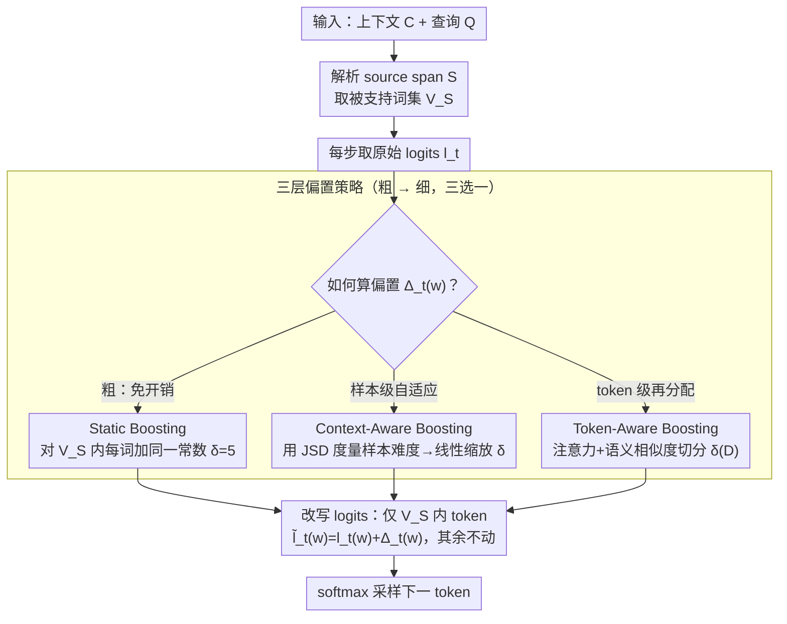

# Context-Fidelity Boosting: Enhancing Faithful Generation through Watermark-Inspired Decoding

**会议**: ACL 2026  
**arXiv**: [2604.22335](https://arxiv.org/abs/2604.22335)  
**代码**: <https://github.com/weixuzhang/CFB>  
**领域**: LLM 安全 / 忠实生成 / 解码策略  
**关键词**: faithfulness hallucination、logit shaping、watermark、context-aware decoding、RAG

## 一句话总结
CFB 把文本 watermark 用的 logit 加性偏置技术反向利用——在解码每步给"被输入上下文支持"的 token 加 bonus，提出 static / context-aware（用 JSD 自适应缩放）/ token-aware（用注意力 + 语义相关性再分配）三层渐进策略，在多模型多任务的摘要和 QA 上稳定提升 faithfulness 指标，且几乎无解码开销。

## 研究背景与动机

**领域现状**：LLM 在 RAG、摘要、对话 IR 等"上下文驱动"任务中经常输出听起来合理但和输入上下文冲突的内容——即 faithfulness hallucination（与 factuality hallucination 不同：后者是不符合世界事实，前者是不符合用户提供的 context）。

**现有痛点**：(1) training-time 方法（faithful finetuning）要重训且跨域差；(2) prompting 方法（chain-of-thought, self-consistency）跨模型不稳定；(3) 现有 decoding-time 方法（CAD / ADACAD / COIECD）依赖对比两个 forward pass 的整个分布或硬约束，常在 faithfulness 和 fluency 之间剧烈摇摆，且超参敏感。

**核心矛盾**：要让 LLM 服从外部 context、又不能让输出僵化失流畅——前者要"强偏置朝向 context 词"，后者要"保持自然语言分布"。

**本文目标**：用一种 lightweight、model-agnostic、几乎免开销的 decoding 干预，让模型在不重训的情况下偏向 source-supported token，但偏置强度能根据 sample 难度和 token 重要性自适应。

**切入角度**：text watermarking 文献已经证明对 logits 做轻量加性偏置就能稳定改写生成而不破坏流畅度（绿/红 token 集合）。watermark 的目标是"埋可检测信号"，但同一套 logit-shaping 机制完全可以反过来——把"绿 token"换成"被 context 支持的 token"。

**核心 idea**：在解码每步，把出现在 source span 的 token 的 logits 加上一个偏置 $\Delta_t(w)$，并设计三种从粗到细的偏置策略——固定值、按"用没用 context 的输出分布差异"自适应、按 token 级注意力 + 语义相关性再分配。

## 方法详解

### 整体框架
CFB 想做的事很简单：解码每一步，凡是输入上下文里出现过的词，就在它的 logit 上额外加一点 bonus，让模型更愿意从 context 里取词、少凭参数记忆瞎编。具体地，给定 context $C$ 和 query $Q$，先从 $C$ 里解析出 source span $S$，取其 token 集合 $V_S$ 当作"被支持词集"；每步拿到原始 logits $l_t$ 后，对落在 $V_S$ 里的词改写成 $\tilde l_t(w) = l_t(w) + \Delta_t(w)$，其余词保持不动，再 softmax 采样下一个 token。整套机制的核心就在偏置 $\Delta_t(w)$ 怎么算——论文给了三种从粗到细的算法，分别在"固定值 → 按样本难度自适应 → 按 token 重要性再分配"三个粒度上回答这个问题，可控性逐级增强，算力代价也逐级上升。

### 关键设计

**1. Static Boosting：所有上下文词加同一个固定偏置，先验证 logit shaping 这条路走不走得通**

最朴素的做法是不区分上下文词之间的差别，给 $V_S$ 里每个 token 统一加一个常数 $\Delta_t(w) = \delta$（论文用 $\delta = 5$），硬性把上下文词的对数似然整体抬升一截。因为只动 $V_S$ 里的词、$V_S$ 之外的"自然 token"分布原封不动，模型不会被逼到只能吐上下文原词的僵化状态，仍保有基本流畅度。它的价值一是当 baseline 证明"反用 watermark 的加性偏置确实能提 faithfulness"，二是部署时算力最低——每步只多一次张量加法，Table 5 显示开销仅为 base model FLOPS 的 0.003%，基本可以忽略。

**2. Context-Aware Boosting：用 JSD 度量"这条样本有多需要管"，难则重压、不难则少动**

固定偏置的毛病是不看样本：哪怕这条样本里 context 和参数知识根本不冲突，它也照样硬加 $\delta$，白白扭曲了本来就对的分布。Context-Aware 让偏置强度随样本难度浮动——先分别算带 context 和不带 context 两个下一 token 分布之间的 Jensen-Shannon divergence $D = \mathrm{JSD}(P_w \| P_{wo})$（$D\in[0,1]$），再线性映射成偏置：

$$\Delta_t(w) = \delta_{\min} + (\delta_{\max} - \delta_{\min}) \cdot D.$$

当 context 几乎没改变模型偏好（$D$ 小）时几乎不加偏置，避免无谓干预；当 context 与模型记忆严重冲突（$D$ 大）时才施加强偏置，把模型往 context 上拽。这其实是把 ADACAD"按冲突程度调对比强度"的思路换成更轻量的加性版本——同样用 JSD 当难度信号，但只需一次额外 forward 而不必维护整套对比解码。

**3. Token-Aware Boosting：在样本级 $\delta(D)$ 之上，按每个上下文词与当前解码状态的相关性再分配 boost**

样本级自适应仍然把 $V_S$ 里所有词一视同仁，但实际上某些上下文词比其他词更贴合当前正在生成的位置。Token-Aware 在 $\delta(D)$ 这个"总预算"之下，按 token 相关性把它切开分给不同的词。相关性由两部分线性组合：一个动态的注意力项 $\alpha_t(w) = \mathrm{Agg}\{a_t(p): p \in \mathcal{P}(w,C)\}$（把词 $w$ 在 source 中所有出现位置的注意力求和聚合），一个静态的语义相似度项 $s(w) = \frac{1}{|S|} \sum_{c \in S} \cos(e_w, e_c)$，合成 $r_t(w) = \lambda_1 \alpha_t(w) + \lambda_2 s(w)$（论文取 $\lambda_1=0.6, \lambda_2=0.4$），再对全集归一化 $\hat r_t(w) = r_t(w) / \frac{1}{|V_S|}\sum_u r_t(u)$，最终偏置为 $\Delta_t(w) = \delta(D) \cdot \hat r_t(w)$。这样在不增加干预总量的前提下，把同样的 boost 预算集中投给最该被选中的几个词，干预更精准。注意 ablation 显示这里真正撑场的是静态语义项——去掉它 ROUGE-L 直接崩盘，注意力单用反而不稳。

### 损失函数 / 训练策略
全程不训练，纯 decoding-time 干预。语义相似度每条样本预计算一次，注意力则每步重算以反映当前 decoding 状态。所有实验用 top-$p$ 采样、零样本设置；超参 $\lambda_1 = 0.6, \lambda_2 = 0.4$ 固定，偏置范围 $\delta$ 在 ablation 中扫描。

## 实验关键数据

### 主实验（摘要：CNN/DM + XSum，QA：NQ-Synth + NQ-Swap，模型：Mistral-7B / Llama2-13B / Llama3-8B）

| 任务 + 模型 | 方法 | ROUGE-L | FactKB | BERT-P | Acc |
|-------------|------|---------|--------|--------|-----|
| CNN/DM + Llama2-13B | CAD | 35.63 | 97.26 | 89.38 | – |
| CNN/DM + Llama2-13B | **Static CFB** | 37.40 | **98.85** | 89.61 | – |
| CNN/DM + Llama2-13B | **Context-aware CFB** | **37.52** | 98.69 | 89.62 | – |
| CNN/DM + Llama2-13B | **Token-aware CFB** | 36.16 | 97.24 | **89.83** | – |
| XSum + Llama3-8B | CAD | 12.92 | 45.77 | 87.05 | – |
| XSum + Llama3-8B | **Context-aware CFB** | 12.59 | **66.85** | 88.67 | – |
| XSum + Llama3-8B | **Token-aware CFB** | **13.23** | 55.29 | 88.45 | – |
| NQ-Synth + Llama3-8B | CAD | 28.19 | 32.26 | 86.50 | 66.80 |
| NQ-Synth + Llama3-8B | **Token-aware CFB** | **32.90** | **45.94** | 88.13 | **73.40** |
| NQ-Swap + Llama3-8B | ADACAD | 12.52 | 39.14 | 85.82 | **86.50** |
| NQ-Swap + Llama3-8B | Token-aware CFB | 14.54 | 40.92 | 87.99 | 32.43 |

> NQ-Swap 上 ADACAD 反超：当 context 显式冲突 parametric knowledge 时，"对比抑制"策略比"加性增强"更有效。CFB 的设计哲学是 boost 而非 suppress，因此在 complementary-context 场景更强、conflict 场景较弱——这是个清晰的设计权衡而不是 bug。

### 消融实验（Token-aware CFB on Llama3-8B / CNN-DM）

| 配置 | ROUGE-L | FactKB | BERT-P |
|------|---------|--------|--------|
| Full Token-aware CFB | 35.81 | 94.31 | 89.38 |
| w/o attention | 35.60 | 93.74 | 88.48 |
| **w/o semantic** | **4.45** | **66.84** | **67.68** |
| w/o JSD | 35.24 | 93.60 | 88.43 |

人工 + GPT-4o judge 评估（CNN-DM + NQ-Swap 各 100 例）：

| 方法 | Faith. | Flu. | Info. | Consistency | Hallucinations | Contradiction |
|------|--------|------|-------|-------------|----------------|---------------|
| CAD | 3.82 | 4.15 | 3.76 | 0.83 | 1.24 | 0.12 |
| ADACAD | 4.03 | 4.21 | 3.89 | 0.87 | 0.95 | 0.09 |
| **Token-aware CFB** | **4.31** | 4.18 | **4.12** | **0.91** | **0.67** | **0.05** |

### 关键发现
- 三个 boosting 变种全面优于 CAD / ADACAD / COIECD 在 CNN/DM 上的 faithfulness 指标；fluency（BERT-P）和 lexical overlap（ROUGE-L）几乎不损失。
- Ablation 揭示 **semantic similarity 是 token-aware 的命门**——去掉后 ROUGE-L 从 35.81 崩到 4.45，说明语义相关性提供了关键的稳定信号，attention 单用反而不够稳。
- NQ-Swap（高知识冲突）上 CFB 输给 ADACAD：当 context 和 parametric knowledge 矛盾时，单纯 boost context token 不够强力，需要同时 suppress parametric 偏好——这是"增强 vs 抑制"两种范式的根本差异。
- 算力开销：Static / Context-aware 仅 0.003% 的 base FLOPS；Token-aware 因要查注意力 + cosine 需 $2.86 \times 10^8$ FLOPS 但仍可忽略。

## 亮点与洞察
- 把 watermark 文献的 logit shaping 反向用于"反幻觉"是简单但漂亮的 idea cross-pollination——同一数学机制服务两个相反目的（加可检测信号 vs 加 context 信号）。
- 三层渐进设计（固定 → sample 自适应 → token 细粒度）让用户按算力/精度需求选择，是"研究方法 + 工程产品"的典范分级。
- token relevance 用"动态注意力 + 静态嵌入相似度"线性组合 + sample 级 JSD 缩放，把多个 signal 用最小公倍数方式融合，每个分量都有清晰的物理解释。
- NQ-Swap 上诚实地承认 CFB 输给 ADACAD，并明确归因为"boost vs suppress"范式差异——这种 case 分析比"全面 SOTA"声明更有信息量。

## 局限与展望
- 依赖 logits + attention 访问，无法用于黑盒 API（GPT-4 / Gemini）；论文也承认这一点并把 black-box approximation 列为未来工作。
- 高冲突场景（NQ-Swap）性能差，需结合 suppression 策略（如和 ADACAD 联合）才能覆盖全谱场景。
- semantic similarity 占主导意味着 token-aware 的"细粒度"贡献其实有限——可能简化为 sample 级 + semantic-only 也能近似达到效果。
- $\delta$ 超参敏感：CNN-DM 上 moderate 值最佳、过大会崩；NQ-Synth 容忍范围更宽。需要为每个新数据集做 grid search。

## 相关工作与启发
- **vs CAD（Shi et al. 2024）**：CAD 对比"带 context vs 不带 context"两个分布做减法；CFB 只用一次 forward + 加性偏置，开销更小且 fluency 更稳。
- **vs ADACAD（Wang et al. 2024）**：ADACAD 用 JSD 动态调整对比强度；CFB-context-aware 用 JSD 调整 boost 强度。两者哲学相反（suppress vs boost）→ 高冲突场景 ADACAD 强，低冲突场景 CFB 强。
- **vs COIECD（Yuan et al. 2024）**：COIECD 用熵约束区分冲突 vs 非冲突 token；CFB 不区分而是统一加 boost。
- **vs watermarking（Kirchenbauer / Liu et al.）**：同一 logit shaping 机制；watermark 把绿 token 当随机种子选，CFB 把"被 context 支持的 token"当目标集——目的相反但数学同源。

## 评分
- 新颖性: ⭐⭐⭐⭐ 反用 watermarking + 三层 boost 设计是清晰的 contribution，但单个组件都比较直接
- 实验充分度: ⭐⭐⭐⭐ 3 模型 × 4 数据集 × 6 方法 + 消融 + 人工/LLM 评估，相当全面
- 写作质量: ⭐⭐⭐⭐⭐ 算法伪代码清晰、case study 直观、对 NQ-Swap 失败的诚实分析加分
- 价值: ⭐⭐⭐⭐ 对 RAG / 摘要部署直接 actionable，且几乎免开销；但需要白盒访问限制了部分场景

<!-- RELATED:START -->

## 相关论文

- [\[ACL 2026\] Differentially Private Synthetic Text Generation for Retrieval-Augmented Generation (RAG)](differentially_private_synthetic_text_generation_for_retrieval-augmented_generat.md)
- [\[ACL 2026\] LeakDojo: Decoding the Leakage Threats of RAG Systems](leakdojo_decoding_the_leakage_threats_of_rag_systems.md)
- [\[ACL 2026\] Membership Inference Attacks on In-Context Learning Recommendation](membership_inference_attacks_on_llm-based_recommender_systems.md)
- [\[ACL 2026\] Robust Multimodal Safety via Conditional Decoding](robust_multimodal_safety_via_conditional_decoding.md)
- [\[ACL 2026\] FAITH: Factuality Alignment through Integrating Trustworthiness and Honestness](faith_factuality_alignment_through_integrating_trustworthiness_and_honestness.md)

<!-- RELATED:END -->
