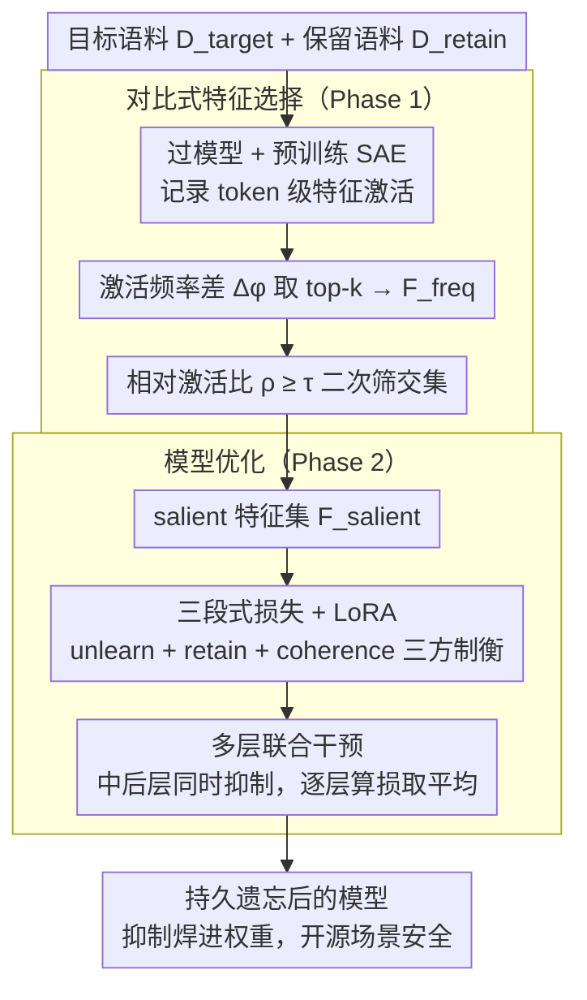

# CRISP: Persistent Concept Unlearning via Sparse Autoencoders

**会议**: ACL 2026  
**arXiv**: [2508.13650](https://arxiv.org/abs/2508.13650)  
**代码**: https://github.com/technion-cs-nlp/CRISP  
**领域**: LLM 安全 / Unlearning / 可解释性 / SAE  
**关键词**: SAE, 持久遗忘, WMDP, 对比特征选择, LoRA, 概念抑制

## 一句话总结
针对 SAE-based unlearning 大多只在推理时干预、参数仍含敏感知识的问题，CRISP 通过对比 target/retain 语料自动挑出"只在 target 上强激活"的 SAE 特征，再用 LoRA + 三段式损失（unlearn + retain + coherence）把这些特征的激活值"焊死"为零，从而在 WMDP-Bio/Cyber 上同时刷新 unlearn-retain-fluency 三轴 Pareto 前沿，比 ELM 高 27-34 分，比 RMU 高 5-8 分。

## 研究背景与动机

**领域现状**：LLM 部署后常需要删除危险知识（生化武器/隐私/版权），unlearning 主流分两派：(1) 直接编辑参数（RMU、ELM），用 random direction 或 self-classification 改写整段隐状态；(2) SAE 推理时干预，把目标概念对应的 SAE feature 激活 clamp 到极小值。

**现有痛点**：(1) 参数编辑派伤及无辜——删"如何增强病毒传染性"也会破坏"免疫系统如何对抗病毒"这类正常知识；同时会让模型在 target 概念上 fluency 崩塌（重复词或跑题）。(2) SAE 推理派只在 inference 时改 activation，参数里的危险知识完全没动，开源模型场景下攻击者只要绕过 hook 就能恢复。

**核心矛盾**："精确（SAE 的 monosemantic 优势）"与"持久（参数级编辑）"目前是分裂的：精细的 SAE 不持久，持久的方法又不够精细。

**本文目标**：把 SAE 的细粒度可解释性"焊"进模型参数，做到 (a) 持久（开源场景安全）；(b) 精确（不波及邻近 benign 概念）；(c) 流畅（target 概念上仍能写出通顺、与事实一致的中性内容）。

**切入角度**：既然 SAE feature 已经把概念解耦，何不"先找出 target 专属 feature，再让模型学会自己把这些 feature 压住"？把 SAE 当作"概念指南针"，但用 LoRA 把指南针指的方向固化进权重。

**核心 idea**：CRISP = **对比频率/比率选 feature** + **LoRA 微调让模型自己抑制这些 feature**，从而把"推理时 clamp"升级为"训练时焊死"。

## 方法详解

### 整体框架

两阶段流水线，无须修改 SAE 本身：

1. **Phase 1 — Feature Selection**：把 $\mathcal{D}_{\text{target}}$（要忘的语料）和 $\mathcal{D}_{\text{retain}}$（要保的语料）分别过模型 + 预训练 SAE，记 token 级激活；按"激活频率差 + 相对激活强度比"双重过滤选出 $\mathcal{F}_{\text{salient}}$。
2. **Phase 2 — Model Optimization**：用 LoRA 微调原模型 $M$，目标是让它在见到 $\mathcal{D}_{\text{target}}$ 时把 $\mathcal{F}_{\text{salient}}$ 的激活压低，但在 $\mathcal{D}_{\text{retain}}$ 上隐状态保持与原模型 $M_0$ 一致。

操作选在中层（Llama-3.1-8B 层 24、Gemma-2-2B 层 14），这一层 SAE feature 解耦度最高。

### 关键设计

**1. 对比式 salient feature 自动选择：从几十万 SAE 特征里只挑出"专属 target 概念"的那一小撮，避免误伤**

SAE 把概念解耦成数十万个 feature，但要做精确 unlearning，得先回答"哪些 feature 才是真正只编码 target 概念的"。只看一个指标都会出错：单看激活频率差，会把"两边都常激活、target 略多"的共享 feature 也选进来；单看激活强度比，又会把"几乎只在 target 出现但总激活量极小"的边缘 feature 误纳。CRISP 因此用两个度量做交集过滤。先按激活频率差 $\Delta\phi(f_i)=\phi(f_i,\mathcal{D}_{\text{target}})-\phi(f_i,\mathcal{D}_{\text{retain}})$ 取 top-$k$ 得到候选集 $\mathcal{F}_{\text{freq}}$，再用相对激活比 $\rho(f_i)=A(f_i,\mathcal{D}_{\text{target}})/(A(f_i,\mathcal{D}_{\text{retain}})+\epsilon)$ 配阈值 $\tau$ 二次筛，最终

$$\mathcal{F}_{\text{salient}}=\{f_i\in\mathcal{F}_{\text{freq}}\mid\rho(f_i)\ge\tau\}.$$

只有同时"激活够频繁"且"强烈偏向 target"的特征才能留下，这正是后续抑制时既精准又不波及 benign 概念的前提——消融里去掉 $\rho$ 比率过滤后 retain 明显下降，就是因为共享 feature 被误选进来一起压了。

**2. 三段式损失 + LoRA 持久化：把"压 target / 保 retain / 保流畅"三个目标显式拆开，再用 LoRA 焊进权重**

选出 $\mathcal{F}_{\text{salient}}$ 后，关键是怎么让模型在不破坏原结构和 benign 表示的前提下学会自己把这些特征压住。如果只用一个 unlearn 目标硬压，往往会"用力过猛"连带把 retain 集和流畅度一起拖垮，所以 CRISP 把目标拆成三项各管一摊：unlearn loss $\mathcal{L}_{\text{unlearn}}=\mathbb{E}_{t\sim\mathcal{D}_{\text{target}}}\mathbb{E}_{f_i\sim\mathcal{F}_{\text{salient}}}[a_i^{(t)}+\lambda c_t]$ 直接最小化 salient feature 在 target token 上的激活；retain loss $\mathcal{L}_{\text{retain}}=\mathbb{E}_{t\sim\mathcal{D}_{\text{retain}}}\|h_M^{(t)}-h_{M_0}^{(t)}\|_2^2$ 把 retain 集的隐状态钉在原模型 $M_0$ 附近防止误伤；coherence loss 同样是隐状态对齐，但施加在最后一层、用 Claude 生成的每领域 20 句中性文本上，专门守住 target 概念附近的流畅度。三者按

$$\mathcal{L}=\alpha\mathcal{L}_{\text{unlearn}}+\beta\mathcal{L}_{\text{retain}}+\gamma\mathcal{L}_{\text{coherence}}$$

加权，且全程只更新 LoRA 适配器。这一步是 CRISP 区别于"推理时 clamp"的核心——把抑制写进权重，开源场景下攻击者绕过 hook 也无法恢复，同时 LoRA 让整个编辑可逆且参数高效。消融里去掉 coherence 后 fluency 退回 RMU 水平、去掉 retain 后 benign 知识被牵连，正说明这三方制衡缺一不可。

**3. 多层联合干预 + 中层定位：在一组中后层同时抑制，避免单层 hook 被下游补回去**

只在某一层做特征抑制并不牢靠——下游层会把被压下去的信息重新"补"回来。CRISP 因此在预选的一组层上同时施加抑制，每层独立算损失再取平均，Llama-3.1-8B 选第 24 层附近、Gemma-2-2B 选第 14 层附近。选这些中后层有据可依：根据 Neuronpedia，越靠后的层 SAE feature 解耦度越高、概念粒度越细，是知识被抽象表示的地方，适合做概念级编辑而非浅层的词面编辑。多层联合让 unlearning 真正稳定地跨层生效，而不是被任意单层的冗余表示绕过。

### 损失函数 / 训练策略
LoRA 适配器（rank 详见附录），每方法 200 组超参 sweep，依据 validation 上的 unlearn + retain + MMLU 综合分选最优配置。验证集/测试集对 MCQ 各占 50%。Overall = HM(100-U, R, M, F·50, C·50)，强调任一维短板都会被惩罚。

## 实验关键数据

### 主实验（WMDP Bio / Cyber, 5 维 + Overall HM）

| 模型 / 集 | 方法 | Overall ↑ | Unlearn↓ | Retain↑ | MMLU↑ | Fluency↑ | Concept↑ |
|---|---|---|---|---|---|---|---|
| Bio / Llama-3.1-8B | Original | 56.60 | 68.29 | 76.81 | 61.15 | 1.24 | 1.77 |
| Bio / Llama-3.1-8B | ELM | 33.93 | 41.44 | 62.17 | 55.31 | 0.25 | 1.24 |
| Bio / Llama-3.1-8B | RMU | 52.51 | 34.54 | 67.75 | 59.50 | 0.56 | 1.58 |
| Bio / Llama-3.1-8B | **CRISP** | **60.10** | **30.93** | **74.13** | **60.28** | **0.77** | 1.58 |
| Bio / Gemma-2-2B | Original | 54.37 | 55.26 | 55.27 | 46.30 | 1.07 | 1.78 |
| Bio / Gemma-2-2B | ELM | 22.13 | 27.80 | 40.54 | 35.80 | 0.14 | 1.20 |
| Bio / Gemma-2-2B | RMU | 51.91 | **27.79** | 48.77 | 42.77 | 0.76 | 1.63 |
| Bio / Gemma-2-2B | **CRISP** | **56.70** | 29.67 | **54.45** | **46.33** | **0.92** | 1.63 |
| Cyber / Llama-3.1-8B | Original | 61.32 | 40.95 | 54.00 | 61.15 | 1.27 | 1.43 |
| Cyber / Llama-3.1-8B | ELM | 58.91 | 30.78 | 53.00 | 58.56 | 0.99 | 1.40 |
| Cyber / Llama-3.1-8B | RMU | 52.47 | 33.70 | 55.00 | 61.15 | 0.68 | 1.23 |
| Cyber / Llama-3.1-8B | **CRISP** | **61.74** | **29.38** | 53.00 | 58.86 | **1.14** | **1.49** |
| Cyber / Gemma-2-2B | Original | 52.57 | 33.90 | 39.00 | 46.30 | 1.05 | 1.46 |
| Cyber / Gemma-2-2B | ELM | 43.33 | 28.87 | 29.00 | 38.71 | 0.76 | 1.36 |
| Cyber / Gemma-2-2B | RMU | 44.79 | 28.67 | 36.00 | 44.79 | 0.64 | 1.23 |
| Cyber / Gemma-2-2B | **CRISP** | **49.02** | **27.26** | **38.00** | **46.26** | **0.81** | 1.28 |

CRISP 在 4 个 (model, dataset) 设置的 Overall 上全部夺冠；Bio-Llama 相对 ELM/RMU 分别 +26.17/+7.59，Bio-Gemma 相对 ELM/RMU +34.57/+4.79；Cyber 上差距收窄但仍保持领先，说明在"网络安全"这类内容更分散的领域 unlearning 难度更高。

### 消融实验（关键设计去除后 Overall 变化，定性总结自论文 §5–§6）

| 配置 | Bio-Llama Overall | 说明 |
|------|-------------------|------|
| Full CRISP | 60.10 | unlearn + retain + coherence + 双指标 feature 选择 |
| w/o Coherence loss | ↓（fluency 接近 RMU 0.56） | target 概念附近生成开始重复 / 跑题 |
| w/o Retain loss | ↓（retain acc 向 ELM 的 62.17 靠拢） | benign 知识被牵连压制 |
| w/o $\rho$ 比率过滤（只用 $\Delta\phi$） | ↓ | 误选共享 feature，retain 显著下降 |
| Inference-time clamp（不做 LoRA 训练） | 非持久 | 攻击者绕过 hook 即可恢复，参数仍含知识 |

### 关键发现
- **Pareto 主导**：Figure 2 中 200 组超参的散点显示，CRISP 几乎所有配置都靠近"random unlearn + 不掉 retain"的红色理想点，RMU 次之，ELM 离得最远；说明 CRISP 不仅最优配置好，整个超参曲面也更稳。
- **Fluency 优势最显著**：Bio-Gemma 上 ELM 的 fluency 仅 0.14，文本几乎是乱码符号；CRISP 0.92 接近 Original 的 1.07。说明把"压谁"做精细比"压多少"更重要。
- **概念分离的语义可解释**：分析 Llama 层 24 / Gemma 层 14 选出的 feature，target feature 集中在病毒/传播/生物威胁载体；benign feature 集中在解剖学/研究方法；shared feature 多是格式 token。Gemma 上有 2 个 feature 被 Neuronpedia 误标为"花/金融"但其实激活在病毒复制和投毒文本上，提示 SAE 解耦不完美但 CRISP 选择标准能挑出真正相关的方向。
- **跨模型一致性**：同一方法在 Llama 和 Gemma 上分布形态相似，说明这套对比 feature 选择不强依赖某一家 SAE 的具体训练方式。

## 亮点与洞察
- **把"可解释性工具"翻译成"训练信号"**：以往 SAE 主要用于 probe / steering，本文把"SAE 告诉我们这个 feature 是 X 概念"直接变成"训练时压 feature 激活"这一可微目标，让可解释性第一次能持久写入参数。
- **对比双指标（频差 + 强度比）**：这是个低成本但非常通用的概念定位 trick，可迁移到任何"我要删 / 增强一个概念"的场景，不只局限于 unlearning（也能做 steering、debiasing、风格控制）。
- **三段式损失的"压 / 保 / 流畅"三方制衡**：把以往 unlearning 隐性混在一起的目标显式拆开，每一项各管一个 axis，超参 sweep 就能直接探到 Pareto 前沿，方法论上很清爽。
- **威胁模型自觉**：论文明确强调"开源场景下 inference 干预不算 unlearning"，这点比很多 RLHF / safety 论文都更诚实，把安全的真正边界讲清楚了。

## 局限与展望
- **依赖预训练 SAE 的质量**：当目标概念在 SAE 里被分散到多个 polysemantic feature 时，对比指标会失效；Gemma 上的 4008/11127 误标已经露出端倪。需要更高质量、更细粒度的 SAE 或在线 SAE 微调。
- **只在 WMDP（生化/网安）+ Harry Potter 上验证**：版权类、多模态、长上下文 / RAG、对话历史中的危险知识等场景没测；尤其没测"指令调过的对齐模型"上效果，base 模型外推性存疑。
- **无形式化遗忘保证**：作者明确承认残留知识可能分布式存在，未做对抗提取（如 fine-tune 攻击、概率泄漏攻击）的鲁棒性评测。下一步明显是加 adversarial finetuning recovery 实验。
- **超参 sweep 200 组成本高**：HM 评分对单项短板敏感，意味着需要广 sweep 才能找到平衡点；面对新领域时上手成本不低。

## 相关工作与启发
- **vs RMU (Li et al. 2024)**：RMU 把 target 隐状态推向随机方向，是粗粒度全状态扰动；CRISP 只压 SAE 选出的少量方向，retain 高 6+ 点、fluency 高一倍，更精准也更流畅。
- **vs ELM (Gandikota et al. 2024)**：ELM 用 self-classification + LoRA 改 early layers，把 target 表示对齐成 "benign 替身"；副作用是会跑题、生成乱码；CRISP 在中层做特征级抑制，避免了表征整体偏移。
- **vs Farrell et al. 2024（SAE clamp）**：前者是 inference 时 clamp feature，CRISP 把同样的 feature 选择目标改成 LoRA 训练目标，实现持久化。
- **vs PISCES (Gur-Arieh et al. 2025)**：PISCES 也是用 SAE 做持久 unlearning，但需要手工挑 feature 且只编辑 FFN 的 $W_2$；CRISP 自动选 feature 且通过 LoRA 改 attention/FFN 全栈，更易扩展。
- **启发**：把"compositional interpretability tool（SAE / circuits / DAS）→ 可微训练损失"这一范式可以推到 model editing、debiasing、对齐拒答、风格删除等多个方向，CRISP 是一个很完整的模板。

## 评分
- 新颖性: ⭐⭐⭐⭐ 把 inference-time SAE clamp 持久化是直接但重要的一步，对比双指标选择和三段式损失组合干净有效；不算颠覆但很扎实。
- 实验充分度: ⭐⭐⭐⭐ 两模型 × 两数据集 × 200 组超参 sweep + Pareto 图 + feature 语义分析齐备；扣半星因为缺对抗鲁棒性和指令模型评测。
- 写作质量: ⭐⭐⭐⭐⭐ 动机 → 方法 → 实验 → 分析层层推进，HM 综合分公式与威胁模型讨论都很清晰，Table 2 的定性对比一眼见高低。
- 价值: ⭐⭐⭐⭐ 在 LLM safety 持久 unlearning 这条线上是新 SOTA，且方法论可迁移到 steering / debiasing，是 SAE 应用落地的代表性工作之一。

<!-- RELATED:START -->

## 相关论文

- [\[ICCV 2025\] SAUCE: Selective Concept Unlearning in Vision-Language Models with Sparse Autoencoders](../../ICCV2025/llm_safety/sauce_selective_concept_unlearning_in_vision-language_models_with_sparse_autoenc.md)
- [\[ICML 2025\] SAEBench: A Comprehensive Benchmark for Sparse Autoencoders in Language Model Interpretability](../../ICML2025/llm_safety/saebench_a_comprehensive_benchmark_for_sparse_autoencoders_in_language_model_int.md)
- [\[NeurIPS 2025\] SAEMark: Steering Personalized Multilingual LLM Watermarks with Sparse Autoencoders](../../NeurIPS2025/llm_safety/saemark_steering_personalized_multilingual_llm_watermarks_with_sparse_autoencode.md)
- [\[ACL 2026\] Representation-Guided Parameter-Efficient LLM Unlearning](representation-guided_parameter-efficient_llm_unlearning.md)
- [\[ACL 2026\] CAP: Controllable Alignment Prompting for Unlearning in LLMs](cap_controllable_alignment_prompting_for_unlearning_in_llms.md)

<!-- RELATED:END -->
