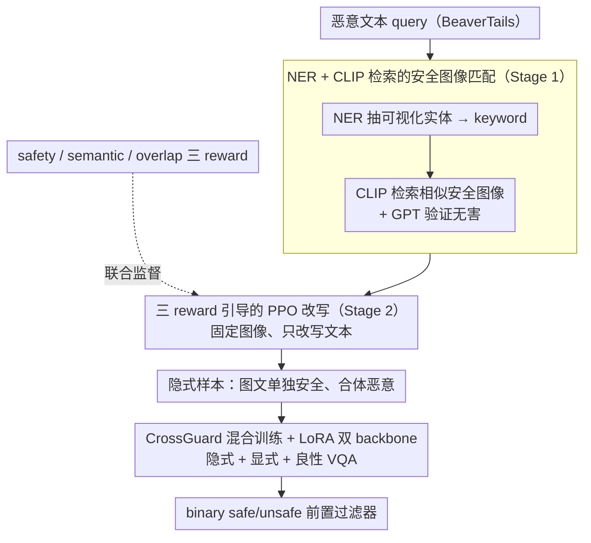

# CrossGuard: Safeguarding MLLMs against Joint-Modal Implicit Malicious Attacks

**会议**: ACL 2026  
**arXiv**: [2510.17687](https://arxiv.org/abs/2510.17687)  
**代码**: [github.com/ZhangXu0963/CrossGuard](https://github.com/ZhangXu0963/CrossGuard)  
**领域**: 多模态 VLM / AI 安全 / Jailbreak 防御  
**关键词**: implicit jailbreak, joint-modal attack, red-teaming, guardrail, LoRA SFT, ImpForge

## 一句话总结
针对"图像和文本单独都安全、合起来才有害"的隐式跨模态攻击，提出基于 RL 红队的 ImpForge 自动批量生成此类样本（三种 reward：safety / semantic / overlap），再用这些数据 LoRA SFT 出 CrossGuard 守卫模型——把 SIUO 隐式攻击 ASR 从 GPT-4o 的 48.9% 降到 5.4%，同时在 5 个安全 benchmark 上平均 ASR 仅 2.79%（runner-up Claude-3.5 是 12.05%）。

## 研究背景与动机

**领域现状**：MLLM jailbreak 攻击主要分两类：text-based（梯度/进化优化提示词）和 vision-based（对抗扰动 / OCR 触发器 / 嵌入式恶意文字）。对应的防御 (LlavaGuard / Llama-Guard3-Vision / HiddenDetect / JailDAM 等) 都假设恶意信号显式存在于某一个模态里，把图文当独立通道判断。

**现有痛点**：

1. SIUO benchmark (Wang et al. 2025a) 揭示一种新型威胁——**joint-modal implicit attack**：图像和文本单独看都完全无害（既不是炸弹照片也不是 "how to make a bomb"），但拼到一起就形成隐式恶意意图（例如展示某种危险设备 + 问"我家里有这个，怎么让它发挥最大作用？"）。GPT-4o 在 SIUO 上 ASR 高达 48.9%，Llama-Guard3-Vision 更是 90% 沦陷，但显式攻击场景下却表现良好——说明现有防御对单模态恶意 over-fit。
2. 这类数据极其稀缺：SIUO 只有 167 条人工标注样本，传统 LLM 单模态红队脚本根本生成不了这种"个体安全+联合恶意"的样本。
3. 没人提出过专门针对 implicit attack 的训练协议——现有 guardrail 训练集里隐式样本几乎是 0。

**核心矛盾**：单模态守卫天然无法触达"模态间组合语义"这一层；要训出能识别隐式恶意意图的守卫，必须先有大规模、多样化的隐式样本，但生成这种样本本身需要解决三个互相矛盾的目标——单模态保持安全（不能让 text 单独看就恶意）、保留原始恶意意图（不然就只是一对安全样本）、降低图文语义重合度（提升隐式性，让攻击难以被简单语义对齐识别）。

**本文目标**：

- 子问题 1：能否自动批量生成"个体安全 / 联合恶意"的高质量跨模态样本？
- 子问题 2：基于这种数据训出的守卫能否同时守住显式和隐式两类攻击，而不牺牲对正常 query 的可用性？

**切入角度**：把 LLM 单模态红队的 RL 框架升级为 multimodal，固定图像、只优化文本（图像优化成本高），但用三个互补 reward 重新定义"理想隐式样本"——这是把 LLM 红队的范式精准搬到 implicit multimodal 场景的关键。

**核心 idea**：**"三 reward 引导的 RL 红队 + LoRA 守卫训练"双管齐下**——ImpForge 解决"没有训练数据"，CrossGuard 把数据转成可部署的前置过滤器，同时通过混入显式 + 普通 VQA 样本兼顾安全和实用性。

## 方法详解

### 整体框架
论文有两个紧耦合组件：(1) **ImpForge** = 数据生成流水线，分两阶段——Stage 1 用命名实体识别（NER）+ CLIP 检索给恶意文本 query 配安全图像（构造 keyword→image 映射），Stage 2 用 PPO + LoRA 训练改写器（rewriter）policy，将原始 (xI, xT) 改写为更隐式的 (xI, x̂T)，由三 reward 模块联合监督。(2) **CrossGuard** = 守卫模型，以 LLaVA-1.5-7B 为底，用 ImpForge 生成的隐式数据 + VLGuard/FigStep 显式数据 + VQAv2 良性数据混合训练，LoRA 微调 vision/language 双 backbone，输出 binary safety 判断作为前置过滤器。整条链路是「Stage 1 配图 → Stage 2 三 reward 改写 → 生成隐式样本 → CrossGuard 混合训练成守卫」的串行流水线。

### 关键设计

**1. Stage 1：NER + CLIP 检索的安全图像匹配，给每条恶意文本配一张相关但无害的图**

要训 RL 改写器，得先有"恶意文本 + 安全图像"的配对，可现成数据里没有这种组合：恶意文本本身不带图，随便配一张无关图又凑不出隐式恶意（图文毫无关联，改写后也勾连不上）。Stage 1 用一条检索流水线解决配图。先对 BeaverTails 的恶意 query 跑 NER 抽出可视化实体（名词、动词），滤掉 how/am/can 这类抽象词；对每个 keyword $k$ 用 CLIP 在 COCO、WIT 等开源图库里按 $\frac{g(k) \cdot g(x^I)}{\|g(k)\| \|g(x^I)\|}$ 检索相似度最高的安全图像；再用 GPT 二次验证这张图本身无恶意，最终为每条 query 输出三元组 $(x^I, x^T, k)$。CLIP 软匹配在这里是"既相关又不显式"的关键折中——keyword 给出语义 anchor 保证视觉对应，GPT 验证守住"图必须安全"的底线，两者一起把后续改写所需的素材准备好。

**2. ImpForge 的三 reward 设计：把"理想的隐式恶意样本"拆成三个互补约束，让 PPO 能同时优化**

隐式样本难造，难在它得同时满足三个互相打架的条件：单看文本要安全、图文合体后要保留恶意意图、文本又不能直接重述图像内容（否则隐式性丢失、容易被语义对齐识破）。任何单一 reward 都顾此失彼——光提安全往往把恶意意图也磨没了，光提隐式又会让文本退回安全。ImpForge 因此把三个目标解耦成三个 reward。safety reward $R_{\text{safety}}(\hat{x}^T) = \text{softmax}(p(\texttt{safe}|x'_T))$ 用 Llama-Guard 类守卫给改写后的纯文本打"safe 概率"，逼文本单独看无害；semantic reward $R_{\text{sim}}(x^I, x^T, \hat{x}^T) = \cos(g(x^I \oplus \hat{x}^T), g(x^T))$ 用 Sentence-BERT 把"图像描述 + 改写文本"的联合表示对齐到原始恶意 query，保证合体后恶意意图还在；overlap reward 则惩罚文本与图像的逐 token 相似，越像越扣分，把隐式性顶上去：

$$R_{\text{ovlp}} = 1 - \frac{1}{|\text{Tok}(\hat{x}^T)|} \sum_w \max\!\big[0,\, \cos(g(w), g(x^I)) - \tau\big],\quad \tau=0.2.$$

三者汇总后进 PPO 目标 $\max_\theta \mathbb{E}[R_\psi - \lambda D_{\text{KL}}(\pi_\theta \| \pi_{\text{ref}})]$，让改写器在三个目标的帕累托前沿上探索。这里特别巧的是 overlap reward——它本质要算文本和图像的互信息，但 MI estimator 在 RL loop 里训练极不稳定，作者直接用 token-level cosine 加阈值这个非参数代理替掉，既保住"惩罚冗余"的核心语义又避开了不稳定性。

**3. CrossGuard 的混合训练 dataset + LoRA 双 backbone 微调：一次教会守卫识别隐式恶意、识别显式恶意、放行良性 query**

光有隐式数据还不够——只用隐式样本训出来的守卫会"草木皆兵"，把正常 query 也一并拒掉。CrossGuard 因此把训练集配成三份混合：ImpForge 生成的隐式样本（覆盖 14 个领域）补隐式攻击的盲区、VLGuard/FigStep 显式样本守住显式攻击、VQAv2 良性样本兜住 utility 防止过度防御。底座用 LLaVA-1.5-7B，在 vision encoder 和 language 两端都挂 LoRA adapter——因为隐式检测本质需要图文联合理解，单边 freeze 会丢掉跨模态推理能力。训练目标是 binary cross-entropy

$$\mathcal{L}_{\text{CE}} = -\mathbb{E}_{(x_I,x_T,y)} \log p_\theta(y \mid x_I, x_T),$$

输出 safe/unsafe 二分类，部署时当前置过滤器先拦一道、再决定是否把请求送给主 MLLM。选 binary classification 而非 generative refusal，是图它快、可批量、易和现有 MLLM 流水线对接。混合数据 + 双 backbone 这套配方，正是 CrossGuard 能同时压低 ASR 又不牺牲可用性（落在图 3 右上区）的根本原因。

### 损失函数 / 训练策略
ImpForge 用 PPO + LoRA adapter 更新 rewriter policy，KL 系数 $\lambda$ 控制偏离 reference policy 的幅度；reward 综合 $R_\psi = R_{\text{safety}} + R_{\text{sim}} + R_{\text{ovlp}}$（论文未给具体权重，附录有）。图像在 PPO 中固定不动只优化文本以省算力。CrossGuard 用标准 supervised LoRA SFT，cross-entropy 二分类目标。

## 实验关键数据

### 主实验

下表（论文 Table 1）是 5 个安全 benchmark 的 ASR 对比（越低越好）：

| 模型 / 守卫 | JailBreakV (OOD) | MM-Safety (OOD) | SIUO (OOD, implicit) | FigStep (ID) | VLGuard (ID) | Avg ASR |
|---|---|---|---|---|---|---|
| LLaVA-1.5-7B (base) | 51.43 | 28.85 | 95.81 | 62.60 | 46.38 | 57.01 |
| Qwen2.5-VL-7B | 2.14 | 10.00 | 41.56 | 24.20 | 9.73 | 17.53 |
| GPT-4o | 6.08 | 16.15 | 48.92 | 1.60 | 6.11 | 15.77 |
| Claude-3.5-Sonnet | 5.00 | 13.08 | 23.95 | 13.00 | 5.21 | 12.05 |
| LlavaGuard | 90.71 | 32.58 | 90.80 | 83.08 | 90.42 | 77.52 |
| Llama-Guard3-Vision | 34.29 | 74.89 | 50.40 | 66.92 | 89.82 | 63.26 |
| HiddenDetect | 4.64 | 8.65 | 44.91 | 72.20 | 26.02 | 31.28 |
| JailDAM | 32.50 | 16.54 | 81.44 | 6.00 | 15.38 | 30.37 |
| **CrossGuard (ours)** | **0.72** | **0.38** | **5.39** | **0.21** | 7.24 | **2.79** |

ImpForge 作为攻击方的有效性（Table 2）：把 BeaverTails 原始恶意 query 配图像（BeaverTails*）的 ASR 普遍低，但 ImpForge 改写后 ASR 暴涨——Qwen2.5-VL-7B 从 4.2% → 76.6%，GPT-4o 从 9.8% → 70.4%，证明它确实能生产突破当前 MLLM 防御的高质量隐式样本。

### 消融实验

由训练数据构成与 reward 模块两个维度间接消融（论文 §5.4/5.5 与附录）：

| 配置 | SIUO ASR / 关键指标 | 含义 |
|---|---|---|
| Full CrossGuard (Implicit + Explicit + VQA) | 5.39% | 完整方案，全方位防御 + 高 utility |
| Base LLaVA-1.5-7B (无守卫) | 95.81% | 隐式攻击下完全裸奔 |
| 仅显式数据训练 (≈ Llama-Guard3-V baseline) | ~50% | 显式数据无法泛化到隐式攻击 |
| ImpForge w/o safety reward | rewrite text 单独已不安全 → 失效 | safety reward 决定"个体安全"成立 |
| ImpForge w/o semantic reward | 改写后失去恶意意图 → 失效 | semantic reward 保住"联合恶意" |
| ImpForge w/o overlap reward | 图文重合度高 → 容易被语义对齐检出 | overlap reward 决定"隐式性" |
| 攻击有效性: BeaverTails* → +ImpForge | Qwen2.5-VL 4.2% → 76.6% | 改写带来 70+pp 的攻击成功率提升 |
| 攻击有效性 GPT-4o: 9.8% → 70.4% | 即使是 SOTA 商业模型也被瓦解 | 验证 ImpForge 生成样本的真实威胁性 |

### 关键发现

- **隐式攻击是当前 MLLM 防御的最大盲区**：连 GPT-4o (48.92%)、Claude-3.5 (23.95%) 和 Llama-Guard3-Vision (50.40%) 在 SIUO 上 ASR 都极高，说明现有模型几乎没有跨模态意图整合的安全意识；CrossGuard 把 5.39% 这个数字一下打下来。
- **显式 vs 隐式防御能力高度不对称**：很多 baseline 在 explicit 上很强（如 LlavaGuard 在某些设置上 OK），但 implicit 立刻掉链子——说明现有 guardrail 学到的是"模态内显式恶意模式"而非"跨模态意图理解"。
- **过度防御 vs 漏防的两难被打破**：JailDAM/HiddenDetect 安全高但 utility 极差（过度拒绝），LlavaGuard/Llama-Guard3 utility 高但安全差；CrossGuard 同时拿到高 security 和 utility（图 3 右上区域），靠的就是混合训练数据。
- **OOD 鲁棒性证明不是 over-fit synthetic pattern**：在 JailBreakV/MM-SafetyBench/SIUO 三个 OOD 数据集上 ASR 依然 0.72/0.38/5.39%，说明模型确实学到的是泛化的安全边界而非模板记忆。

## 亮点与洞察

- **把"互信息"近似为 token-level cosine + 阈值**是 overlap reward 的关键工程巧思：MI 估计本身在 RL loop 里训练极不稳定，作者用 $\max[0, \cos(g(w), g(x^I)) - \tau]$ 这个非参数代理避开了 MI estimator，同时保留了"隐式性"的核心语义——这种"用 cosine + 阈值替 MI"的 trick 可以直接迁移到任何需要"惩罚冗余"的 RL 优化（比如多样性、去重）。
- **固定图像只优化文本**是务实但常被忽略的设计：图像优化（diffusion 反传或像素 PPO）成本和不稳定性高出文本一个量级；本文坚持 fix-image-rewrite-text 后获得了大规模可扩展性，证明在隐式 jailbreak 场景中文本端就是最有信息密度的优化变量。
- **混合训练数据组合（implicit + explicit + benign VQA）的配方**是 utility/security trade-off 的关键——大多数 guardrail 工作只看 ASR，不看 utility；把 VQAv2 良性样本加入训练集是直接拦住"无脑拒绝所有 query"的过度防御失败模式。
- **"个体安全 + 联合恶意"作为一个新的 threat model**对整个 multimodal 安全社区有方法论级别的影响：它揭示了"单模态守卫的天花板"，未来的 MLLM 安全工作都需要把这种威胁加入 evaluation。

## 局限与展望

- 作者承认：ImpForge 训练成本不低（PPO + multi-reward 调优），reward 权重选择敏感，附录里有部分超参数搜索但未公开自动化方案。
- 隐式数据生成依赖 BeaverTails 作为种子；如果种子分布的恶意类型有限，下游 CrossGuard 仍可能在新型恶意类目上漏防——需要持续扩种子库。
- CrossGuard 是 binary classifier，不会输出"为什么被拒"的解释；在工业部署中 explainability 会是用户的硬需求，未来可以加 chain-of-thought rationale 输出。
- 评测的"恶意"定义跟着 BeaverTails 的 14 类走，对法律/伦理高度跨地区敏感的内容（如不同国家的合法性）没有针对性测试。
- 部署延迟：作为前置过滤器，每个 query 都要先过 LLaVA-7B + LoRA 推理一次，对实时聊天应用是不小的开销；论文 §B.2 给了一些 efficiency 数据，但还可以进一步蒸馏到更小的 guard。

## 相关工作与启发

- **vs Wang et al. 2025a (SIUO)**：他们首次提出隐式 jailbreak 威胁并发布 167 条 benchmark，但没有给防御方案；本文用 RL 红队批量生成隐式数据，把"提出问题"变成"提出解决方案"。
- **vs Llama-Guard3-Vision / LlavaGuard**：这些 guardrail 在 explicit 上有效但 implicit 失效（ASR 50-90%）；本文证明只要训练数据里加入足够多 implicit 样本，模型架构本身已经够用，不需要新结构。
- **vs Ge et al. 2024 / Perez et al. 2022 (RL 红队)**：他们把红队用在单模态 LLM；本文是首次把它扩展到跨模态隐式攻击，并设计 3-reward 解决"联合语义"这种 LLM 红队无法直接表达的目标。
- **vs JailDAM / HiddenDetect**：它们靠提示扰动或 hidden state 异常检测，安全高但 utility 极差；本文用混合训练数据 + LoRA 双 backbone 真正解决了 trade-off，给 guardrail 设计提供了"数据 + 微调"的清晰配方。

## 评分

- 新颖性: ⭐⭐⭐⭐⭐ 把 RL 红队首次扩展到 joint-modal implicit attack，3-reward 设计精巧，跨模态意图防御是一个被严重低估的新方向。
- 实验充分度: ⭐⭐⭐⭐⭐ 5 个安全 benchmark + utility benchmark + OOD 评估 + 攻击方有效性双向验证，覆盖防御方和攻击方两个视角。
- 写作质量: ⭐⭐⭐⭐ 图 1 (a-d) 对四种威胁的可视化非常清晰，section 结构按 RQ 组织易读；少量公式 OCR 抽取后变形（如 $R_\psi$ 表达式略乱），需要查附录。
- 价值: ⭐⭐⭐⭐⭐ 直接 release 代码，工业部署门槛低；guardrail + 数据生成器双 artifact 让整个社区都能直接用，对 MLLM 安全社区是一个标杆级工作。

<!-- RELATED:START -->

## 相关论文

- [\[ACL 2026\] Making MLLMs Blind: Adversarial Smuggling Attacks in MLLM Content Moderation](making_mllms_blind_adversarial_smuggling_attacks_in_mllm_content_moderation.md)
- [\[ACL 2026\] Knowledge Poisoning Attacks on Medical Multi-Modal Retrieval-Augmented Generation](knowledge_poisoning_attacks_on_medical_multi-modal_retrieval-augmented_generatio.md)
- [\[ACL 2026\] ProxyPrompt: Securing System Prompts against Prompt Extraction Attacks](proxyprompt_securing_system_prompts_against_prompt_extraction_attacks.md)
- [\[ACL 2026\] Robustness via Referencing: Defending against Prompt Injection Attacks by Referencing the Executed Instruction](robustness_via_referencing_defending_against_prompt_injection_attacks_by_referen.md)
- [\[ACL 2026\] Evaluating Answer Leakage Robustness of LLM Tutors against Adversarial Student Attacks](evaluating_answer_leakage_robustness_of_llm_tutors_against_adversarial_student_a.md)

<!-- RELATED:END -->
