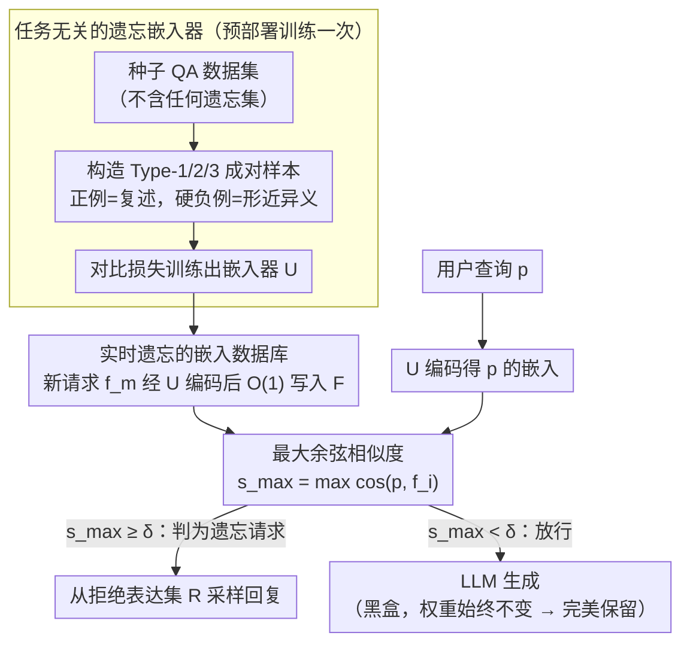

# CURaTE: Continual Unlearning in Real Time with Ensured Preservation of LLM Knowledge

**会议**: ACL 2026 Findings  
**arXiv**: [2604.14644](https://arxiv.org/abs/2604.14644)  
**代码**: [GitHub](https://github.com/bsu1313/CURaTE)  
**领域**: 信息检索  
**关键词**: 持续遗忘, 实时遗忘, 行为遗忘, 句子嵌入, 知识保留

## 一句话总结
CURaTE 提出一种基于句子嵌入匹配的行为遗忘框架：预部署时训练一个通用的遗忘嵌入器（不使用任何遗忘集），部署后实时将新遗忘请求嵌入存入数据库，推理时通过余弦相似度决定是回答还是拒绝，完全不修改 LLM 权重从而实现近乎完美的知识保留。

## 研究背景与动机

**领域现状**：LLM 遗忘方法主要包括梯度上升（GA）、梯度差分（GradDiff）、偏好优化（PO/NPO）等参数修改方法，以及 GUARD、O3、UniErase 等持续遗忘方法。

**现有痛点**：所有修改 LLM 权重的方法都面临灾难性遗忘——随着遗忘请求累积，模型在保留集上的性能急剧下降。此外，现有方法在处理遗忘请求时需要训练/优化过程，导致敏感信息在处理期间持续暴露。

**核心矛盾**：遗忘需要"改变模型行为"但修改权重必然导致"丢失其他知识"——这两个目标在参数空间中根本冲突。

**本文目标**：实现不修改 LLM 权重的实时持续遗忘，支持任意数量的连续遗忘请求而不降低模型效用。

**切入角度**：重新定义遗忘目标——从"参数遗忘"（擦除知识）放宽到"行为遗忘"（阻止输出被标记的信息），这打开了不修改权重的解决方案空间。

**核心 idea**：训练一个任务无关的句子嵌入器做语义相似度判断——查询与遗忘请求相似则拒绝回答，否则正常生成。

## 方法详解

### 整体框架
CURaTE 把"遗忘"从动模型权重彻底搬到了推理前的一道语义闸门上，整条流水线分两段。预部署阶段，它在一个与任何具体遗忘任务都无关的种子 QA 数据集上，用对比损失训练出一个句子嵌入器 $U$，让它学会判断"两句话是不是在问同一件事"。部署之后，每当来一个新的遗忘请求，系统只把它编码成向量塞进数据库 $F$，完全不碰 LLM；用户查询到达时，先算查询与 $F$ 中所有遗忘向量的最大余弦相似度，够像就直接拒答、不像才放行给 LLM 正常生成。整个回路里 LLM 始终是一个只读的黑盒。

### 关键设计

**1. 任务无关的遗忘嵌入器：用硬负例把"同义改写"和"形近异义"拉开**

行为遗忘成败全压在一个判断上——查询和某条遗忘请求到底是不是问同一件事，所以嵌入器必须同时扛住两种极端：既要把"换了措辞的复述变体"判为相似（否则换个说法就能绕过遗忘），又不能把"长得像但其实问别的"误判为相似（否则到处误拒）。CURaTE 的做法是从 Natural Questions 这类种子集里造三种成对样本来逼出这条决策边界：Type-1 是原始问题配它的复述，作正例；Type-2 是原始问题配一个词法相似但语义不同的对比问题，作硬负例；Type-3 是复述问题再配它的对比问题，作另一种硬负例。训练用对比损失 $\mathcal{L} = y \cdot d_U^2 + (1-y) \cdot \max(0, m-d_U)^2$，其中 $d_U$ 是两句嵌入的余弦距离、$m$ 是负例间隔——正例把距离压到 $0$，负例则被推到 $m$ 之外。关键在于这套数据完全不用任何真实遗忘集，学到的是通用的"是否同问"能力，所以训一次就能跨域复用，部署后再不用重训。

**2. 实时遗忘的嵌入数据库：把"生效一个遗忘请求"降成一次 $O(1)$ 写入**

参数遗忘的隐患不只在掉知识，还在"处理窗口"——一次梯度优化要跑几分钟到几小时，这段时间敏感信息照样能被问出来。CURaTE 直接把这个窗口压没了：遗忘请求 $f_m$ 一到，只需算出嵌入 $f_m^{emb} = U(f_m)$ 追加进集合 $F$，没有任何梯度、没有任何训练，是一次纯写入操作，请求落库即刻生效。推理时对用户查询 $p$ 算 $s_{max} = \max_{i} \cos(p^{emb}, f_i^{emb})$，一旦 $s_{max} \geq \delta$ 就从预定义的拒绝表达集 $R$ 里采一句回复挡回去，否则交给 LLM。阈值 $\delta$ 在这里是唯一的旋钮：松了遗忘不彻底，紧了误拒变多，而硬负例训练正是为了把这条边界训得够锐、让单一 $\delta$ 也能两头兼顾。

**3. 不碰权重换来近乎完美的知识保留：把灾难性遗忘从可能性里直接抹掉**

参数遗忘的根本瓶颈是灾难性遗忘——改权重必然牵连无关知识，遗忘请求越攒越多、保留集性能越掉越狠。CURaTE 绕开得最彻底：LLM 参数自始至终一个字节没动，所有跟遗忘无关的知识天然原样保留，灾难性遗忘在这套框架里根本不存在被触发的可能。代价是它换来了另一类、也是唯一一类风险——误拒，即把无关查询错判成遗忘请求，而这恰好又被设计 1 的硬负例训练按住了。于是"完美保留 + 可控误拒"成了行为遗忘相对参数遗忘的本质交换。

### 损失函数 / 训练策略
完整对比损失为 $\mathcal{L} = \frac{1}{2|T|}\sum [y \cdot d_U^2 + (1-y) \cdot \max(0, m-d_U)^2]$，以余弦距离为度量、在 $|T|$ 个样本对上取平均。训练只在种子数据集上做一次，部署后不再有任何训练或微调。

## 实验关键数据

### 主实验

| 方法 | 10阶段后遗忘效果 | 10阶段后知识保留 | 实时能力 |
|------|-----------------|-----------------|---------|
| GA | 有效但过度遗忘 | 严重下降（~0） | 否 |
| GradDiff | 过度遗忘 | 严重下降 | 否 |
| NPO | 中等 | 中等下降 | 否 |
| O3 | 遗忘不足 | 部分保留 | 否 |
| UniErase | 遗忘不足 | 部分保留 | 否 |
| CURaTE | 有效遗忘 | 近乎完美保留 | 是 |

### 消融实验

| 配置 | 关键指标 | 说明 |
|------|---------|------|
| 无硬负例训练 | 误拒率高 | 硬负例对决策边界精度至关重要 |
| 固定阈值 $\delta$ | 性能稳定 | 阈值对不同任务有一定敏感性 |
| 使用复述变体评估 | CURaTE 仍有效 | 嵌入器对复述具有鲁棒性 |

### 关键发现
- CURaTE 是唯一在 10 阶段持续遗忘后仍保持近乎完美知识保留的方法
- 参数遗忘方法（GA、GradDiff）在 3-5 阶段后就出现严重的效用崩溃
- 嵌入器在单一种子数据集上训练后可跨域迁移到完全不同的遗忘任务
- 对复述攻击（paraphrase）具有鲁棒性，这得益于训练中的正例对设计

## 亮点与洞察
- **"行为遗忘"概念的重定义**是关键贡献——将目标从"擦除知识"放宽到"阻止输出"，从根本上改变了解决方案空间
- 极其简单的方法（嵌入相似度+阈值判断）却取得最好效果，揭示了参数遗忘方法的过度复杂性
- 可以推广到任何需要"选择性拒绝"的场景——如版权保护、隐私保护、信息过滤

## 局限与展望
- 行为遗忘不是真正的知识擦除——知识仍存在于 LLM 权重中，可能通过间接提问绕过
- 阈值 $\delta$ 的选择是性能瓶颈，过松则遗忘不彻底，过紧则误拒增多
- 遗忘数据库 $F$ 随请求累积增长，大规模场景需要近似最近邻搜索
- 不适用于需要"真正擦除"知识的法规要求（如 GDPR 的被遗忘权）

## 相关工作与启发
- **vs GUARD**: GUARD 也训练分类器但每个遗忘集需重训，CURaTE 训练一次跨域通用
- **vs O3**: O3 训练正交 LoRA 适配器+OOD 检测器，仍修改参数，CURaTE 完全不碰权重
- **vs UniErase**: UniErase 用模型编辑注入遗忘 token，本质上仍是参数修改，灾难性遗忘不可避免

## 评分
- 新颖性: ⭐⭐⭐⭐ "行为遗忘"概念和极简方案设计新颖
- 实验充分度: ⭐⭐⭐⭐⭐ 四个 benchmark、10 阶段持续遗忘、多基线对比
- 写作质量: ⭐⭐⭐⭐ 动机清晰，方法描述直白易懂

<!-- RELATED:START -->

## 相关论文

- [\[ACL 2025\] Real-time Factuality Assessment from Adversarial Feedback](../../ACL2025/llm_safety/real-time_factuality_assessment_from_adversarial_feedback.md)
- [\[ACL 2026\] Representation-Guided Parameter-Efficient LLM Unlearning](representation-guided_parameter-efficient_llm_unlearning.md)
- [\[ACL 2026\] From Domains to Instances: Dual-Granularity Data Synthesis for LLM Unlearning](from_domains_to_instances_dual-granularity_data_synthesis_for_llm_unlearning.md)
- [\[ACL 2026\] TrajGuard: Streaming Hidden-state Trajectory Detection for Decoding-time Jailbreak Defense](trajguard_streaming_hidden-state_trajectory_detection_for_decoding-time_jailbrea.md)
- [\[ACL 2026\] Red-Bandit: Test-Time Adaptation for LLM Red-Teaming via Bandit-Guided LoRA Experts](red-bandit_test-time_adaptation_for_llm_red-teaming_via_bandit-guided_lora_exper.md)

<!-- RELATED:END -->
