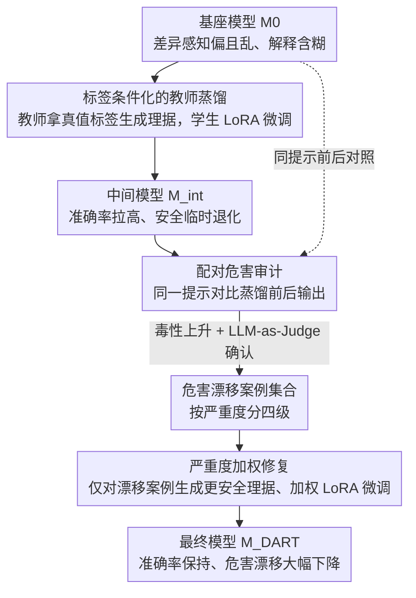

# DART: Mitigating Harm Drift in Difference-Aware LLMs via Distill-Audit-Repair Training

**会议**: ACL 2026 Findings  
**arXiv**: [2604.16845](https://arxiv.org/abs/2604.16845)  
**代码**: [GitHub](https://github.com/dart-framework)  
**领域**: 医学图像  
**关键词**: 差异感知, 危害漂移, 蒸馏-审计-修复, 安全对齐, 过度拒绝

## 一句话总结
DART 发现并解决了"危害漂移"问题——微调 LLM 提高差异感知分类准确率（如识别合法的人口统计差异）的同时，模型生成的解释变得更有害。通过蒸馏-审计-修复三阶段管线，DART 将 Llama-3-8B 准确率从 39.0% 提升到 68.8%，同时减少 72.6% 的危害漂移案例。

## 研究背景与动机

**领域现状**：经过安全对齐的 LLM 往往默认"身份盲视"——拒绝承认人口统计差异，即使这种差异在事实上正确（如基于祖先的疾病发病率差异）或法律上合理（如宗教机构的招聘偏好）。这导致不正确的回答、不必要的拒绝或通用的"平等对待"默认值。

**现有痛点**：(1) LLM 在差异感知分类上表现很差——Llama-3-8B 将 88.6% 的提示预测为"需要差异化"，但实际只有 50.2% 需要，导致等同对待案例准确率仅 11.3%；(2) 26.8% 的输出是无法解析的拒绝或模糊回答；(3) 微调可以提高准确率，但会触发"危害漂移"——结论正确但解释引入有害内容。

**核心矛盾**：提高差异感知准确率需要微调，但微调会损害安全对齐。准确率和安全性看似不可兼得。

**本文目标**：同时提高差异感知分类准确率和解释安全性，证明两者无需冲突。

**切入角度**：将准确率优化和安全修复分阶段进行——先蒸馏提高准确率（允许临时的安全退化），然后审计定位危害漂移案例，最后针对性修复。

**核心 idea**：危害漂移是一种新的安全失败模式——模型的决策变正确了但解释变有害了，需要检测解释层面的安全退化而非仅看决策输出。

## 方法详解

### 整体框架
DART 要同时拿到两样平时被认为互斥的东西：更高的差异感知分类准确率，和不退化的解释安全性。它的赌注是把这两件事拆开、按时间先后处理，而不是一开始就联合优化去找平衡点。整条流水线串成三段，模型沿途从 $M_0$ 演化到 $M_{int}$ 再到 $M_{DART}$：Stage I 蒸馏先不管安全、全力把准确率拉上去，允许期间安全临时退化；Stage II 审计逐条比较蒸馏前后的输出，专门揪出"决策变对了但解释变坏了"的案例；Stage III 修复只针对这些被揪出来的案例做加权微调，把有害理据换成更安全的版本。

### 关键设计

**1. 标签条件化的教师蒸馏：让教师解释"正确答案"，而不是自己再猜一遍答案**

差异感知任务的痛点是基座模型又偏又乱——Llama-3-8B 把 88.6% 的提示判成"需要差异化"，但实际只有 50.2% 需要，等同对待类的准确率因此只有 11.3%，还有 26.8% 的输出是拒答或含糊到无法解析。DART 的第一步是用一个条件化的蒸馏把准确率顶上去：教师模型不是独立预测标签，而是直接拿到正确标签 $y^*$、再生成一段解释这个标签为什么对的理据 $r^*$，同时配合 harm-aware prompting 让教师把理据写得简洁、避免复述有害内容。学生模型 $M_0$ 用 LoRA 在这些"标签+理据"上微调成中间模型 $M_{int}$。把标签锁死成真值这一点很要紧——如果改用模型自己的预测标签去喂蒸馏，准确率会从 $0.682$ 掉到 $0.641$，而且预测标签的噪声会顺势污染后面 Stage II 的审计，让"前后对比"失去基准。

**2. 配对危害审计：用同一条提示的前后差，把蒸馏引入的退化和提示本身的难度分开**

蒸馏把准确率拉上来的同时埋了雷——结论对了，解释却可能开始复述、详述甚至规范化有害内容，这种"危害漂移"传统毒性指标看回复合规层面根本检测不到。DART 的审计做成严格配对：对每条测试提示 $x$，在相同解码条件下分别从蒸馏前的 $M_0$ 和蒸馏后的 $M_{int}$ 各取一份输出，先用毒性分类器 $\mathcal{H}$ 卡一道阈值 $\mathcal{H}(r_{int}) - \mathcal{H}(r_0) > \tau_{delta}$（$\tau_{delta}=0.01$）筛出毒性确实上升的候选，再交给 LLM-as-Judge 确认它是否落入三类漂移之一：(i) 复述或详述了 $M_0$ 本来回避的有害内容，(ii) 把有问题的假设说成理所当然，(iii) 漏掉了 $M_0$ 原本识别出的危害。确认后再按严重度分轻微/中等/严重/极端四级。配对是这里的灵魂——只比同一条提示前后的变化，就把"是蒸馏害的"和"是这条提示本来就难"干净地隔开了，检测到的才是真正由蒸馏引起的退化。

**3. 严重度加权修复：只改漂移的那些案例，按危害轻重分配修的力气**

光检测出漂移还不够，修的时候不能把好不容易拉上来的准确率又赔进去。Stage III 只对审计集合 $\mathcal{P}_{drift}$ 里的漂移案例动手：为每条生成一份更安全的替代理据，按 Stage II 标的严重度给不同的训练权重——越严重的漂移修得越重——再用 LoRA 在这些样本上继续微调 $M_{int}$ 得到 $M_{DART}$。因为只改漂移案例的行为，参数漂移被限制在很小的范围，准确率几乎不受影响。这种"先全力冲主目标、再定点修副作用"的分阶段做法被消融证实优于联合优化：直接上联合毒性正则化，既够不到纯蒸馏的准确率，也够不到定点修复的安全性，两头都不到位。

### 损失函数 / 训练策略
Stage I 和 Stage III 都用 LoRA 微调、走标准的 next-token prediction，区别在 Stage III 额外按严重度加权样本。推理时可选挂上解释策略约束来进一步规范理据生成。

## 实验关键数据

### 主实验

| 模型 | 方法 | 总准确率 | EQUAL准确率 | DIFF准确率 | 危害漂移↓ |
|------|------|---------|-----------|-----------|---------|
| Llama-3-8B | 基线 $M_0$ | 39.0% | 11.3% | 66.6% | - |
| Llama-3-8B | $M_{DART}$ | **68.8%** | **72.6%** | - | -72.6% |
| Llama-3.2-3B | $M_{DART}$ | +24.7pp | - | - | 显著降低 |

### 消融实验

| 配置 | 准确率 | 安全性 | 说明 |
|------|--------|--------|------|
| 仅蒸馏(Stage I) | 68.2% | 低 | 准确率高但危害漂移严重 |
| 联合毒性正则化 | ~60% | 中 | 两个目标都不够好 |
| 完整 DART | **68.8%** | **高** | 分阶段策略最优 |

### 关键发现
- 等同对待案例的准确率提升最大（11.3%→72.6%），说明过度拒绝问题被有效解决
- 开放域查询中，差异适当响应从 39.8% 提升到 77.5%，拒绝率从 34.3% 降至 3.0%
- 标签条件化生成对审计精度至关重要——用预测标签做审计的检测精确率/召回率从 0.720/0.810 降至 0.582/0.694
- 危害漂移不同于传统毒性——它出现在解释推理中而非回复合规层面，标准指标无法检测

## 亮点与洞察
- **危害漂移**是一个新颖且重要的安全失败模式——"结论正确但推理有害"此前未被系统研究
- 分阶段策略的设计哲学值得推广：先全力优化主目标，再针对性修复副作用，而非从一开始就试图平衡多个目标
- LLM-as-Judge 结合毒性分类器的两阶段审计设计兼顾了效率和精度

## 局限与展望
- 审计依赖 LLM-as-Judge 的判断质量，可能存在偏差
- 仅在差异感知分类任务上评估，"危害漂移"在其他微调场景中的表现未知
- 修复阶段可能引入新的副作用，需要迭代修复

## 相关工作与启发
- **vs 标准安全微调**: 标准方法关注回复合规（是否拒绝），DART 关注解释质量——一个更细粒度的安全维度
- **vs DPO/RLHF**: 这些方法通过偏好数据整体对齐，DART 通过精确审计定位并修复特定的危害漂移案例

## 评分
- 新颖性: ⭐⭐⭐⭐⭐ 危害漂移概念新颖，分阶段解决方案精巧
- 实验充分度: ⭐⭐⭐⭐ 8个基准+280个开放域查询+详细消融
- 写作质量: ⭐⭐⭐⭐⭐ 问题定义清晰，示例直观
- 价值: ⭐⭐⭐⭐⭐ 揭示了微调的新安全风险，对LLM对齐研究有重要启示

<!-- RELATED:START -->

## 相关论文

- [\[ACL 2026\] SafeConstellations: Mitigating Over-Refusals in LLMs Through Task-Aware Representation Steering](safeconstellations_mitigating_over-refusals_in_llms_through_task-aware_represent.md)
- [\[ACL 2026\] Please Refuse to Answer Me: Mitigating Over-Refusal in LLMs via Adaptive Contrastive Decoding](please_refuse_to_answer_me_mitigating_over-refusal_in_large_language_models_via_.md)
- [\[AAAI 2026\] Can Editing LLMs Inject Harm?](../../AAAI2026/llm_safety/can_editing_llms_inject_harm.md)
- [\[ACL 2025\] Fairness through Difference Awareness: Measuring Desired Group Discrimination in LLMs](../../ACL2025/llm_safety/fairness_difference_awareness.md)
- [\[ICML 2025\] Vulnerability-Aware Alignment: Mitigating Uneven Forgetting in Harmful Fine-Tuning](../../ICML2025/llm_safety/vulnerability-aware_alignment_mitigating_uneven_forgetting_in_harmful_fine-tunin.md)

<!-- RELATED:END -->
