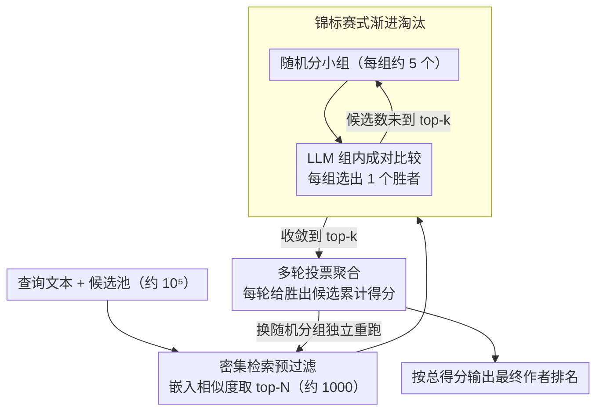

# De-Anonymization at Scale via Tournament-Style Attribution

**会议**: ACL 2026  
**arXiv**: [2601.12407](https://arxiv.org/abs/2601.12407)  
**代码**: 无  
**领域**: AI 安全 / 隐私  
**关键词**: 作者归因, 去匿名化, LLM隐私威胁, 锦标赛式匹配, 同行评审

## 一句话总结

本文提出 DAS（De-Anonymization at Scale），一种基于 LLM 的大规模作者去匿名化方法，采用锦标赛式淘汰策略+密集检索预过滤+多轮投票聚合，可在数万候选文本中进行作者匹配，揭示了 LLM 对匿名平台（如双盲评审）的隐私威胁。

## 研究背景与动机

**领域现状**：传统作者归因（AA）在封闭集小规模场景下研究——给定少量候选作者和标注样本，训练分类器进行归因。但现实匿名系统（如学术同行评审）可能有数万候选者且无标注数据。

**现有痛点**：(1) 传统方法在大规模场景下不可行——需要为每个候选者构建作者画像；(2) 近期用 GPT-3/4 进行作者归因的工作仍局限于小规模候选集；(3) LLM 的文本分析能力可能使大规模去匿名化成为现实威胁。

**核心矛盾**：匿名系统（如双盲评审、举报人论坛）依赖身份隐藏来保护公正和安全，但 LLM 可能通过分析写作模式、领域专长等信号识别匿名作者。

**本文目标**：开发一种可在数万候选文本池中实用运行的 LLM 作者匹配方法，并评估其对匿名系统的威胁程度。

**切入角度**：将大规模作者匹配建模为锦标赛式淘汰赛——将候选者随机分组，LLM 在每组中选出最可能的匹配，胜出者进入下一轮，最终产生排名。

**核心 idea**：渐进淘汰 + 密集检索预过滤 + 多轮投票聚合 = 在受限 token 预算下实现大规模去匿名化。

## 方法详解

### 整体框架
DAS 要解决的是一个传统作者归因够不着的场景：候选作者可能有数万人、且没有任何标注样本，而 LLM 的上下文窗口又塞不下这么多候选。它的破局思路是把"从数万候选里找出真作者"这个一对多难题，拆成"检索先粗筛、锦标赛再细比、投票最后定"三道接力。先用密集检索把 $10^5$ 级的候选池压到 $10^3$ 级，再让 LLM 在小分组里反复淘汰、逐轮收缩到 top-k，最后多次独立重跑、按胜出次数聚合出稳定排名。三道工序层层把搜索空间和不确定性往下压。

### 关键设计

**1. 密集检索预过滤：先把搜索空间砍到 LLM 拿得动的量级**

让 LLM 从 $10^5$ 级候选起步根本不现实——光是把每个候选过一遍组比较就烧不起。DAS 在锦标赛之前先架一道纯向量的粗筛：用嵌入模型把查询和全部候选都编码，按向量相似度检索出 top-$N$（如 1000）个最像的，只把这一千个喂给后面的锦标赛。这一刀把 $10^5$ 级直接削到 $10^3$ 级，让后续的 LLM 比较第一次变得可行；而且它不只是省钱的手段——把明显不像的候选提前剔掉，等于给锦标赛喂了更干净的输入，反过来抬高了最终匹配质量。

**2. 锦标赛式渐进淘汰：把一对多匹配拆成一串小规模分组比较**

即便粗筛到上千个候选，LLM 的上下文窗口仍装不下它们同时比，硬塞既超预算又比不准。DAS 借用淘汰赛的结构：把候选随机分成固定大小的小组（如每组 5 个），让 LLM 在一组里把查询文本和这 5 个候选逐一对照、只选出最可能的那一个；胜者再和别的胜者重新分组、再比，如此一轮轮收缩直到收敛出 top-k。每轮只需做一批组内的小比较，候选规模大致按组大小的比例逐轮衰减，把原本线性扫描上千候选的代价压到对数级的轮数，单次比较也始终落在 token 预算内。

**3. 多轮投票聚合：用重复重跑摊平单次随机分组的运气**

单跑一次锦标赛有个隐患：候选是随机分组的，真作者要是恰好被分进一个高手云集的组，可能第一轮就被误淘汰，排名带着这种分组偏差。DAS 的对策是把整个锦标赛独立重跑多次、每次换一套随机分组，每次给胜出的候选记分，最后把所有轮次的分数聚合成最终排名。能在五花八门的分组里反复胜出的候选自然分高、排名靠前，偶然胜出的则被摊薄，排名的稳定性和精度都随之上去。

### 一个完整示例：从十万候选锁定一位匿名评审

设要从某会议 $10^5$ 量级的潜在作者里，反查一篇匿名评审意见出自谁手。第一步密集检索把这十万人按写作风格相似度粗筛到 top-1000，真作者通常落在这一千里。第二步锦标赛接手：1000 个候选按每组 5 个随机分组，LLM 在每组里挑出最像的一个，一轮过后约剩 200，再分组剩约 40，再剩约 8，几轮就收敛到 top-k 的小名单。第三步把上述检索+锦标赛整体独立重跑若干次、每次换随机分组，对每个候选累计胜出得分；某位作者若在多数轮次都稳定杀进决赛圈，聚合后就排到榜首，最终被指认为该匿名意见的作者。

### 损失函数 / 训练策略
DAS 是无训练的推理时方法，不更新任何权重，全部能力来自 LLM 的文本分析，核心计算就是一次次成对比较的提示调用。

## 实验关键数据

### 主实验

**匿名评审数据上的去匿名化表现**

| 场景 | 候选池大小 | DAS 准确率 | 随机基线 |
|------|-----------|----------|---------|
| 同行评审 | 数千 | 远高于随机 | ~0.01% |
| Enron 邮件 | 标准基准 | 优于先前方法 | - |
| 博客文章 | 大规模 | 优于先前方法 | - |

### 消融实验

| 组件 | 去除后效果 | 说明 |
|------|----------|------|
| 密集检索预过滤 | 无法运行 | 候选池太大 |
| 多轮投票 | 准确率下降 | 单轮不稳定 |
| 锦标赛淘汰 | 准确率下降 | 需要渐进比较 |

### 关键发现

- DAS 在数千候选的匿名评审数据中成功识别同作者文本，准确率远高于随机
- 在标准基准（Enron、博客）上超越先前直接 LLM 提示的方法
- 多轮投票显著提升排名精度和稳定性
- 密集检索预过滤不仅是效率手段，还通过缩小候选池提高了后续匹配质量

## 亮点与洞察

- 揭示了一个严肃的隐私威胁——LLM 使大规模去匿名化变得实际可行
- 锦标赛式设计优雅地解决了大规模一对多匹配的计算瓶颈
- 方法论具有通用性——可应用于任何需要从大候选池中找到匹配的文本归因场景

## 局限与展望

- 准确率虽高于随机但仍有限，特定场景下可能不足以构成实际威胁
- 密集检索的召回质量可能限制最终准确率
- 作为潜在隐私攻击工具，需要配套的防御措施和伦理讨论
- 对风格相似的作者（如同一实验室成员）可能区分能力有限

## 相关工作与启发

- **vs Huang et al. (2024a)**: 先前工作用 GPT 进行小规模归因，DAS 扩展到数万级别
- **vs 传统 AA**: 传统方法需要标注数据和小候选集，DAS 完全零样本且大规模
- **vs 文体计量学**: DAS 利用 LLM 的隐式文体分析能力，无需显式特征工程

## 评分

- 新颖性: ⭐⭐⭐⭐ 锦标赛式大规模归因设计新颖，隐私威胁视角重要
- 实验充分度: ⭐⭐⭐⭐ 真实评审数据+标准基准，但匿名评审实验的规模可以更大
- 写作质量: ⭐⭐⭐⭐ 动机清晰，方法描述系统
- 价值: ⭐⭐⭐⭐ 对匿名系统的安全性评估有实际意义

<!-- RELATED:START -->

## 相关论文

- [\[ICML 2026\] From Weak Cues to Real Identities: Evaluating Inference-Driven De-Anonymization in LLM Agents](../../ICML2026/llm_safety/from_weak_cues_to_real_identities_evaluating_inference-driven_de-anonymization_i.md)
- [\[ACL 2026\] ForgeryTalker: Generating Attribution Reports for Manipulated Facial Images](generating_attribution_reports_for_manipulated_facial_images_a_dataset_and_basel.md)
- [\[ACL 2026\] Subject-level Inference for Realistic Text Anonymization Evaluation](subject-level_inference_for_realistic_text_anonymization_evaluation.md)
- [\[ACL 2026\] Adaptive Text Anonymization: Learning Privacy-Utility Trade-offs via Prompt Optimization](adaptive_text_anonymization_learning_privacy-utility_trade-offs_via_prompt_optim.md)
- [\[ACL 2026\] Look Twice before You Leap: A Rational Framework for Localized Adversarial Anonymization](look_twice_before_you_leap_a_rational_framework_for_localized_adversarial_anonym.md)

<!-- RELATED:END -->
