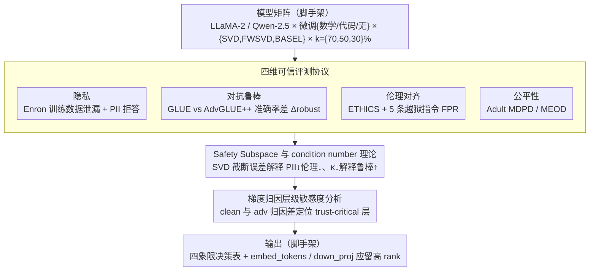

# Decomposed Trust: Privacy, Adversarial Robustness, Ethics, and Fairness in Low-Rank LLMs

**会议**: ACL 2026 (Findings)  
**arXiv**: [2511.22099](https://arxiv.org/abs/2511.22099)  
**代码**: 待确认  
**领域**: LLM 安全 / 模型压缩 / 可信 AI  
**关键词**: 低秩分解、PII 泄漏、对抗鲁棒、伦理对齐、公平性、层级归因

## 一句话总结
首篇系统评估**低秩分解 (SVD/FWSVD/BASEL)** 对 LLM 可信性影响的研究，发现"训练数据隐私 ↑、对抗鲁棒 ↑、PII 防护 ↓、伦理对齐 ↓、公平性 ↓"的非对称 trade-off，并用梯度归因把对抗脆弱性定位到 `embed_tokens` 与 `down_proj` 两个子层。

## 研究背景与动机
**领域现状**：量化 (GPTQ) 和剪枝 (Wanda) 之外，低秩分解（SVD → FWSVD → BASEL → IMPACT）正成为主流 LLM 压缩路线，能在保持 benign accuracy 的同时大幅降显存、提吞吐。Hong et al. (2024, ICML) 已研究量化/剪枝对可信性的影响，但低秩分解空白。

**现有痛点**：业界把低秩压缩当"无副作用的瘦身术"在边缘部署 LLM，但没人系统问过 —— 压缩后模型还能不能拒答 PII？还能不能识别非伦理 prompt？还能不能保持公平？这条空白链路在医疗、金融等高敏感场景里是合规级风险。

**核心矛盾**：低秩分解会**截断奇异值子空间**，而 Arditi et al. (2024) 已证明 LLM 的 "safety subspace（refusal direction）" 就藏在这些被截掉的方向里——压缩越狠，refusal vector 越无法重构，安全机制就被悄悄削掉，但 benign accuracy 看不出来。

**本文目标**：(1) 在 4 个可信维度（privacy / adversarial robustness / ethics / fairness）系统量化低秩压缩的影响；(2) 进一步拆解 model scale × fine-tuning × 压缩方法 的交互；(3) 用梯度归因定位"对抗鲁棒由哪些层决定"，为未来压缩算法提供"哪些层不能动"的指导。

**切入角度**：选 LLaMA-2 (7B/13B, Base/Chat) + Qwen-2.5 (7B/14B) 为基底，3 种低秩方法 (SVD / FWSVD / BASEL) × 3 种压缩率 (k%=70/50/30)，与 4 类可信数据集 (Enron / GLUE+AdvGLUE++ / ETHICS / Adult) 做完整正交评测。

**核心 idea**：把"可信性"拆成四象限独立评估，发现低秩压缩**不是统一变差**而是有方向性变化，并通过 SVD safety subspace 理论 + condition number 理论给出严谨解释。

## 方法详解

### 整体框架
本文是评估 + 解释性研究，pipeline 为：① **设定模型矩阵**——LLaMA-2 Base/Chat (7B/13B) 与 Qwen-2.5 (7B/14B)，每个模型 × {fine-tune 数学、fine-tune 代码、不 fine-tune} × {SVD, FWSVD, BASEL} × {k=70%, 50%, 30%}；② **可信评测**——四个维度独立测：Enron Email (training-data leakage 5 指标) + Enron PII (zero-shot / few-shot protected / few-shot attack 三场景 leakage&reject) + GLUE/AdvGLUE++ on SST-2/QQP/MNLI (accuracy drop $\Delta_{\text{robust}}$) + ETHICS commonsense (zero/few-shot acc + FPR under 5 jailbreak instructions) + UCI Adult (MDPD / MEOD on race/sex/age)；③ **理论解释**——用 SVD 的 safety subspace、condition number、capacity-memorization 三套理论分别解释 PII↓ ethics↓、对抗鲁棒↑、training-data privacy↑ 的成因；④ **层级归因**——用 first-order Taylor 把每层贡献量化为 $a_i = \|(\partial \ell / \partial \mathbf{h}_i) \mathbf{h}_i\|_2$，用 clean vs adversarial 的 $\Delta_i = |a_i^{\text{clean}} - a_i^{\text{adv}}|$ 找出对鲁棒性最关键的层。

### 关键设计

**1. 四维可信评测协议：把"可信性"拆成四象限独立测，不让 overall accuracy 一刀切**

如果只看一个聚合指标，"PII 泄漏增加但 training-data 泄漏下降"这种方向相反的 trade-off 会被直接抹平，部署方根本看不出风险藏在哪。本文因此把可信性拆成 privacy（training-data + PII 两子项）、adversarial robustness、ethics（standard + jailbreaking 两子项）、fairness 四个象限，每个维度都挂上业内标准 dataset 和标准 metric：Privacy 用 Enron 邮件，context length 取 $L \in \{50,100,200\}$，5 个指标涵盖 leakage rate 与 reject rate；Adversarial 用 GLUE 与 AdvGLUE++ 的 accuracy 差 $\Delta_{\text{robust}}$；Ethics 用 ETHICS commonsense，再叠 5 条 jailbreak 指令测 FPR；Fairness 用 Adult 数据的 MDPD/MEOD。最后再交叉 zero-shot 与 few-shot 双 prompt 设置。正是这种分维度评测，才能凝练出 Table 2 那张可操作的"✓✗ 决策表"，告诉 engineer 低秩压缩究竟适合、不适合做什么。

**2. Safety Subspace 与 condition number 理论：把实验现象升华成可证的因果**

光报告"压缩后 PII 变差、对抗变好"会被批成 benchmark 大杂烩，所以本文给三条观察各配一条数学解释。对每个权重矩阵 $\mathbf{W} = \mathbf{U} \mathbf{\Sigma} \mathbf{V}^\top$，refusal vector $\mathbf{v} = \sum_{k=1}^r \lambda_k \mathbf{u}_k$ 横跨完整奇异子空间；一旦压到 $r' < r$，被截掉的方向带来不可消除的重构误差

$$\|\mathbf{v} - \hat{\mathbf{v}}\|_2^2 = \sum_{k=r'+1}^r \lambda_k^2,$$

压得越狠，refusal 方向越重构不回来，PII 防护和伦理对齐就被悄悄削掉。对抗鲁棒则由 condition number $\kappa(\mathbf{W}) = s_{\max}/s_{\min}$ 主导——低秩分解恰好扔掉最小的那些奇异值，$s_{\min}$ 被抬高、$\kappa$ 随之变小，模型对扰动反而更稳。training-data 隐私走的是容量路线：截子空间等价于减容量，记忆能力下降，训练邮件的泄漏也跟着减少。三条理论分别咬合三条实验现象，同时把 Arditi et al. 的 safety subspace 这一最新可解释性发现引进了压缩算法的设计语境。

**3. 梯度归因层级敏感度分析：定位"对抗鲁棒到底由哪些层决定"**

现有低秩方法（ASVD/AMC）按 benign reconstruction error 来分配 rank，但这套准则可能"误伤"真正承载安全的层，本文要把这些层揪出来。做法是用一阶 Taylor 把第 $i$ 层的贡献量化为 $a_i = \|(\partial \ell / \partial \mathbf{h}_i) \mathbf{h}_i\|_2$，对每个样本分别在 clean 和 adversarial 输入下各算一份，再取差 $\Delta_i = |a_i^{\text{clean}} - a_i^{\text{adv}}|$ 当作"信任敏感度"。在 SST-2/QQP/MNLI 三任务 × LLaMA-2 8 个变体上跑完层 ranking 后，`embed_tokens` 与 `down_proj` 稳定排在最前——它们才是 trust-critical 层，未来的 trust-aware compression 应当给这两层留更高的 rank，而非一视同仁地压。

### 损失函数 / 训练策略
评估论文，不训练新模型；微调用 GSM8K (math) 和 HumanEval-style (code) 标准 dataset；低秩压缩用各方法原始 paper 的实现，仅控压缩率 $k\%$；归因实验用一阶 Taylor，无需训练。

## 实验关键数据

### 主实验

低秩压缩 LLaMA-2 Base 13B (k=70%) vs 原始模型，四维可信指标变化：

| 维度 | 指标 | Base 13B | BASEL-70 | FWSVD-70 | SVD-70 | 方向 |
|------|------|----------|----------|----------|---------|------|
| Training-data privacy | leakage @ L=200 (%↓) | 3.99 | **0.00** | 0.79 | 0.11 | ✓ 都好 |
| PII (zero-shot) | leakage (%↓) | 2.42 | 0.00 | 0.00 | 0.00 | (拒答) |
| PII (zero-shot) | **leakage 实际** (%↓) | 5.67 | 42.00 | 26.25 | 47.25 | ✗ 全坏 |
| PII (few-shot protected) | leakage (%↓) | 3.33 | 21.42 | 13.25 | 23.63 | ✗ 全坏 |
| Adv. robustness SST-2 | acc drop (%↓) | 18.78 | **3.48** | 15.39 | 17.32 | ✓ BASEL 好 |
| Adv. robustness QQP | acc drop (%↓) | 37.51 | **5.63** | 5.57 | 16.42 | ✓ 都好 |
| Ethics zero-shot | accuracy (%↑) | 52.92 | 38.45 | 37.80 | 41.87 | ✗ 全坏 |
| Ethics few-shot | accuracy (%↑) | 63.11 | 60.36 | **77.15** | 64.77 | ≈ 缓解 |
| Fairness | MDPD (%↓) | 0.01 | - | - | 2.00 | ✗ 全坏 |

**结论**：四维方向是 ✓✗✓✗✗——训练数据隐私和对抗鲁棒受益，PII 防护、伦理对齐、公平性全部恶化。

### 消融实验

压缩率 $k\%$ 与可信性的关系（LLaMA-2 Base 13B + BASEL）：

| 指标 | k=70% | k=50% | k=30% | 趋势 |
|------|--------|--------|--------|------|
| Training-data leakage (%↓) | 0.0017 | 0.0300 | - | 持续低 |
| PII zero-shot leakage (%↓) | 42.00 | 42.42 | - | 高位稳定 |
| Adv. SST-2 drop (%↓) | 3.48 | 13.46 | -0.61 | 非单调 |
| Ethics zero-shot acc (%↑) | 38.45 | 13.47 | 7.48 | 快速崩盘 |
| Fairness MDPD (%↓) | - | 0.02 | 8.33 | 30% 时崩 |

Jailbreak FPR (fine-tuning 影响)：

| 模型 | FPR (%↓) | 模型 | FPR (%↓) |
|------|----------|------|----------|
| Base 7B | 10.20 | Chat 7B | 45.10 |
| Math Base 7B | **91.80** | Math Chat 7B | **99.40** |
| Prog Base 7B | 32.20 | Prog Chat 7B | 89.90 |

→ 数学 fine-tuning 把 7B Base 的 jailbreak FPR 从 10.20% 推到 91.80%，**任务微调几乎完全摧毁安全对齐**。

### 关键发现
- **PII vs training-data privacy 方向相反**：压缩同时降低记忆容量（少漏训练邮件）却也削弱了 refusal subspace（多漏对话 PII），单一"privacy"标签不足以描述风险。
- **k% 与 ethics 严重非线性**：BASEL 从 k=70 (38.45%) → k=50 (13.47%) → k=30 (7.48%)，伦理 accuracy 几乎崩盘到随机；说明高压缩比下伦理对齐机制被彻底破坏。
- **Math fine-tuning 是最危险微调**：把 LLaMA-2 Base 7B 的 jailbreak FPR 从 10.20% 拉到 91.80%，比 programming fine-tuning 还危险，可能因 math task 几乎不含 refusal 样本而稀释了安全分布。
- **`embed_tokens` 和 `down_proj` 是 trust-critical 层**：在所有 8 种 LLaMA-2 变体上，归因 ranking 第一名永远是 `embed_tokens`，第二/三名永远在 `down_proj` 附近——未来压缩算法应给这两层留更高 rank。

## 亮点与洞察
- **"四象限决策表"是核心 takeaway**：Table 2 用极简的 ✓✗ 表把整篇研究压缩成 5 行，是部署 engineer 可以直接用的"低秩压缩适合 / 不适合做什么"checklist。
- **safety subspace 理论 + 实验联动**很优雅：从 Arditi et al. 的 single-direction refusal 假设 → SVD 截断误差公式 → PII/ethics 恶化实验，三步因果链构造严密。
- **归因方法可复用**：$a_i = \|(\partial \ell / \partial \mathbf{h}_i) \mathbf{h}_i\|_2$ 是 first-order Taylor 的标准做法，但用 clean vs adv 取差来定义 "trust sensitivity" 是新颖应用，可扩展到其他可信维度（如 fairness 归因）。
- **同时覆盖 LLaMA-2 + Qwen-2.5 两族**：用架构差异（不同 tokenizer、不同 pretrain mix）来证明结论不是单一模型 artifact，提升 finding 的可信度。

## 局限与展望
- **未测 instruction-tuned 模型 + RLHF**：作者只压 Base 模型，Chat 模型未直接低秩压缩，因此"压缩对 RLHF 安全对齐影响多大"仍未解。
- **只看 commonsense morality**：ETHICS 还有 deontology / justice / utilitarianism / virtue 四子集没测，结论无法外推到这些更复杂的道德推理。
- **理论解释偏定性**：safety subspace 论证假设了 "refusal 由 single direction 主导"，但实际多 turn 安全对话可能是多 subspace 联合编码；推导只到不等式层面，没给可优化的 trust-aware compression objective。
- **未提出新算法**：本文只 diagnose 不 fix，下一步自然是"基于归因结果设计 trust-aware compression"（如对 `embed_tokens` 和 `down_proj` 自适应分配更高 rank），论文只在 conclusion 一笔带过。

## 相关工作与启发
- **vs Hong et al. (2024, ICML) Decoding Compressed Trust**：他们测的是 quantization (GPTQ) 和 pruning (Wanda)，本文是 low-rank factorization；两者结论形成互补——quantization/pruning 在 PII 上反而更好，但 low-rank 在对抗鲁棒上明显胜出。
- **vs DecodingTrust (Wang et al. 2023)**：DecodingTrust 是评测协议的源头，本文把它从 GPT 系列扩展到了 open-source 压缩模型。
- **vs Arditi et al. (2024, NeurIPS) Single-Direction Refusal**：本文把那篇的"safety direction"理论搬到压缩场景，给出 SVD 截断 → safety 被截 的直接因果。
- **启发**：任何"压缩 + 部署"项目都应该把 trust 评测协议作为 CI gate（连同 benign accuracy 一起测），否则边缘部署 LLM 在金融/医疗会埋雷。

## 评分
- 新颖性: ⭐⭐⭐⭐ 首篇 low-rank trust 系统评测 + safety subspace 理论解释组合，填补了 Hong et al. 量化/剪枝研究的明显空缺
- 实验充分度: ⭐⭐⭐⭐⭐ 2 模型族 × 3 压缩方法 × 3 压缩率 × 4 可信维度 × 2 prompt 设置 + 8 模型变体归因 + 5 jailbreak 指令，矩阵几乎全覆盖
- 写作质量: ⭐⭐⭐⭐ Table 2 决策表 + 理论 appendix 都精炼；附录公式推导和归因表格清晰
- 价值: ⭐⭐⭐⭐ 对工业界部署低秩压缩 LLM 是直接合规级风险警示；归因结论可指导下一代 "trust-aware compression" 算法

<!-- RELATED:START -->

## 相关论文

- [\[NeurIPS 2025\] On the Robustness of Verbal Confidence of LLMs in Adversarial Attacks](../../NeurIPS2025/llm_safety/on_the_robustness_of_verbal_confidence_of_llms_in_adversarial_attacks.md)
- [\[NeurIPS 2025\] Demystifying Language Model Forgetting with Low-Rank Example Associations](../../NeurIPS2025/llm_safety/demystifying_language_model_forgetting_with_low-rank_example_associations.md)
- [\[ACL 2026\] Evaluating Answer Leakage Robustness of LLM Tutors against Adversarial Student Attacks](evaluating_answer_leakage_robustness_of_llm_tutors_against_adversarial_student_a.md)
- [\[ACL 2026\] Can Persona-Prompted LLMs Emulate Subgroup Values? An Empirical Analysis of Generalisability and Fairness in Cultural Alignment](can_persona-prompted_llms_emulate_subgroup_values_an_empirical_analysis_of_gener.md)
- [\[NeurIPS 2025\] Differentially Private Federated Low Rank Adaptation Beyond Fixed-Matrix](../../NeurIPS2025/llm_safety/differentially_private_federated_low_rank_adaptation_beyond_fixed-matrix.md)

<!-- RELATED:END -->
