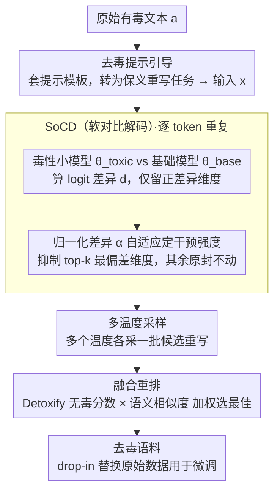

# Detoxification for LLM from Dataset Itself

**会议**: ACL 2026  
**arXiv**: [2604.19124](https://arxiv.org/abs/2604.19124)  
**代码**: [GitHub](https://github.com/)  
**领域**: LLM/NLP  
**关键词**: 数据级去毒, 对比解码, 语义保留, 预训练语料清洗, 毒性缓解

## 一句话总结

本文提出 HSPD（层次化语义保留去毒）流水线，通过 SoCD（软对比解码）引导 LLM 定位并重写原始语料中的有毒片段，同时保留语义，生成可直接替换原始数据用于微调的去毒语料——在 GPT2-XL 上将毒性概率从 0.42 降至 0.18，在 LLaMA2-7B、OPT-6.7B 和 Falcon-7B 上也取得了最优去毒效果。

## 研究背景与动机

**领域现状**：LLM 从互联网数据中学习，不可避免地吸收有毒内容。现有去毒方法主要在后训练阶段（微调/RLHF）或推理时（受控解码）操作，但无法从根本上阻止模型在预训练中习得毒性知识。

**现有痛点**：(1) 受控推理方法（如 PPLM、DExperts）可能降低生成质量；(2) 后训练方法（如 DAPT）需要大量额外计算；(3) 上述方法都只是"压制"而非"消除"毒性——模型仍然"知道"有毒内容，只是被阻止输出。

**核心矛盾**：在推理和后训练阶段去毒是"治标不治本"——真正的问题在于训练数据本身。但直接去毒数据面临语义保留的挑战——粗暴删除有毒内容会破坏上下文语义和知识连贯性。

**本文目标**：从数据集层面去毒——将原始语料中的有毒片段重写为无毒但语义等价的文本，生成可直接替换原始数据的去毒语料。

**切入角度**：利用 LLM 自身的文本生成能力，通过对比解码精确定位和抑制有毒 token，同时保留原始语义。

**核心 idea**：用一个在有毒数据上微调的小模型作为"毒性检测器"，与基础模型对比解码时产生的差异信号精确定位有毒 token 维度，仅在这些维度上进行抑制，最大限度保留语义。

## 方法详解

### 整体框架

HSPD 三步流水线：(1) 去毒提示引导——设计提示让模型将有毒文本重写为保义无毒版本；(2) SoCD 解码——在解码时用有毒小模型 vs 基础模型的 logit 差异自适应地抑制 top-k 最偏差的 token 维度；(3) 多温度采样+融合重排——在多个温度下生成候选，用毒性分数×语义相似度加权选择最佳输出。

### 关键设计

**1. 去毒提示引导（detoxification prompt steering）：先把任务约束成"保义重写"，而非自由续写**

如果直接让模型对一段有毒文本"接着写"，它很可能顺着原文的语气继续吐出有害内容，去毒无从谈起。HSPD 在解码前先套一层提示模板，把每条有毒文本 $\bm{a}$ 转成"在尽量不改变原意的前提下重写为无毒/低毒版本"的指令，得到送入后续流水线的输入 $\bm{x}$。这一步看似只是提示工程，作用却是把整个生成过程**框定在"保义重写"的轨道上**——后面的对比解码只需在这条轨道内微调 token，而不必从零对抗模型自由发挥的冲动。

**2. SoCD（软对比解码）：只掐住最偏向毒性的少数维度，且干预强度随毒性强度自适应**

经典对比解码用激进的掩码策略，把毒性模型偏好的方向大面积砍掉，结果连承载正常语义的信息维度也被误伤，去毒后的文本读起来支离破碎。SoCD 的思路是只动真正"有毒"的那几维。先在有毒数据上微调一个小模型 $\theta_{\text{toxic}}$ 当毒性探针，解码每一步计算它与基础模型的 logit 差异

$$\mathbf{d} = \log(p_{\theta_{\text{toxic}}}) - \log(p_{\theta_{\text{base}}}),$$

只保留正差异维度（即毒性模型相对更偏好的 token）。关键在于一个归一化差异度 $\alpha$（由两模型 logit 差异归一化而来，反映当前步的毒性偏离程度）同时支配两件事：**抑制多少维**和**每维抑制多狠**。一方面 $k = \text{clip}(\lceil \alpha V \rceil, k_{\min}, k_{\max})$ 把干预限定在 top-$k$ 个最偏差维度上，差异大就抬高 $k$ 多压几维、差异小就只碰少数维度，外层 clip 用上下限兜住极端情况；另一方面 $\alpha$ 还决定每个被选中维度的抑制力度。毒性并非均匀分布在每个 token 上——"fuck"这种位置两模型分布差异极大、需要强干预，"the"这种位置几乎没有差异、根本不该动——靠 $\alpha$ 自适应而非固定超参，干预强度就能随毒性强度自动伸缩，去毒只发生在毒性信号最强的地方，其余通道原封不动以保留语义。

**3. 多温度采样 + 融合重排：在更大的候选空间里挑出语义-去毒的帕累托最优**

单次采样很容易在"保住原意"和"去掉毒性"之间没拿捏好，要么改得太轻毒性还在、要么改得太狠语义跑偏。HSPD 改成在多个温度下各采一批候选重写，对每个候选用 Detoxify 模型算无毒分数、用句子嵌入算与原文的语义相似度，再把两项加权组合排序，选出最佳输出。候选空间一旦铺开，就更可能找到一个既无毒又贴近原义的重写版本。

### 损失函数 / 训练策略

毒性小模型通过在有毒数据集 $\mathbb{D}$ 上标准微调获得。HSPD 流水线本身不需要训练——是推理时的去毒工具。去毒后的语料直接用于进一步训练（模拟预训练设定）。

## 实验关键数据

### 主实验

**GPT2-XL 去毒性能**

| 方法 | 毒性概率 (TP) ↓ | 期望最大毒性 (EMT) ↓ | 困惑度 ↓ |
|------|---------------|-------------------|---------|
| 原始模型 | 0.42 | 0.43 | 基线 |
| DExperts | 0.26 | 0.32 | 轻微上升 |
| DAPT | 0.30 | 0.35 | 明显上升 |
| **HSPD** | **0.18** | **0.20** | 接近基线 |

**多模型验证**

| 模型 | 原始 TP | HSPD TP | 说明 |
|------|--------|---------|------|
| GPT2-XL | 0.42 | 0.18 | -57% |
| LLaMA2-7B | - | 最优 | 一致领先 |
| OPT-6.7B | - | 最优 | 一致领先 |
| Falcon-7B | - | 最优 | 一致领先 |

### 消融实验

| 配置 | TP | 说明 |
|------|-----|------|
| Full HSPD | 0.18 | 完整流水线 |
| w/o SoCD（仅提示） | 0.28 | SoCD 贡献显著 |
| w/o 多温度重排 | 0.22 | 重排提供额外保障 |
| 固定 k（非自适应） | 0.24 | 自适应 k 优于固定值 |
| 经典 CD（非 SoCD） | 0.30 + 语义损失 | SoCD 的软干预更优 |

### 关键发现

- 数据级去毒从根本上减少模型习得的毒性，而非仅在推理时压制
- SoCD 的软干预（仅操作 top-k 最偏差维度）在去毒和语义保留之间取得了显著优于经典 CD 的平衡
- 自适应 k 值是关键——让每个 token 位置的干预强度与毒性信号成正比
- 去毒后语料的困惑度接近原始语料，说明知识和语言能力被有效保留
- 跨四个不同模型架构和规模一致有效

## 亮点与洞察

- "从数据源头去毒"的思路改变了去毒的战略层面——从后训练/推理时的"打补丁"变为预训练前的"治本"
- SoCD 的自适应 top-k 抑制是精妙的工程设计——仅干预最有毒的维度，其余全部保留
- 多温度+融合重排提供了语义-安全帕累托选择的实用方案

## 局限与展望

- 需要为每个数据集训练一个毒性小模型（虽然成本低但增加了流水线复杂度）
- OOD 毒性（训练数据未覆盖的毒性类型）可能未被有效处理
- 去毒后的语料可能在某些边界情况下改变了原始意图
- 未来可探索无需毒性小模型的自适应去毒方法

## 相关工作与启发

- **vs DExperts**: 推理时 logit 集成，无法根本消除毒性；HSPD 从数据源清除
- **vs DAPT**: 后训练适应，需额外计算且不完全消除；HSPD 在训练前处理
- **vs UniDetox**: 数据蒸馏仍需后训练应用；HSPD 直接替换原始数据
- **vs ParaGeDi**: 语义保留重写但在推理时操作；HSPD 将重写应用于语料本身

## 评分

- 新颖性: ⭐⭐⭐⭐ 数据级去毒的思路新颖，SoCD 是对比解码的有效改进
- 实验充分度: ⭐⭐⭐⭐⭐ 四个模型、多消融、去毒质量和语义保留双重验证
- 写作质量: ⭐⭐⭐⭐ 方法描述清晰，流水线设计合理
- 价值: ⭐⭐⭐⭐ 提供了从数据源头解决 LLM 毒性的实用方案

<!-- RELATED:START -->

## 相关论文

- [\[ACL 2026\] CausalDetox: Causal Head Selection and Intervention for Language Model Detoxification](causaldetox_causal_head_selection_and_intervention_for_language_model_detoxifica.md)
- [\[NeurIPS 2025\] CPRet: A Dataset, Benchmark, and Model for Retrieval in Competitive Programming](../../NeurIPS2025/llm_safety/cpret_a_dataset_benchmark_and_model_for_retrieval_in_competitive_programming.md)
- [\[ICCV 2025\] Asynchronous Event Error-Minimizing Noise for Safeguarding Event Dataset](../../ICCV2025/llm_safety/asynchronous_event_error-minimizing_noise_for_safeguarding_event_dataset.md)
- [\[ACL 2026\] SSG: Logit-Balanced Vocabulary Partitioning for LLM Watermarking](ssg_logit-balanced_vocabulary_partitioning_for_llm_watermarking.md)
- [\[ACL 2026\] Illusions of Confidence? Diagnosing LLM Truthfulness via Neighborhood Consistency](illusions_of_confidence_diagnosing_llm_truthfulness_via_neighborhood_consistency.md)

<!-- RELATED:END -->
