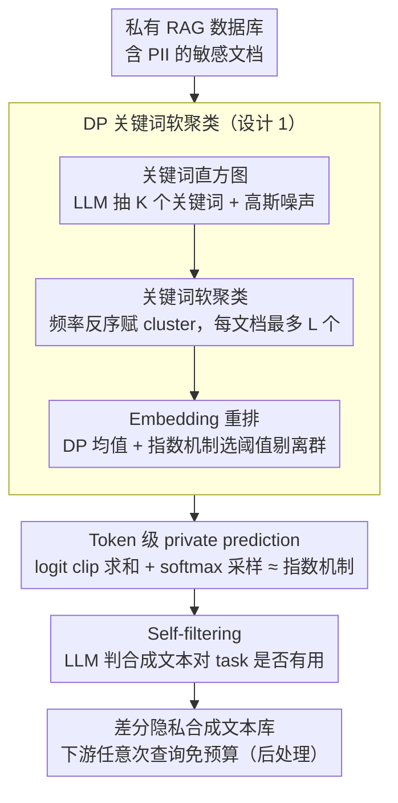

# Differentially Private Synthetic Text Generation for Retrieval-Augmented Generation (RAG)

**会议**: ACL 2026 Findings  
**arXiv**: [2510.06719](https://arxiv.org/abs/2510.06719)  
**代码**: 基于 https://github.com/sarus-tech/dp-rag 扩展  
**领域**: LLM 安全 / 差分隐私 / RAG  
**关键词**: 差分隐私、合成数据、RAG、private prediction、subsample-and-aggregate

## 一句话总结
DP-SynRAG 用 LLM 把私有 RAG 数据库**一次性**蒸馏成差分隐私合成文本库，之后任意次查询都不再消耗 privacy budget，在 Medical Synth / MovieLens / SearchQA 三个数据集上 accuracy 远超 query-time DP-RAG（多查询场景下 DP-RAG 退化到崩盘）。

## 研究背景与动机
**领域现状**：RAG 通过外挂私有知识库给 LLM 接地，但医疗、客户、推荐等场景里数据库装着 PII、病历这种高敏感内容，已有研究表明 (a) 即便良性查询也能让 LLM 复读私有片段；(b) 针对性 extraction attack 和 membership inference attack 都能高效拿到原始记录。

**现有痛点**：现有 private RAG（DP-RAG / Koga 2025 / Wang 2025）都是 **query-time DP**——在每个 query 的响应输出层加噪。这导致 privacy budget **随查询数线性累计**：1000 个 query 想保持 $\varepsilon_{\text{query}} = 10$，总预算 $\varepsilon_{\text{total}} \approx 10000$，要么早早 budget 烧光要么单 query 噪声大到不可用。Figure 3 显示 DP-RAG 在 $\varepsilon_{\text{total}}=20$ 下 query 数过 20 就已经完全失效。

**核心矛盾**：知识库是"被反复读"的资源，但 query-time DP 把"每次读都付 privacy"当作前提，这条假设在 RAG 多查询场景里是根本错位 —— 隐私应该一次性付给"建库"，之后所有查询都是 post-processing（DP 后处理免疫）。

**本文目标**：构造一种 (1) privacy budget 固定与查询数无关、(2) 不需要 DP-SGD 微调 LLM、(3) 能在合成文本里**保留 task-critical 细节**（病名、用户偏好等），而不是只学到 dataset-average style 的方案。

**切入角度**：在 private prediction 框架（subsample-and-aggregate + 多文档 logit 聚合+clip）基础上加上**先按关键词聚类、再 cluster 内做合成**的策略——之前 Amin/Tang/Hong 的 private prediction 是全库 random subsample，只能学到全局平均特征；本文用 DP 聚类让每个 subset 同主题，从而生成保留"局部信息（locality）"的合成文本。

**核心 idea**：用"DP 关键词直方图 → DP 软聚类 → DP embedding 重排 → cluster 内 private prediction 改写 → LLM self-filter"五步把 query-time DP 转化为 data-time DP，付一次性预算换无限次查询。

## 方法详解

### 整体框架
Pipeline 两阶段（Algorithm 1，5 个子步骤）：

**Stage 1: DP 软聚类**
(a) **关键词直方图**：LLM 从每篇文档抽 $K$ 个代表关键词（限制 $K$ 个 → 让 sensitivity 是 $\sqrt{K}$），全库求和得直方图，加高斯噪声 $h' = h + \mathcal{N}(0, \sigma_h^2 I)$；
(b) **关键词软聚类**：从 $h'$ 取 top-$R$ 关键词 $W = \{w_1, \ldots, w_R\}$（频率递减），按**频率反序**遍历（避免高频无信息词独占文档），每个 keyword $w_r$ 构成 cluster $C_r = \{d_i \mid w_r \in d_i, \text{且} d_i \text{已属于} <L \text{个 cluster}\}$，每篇文档最多分到 $L$ 个 cluster；
(c) **Embedding 重排**：对每个 $C_r$ 用 Gaussian mechanism 算带噪 mean embedding $\mu(C_r) = \sum_{d_i \in C_r} \mathcal{E}(d_i) + \mathcal{N}(0, \sigma_\mu^2 I)$，再用 exponential mechanism 选相似度阈值 $\theta_s$，留下 $S_r = \{d_i \in C_r \mid \text{sim}(\mathcal{E}(d_i), \mu(C_r)) > \theta_s\}$。

**Stage 2: 合成文本生成**
(d) **Private prediction**：对每个 $S_r$ 并行做 logit aggregation——给每篇文档配 rephrase prompt $p_i = (\text{"Rephrase the following text:"}, d_i)$，第 $n$ 个 token 的 logit $z_n(S_r) = \sum_{d_i \in S_r} \text{clip}_c(\mathcal{L}(p_i, y_{r, <n}))$，softmax 采样等价于 sensitivity 为 $c$ 的 exponential mechanism。重复 $T$ 步得到长度 $T$ 的合成文本 $y_r$；
(e) **Self-filtering**：把每条 $y_r$ + 下游 task 描述喂回 LLM，问"这条文本对解决这个 task 有没有用？"，留 YES 的进合成库（post-processing 不消耗隐私预算）。

**Privacy 总账**（Theorem 1）：整个 pipeline 满足 $(\varepsilon, \delta)$-DP，其中 $\rho = \frac{K}{2\sigma_h^2} + L \left( \frac{1}{8}\varepsilon_{\theta_s}^2 + \frac{1}{2\sigma_\mu^2} + \frac{T}{2}\left(\frac{c}{\tau}\right)^2 \right)$，再转化为 $\varepsilon = \rho + \sqrt{4\rho\log(1/\delta)}$。关键技巧是 **overlapping parallel composition** —— 因为每篇文档最多在 $L$ 个 cluster 中，并行处理的隐私代价是 $L \cdot \rho_{\text{cluster}}$ 而非 $R \cdot \rho_{\text{cluster}}$。

### 关键设计

**1. DP 关键词软聚类：让合成文本保留病名、用户偏好这类"局部细节"，而不只是学到全库平均特征**

Amin 等的 private prediction 直接对全库做 random subsample，结果只能学到 dataset-average characteristics——对 RAG 这种"要查具体事实"的下游任务等于无用（Table 1 里 DP-Synth/Aug-PE 在 Medical Synth 上 accuracy = 0%）。DP-SynRAG 的破法是先把库切成同主题的 cluster，再在 cluster 内做合成。具体三步：先让 LLM 从每篇文档抽 $K$ 个关键词、加噪后选 top-$R$ 主题；再按**频率反序**遍历赋 cluster（高频词如 "patient" 没区分度，先给低频代表词），每篇文档最多落进 $L$ 个 cluster，以增加它被分到最相关主题的概率；最后用 DP embedding mean + exponential mechanism 选相似度阈值 $\theta_s$，把 cluster 内语义远离的离群文档剔掉——这步在 cluster 内完成，不额外消耗预算。

软聚类（$L>1$）是整个设计的命门。硬聚类（$L=1$）会把多义文档错分到无关 cluster，消融里 Medical Synth + Llama-3.1 上 $L=1$ 比 $L=5$ 直接掉 31.88%；$L$ 太大又让噪声分散，$L=5$ 是跨数据集都稳定的 sweet spot。本质上是在"保留 locality"和"控制噪声"之间做精细 trade-off。

**2. Token 级 private prediction：用 softmax 采样的天然随机性当 DP 噪声源，不必显式加噪**

cluster 切好之后要在 cluster 内改写文档生成合成文本，问题是这步怎么加 DP 保证。直接往 logit 上加 Gaussian 会让分布严重失真——小 logit 都被噪声盖住。本文转而借用 LLM token sampling 本身的随机性：对每篇 $d_i \in S_r$ 跑 rephrase prompt $p_i$，把第 $n$ 个 token 的 logit 各自 clip 到 $[-c, c]$ 再求和 $z_n(S_r) = \sum_{d_i \in S_r} \text{clip}_c(\mathcal{L}(p_i, y_{r,<n}))$，对它做 softmax 采样下一个 token。这一步在数学上恰好等价于 utility = clipped logits、sensitivity = $c$ 的 exponential mechanism，于是采样的 randomness 就"免费"提供了 DP 噪声。生成 $T$ 个 token 由 sequential composition 串起来，得到长度 $T$ 的合成文本 $y_r$。

clipping 用的是 Grislain (2025) 的 "exp normalize → center → rescale 到 $[-c, c]$" 变体，相比单调 clip 能保留高 logit token 之间的相对差异，进一步压低"clip 截掉重要 token"的概率，对生成质量损害更小。

**3. 数据时间 DP + Self-filtering 后处理：整套预算只在"建库"时付一次，之后无限次查询都是免费的 post-processing**

这是全文最关键的 reframing。现有 private RAG 都是 query-time DP，在每个 query 输出层加噪，导致 privacy budget 随查询数线性累计——1000 个 query 想保持 $\varepsilon_{\text{query}}=10$，总预算就要 $\varepsilon_{\text{total}}\approx 10000$，要么早早烧光、要么单 query 噪声大到不可用。但知识库的本质是"被反复读"，DP 偏要按"每次读都付钱"算账，这条假设在 RAG 多查询场景里根本错位。DP-SynRAG 把整个建库流程做成满足 $(\varepsilon, \delta)$-DP，由 DP 的 post-processing immunity，之后的 embedding 索引、检索、LLM 推断全都不再消耗预算，结果就是"查询数 vs accuracy"曲线被拉平（Figure 3 里 DP-SynRAG 是一条水平直线，DP-RAG 是急剧下滑曲线）。

在此之上再叠一层 self-filtering：把每条合成文本 $y_r$ 连同下游 task 描述一起喂回 LLM，问"这条对解决 task 有没有用"，留 YES 的进合成库。因为输入只含合成数据 + 公开 task 信息、不接触原数据库，这步也是纯后处理、不花预算，却能把垃圾合成文本剔掉提升下游 accuracy（消融里对 Medical/MovieLens 最多贡献 9 个百分点）。

### 损失函数 / 训练策略
**无需训练**。所有 LLM 都是冻结的 inference 用（关键词抽取、改写、self-filter 用同一个 LLM）。主参数：$K=10$ keywords/doc、$R=500$ (Medical/MovieLens) 或 $1000$ (SearchQA)、$L=5$ overlap、$k=80-100$ docs/cluster、$T=70$ tokens/synthetic、$\tau=1.0$、$\varepsilon_{\text{total}}=10$、$\delta=10^{-3}$、$\rho_{\text{hist}}=0.1$、$\rho_{\text{retr}}=0.009$。

## 实验关键数据

### 主实验

三 dataset × 三 LLM × 五方法（$\varepsilon_{\text{total}}=10$ for DP-Synth/SynRAG，$\varepsilon_{\text{query}}=10$ for DP-RAG）：

| Dataset | Method | Phi-4-mini (3.8B) | Gemma-2-2B | Llama-3.1-8B |
|---------|--------|------------------|------------|---------------|
| **Medical Synth** | Non-RAG | 0.00 | 0.00 | 0.00 |
| | RAG (no DP) | 87.00 | 85.20 | 86.20 |
| | DP-Synth (Amin'24) | 0.00 | 0.00 | 0.00 |
| | Aug-PE | 0.00 | 0.00 | 0.00 |
| | **DP-SynRAG** | **67.26** | **67.06** | **61.26** |
| | DP-RAG ($\varepsilon_{\text{total}}{\approx}10\text{k}$) | 59.92 | 67.06 | 48.94 |
| **MovieLens** | RAG (no DP) | 67.80 | 54.60 | 70.80 |
| | DP-Synth | 37.60 | 16.64 | 46.12 |
| | Aug-PE | 36.16 | 26.04 | 44.96 |
| | **DP-SynRAG** | **42.56** | **41.08** | 54.12 |
| | DP-RAG ($\varepsilon_{\text{total}}{\approx}5\text{k}$) | 34.72 | 40.48 | **56.80** |
| **SearchQA** | RAG (no DP) | 92.16 | 94.12 | 95.10 |
| | DP-Synth | 60.20 | 20.20 | 40.00 |
| | **DP-SynRAG** | **89.61** | **85.10** | **91.18** |
| | DP-RAG ($\varepsilon_{\text{total}}{\approx}1\text{k}$) | 85.10 | 83.14 | 84.90 |

**结论**：DP-SynRAG 在所有三个数据集都大幅领先同预算 baseline（DP-Synth/Aug-PE），且即便 vs DP-RAG（实际预算超 1000 倍）也在多数情形胜出。

### 消融实验

DP-SynRAG 各组件影响（accuracy %）：

| Dataset / Model | Full | w/o Retrieval | w/o Self-filter | Hard cluster ($L=1$) |
|-----------------|------|---------------|-----------------|----------------------|
| Medical Synth / Phi-4 | 67.26 | 65.92 (-1.34) | 66.78 (-0.48) | 42.52 (**-24.74**) |
| Medical Synth / Llama-3.1 | 61.26 | 57.74 (-3.52) | 52.20 (**-9.06**) | 29.38 (**-31.88**) |
| MovieLens / Llama-3.1 | 54.12 | 53.76 (-0.36) | 45.12 (**-9.00**) | 46.56 (-7.56) |
| SearchQA / Gemma-2 | 85.10 | 83.73 (-1.37) | (N/A) | 67.06 (**-18.04**) |

**结论**：(1) 软聚类 ($L>1$) 是最关键组件，hard cluster 平均掉 5–32 个百分点；(2) self-filtering 对 Medical/MovieLens 重要（最多 -9pp），SearchQA 因任务发散没用；(3) embedding 重排有持续小幅增益。

隐私泄漏测试（Medical Synth，统计 1000 benign queries + 100 attack queries 中 patient 全名出现次数）：

| Method | Benign avg | Attack avg |
|--------|-----------|-----------|
| RAG (no DP) | 4–22 | 81–90 |
| DP-RAG | 1.8–6 | 0–2 |
| **DP-SynRAG** | **0–2.4** | **0.25–1.25** |

→ DP-SynRAG 把 leakage 压到接近 0，且不受 attack prompt 影响。

### 关键发现
- **查询数 vs accuracy 曲线本质不同**：DP-SynRAG 是水平直线（隐私预算固定），DP-RAG 是急剧下滑曲线 —— 1 query 时两者相当，20+ query 时 DP-RAG 即便 $\varepsilon_{\text{total}}=20$ 也已完全崩盘，这条曲线对比是整篇论文最强的"图叙事"。
- **DP-Synth 和 Aug-PE 在 Medical Synth 上 accuracy = 0%**：证明现有 private prediction 只学全局平均特征是死路一条；DP-SynRAG 的聚类设计是 RAG 场景的必要条件。
- **稀有主题上 DP 是天花板**：Table 2 显示 ground-truth disease 只在 <30 篇文档出现时，DP-RAG 和 DP-SynRAG 都基本答不出来（accuracy <1%）—— 作者明确这是 DP 的本质 trade-off，不是算法缺陷，"能稳定答稀有病的系统等于在泄漏 rare patient 存在"。
- **软聚类 $L=5$ 是 sweet spot**：$L=1$ 严重掉点（多义文档错分），$L=10$ 也不再涨（噪声分散），$L=5$ 跨数据集都稳定。

## 亮点与洞察
- **"DP 时机迁移"是最大 contribution**：把隐私从"每次查询付"挪到"建库一次付"，这种 reframing 在 RAG 反复读的场景里释放了巨大效用空间，是个简单但被忽视的关键观察。
- **softmax = exponential mechanism** 这条等价性把 LLM token sampling 的天然随机性变成 DP 噪声源，避免了显式加噪带来的"clip 太死"或"噪声盖过 logit"问题——这是 Amin 2024 提出的，但本文把它和聚类策略组合得很优雅。
- **Overlapping parallel composition** 让"每文档最多在 $L$ 个 cluster"产生 $L\rho$ 而非 $R\rho$ 的预算，是 zCDP 框架的精妙应用，对类似"并行多分支 DP"工作有借鉴价值。
- **承认 DP 在稀有主题上的本质局限**：这种诚实的态度比硬撑"我们能解决一切"更有学术价值，Table 2 直接画出"稀有 → utility = 0"的曲线，给读者明确 boundary。

## 局限与展望
- **稀有主题不可用**：<30 个支撑文档的主题 accuracy 几乎为 0，这是 DP 的根本约束而非算法缺陷，但限制了对长尾知识的应用。
- **数据库更新要重建合成库**：作者承认每次大幅更新都得重跑（Llama-3.1 在 8000 docs 上需 ~40 分钟），频繁更新场景需要 incremental refresh 机制（future work）。
- **Token-level DP 在极紧预算下崩塌**：$\varepsilon < 5$ 时 utility 急剧降；作者建议未来探索 non-token-level 但保留 locality 的 DP 文本生成（Aug-PE 不行，需要新方法）。
- **聚类对 surface-form 关键词依赖强**：如果同义词或不同表达描述同一主题，聚类会失败；作者建议未来用 synonym expansion / abstract topic descriptor 改进。

## 相关工作与启发
- **vs DP-RAG (Grislain 2025)**：query-time DP，预算 per-query；本文是 data-time DP，预算 one-shot。Figure 3 的曲线对比一目了然——多查询场景必然选 DP-SynRAG。
- **vs DP-Synth (Amin 2024)**：同属 private prediction synthetic data 框架，但 random subsample 只学全局特征；本文加了 DP 聚类专门保留 locality。
- **vs Aug-PE (Xie 2024)**：embedding-based DP selection 而非 token-level，但作者实测对 RAG 任务 utility 极低（Medical Synth 上 0%）——说明"非 token-level DP" ≠ "适合 RAG"。
- **vs DP-OPT / private fine-tuning**：DP-SGD 微调 LLM 计算昂贵且每次 DB 更新都得重训，DP-SynRAG 完全 training-free 更易部署。
- **启发**：DP 预算 budget 的"时机选择"应该是 DP 系统设计的第一性问题——任何"被反复使用的资源"都应优先考虑 build-time DP 而非 use-time DP；这条原则可推广到 prompt template DP、tool registry DP 等。

## 评分
- 新颖性: ⭐⭐⭐⭐ "聚类 + private prediction" 的组合简单但精准切中现有 DP-Synth 全局平均的弱点，加上 build-time vs query-time DP 的 reframing 是个 elegant insight
- 实验充分度: ⭐⭐⭐⭐⭐ 3 dataset × 3 model × 5 method 主表 + 隐私泄漏定量 + 多查询曲线 + 稀有主题分析 + 4 维消融 + 4 表 hyperparameter sensitivity + 附录合成文本质量评估，矩阵几乎全覆盖
- 写作质量: ⭐⭐⭐⭐ 故事线"query-time DP 的预算累积痛点 → 时机迁移 → 局部聚类保 locality"层层递进；Algorithm 1、Theorem 1、Figure 3 三大件齐全
- 价值: ⭐⭐⭐⭐⭐ 对医疗/客服/推荐场景的私有 RAG 部署是直接可用的开源方案；data-time vs query-time DP 这条原则对整个 private LLM 社区都有启发

<!-- RELATED:START -->

## 相关论文

- [\[ICML 2026\] ACTG-ARL: Differentially Private Conditional Text Generation with RL-Boosted Control](../../ICML2026/llm_safety/actg-arl_differentially_private_conditional_text_generation_with_rl-boosted_cont.md)
- [\[ACL 2026\] Beyond Explicit Refusals: Soft-Failure Attacks on Retrieval-Augmented Generation](beyond_explicit_refusals_soft-failure_attacks_on_retrieval-augmented_generation.md)
- [\[ACL 2026\] Knowledge Poisoning Attacks on Medical Multi-Modal Retrieval-Augmented Generation](knowledge_poisoning_attacks_on_medical_multi-modal_retrieval-augmented_generatio.md)
- [\[AAAI 2026\] Privacy-protected Retrieval-Augmented Generation for Knowledge Graph Question Answering](../../AAAI2026/llm_safety/privacy-protected_retrieval-augmented_generation_for_knowledge_graph_question_an.md)
- [\[ACL 2026\] AGSC: Adaptive Granularity and Semantic Clustering for Uncertainty Quantification in Long-text Generation](agsc_adaptive_granularity_and_semantic_clustering_for_uncertainty_quantification.md)

<!-- RELATED:END -->
