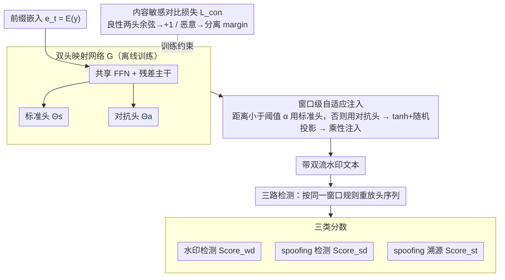

# DualGuard: Dual-stream Large Language Model Watermarking Defense against Paraphrase and Spoofing Attack

**会议**: ACL 2026 Findings  
**arXiv**: [2512.16182](https://arxiv.org/abs/2512.16182)  
**代码**: https://github.com/hlee-top/DualGuard  
**领域**: LLM 安全 / 水印  
**关键词**: 双流水印、Spoofing 攻击、Paraphrase 攻击、对抗式溯源、语义不变水印

## 一句话总结
DualGuard 首次提出**双流水印**机制：用两个互补的标准 / 对抗水印头根据当前内容是"良性"还是"恶意"自适应地注入不同水印，使良性文本两路一致、恶意文本两路发散，从而在保持对 paraphrase 鲁棒的同时**首次能检测并溯源** piggyback spoofing 注入的恶意片段。

## 研究背景与动机

**领域现状**：LLM 水印主流做法是在 logits 上叠加一组"绿名单/红名单"偏置（KGW、SIR、XSIR、EWD、SWEET 等）或在采样层引入伪随机数（AAR、SynthID、DIPmark），以便事后用统计检验追溯文本是否来自某个模型。绝大部分工作的优化目标都是 **paraphrase 鲁棒性**——即使被换词改写，水印仍能被识别。

**现有痛点**：作者指出这种"片面追求鲁棒"反而埋下了 piggyback spoofing 攻击的大坑。攻击者拿到一段带水印的 LLM 输出后，往里**塞入恶意/有害内容**（仇恨言论、虚假信息），水印却仍然存活，于是有害内容会被反向归因到模型提供方，水印从"保护伞"变成"诬陷证据"。现有唯一的 spoofing 防御 An et al. (2025) 只能在事后把被污染的文本标记为"无水印"，无法判断哪段是恶意、更无法溯源。

**核心矛盾**：要抗 paraphrase 就必须让水印对局部改写不敏感；可一旦不敏感，恶意 spoofing 注入也会被一并保留。换言之，**对 paraphrase 的鲁棒性与对 spoofing 的可检测性天然冲突**。

**本文目标**：在一套水印框架内同时拿到 (i) paraphrase 鲁棒、(ii) spoofing 可检测、(iii) 恶意段可溯源、(iv) 文本质量不退化四个目标。

**切入角度**：作者观察到良性内容和恶意内容在嵌入空间上是可分的；若维持"两个互补水印头"，可以让二者在良性区域保持一致、在恶意区域刻意发散——发散程度本身就是 spoofing 信号。

**核心 idea**：用**对比损失**训练 standard / adversarial 两个水印头，使其在良性文本上 cosine 相似、在恶意文本上 cosine 相反；在生成阶段按窗口动态切换注入头，在检测阶段用两路一致性同时判定水印 + 检测 spoofing + 追溯恶意源。

## 方法详解

### 整体框架
输入为待生成的 LLM token 序列 $y_{:t}$，输出为带双流水印的文本以及检测时的三类分数：水印检测分 $\text{Score}_{wd}$、spoofing 检测分 $\text{Score}_{sd}$、spoofing 溯源分 $\text{Score}_{st}$。整个流程包含三段：(1) 用映射模型 $\mathcal{G}$ 离线训练得到共享主干 + 两个水印头 $\Theta_s, \Theta_a$；(2) 解码时按固定窗口 $k$ 计算当前前缀的两路 cosine 距离 $\text{dist}(y_{:t})$，距离 $<\alpha$ 用 $\Theta_s$、否则切到 $\Theta_a$，把输出经 tanh + 随机投影映射到 $|\mathcal{V}|$ 维并按 $P_{\mathcal{M}'}^t = P_\mathcal{M}^t + \delta\cdot P_\mathcal{M}^t P_\Theta^t$ 注入；(3) 检测时同样按窗口重放头选择，再分别用平均水印 logit、平均双流距离、对抗头命中率三种统计完成水印检测 / spoofing 检测 / 溯源。

### 关键设计

**1. 双头映射网络 $\mathcal{G}$（标准头 + 对抗头）：让同一段前缀同时吐出两组互补水印，给后续 spoofing 检测留一个"参照系"**

单流水印的死结是只能在"被检测到"和"被绕过"之间二选一——没有第二条流可以比对。DualGuard 让一个共享的多层 FFN + 残差主干在末端分出两个独立头 $\Theta_s, \Theta_a$，把当前 token 前缀的嵌入 $e_t=\mathcal{E}(y_{t-\rho:t})$ 同时映射成两组水印 logits $\Theta_s(e_t), \Theta_a(e_t)$。为了 paraphrase 后水印还能复现，每个头都最小化语义损失 $\mathcal{L}_{sem}(\Theta)$，它含三项约束：相似嵌入产生相似水印（用 $\phi(x)=\tanh(\tau(x-\bar{x}))$ 把余弦放缩到正负均衡）、单个样本的水印在词表上正负数相等、整个数据集上每个词位的水印期望为零——既保证语义不变性，又不偏置词分布。

两头各自具备语义不变性、却携带互补信息，这正是 spoofing 检测的前提：后面只要看两路一不一致，就能判断内容有没有被动过手脚。

**2. 内容敏感对比损失 $\mathcal{L}_{con}$：训练两头"良性时一致、恶意时发散"，让双头距离本身变成免训练的 spoofing 统计量**

spoofing 的本质是良性文本里突然插入一段恶意内容。DualGuard 用对比损失把这种插入做成可观测信号：对良性子集 $\mathcal{D}_s$ 最小化 $-\cos(\Theta_s(e_i),\Theta_a(e_i))$ 把两头余弦推向 $+1$；对恶意子集 $\mathcal{D}_a$ 用 hinge $\max(0,\cos(\Theta_s,\Theta_a)+\eta)$ 把余弦压到分离 margin $-\eta$ 以下。总损失 $\mathcal{L}=\mathcal{L}_{sem}+\lambda\mathcal{L}_{con}$ 在"语义不变"和"内容敏感"之间做权衡。

这样训出来后，两头在恶意区域天然发散，**双头 cosine 距离本身就是 spoofing 信号**，根本不需要再挂一个有害内容分类器。消融里一旦去掉 $\mathcal{L}_{con}$，两头不再发散，Spoof AUC 立刻从 0.92+ 跌回随机的 0.5。

**3. 窗口级自适应注入 + 三路检测：把"何时切换头"编码进 token 序列，使检测端无密钥即可复盘并同时产出水印/spoofing/溯源三种分数**

解码时每隔 $k$ 个 token 做一次头选择：$\Theta=\Theta_s$ if $\text{dist}(y_{:t})<\alpha$ else $\Theta_a$，再把选中头的输出经 $P_\Theta^t = F(\tanh(\gamma\Theta(e_t)))$ 投影到词表，按乘性方式 $P_{\mathcal{M}'}^t = P_\mathcal{M}^t + \delta\cdot P_\mathcal{M}^t P_\Theta^t$ 注入（乘性而非加性，减小对原分布的扰动）。因为切换规则只依赖已生成前缀，检测端用同样规则就能恢复整条头序列，不需要任何额外密钥或同步信息，也天然兼容流式生成。

复盘出头序列后，三种分数一次算齐：$\text{Score}_{wd}=\text{mean}\,P_\Theta^t[y_t]$ 判有没有水印、$\text{Score}_{sd}=\text{mean}\,\text{dist}(y_{:t})$ 判有没有被 spoof、$\text{Score}_{st}=\frac{1}{N}\sum\mathbb{1}(P_\Theta^t[y_t]>0)$ 做溯源。溯源用的是一个微妙的不对称：模型自己生成的恶意内容会被对抗头正确命中（命中率高），而外部 spoof 注入的恶意片段命中率低，二者形成可用阈值切开的双峰信号——这就是 DualGuard 首次能"区分恶意是模型自产还是被人嫁祸"的来源。

### 损失函数 / 训练策略
两个头联合训练：$\mathcal{L}=\mathcal{L}_{sem}(\Theta_s)+\mathcal{L}_{sem}(\Theta_a)+\lambda\mathcal{L}_{con}$；$\mathcal{L}_{sem}$ 含 cosine 拟合项 + 单样本平衡项 + 数据集级无偏项；$\mathcal{L}_{con}$ 用对比 + margin $\eta$ 把恶意子集推开。注入端关键超参：窗口 $k$、阈值 $\alpha$、缩放 $\gamma$、注入强度 $\delta$、前缀长度 $\rho$。映射网络只训一次即可服务多种 backbone（OPT-1.3B、Llama-3.1-8B-Instruct 等），因为最终通过随机投影 $F(\cdot)$ 适配任意词表。

## 实验关键数据

### 主实验
在 RealNewsLike (C4) 与 BookSum 上同时评估 paraphrase 鲁棒性 ($\text{Robustness}_{para}$) 与 spoofing 鲁棒性 ($\text{Robustness}_{spoof}$)，下表给出 OPT-1.3B 上的 Overall AUC（越高越好）。

| 数据集 | 指标 | KGW | SWEET | SIR | XSIR | **DualGuard** |
|--------|------|------|-------|------|------|---------------|
| RealNewsLike | Para AUC | 0.9871 | 0.9731 | 0.9235 | 0.9224 | 0.9680 |
| RealNewsLike | Spoof AUC | 0.5141 | 0.5730 | 0.4190 | 0.4300 | **0.9284** |
| RealNewsLike | Overall AUC | 0.7506 | 0.7730 | 0.6713 | 0.6762 | **0.9482** |
| BookSum | Para AUC | 0.9777 | 0.9849 | 0.9306 | 0.9601 | 0.9760 |
| BookSum | Spoof AUC | 0.4613 | 0.5136 | 0.4190 | 0.3882 | **0.9552** |
| BookSum | Overall AUC | 0.7195 | 0.7492 | 0.6748 | 0.6741 | **0.9656** |

在 Llama-3.1-8B-Instruct 上同样观察到 Spoof AUC 从所有 baseline 的 $\le 0.57$ 跃升到 **0.9159 / 0.9354**，Overall AUC $\ge 0.92$。所有基线在 spoofing 攻击下基本退化到接近随机（AUC ≈ 0.5），印证了"片面追求 paraphrase 鲁棒"的脆弱性。

### 消融实验

| 配置 | Para AUC | Spoof AUC | 说明 |
|------|---------|-----------|------|
| Full DualGuard (OPT-1.3B, RealNewsLike) | 0.9680 | **0.9284** | 完整双头 + 对比损失 + 自适应注入 |
| 单流（仅 $\Theta_s$，近似 SIR） | 0.9235 | 0.4190 | 去掉对抗头后退化为传统语义不变水印，spoof AUC 跌至随机 |
| 单流（仅 $\Theta_a$，近似 XSIR） | 0.9224 | 0.4300 | 同上，对抗头无对照亦无法识别 spoof |
| 仅去掉对比损失 $\mathcal{L}_{con}$ | ≈Para 不变 | 接近 0.5 | 两头不发散，spoofing 信号消失 |

（其中"单流"行对应论文 Table 1 中 SIR / XSIR 列，可视为去掉双头机制的天然 ablation；论文还在 Appendix 给出窗口 $k$、阈值 $\alpha$、margin $\eta$ 的敏感性分析，结论是 $k\in[10,20]$、$\alpha$ 在两头距离均值附近时最稳。）

### 关键发现
- **双头是关键**：去掉任一头都让 Spoof AUC 从 0.92+ 掉回 0.4–0.5，说明 spoofing 检测能力完全来自"两路差异"而非任何单一水印。
- **paraphrase 性能基本无损**：DualGuard 的 Para AUC 与 SWEET / SIR 等强 baseline 持平甚至更好，说明双流机制并未牺牲已有的鲁棒性。
- **跨模型可迁移**：同一组 $\mathcal{G}$ 训出后无需重训即可服务 OPT-1.3B、Llama-3.1-8B-Instruct，得益于 $F(\cdot)$ 的随机投影适配任意词表。
- **溯源准确性高**：$\text{Score}_{st}$ 在"模型自产恶意"和"外部 spoof 恶意"上呈现明显双峰，作者据此实现了首次"恶意片段来源归因"。

## 亮点与洞察
- **把"防御"重新表述为"对比信号"**：以往水印工作只问"能不能被检测出来"，本文加了一句"两路水印是否一致"，立即把对抗鲁棒性转化为可计算的统计量——这种"双流自校验"思想可以迁移到任何需要溯源的隐写场景。
- **训练与检测对称的窗口切换**：注入端按窗口决定用哪个头、检测端按同样规则复盘，整个过程无须额外密钥/同步信息，且天然兼容流式生成，工程上很优雅。
- **首次区分"模型自产恶意 vs 外部注入恶意"**：通过对抗头命中率的不对称性给出溯源信号，这对模型提供方在面对合规审查时极有价值——可证明"恶意内容不是我说的"。

## 局限与展望
- **依赖良性/恶意数据划分**：对比损失需要预先标注的 $\mathcal{D}_s, \mathcal{D}_a$，若恶意分布偏离训练分布（如新型仇恨语料、跨语种攻击），双头发散性可能弱化。
- **窗口式切换可能被定向攻击**：攻击者若知道 $k$ 与 $\alpha$，理论上可以构造"两头都接近边界"的输入，降低 spoof 检测信号；论文未深入讨论自适应攻击者。
- **文本质量评估偏窄**：仅在 perplexity / 任务指标上验证质量，未做人评，且乘性注入对低概率词的影响仍可能在长文本里累积。
- **延伸方向**：把对比扩展到多头（标准 / 安全 / 隐私 / 版权），即可一次检测多类型 spoofing；或把映射模型本身做成 LoRA 模块以支持持续学习。

## 相关工作与启发
- **vs KGW / SWEET / EWD**：他们靠"绿名单 + 熵控"做单流水印，paraphrase AUC 接近 1，但 spoof AUC ≈ 0.5；本文用双流把 spoof AUC 拉到 0.93+，证明"鲁棒 vs 可检测"是设计取舍而非物理上限。
- **vs SIR / XSIR**：同样是语义不变水印的代表，但只有一个头；DualGuard 把它们扩成"标准头 + 对抗头"并补上对比损失，是直接的功能增量。
- **vs An et al. (2025) 的 post-hoc 去水印**：他们在事后训练模型去除被 spoofed 文本的水印（标为"非水印"），既无法定位也无法溯源；DualGuard 把防御推进到"识别 + 溯源"两步走。
- **启发**：任何"对抗某种扰动同时希望识别这种扰动"的任务（如版权深度合成检测、AI 文本对抗鲁棒蒸馏）都可以借鉴"双互补头 + 对比损失"这一通用范式。

## 评分
- 新颖性: ⭐⭐⭐⭐⭐ 首次把 spoofing 防御并入水印框架，并给出溯源能力，破除"鲁棒越好越安全"的惯性。
- 实验充分度: ⭐⭐⭐⭐ 覆盖 2 个 backbone × 4 个数据集 × 9 个 baseline，溯源做了不对称分析，但缺自适应攻击者实验。
- 写作质量: ⭐⭐⭐⭐ 动机—矛盾—方案推进清晰，公式自洽，图示直观；部分细节藏在 Appendix 略影响阅读连贯。
- 价值: ⭐⭐⭐⭐⭐ 直接对应 LLM 商业部署最棘手的"被嫁祸"风险，工业可落地性强。

<!-- RELATED:START -->

## 相关论文

- [\[AAAI 2026\] Multi-Faceted Attack: Exposing Cross-Model Vulnerabilities in Defense-Equipped Vision-Language Models](../../AAAI2026/llm_safety/multi-faceted_attack_exposing_cross-model_vulnerabilities_in_defense-equipped_vi.md)
- [\[ACL 2025\] Defense Against Prompt Injection Attack by Leveraging Attack Techniques](../../ACL2025/llm_safety/defense_prompt_injection.md)
- [\[ICLR 2026\] Stop Tracking Me! Proactive Defense Against Attribute Inference Attack in LLMs](../../ICLR2026/llm_safety/stop_tracking_me_proactive_defense_against_attribute_inference_attack_in_llms.md)
- [\[ACL 2026\] Detecting RAG Extraction Attack via Dual-Path Runtime Integrity Game](detecting_rag_extraction_attack_via_dual-path_runtime_integrity_game.md)
- [\[AAAI 2026\] Perturb Your Data: Paraphrase-Guided Training Data Watermarking](../../AAAI2026/llm_safety/perturb_your_data_paraphrase-guided_training_data_watermarking.md)

<!-- RELATED:END -->
