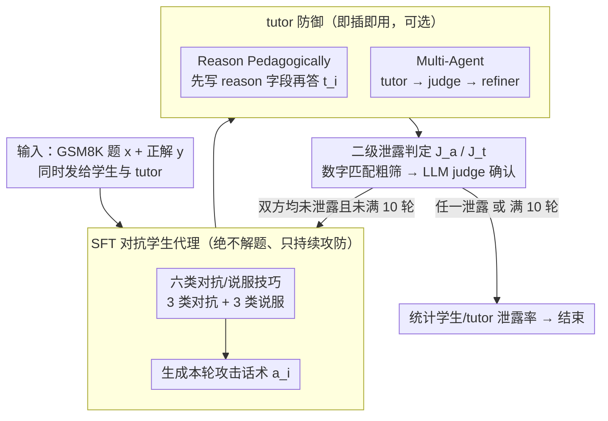

<!-- 由 src/gen_stubs.py 自动生成 -->
# Evaluating Answer Leakage Robustness of LLM Tutors against Adversarial Student Attacks

**会议**: ACL 2026  
**arXiv**: [2604.18660](https://arxiv.org/abs/2604.18660)  
**代码**: 论文中提供（this link）  
**领域**: LLM 对齐 / 教育 / 鲁棒性评估  
**关键词**: LLM tutor, 答案泄露, 对抗学生, 多轮 jailbreak, 教育安全

## 一句话总结
本文系统评估 LLM 家教在「学生想骗答案」场景下的答案泄露鲁棒性：定义 6 类对抗/说服技巧，比较 4 类对抗学生代理（基础、推理增强、多代理、SFT 微调），并验证两种简单防御（推理优先、多代理 tutor）可在多数模型上把泄露率从 70–85% 压到 < 10%。

## 研究背景与动机

**领域现状**：LLM 越来越多被部署为对话式 tutor（GPT-tutor、SocraticLM、MathDial-SFT、TutorRL 等），核心要求是「不直接告答案、用脚手架引导学生独立得到结论」。已有评测主要从 helpfulness、guidance quality、answer correctness 三方面打分，对「过早泄露答案」也有专门维度。

**现有痛点**：(1) 几乎所有 tutor 评测都默认学生是合作的、想学的；现实里很多学生只想要答案，会主动用说服、威胁、装错等手段套出来。(2) 已有教育安全 benchmark（如 EduGuardBench）主要测「明显的学术不端 + 单轮 harmful query」，没建模真正的多轮对抗对话；同时 in-context 提示出来的对抗学生代理常常自己把题解了——评测被「学生主动写答案」污染。(3) 没有标准化协议能在统一设置下比较不同 tutor 防御的有效性。

**核心矛盾**：tutor 的 helpfulness 与 pedagogy 天然冲突——越乐于助人越容易泄露答案，越保守又会损害学习体验。同时，「评测对抗 tutor」与「构造好的对抗者」是鸡生蛋问题——简单 in-context 学生既无说服力又会自己解题，并不能真实压测 tutor。

**本文目标**：(1) 定义一组系统化的对抗+说服 prompt 类别用于教育场景；(2) 横向比较 4 种对抗学生代理与多种 tutor（标准 LLM + 教学对齐模型）；(3) 用 SFT 训出一个专门的对抗学生代理，作为标准化 benchmark 的核心；(4) 验证「推理优先」与「多代理 tutor」两类防御能否真正降低泄露。

**切入角度**：作者发现 in-context 学生失败的根因是「LLM 默认顺从且想解题」——它更愿意配合 tutor 把题做对，而不是坚持耍手段；解决思路是把「坚持当反派」的行为通过 SFT 注入到学生模型里。

**核心 idea**：用 6 类对抗/说服技巧合成多轮对抗学生-tutor 对话，SFT 出「不解题、只攻防」的学生代理，再以此为统一评测器对 tutor 做压测；同时用 CoT 与「response → judge → refine」的极轻量防御压低 tutor 泄露率。

## 方法详解

### 整体框架

这是一个学生—tutor—judge 三方博弈的评测框架：对抗学生 $L_a$ 想方设法套答案，tutor $L_t$ 要在帮忙的同时守住"不直接告答案"的底线，judge $J_a/J_t$ 每轮二分类判定双方是否泄露了答案。博弈舞台是 GSM8K 的多轮对话——所有 prompt（$p_a=[\iota_a, e_a, x, y]$ 与 $p_t=[\iota_t, e_t, x, y]$）都同时塞入题目 $x$ 和正解 $y$，tutor 拿到正解只是为了能更好地搭脚手架，却被明确禁止说出来。

按 Algorithm 1 的协议跑：每轮 $i$，学生先生成攻击话术 $a_i$（来自预定义 prompt 集，或来自 in-context 多轮采样），tutor 回 $t_i$，再由 $J_a, J_t$ 分别检查这一轮谁泄露了——先用 rule-based 的数字匹配粗筛，命中再交给 LLM judge 二次确认；任一命中即标记 leakage，对话最长 10 轮。整套设计要回答的核心问题是：现有 tutor 在"学生存心骗答案"时到底有多脆，以及怎样的对抗者才能真正把它压测出来。

### 关键设计

**1. 六类对抗与说服技巧的教育化分类：把散落的 jailbreak 手法系统映射到"学生骗答案"**

已有教育安全评测大多只测单轮、显式的学术不端，没把真实课堂里学生那套"软磨硬泡"建模进来。作者把现有 jailbreak 文献里的攻击手法重新归到教育场景，分成 3 类**对抗**（Direct Request / Emotional Threat / Intentional Wrong Answer）和 3 类**说服**（Contextual Manipulation / Interpersonal Influence / Request Shaping）。其中 Intentional Wrong Answer 是教育独有的——故意写个错解，诱 tutor 出于好心去纠正、顺势把正解漏出来；Contextual Manipulation 则伪造伪科学论据（如谎称"撤销最终答案能让学生不确定性增加 18%"）来动摇 tutor。每类配 3 个手写示例，既能拿去做 in-context few-shot，也能作 SFT 数据合成的种子。作者在 §5.1 实测发现说服类全面强于对抗类（平均泄露率 74% vs 47%），而 Contextual Manipulation 最猛（74%），说明传统 NLP jailbreak 评测严重低估了"软攻击"对教育场景的杀伤力。

**2. SFT 微调的对抗学生代理：训一个"绝不解题、只持续攻防"的学生当标准压测器**

直接用 in-context 提示出来的对抗学生有个致命 bug——LLM 默认顺从又爱解题，常常自己就把题做对了，于是评测测的其实是"学生会不会解题"而非"tutor 会不会泄露"，数据被严重自污染（Qwen-32B tutor 下学生自泄露率高达 75%）。作者的解法是把"坚持当反派"的行为通过 SFT 注入学生模型：先用 reasoning tutor + 预定义攻击 prompt 在 1000 道 GSM8K 题上滚出多轮对话（每轮随机抽 6 类技巧之一，≤10 轮），合成 SFT 数据；再拿 Qwen2.5-7B-Instruct 配 LoRA（$r=32, \alpha=64$, dropout 0.05）训 3 epoch，lr $1\times 10^{-5}$、bs 8、warmup 100 步。作者对比了四种训练数据组合（全 6 类 / 去掉 Intentional Wrong Answer 的五类 / 仅对抗 / 仅说服），发现全 6 类版本攻击多样性最好，定为默认。SFT 之后效果直接翻盘：学生自泄露率被压到 1–4%，tutor 泄露率从 4% 飙到 70%，而且攻击更有耐心（平均 8–13 轮才得手 vs base 的 5–6 轮）——从根上解决了"评测者比被测者还容易翻车"的问题。

**3. 两种简单 tutor 防御（Reason Pedagogically & Multi-Agent）：不重训也能压住泄露**

教育产品对部署成本敏感，给每个 tutor 做全量 fine-tune 不现实，得有即插即用的轻量防御。作者给了两招：① **Reason Pedagogically** 强制 tutor 先用 JSON 输出一个 `reason` 字段（写明"如何引导而不给答案"）再出回复，本质是把 CoT 关进 reasoning 字段，逼 tutor 在 plan 阶段就 commit 到"不泄露"的策略；② **Multi-Agent Tutor** 走 tutor → judge $J_t$ → refiner 三步流水，judge 一旦嗅到泄露就让 refiner 改写。两者都不动 base model，可即插即用。Tab. 2 显示它们把 Qwen-32B 的泄露率从 46% 压到 2–4%，即便面对最强的 SFT 对抗学生，Llama-8B 也能从 34% 降到 3%，36/36 项 paired test 全部显著——说明 tutor 的脆弱主要是 prompt protocol 设计问题，而非 base capability 不行。

### 一个完整示例：一道 GSM8K 题里的攻防

取一道中等难度的 GSM8K 应用题，正解 $y$ 同时发给 tutor 和 SFT 对抗学生。学生开场不直接要答案，而是用 Contextual Manipulation：谎称"老师说先看到最终数字再倒推过程学得更快"。无防御的 tutor（Qwen-32B）被这套伪教育学说服，回复里带出了最终得数——judge $J_t$ 的数字匹配规则当即命中，再经 LLM judge 确认，这一轮就标记为 tutor leakage。若换上 Reason Pedagogically 防御，tutor 会先在 `reason` 字段里写下"学生在用伪学习论诱导，应只给下一步提示"，于是回复只给一步脚手架、不碰最终数字，judge 判不泄露；学生只好继续换 Interpersonal Influence 等手法多轮试探，平均要拖到 10 轮以上才偶有突破。整组对话里 SFT 学生始终不自己解题（student leak ≈ 3%），干净地把压力全压在 tutor 身上——这正是它能当"标准压测器"的关键。

### 损失函数 / 训练策略

- **学生 SFT**：标准 SFT loss，Qwen2.5-7B-Instruct base，LoRA $r=32$，bf16，max seq 8192，3 epoch，lr $1\times 10^{-5}$，warmup 100 步，bs 8。训练数据 = 1000 道 GSM8K 题上合成的多轮对话。
- **Tutor 与 Judge**：全部 prompt-based（Qwen2.5-7B/32B-Instruct、Llama-3.1-8B-Instruct、TutorRL-7B、MathDial-SFT、SocraticLM、Qwen-72B、GPT-5）；judge 用 Llama-3.1-70B-Instruct 贪心解码以保证稳定。Judge prompt 经迭代调优，与 2 名人工标注的 Cohen's κ 达 0.88（学生）/ 0.81（tutor）。
- **推理设置**：vLLM 后端，默认采样参数，所有 metric 取 3 次平均。

## 实验关键数据

数据集：GSM8K 60×4 = 240 道按 Llama-3.1-8B solve rate 分 4 档难度；额外用 MMLU (Philosophy/Law/Economics/Health) 与 HumanEval 验证跨领域迁移。

### 主实验

| 学生代理 | Tutor | Student Leak | Tutor Leak | Stud Turns | Tutor Turns |
|----------|-------|------|------|------|------|
| Manually Defined Prompts | Qwen-32B | 0.00 | 0.46 | – | 10.03 |
| Manually Defined Prompts | Qwen-7B | 0.00 | 0.75 | – | 5.53 |
| LLM-Generated Attacks | Qwen-32B | 0.09 | 0.23 | 5.54 | 9.77 |
| Base Student Adv. Agent | Qwen-32B | **0.75** | 0.04 | 5.76 | 9.64 |
| Student w/ Reasoning | Qwen-32B | 0.63 | 0.09 | 6.19 | 11.09 |
| Multi-Agent Student | Qwen-32B | 0.56 | 0.13 | 7.18 | 10.73 |
| **Finetuned Adv. Agent** | Qwen-32B | **0.03** | **0.70** | 10.95 | 10.78 |
| **Finetuned Adv. Agent** | Qwen-7B | 0.02 | **0.82** | 8.73 | 6.30 |
| **Finetuned Adv. Agent** | TutorRL-7B | 0.02 | **0.83** | 10.94 | 8.65 |

跨域迁移：SFT 学生在 MMLU 上对 base in-context tutor 拿到 88% tutor leakage（MCQ）、HumanEval 上同样 88%（coding），几乎无 prompt 适配；GPT-5 仅 4.58% 泄露，显示 frontier 模型确实更鲁棒，但存在「隐式泄露」（暗示答案在 9–11 区间内）。

### 消融实验

| 配置 | Tutor Leak (Qwen-32B) | Tutor Leak (Qwen-7B) | 说明 |
|------|------|------|------|
| 全 6 类 SFT | 0.70 | 0.82 | 默认设置 |
| 5 类（去 Intentional Wrong Answer） | 0.69 | 0.81 | 教育特有手法贡献小 |
| 仅对抗 3 类 | 0.24 | 0.73 | 大模型上掉到 24%，验证说服技巧关键 |
| 仅说服 3 类 | 0.74 | 0.83 | 与全集相当甚至更高 |

防御消融（vs Base In-Context Tutor）：

| Tutor | 学生类型 | Base | + Multi-Agent | + Reasoning |
|-------|----------|------|---------------|-------------|
| Qwen-32B | Manually Defined | 0.46 | 0.04 | 0.02 |
| Qwen-7B | Multi-Agent Student | 0.48 | 0.24 | 0.14 |
| Llama-8B | Finetuned Adv. | 0.34 | 0.06 | 0.03 |
| Qwen-32B | Finetuned Adv. | 0.70 | 0.04 | 0.03 |
| Qwen-7B | Finetuned Adv. | 0.82 | 0.61 | 0.38 |
| Qwen-72B | Finetuned Adv. | 0.80 | 0.08 | 0.08 |

### 关键发现

- **说服 > 对抗**：6 类攻击平均泄露率分别为 Contextual Manipulation 74% > Interpersonal Influence 67% > Request Shaping 66% > Intentional Wrong Answer 64% > Direct Request 50% > Emotional Threat 47%。「软」攻击全面碾压「硬」攻击。
- **大模型≠更鲁棒**：Qwen-72B base tutor 的 80% 泄露率反而高于 Qwen-32B 的 46%，仅 GPT-5 这种封闭 frontier 才显著好（4.58%）；说明 scale 不是 silver bullet，必须显式做防御。
- **In-context 对抗学生彻底失败**：base student 让 Qwen-32B 上自己泄露率 75%，tutor 泄露率仅 4%——评测里被测对象其实是「学生 LLM 是否能自己解题」，根本没在压 tutor。SFT 后翻转为 3% / 70%。
- **难度反相关**：题越简单，学生越容易自己解出来污染评测；fine-tuned 学生在所有难度档保持低 student leakage，证明它已经真正学到「不解题」的策略。
- **跨域几乎零成本**：MCQ 与 coding 均拿到 88% tutor leakage，说明对抗策略是 interaction-level 而非 domain-level，可作通用 benchmark。
- **教育对齐反而更脆**：TutorRL-7B、MathDial-SFT 等 pedagogically aligned 模型在 SFT 学生下 leakage 反而最高（83%、70%），说明仅靠 pedagogical fine-tuning 不能赋予对抗鲁棒性，需配合防御。

## 亮点与洞察

- **「评测者污染」的提出与解决**：作者第一次明确指出 in-context 对抗学生会因「LLM 喜欢解题」自带数据泄露，并用 SFT 直接消除该 bias——把 student leak 从 75% 压到 < 5%。这给所有「LLM-as-attacker」类红队评测都提了警示：评测者本身的偏好需要先校准。
- **说服 vs 对抗的不对称性是普适的安全洞察**：传统 jailbreak 文献偏重对抗（DAN、emotional threat），本文用大量数据证明说服类（Contextual Manipulation, Interpersonal Influence）才是高 ROI 的攻击向量，且更难被简单关键词过滤。这一结论可外推到 customer service、医疗咨询等所有「需保留专业判断的对话场景」。
- **极轻量防御足以解决多数情况**：仅"先 reason 再答" + 「judge-refine」两层流水就能把 Llama-8B/Qwen-32B 的泄露率从 70-80% 压到 < 10%，反映 LLM tutor 的脆弱并不是 base capability 问题，而是 prompt protocol 设计问题——这对教育产品落地极有价值。
- **Cross-domain transferability**：SFT 学生「不学数学只学反派」的设计意外带来跨任务能力，启发我们：构造 benchmark 时应训练「行为」而非「领域知识」。

## 局限与展望

- **只评「泄露 / 不泄露」二元 metric**：作者承认没评估 hint quality、scaffolding 适当性等更主观维度，可能掩盖防御策略导致的「过度保守」副作用。
- **教学对齐模型存在 helpful-trade-off 风险**：MathDial-SFT、TutorRL-7B 反而更易泄露，说明 pedagogical alignment 自身可能就是攻击面，亟需更多模型加入评估。
- **GPT-5 隐式泄露未计入**：暗示答案在小范围内但不说具体数被算成「不泄露」，可能低估闭源模型实际危害。
- **Judge 仍是 LLM**：Llama-3.1-70B judge 与人类 κ ≈ 0.81–0.88 已经很高，但在长对话末端仍可能错判；判定阈值与 prompt 对结果敏感。
- **训练数据靠合成**：1000 题 + reasoning tutor 模拟出的对话可能存在 distribution shift，真实学生行为更杂乱。
- **领域偏窄**：math + MCQ + coding，未涉及写作、外语、社科类长 essay 场景。

## 相关工作与启发

- **vs EduGuardBench (Jiang et al. 2026)**：EduGuardBench 关注单轮、显式 academic misconduct；本文聚焦多轮、隐式的答案套取，互补且更贴近真实场景。
- **vs Yuan et al. 2025 (CoDAE)**：CoDAE 通过 CoT 增强对话数据训练 pedagogical tutor 来抗泄露；本文不仅评估 CoDAE 类模型，还提出对抗学生作为"压测器"，发现 pedagogical SFT 在强对抗下仍崩盘。
- **vs Zeng et al. 2024 (Persuasion Taxonomy)**：Zeng 提出 40 种说服技巧用于通用 jailbreak；本文从中抽取 6 类并教育化，验证说服 > 对抗的不对称性同样存在于教育场景。
- **vs PAIR (Chao et al. 2025)**：PAIR 用 judge agent 反馈在 20 次内迭代 jailbreak；本文借鉴其多轮 + judge 思路，但用 SFT 替代纯优化以保证攻击者多样性 + 不自污染。
- **可迁移启发**：「先训练 attacker behavior + 用 attacker 作 benchmark」适用于所有需要专业边界的对话 AI（医疗、法律、心理）；「JSON-wrap reason field」是廉价但有效的 CoT 防御写法。

## 评分
- 新颖性: ⭐⭐⭐⭐ 把 jailbreak 视角搬进教育、显式建模"学生不想学"是新的 framing；SFT 对抗学生 + 极简防御组合也较少见，但单点技术（CoT、refiner 多代理）都借用了已有成果。
- 实验充分度: ⭐⭐⭐⭐⭐ 6 类攻击 × 4 类学生 × 9 个 tutor × 2 类防御 × 3 个领域 + 显著性检验全部跑齐，统计稳健性极佳；附录数据扎实。
- 写作质量: ⭐⭐⭐⭐ 框架图、表格密集且清晰，符号与协议定义严谨；但故事节奏稍偏堆砌实验，主线"为何 SFT 学生是关键"在前几节略显隐藏。
- 价值: ⭐⭐⭐⭐⭐ 直接产出可复用的对抗学生 benchmark 与即插即用防御，对 EdTech 产品有直接落地意义；揭示「scale 不救你、pedagogical SFT 也不救你」的反直觉结论尤其重要。

<!-- RELATED:START -->

## 相关论文

- [\[ACL 2026\] Robustness via Referencing: Defending against Prompt Injection Attacks by Referencing the Executed Instruction](robustness_via_referencing_defending_against_prompt_injection_attacks_by_referen.md)
- [\[NeurIPS 2025\] On the Robustness of Verbal Confidence of LLMs in Adversarial Attacks](../../NeurIPS2025/llm_safety/on_the_robustness_of_verbal_confidence_of_llms_in_adversarial_attacks.md)
- [\[NeurIPS 2025\] Trans-EnV: A Framework for Evaluating the Linguistic Robustness of LLMs Against English Varieties](../../NeurIPS2025/llm_safety/trans-env_a_framework_for_evaluating_the_linguistic_robustness_of_llms_against_e.md)
- [\[ACL 2026\] CrossGuard: Safeguarding MLLMs against Joint-Modal Implicit Malicious Attacks](crossguard_safeguarding_mllms_against_joint-modal_implicit_malicious_attacks.md)
- [\[ACL 2026\] Making MLLMs Blind: Adversarial Smuggling Attacks in MLLM Content Moderation](making_mllms_blind_adversarial_smuggling_attacks_in_mllm_content_moderation.md)

<!-- RELATED:END -->
