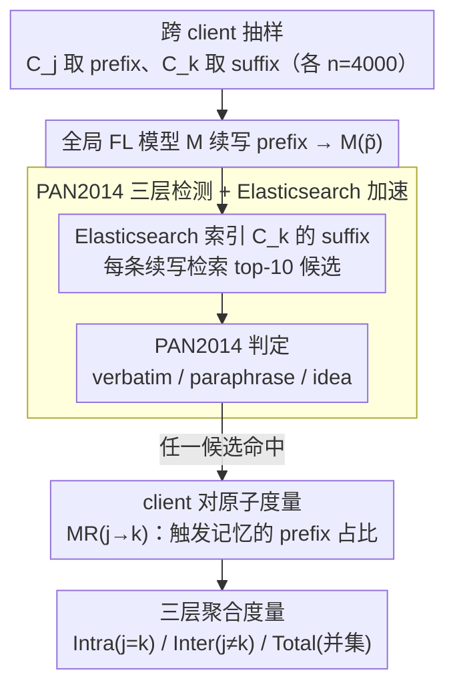

# Exploring Cross-Client Memorization of Training Data in Large Language Models for Federated Learning

**会议**: ACL 2026  
**arXiv**: [2510.08750](https://arxiv.org/abs/2510.08750)  
**代码**: https://github.com/tinnakitudsa/FL_memorization_framework.git  
**领域**: LLM 安全 / 联邦学习 / 隐私  
**关键词**: 联邦学习, 训练数据记忆, 隐私泄露, 跨客户端泄漏, PAN2014

## 一句话总结
作者把集中式 LLM 上的 fine-grained 跨样本记忆度量（Zeng 2024 + PAN2014 抄袭检测器）扩展到联邦学习场景，提出一对 client-pair 度量 $\text{MR}_{j \to k}$ 并由此推导 intra-client / inter-client 记忆比率，发现 FL **并不能**有效防止训练数据记忆——intra-client 记忆比 inter-client 高、但 FL vs CL 总记忆比并无明显下降，且记忆量受 prefix 长度、解码策略、FL 算法（FedProx > FedAvg）显著影响。

## 研究背景与动机
**领域现状**：联邦学习（FL）通过让多个 client 在本地训练、只上传梯度/参数来"避免共享原始数据"，被广泛宣传为医疗、金融等隐私敏感场景的隐私保护范式。但 LLM 在 fine-tuning 阶段会"记住"训练数据（Carlini 2022 等），这种记忆在 FL 下是否还存在、是否会跨 client 泄露，是个尚未系统量化的问题。

**现有痛点**：(a) CL（集中式学习）侧的记忆度量方法（verbatim / k-extractible / paraphrase / idea-level，最先进的是 Zeng 2024 用 PAN2014 plagiarism detector 做三层粒度判断）都隐含"记住的 suffix 只能被同 sample 的 prefix 触发"假设——这在 CL 里合理，但在 FL 里就漏掉了"client A 的 prefix 触发 client B 的 suffix"这种更危险的跨 client 泄露。(b) FL 侧的记忆研究（Thakkar 2021, Ramaswamy 2020）几乎只用 canary injection（向训练数据注入 out-of-distribution 短语然后看模型能否吐出），这只能检测"同 sample verbatim"且只针对 OOD 数据，对真实 in-distribution 跨样本泄露完全失效。

**核心矛盾**：FL 的隐私保护宣传 vs 实际记忆风险之间存在度量空白——既有 CL 的 fine-grained 方法但只支持 same-sample，又有 FL 的 cross-client 场景但只有 canary injection 这种粗粒度工具。

**本文目标**：(1) 把 CL 的跨样本 fine-grained 记忆度量适配到 FL 的多 client 场景；(2) 用这个新框架定量回答两个 RQ：FL 模型到底记不记训练数据？什么因素影响记忆程度？

**切入角度**：直接扩展 Zeng 2024 + Lee 2023 的 PAN2014-based 框架——把判定函数 $F(M(p), s)$ 从 "$p$ 和 $s$ 属于同一 sample"放宽到 "$p$ 来自 client $C_j$、$s$ 来自 client $C_k$"，从而引出 client-pair 度量 $\text{MR}_{j \to k}$。

**核心 idea**：把 "memorization" 从同 sample / 同 client 内部的 prefix-suffix 匹配，扩展为**任意 client 对的 prefix-suffix 匹配**，并据此区分 harm-exposed（同 client：$C_j = C_k$）和 harmful（跨 client：$C_j \neq C_k$）两类风险。

## 方法详解

### 整体框架
框架五步走（图 1 中的步骤①-⑤）：(①) 从 client $C_j$ 的训练集 $D_j$ 抽样 $n=4000$ 个 prefix-suffix 对，并从 client $C_k$ 也抽 $n$ 个 suffix；(②) 把 $C_j$ 的每个 prefix $\tilde{p}$ 输入全局 FL 模型 $M$，生成续写 $M(\tilde{p})$；(③) 用 Elasticsearch 索引 $C_k$ 的 suffix 集合 $\tilde{S}_k$，对每个 $M(\tilde{p})$ 做相似度检索取 top-$n'=10$ 个最像的真实 suffix；(④) 用 PAN2014 抄袭检测器（verbatim / paraphrase $p>0.5$ / paraphrase $p<0.5$ / idea-level 共三层粒度）判定 $M(\tilde{p})$ 是否和 top-$n'$ 中任何一个匹配；(⑤) 任一返回 True 即认为该 prefix 触发了 $C_j \to C_k$ 的记忆，统计比例得 $\text{MR}_{j \to k} = |P_{j,k}| / |P_j|$。

由此衍生两个核心度量：$\text{MR}_{\text{Intra}}$（所有 $j = k$ 的加权平均，表示同 client 内泄露）和 $\text{MR}_{\text{Inter}}$（所有 $j \neq k$ 的平均加权后总平均，表示跨 client 泄露）；为了和 CL 公平比较，又定义 $\text{MR}_{\text{TotalCL}}$ 和 $\text{MR}_{\text{TotalFL}}$（所有触发记忆的 prefix 的并集占比）。

### 关键设计

**1. 从同 sample 假设扩展到 client-pair 度量：让"A 的 prefix 拉出 B 的 suffix"第一次可被量化**

CL 时代的记忆度量都默认"记住的 suffix 只能被同一句的 prefix 触发"，这在集中式下没问题，可一搬到 FL 就漏掉了最危险的那类泄露——client A 的查询把 client B 的私有 suffix 钓出来。作者把判定函数里的同句假设松绑：Definition 3.1 形式化为"存在 $s_k \in S_k$ 使得 $F(M(p_j), s_k) = \text{True}$"，prefix 来自 client $j$、suffix 来自 client $k$，并据此把记忆切成 intra-client（$j=k$，harm-exposed）和 inter-client（$j \neq k$，直接 harmful）两类。在此之上定义 client 对粒度的原子度量 $\text{MR}_{j \to k} = |P_{j,k}| / |P_j|$，上层所有指标都是它的加权聚合。之所以非得用这个 client 对矩阵，是因为旧度量 $|\{p \in P : \exists s, F(M(p), s) = \text{True}\}| / |P|$ 在 FL 下只有两条糟糕的路：要么只算同 client（漏掉跨 client 风险），要么把所有 client 数据混在一起算（分不清 harm-exposed 和 harmful）——而 $\text{MR}_{j \to k}$ 是数学上能同时承载这两种粒度的最小信息单元。

**2. PAN2014 三层 fine-grained 检测器 + Elasticsearch 加速：既不低估改写式记忆，又把 $O(n^2)$ 比对压到可行**

只认逐字匹配（verbatim）会严重低估真实记忆量——模型常常用不同的词复述同一件事；可若要"每个 prefix 比对全部 suffix"，复杂度又是 $O(n^2)$ 跑不动。作者沿用 Zeng 2024 验证有效的设计，用 Lee 2023 改进版的 PAN2014 抄袭检测器同时支持三层粒度：verbatim（字面）、paraphrase（同义改写，再按 $p>0.5$ 高置信与 $p<0.5$ 低置信细分）、idea（概念相似），从而把"换词复述"这种更隐蔽的记忆也抓出来。为了降复杂度，先用 Elasticsearch 给每个 client 的 4000 条 suffix 建索引，对每个续写 $M(\tilde{p})$ 只检索 top-10 候选再跑 PAN2014，把比较次数从 $n \times n = 1.6 \times 10^7$ 砍到 $n \times 10 = 4 \times 10^4$。作者也在 Appendix E.5 诚实交代了这套范式的天花板：PAN2014 是为 human-like text 设计的，遇到 mode collapse 式的不连贯输出（如反复吐 "lobes, lobes, lobes"）会误判成 idea memorization——这是工具本身的内在局限，而非实现 bug。

**3. client-pair 矩阵 → Intra/Inter/Total 三层聚合度量：一个底层矩阵同时回答三类问题**

研究者其实想知道三件不同的事——同 client 内泄露多少、跨 client 泄露多少、FL 比 CL 总体上多记还是少记——但若各设一套独立度量就会割裂、也难公平对照。作者让它们全部由同一个 $\text{MR}_{j \to k}$ 矩阵聚合而来：$\text{MR}_{\text{Intra}} = \sum_j w_j \cdot \text{MR}_{j \to j}$ 取所有对角项的数据量加权平均；$\text{MR}_{\text{Inter}}(j) = \frac{1}{L-1}\sum_{j \neq k} \text{MR}_{j \to k}$ 再加权成 $\text{MR}_{\text{Inter}} = \sum_j w_j \cdot \text{MR}_{\text{Inter}}(j)$（权重 $w_j = |D_j| / \sum_i |D_i|$ 按 client 数据量分配，免得大 client 被小 client 的噪音淹没）；与 CL 对照时则用 $\text{MR}_{\text{TotalFL}} = |\bigcup_{j,k} P_{j,k}| / |\bigcup_j P_j|$。这里关键是 Total 用并集而非求和：同一个 prefix 可能同时记住好几个 client 的 suffix，"只要触发任意泄露就该算一次"，并集才能把"泄露范围广"和"泄露次数多"分开、避免双计。

### 损失函数 / 训练策略
本工作不引入新训练算法，全部沿用现成 FL：FedAvg (McMahan 2017) 和 FedProx (Li 2020) 两个对比基线；模型为 Qwen2.5-3B（主实验）、Llama3.2-1B/3B、GPT-2 XL、Qwen2.5-0.5B/1.5B（消融）；LLaMA Factory 框架 + lr=2e-4 + bf16 + batch=64；3 个 FL clients，每 client 27k 训练 + 3k 测试；默认 prefix 长度 30, top-k 解码 (k=40), 3 轮通信。任务覆盖 summarization（arXiv abstract → title）、dialog（HealthCareMagic 患者-医生对话）、QA（PubMedQA）、classification（PubMed 200k RCT），都是隐私敏感域。

## 实验关键数据

### 主实验
**RQ1: FL 模型是否记忆训练数据？**（Qwen2.5-3B + FedAvg + top-k + prefix=30）：

| 任务 | $\text{MR}_{\text{Intra}}$ (%) | $\text{MR}_{\text{Inter}}$ (%) | Intra/Inter 比 |
|------|--------------------------------|--------------------------------|-----------------|
| Summarization | 0.342 | 0.046 | 7.4× |
| Dialog | 1.533 | 1.446 | 1.06× |
| QA | 1.450 | 0.813 | 1.78× |
| Classification | 0.000 | 0.000 | – |

**FL vs CL 总记忆比对照 + 性能**：

| 任务 | 模型 | Performance | Memorization (%) |
|------|------|-------------|------------------|
| Summarization | $\text{MR}_{\text{TotalCL}}$ | 28.46 | 0.558 |
| Summarization | $\text{MR}_{\text{TotalFL}}$ | 29.88 | 0.433 |
| Dialog | $\text{MR}_{\text{TotalCL}}$ | 19.40 | 3.417 |
| Dialog | $\text{MR}_{\text{TotalFL}}$ | 18.11 | **3.992** |
| QA | $\text{MR}_{\text{TotalCL}}$ | 26.66 | 2.150 |
| QA | $\text{MR}_{\text{TotalFL}}$ | 28.60 | **2.917** |
| Classification | $\text{MR}_{\text{TotalCL}}$ | 76.30 | 0.000 |
| Classification | $\text{MR}_{\text{TotalFL}}$ | 51.22 | 0.000 |

→ Dialog/QA 上 FL 居然**比 CL 多记忆**，反驳了 Thakkar 2021 "FL 减少记忆" 的结论。

### 消融实验

| 配置 | Summa $\text{MR}_{\text{Intra}}$ | Dialog $\text{MR}_{\text{Intra}}$ | QA $\text{MR}_{\text{Intra}}$ | 说明 |
|------|--------|--------|--------|------|
| Decoding: temperature | 0.475 | 1.267 | 1.283 | baseline |
| Decoding: top-k | 0.342 | 1.533 | 1.450 | 略升 |
| Decoding: top-p | **0.525** | **3.792** | **2.567** | top-p 最大放大记忆（Dialog +2x） |
| Prefix 10 | 0.508 | 2.108 | 1.525 | 短 prefix |
| Prefix 30 | 0.342 | 1.533 | 1.450 | 默认 |
| Prefix 50 | 0.425 | 1.575 | 1.242 | 中长 |
| Prefix 100 | **0.208** | **1.408** | **1.125** | 长 prefix → 记忆最少 |
| FL algo: FedAvg | 0.342 | 1.533 | 1.450 | baseline |
| FL algo: FedProx | **0.942** | **1.892** | **3.675** | FedProx 比 FedAvg 多 2-3 倍记忆 |
| Model size 0.5B/1.5B/3B | 0.550 / 0.992 / 0.342 | – | – | 无清晰趋势 |
| Comm rounds 1/3/5 | 0.433 / 0.342 / 0.467 | – | – | 无清晰趋势 |

**Suffix client 来源对记忆的影响**（Dialog 任务，$\text{MR}_{j \to k}$ %）：

| Prefix \ Suffix | Group1 | Group2 | Group3 |
|------|--------|--------|--------|
| Group1 | 1.450 | 1.525 | 1.500 |
| Group2 | 1.150 | 1.200 | 1.225 |
| Group3 | **1.725** | 1.550 | **1.950** |

→ Group3 的 suffix 总是更容易被记住（行平均 1.475），暗示数据集**内容特性**而非 prefix 来源决定了被记忆风险。

### 关键发现
- **FL 不是隐私银弹**：Intra > Inter 的普遍规律说明"client 自己的数据更容易被自己的 prefix 拉出来"是 harm-exposed 风险，但 Inter 也明显非零（Dialog 1.446% 几乎和 Intra 持平）——意味着另一 client 的数据真的可以被"隔壁"拉出来，FL 的隐私保护承诺在 in-distribution 数据上是空头支票。
- **Thakkar 2021 的"FL 减少记忆"结论不成立**：那篇论文用 canary injection（OOD），本文用 in-distribution PAN2014；Dialog 和 QA 上 FL 反而比 CL 记忆更多——说明 OOD canary 测得的"安全"和 in-distribution 真实泄露完全是两回事，过去 5 年 FL 隐私研究有系统性低估。
- **prefix 越长记忆越少**：从 10 到 100 token，$\text{MR}_{\text{Inter}}$ 在 Summa 从 0.188 → 0.004 跌 47 倍。直觉解释：长 prefix 提供了更"独特"的指纹，模型必须精准 reproduce 而非靠模糊匹配——这给攻击者一个反提示：**短 prompt 才是最危险**的隐私探针。
- **top-p / top-k 解码放大记忆**：温度采样最弱，top-p 在 Dialog 上把 Intra 从 1.267 推到 3.792，几乎翻 3 倍——意味着部署 FL LLM 时"更好的解码策略"会带来更多隐私泄露，安全 vs 质量之间存在 trade-off。
- **FedProx > FedAvg 在记忆量上**：FedProx 的 proximal 正则项原本是为非 IID 场景设计的稳定项，但反而让模型更紧地拟合 client 数据导致记忆翻倍；Dialog Intra 从 1.533 → 1.892，QA Intra 从 1.450 → 3.675。这是 FL 算法选择直接影响隐私的硬证据。
- **classification 0% 记忆是工件**：因为 classification 任务的 output 只有 1-2 token（label），生成的 suffix 长度（中位数 1-2 token）短于 PAN2014 的 50 字符匹配阈值，所以测量值被截成 0——不代表真无记忆，而是当前度量盲区。
- **某些 client 更易被记住**：Group3 的 suffix 比其他组容易被记忆 (1.6× Group2)——数据集内容特性（重复模式、词汇分布）才是关键因素，简单按 client 数据量 weight 平均会掩盖这种异质性。

## 亮点与洞察
- **client-pair 矩阵的范式价值**：把 FL 隐私度量从"全局聚合的单一数字"升级为"$L \times L$ 矩阵"，未来工作可以用这个矩阵研究 client 异质性、对抗性 client 行为、defense 的精确投放策略——是一个干净的度量基础设施。
- **诚实承认 PAN2014 局限**：作者明确在 Appendix E.5 给出 mode-collapsed 输出被误判为 idea memorization 的真实案例（"lobes, lobes, lobes"），并写出"用 10 次重复三词序列"的简单过滤启发式，这种透明度比堆数字更可信。
- **挑战既有共识**：Thakkar 2021 的 "FL 减少记忆" 是 FL 隐私圈的标志性结论，本文用 in-distribution + fine-grained 度量首次给出**反例数据**，对整个 FL privacy 研究有重大方法论冲击。
- **prefix 长度反直觉发现**：很多人会以为"长 prefix 提供更多上下文 → 模型更容易'回忆'"，但实验显示恰好相反——长 prefix 让 reproduce 任务变得更"指纹化"也更难达成；这给 prompt-based privacy attack 设计提供了直接策略（短 prompt > 长 prompt）。
- **FedProx 的隐私 cost**：业界普遍把 FedProx 视为 FedAvg 的"无副作用增强版"，但本工作展示了它在隐私维度的 hidden cost——proximal 项让模型更稳定地拟合 client local data，反而记得更牢。

## 局限与展望
- **PAN2014 工件**：(a) 对不连贯输出会假阳性归为 idea memorization；(b) 只支持英文；(c) 50 字符匹配阈值导致短输出任务（classification）测量失效——所有结论受这个工具天花板限制。
- **缺乏理论**：作者承认没有解释"为什么 Intra > Inter"的理论分析——只是观察现象，没有概率/信息论级别的证明。
- **只测了 3 个 client**：现实 FL 场景动辄 100-1000 个 client，3 个 client 的结论是否外推未知；且 client 数变多后 cross-client 检索（每个 $M(\tilde{p})$ 要查 $L-1$ 个其他 client 的 suffix）会变成 $O(L^2)$ 的扩展瓶颈。
- **没有 defense 评估**：本工作只测量了泄露程度，没有评估 differential privacy / gradient clipping / secure aggregation 这些常见 FL defense 在 fine-grained cross-client 度量下的真实效果。
- **模型/通信轮数无明显趋势**：可能是因为搜索范围太小（最大 3B 参数 / 5 轮通信），不能排除更大尺度下出现非线性效应。
- **改进方向**：(1) 设计能正确处理 mode collapse + 跨语言的 fine-grained 度量；(2) 把 client-pair 矩阵用在 client 选择 / 数据精选 / adaptive DP noise 上做 defense；(3) 理论上证明 FedProx proximal 项与记忆量的关系；(4) 扩到 100+ client 的大规模 FL 验证；(5) 用 mechanistic interpretability 找"记忆神经元"在 FL 下的迁移规律。

## 相关工作与启发
- **vs Zeng 2024 (CL fine-grained memorization)**：Zeng 2024 在 CL 上把记忆度量从 verbatim 升级到 paraphrase/idea 三层；本工作直接借用其 PAN2014 pipeline，但把"prefix 和 suffix 同 sample"假设松绑到"跨 client"，并定义了 client-pair 矩阵作为 FL 专用度量层。
- **vs Thakkar 2021 (FL canary injection)**：Thakkar 用 OOD canary 测 FL 是否记忆，结论是"FL 比 CL 安全"；本工作用 in-distribution PAN2014 测，结论恰好相反——说明 canary-based 度量低估了真实泄露，FL 隐私研究需要重新审视。
- **vs Lee 2023 "Do language models plagiarize?"**：Lee 2023 提出 CL 下用 PAN2014 + Elasticsearch 做大规模 plagiarism 检测；本工作把同样的工程框架扩展到 FL 多 client。
- **vs canary injection 流派**（Carlini 2019, Ramaswamy 2020）：canary 适合检测罕见 OOD 模式被记忆，但对真实业务里的常见模式（如 "I have high blood pressure" 这种几千条都有的句子）无能为力；fine-grained 度量是补足这个盲区的必要工具。
- **对其他领域的启发**：cross-client 记忆度量框架可以推广到 cross-organization 数据共享、cross-domain pre-training（如多语言混合 pre-train 后某语言数据是否被另一语言 prompt 拉出来）、cross-modal pre-training（如 image-text 数据互相记忆）等。

## 评分
- 新颖性: ⭐⭐⭐⭐ client-pair 矩阵 + harm-exposed/harmful 二分法是清晰的概念增量；但底层度量工具完全继承 Zeng 2024，理论创新有限。
- 实验充分度: ⭐⭐⭐⭐ 4 任务 × 5 模型 × 4 prefix 长度 × 3 解码 × 2 FL 算法 × 3 通信轮数 + per-category PAN2014 breakdown + client-pair 矩阵 + suffix 来源分析，覆盖度高；但 client 数量只有 3 个偏少。
- 写作质量: ⭐⭐⭐⭐ 论文 5 页正文 + 大量附录组织得清晰，Definition 1/3.1 + Equation 1-5 把度量形式化得简洁；limitation 部分诚实指出 PAN2014 的失败模式。
- 价值: ⭐⭐⭐⭐ 对 FL 隐私研究是重要 wake-up call（FL ≠ 安全）；client-pair 矩阵是后续 defense 工作的好基础；开源代码让 medical/legal 等高 stakes 场景可以直接评估自己的部署。

<!-- RELATED:START -->

## 相关论文

- [\[ACL 2026\] Revisiting Non-Verbatim Memorization in Large Language Models: The Role of Entity Surface Forms](revisiting_non-verbatim_memorization_in_large_language_models_the_role_of_entity.md)
- [\[ICML 2026\] Decoupled Training with Local Reinforcement Fine-Tuning in Federated Learning](../../ICML2026/llm_safety/decoupled_training_with_local_reinforcement_fine-tuning_in_federated_learning.md)
- [\[ACL 2025\] Exploring Forgetting in Large Language Model Pre-Training](../../ACL2025/llm_safety/exploring_forgetting_in_large_language_model_pre-training.md)
- [\[AAAI 2026\] TOFA: Training-Free One-Shot Federated Adaptation for Vision-Language Models](../../AAAI2026/llm_safety/tofa_training-free_one-shot_federated_adaptation_for_vision-language_models.md)
- [\[ACL 2026\] Learning Uncertainty from Sequential Internal Dispersion in Large Language Models](learning_uncertainty_from_sequential_internal_dispersion_in_large_language_model.md)

<!-- RELATED:END -->
