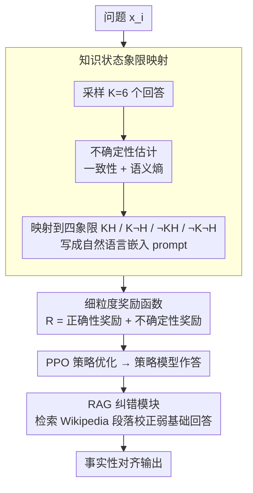

# FAITH: Factuality Alignment through Integrating Trustworthiness and Honestness

**会议**: ACL 2026 Findings  
**arXiv**: [2604.10189](https://arxiv.org/abs/2604.10189)  
**代码**: [https://github.com/xndong/FAITH](https://github.com/xndong/FAITH)  
**领域**: 信息检索  
**关键词**: 事实性对齐、知识状态象限、不确定性估计、PPO、检索增强

## 一句话总结
本文提出FAITH框架，通过将LLM的不确定性信号（一致性+语义熵）映射到自然语言描述的知识状态象限（可信度×诚实度），设计考虑不确定性的细粒度奖励函数进行PPO训练，再用RAG模块纠正潜在错误，系统性提升LLM的事实准确性。

## 研究背景与动机

**领域现状**：LLM可能生成流畅但事实错误的内容（幻觉），即使模型内部拥有正确知识。这种"知道但说不对"的know-tell gap严重损害了可靠性。近期工作尝试在训练中引入不确定性信号来对齐事实性。

**现有痛点**：(1) 现有方法将数值型不确定性分数直接放入QA prompt中（如"Conf: 0.833"），缺乏语义丰富性，LLM难以理解和利用；(2) 使用二值奖励函数（对/错），忽略了回答的置信度，可能鼓励"猜测"行为；(3) 忽视外部知识的使用，未能纠正潜在的错误回答。

**核心矛盾**：LLM的事实性不一致表现为——同一问题在不同表述下可能给出对或错的答案。根本原因是模型的知识拥有状态（是否真的知道）和回答行为（是否诚实表达）之间缺乏对齐。数值型不确定性信号无法帮助模型理解自身的知识边界。

**本文目标**：设计一个后训练框架，将不确定性信号转化为语义丰富的知识状态描述，通过细粒度奖励和外部知识检索来提升LLM的事实准确性和真实性。

**切入角度**：将LLM对每个问题的知识状态分为四个象限——KH（有知识且诚实）、K¬H（有知识但不诚实）、¬KH（无知识但诚实）、¬K¬H（无知识且不诚实），用自然语言描述这些状态并嵌入训练prompt中。

**核心 idea**：用自然语言知识状态替代数值不确定性→细粒度奖励同时考虑正确性和不确定性→RAG模块纠正弱基础的回答。

## 方法详解

### 整体框架
FAITH 想解决的是"模型其实知道答案、却说错了"这个 know-tell gap，整条流水线的核心动作是：先把模型对每个问题的内部不确定性量化出来、翻译成一句人话告诉它"你到底知不知道、该不该答"，再用一个能区分"自信地对"和"蒙对"的奖励把这种自知之明训练进策略里，最后挂一个 RAG 兜底层去纠正那些它确实不懂的题。落到模块上分三段：数据增强阶段对每个问题采样多个回答、估计不确定性并映射到知识状态象限，把象限描述写进训练数据；训练阶段走"参考模型 SFT → 奖励模型 → PPO 策略优化 → RAG 模型"四步；推理阶段则是先估计知识状态、策略模型作答、再由 RAG 纠正。

### 关键设计

**1. 知识状态象限映射：把不透明的置信度数值翻译成模型读得懂的一句人话**

以往做法是直接把 "Conf: 0.833" 这种数字塞进 prompt，但 LLM 根本不擅长从一个裸数值里推断"自己知不知道、该不该答"，这层信号等于白给。FAITH 的做法是先把不确定性测准、再语义化：对每个问题 $x_i$ 采样 $K=6$ 个回答，同时算两个量——一致性 $\text{Consistency}(x_i) = \frac{1}{K}\sum \mathbb{1}\{y_i^k = \hat{y_i}\}$ 衡量"答案稳不稳"，语义熵 $SE(x_i) = -\sum_c p(c|x_i) \log p(c|x_i)$ 衡量"语义上散不散"。两个维度交叉切出四个知识状态象限：一致性 $>0$ 且 $SE=0$ 为 KH（有知识且诚实），一致性 $>0$ 且 $SE\neq0$ 为 K¬H（有知识但不诚实），一致性 $=0$ 且 $SE=0$ 为 ¬KH（无知识但诚实），其余为 ¬K¬H。关键一步是把这些象限用自然语言描述（"你对这个问题有把握且回答一致"之类）嵌进训练 prompt——比起让模型去猜"0.833 意味着什么"，一句直白的状态描述更贴合它的语言理解能力，也才真正帮它认清自己的知识边界。

**2. 细粒度奖励函数：让奖励能分辨"自信地答对"和"运气好蒙对"**

二值奖励只看对错，于是模型会发现"反正答对就有分"，从而养成乱猜的习惯——这正是事实性对齐里最隐蔽的虚高来源。FAITH 把奖励拆成两项 $R_{\text{FAITH}} = R_{\text{correctness}} + R_{\text{uncertainty}}$：正确性奖励仍是标准的精确匹配，而不确定性奖励直接按上一步算出的知识状态发放——KH 给 $+2$、K¬H 给 $+1$、¬KH 给 $-1$、¬K¬H 给 $-2$，叠加后总奖励落在 $-2$ 到 $+3$。这样的分档把训练目标说清楚了：知道就自信地答（KH 最高分），不知道就诚实拒答而非硬编（¬KH 只轻罚），最该打压的是不懂还乱答（¬K¬H 扣到底）。奖励信号从"对/错"两档变成与置信度耦合的连续梯度，模型学到的就不只是答对、而是"在该有把握的地方有把握"。

**3. RAG 纠错模块：给训练后仍力不能及的题加一道外部知识兜底**

PPO 再怎么训，也改变不了模型内部知识本身的覆盖空洞——那些 ¬K 状态的问题，模型确实不掌握答案，靠内部知识只能继续错。FAITH 因此构建了一个基于 Wikipedia 语料的向量数据库，并训练一个 RAG 模型从中检索相关段落当作上下文，去纠正策略模型可能不正确的回答。它被放在策略模型之后、作为整条链路的最后一道事实性校验层，专门补内部知识够不到的部分，这也是知识状态引导和细粒度奖励之外的第三重保障。

### 损失函数 / 训练策略
四阶段训练：(1) SFT 训练参考模型 $\pi_\mu$；(2) 奖励模型训练；(3) PPO 优化策略模型；(4) RAG 模型训练。在 Llama3-8B 和 Mistral-7B-v0.1 上验证，用 NQ-Open、SciQ、TriviaQA 做域内训练，PopQA 做域外测试。

## 实验关键数据

### 主实验（Llama3-8B）

| 方法 | 域内精度 | 域内真实性 | 域外精度 | 域外真实性 |
|------|---------|-----------|---------|-----------|
| 基线平均 | 低 | 低 | 低 | 低 |
| UAlign | 中 | 中 | 中 | 中 |
| FAITH | **74.26%** | **45.73%** | **67.99%** | **34.03%** |

### 消融实验

| 配置 | 精度 | 真实性 | 说明 |
|------|------|--------|------|
| Full FAITH | 最优 | 最优 | 完整框架 |
| w/o 知识状态（用数值） | 下降 | 下降 | 自然语言描述的优势 |
| w/o 不确定性奖励（二值） | 下降 | 下降 | 细粒度奖励的必要性 |
| w/o RAG | 下降 | 下降 | 外部知识的纠错贡献 |

### 关键发现
- 自然语言知识状态描述一致优于数值型不确定性信号，在两个模型和四个数据集上都成立
- 细粒度奖励比二值奖励提供更好的学习信号，减少了"猜对"的虚高性能
- RAG模块在域外泛化上贡献尤其显著——弥补了模型内部知识的覆盖不足
- FAITH在Llama3-8B和Mistral-7B上都超越了5个强基线，证明了跨模型泛化性

## 亮点与洞察
- **知识状态象限的语义化**：将不透明的不确定性数值转化为"有知识且诚实/不诚实"等自然语言描述，使LLM能在训练中理解自身的知识边界。这比让模型学习"0.833意味着什么"更符合LLM的能力特点。
- **区分"确信地对"和"猜对了"**：通过不确定性奖励惩罚低置信度的正确回答，减少了虚高性能。这对高风险场景（如医疗、法律）尤为重要。
- **三层事实性保障**：知识状态引导（认识自我）→细粒度奖励（正确行为）→RAG纠错（外部校验），形成完整的事实性保障链。

## 局限与展望
- 知识状态估计需要对每个问题采样多个回答（K=6），推理时有额外开销
- 四象限划分可能过于简化——实际的知识状态可能是连续的而非离散的
- RAG模块依赖Wikipedia语料库，对最新知识或专业领域可能覆盖不足
- PPO训练的计算成本较高，可能不适合大规模模型

## 相关工作与启发
- **vs UAlign**：UAlign在prompt中直接使用数值不确定性和二值奖励。FAITH用自然语言状态和细粒度奖励，提供更丰富的信号
- **vs R-Tuning**：R-Tuning教模型在不确定时拒绝回答，但不区分知识拥有和回答行为的细粒度差异
- **vs 自一致性方法**：自一致性通过多次采样检测不确定性，FAITH将此信号转化为训练信号而非仅用于推理

## 评分
- 新颖性: ⭐⭐⭐⭐ 知识状态象限和细粒度奖励的组合是有洞察力的设计
- 实验充分度: ⭐⭐⭐⭐ 四个数据集、两个模型、五个基线、详细消融
- 写作质量: ⭐⭐⭐⭐ 框架描述清晰，公式推导完整
- 价值: ⭐⭐⭐⭐ 为LLM事实性对齐提供了实用且可解释的方法

<!-- RELATED:START -->

## 相关论文

- [\[ACL 2025\] UAlign: Leveraging Uncertainty Estimations for Factuality Alignment on Large Language Models](../../ACL2025/llm_safety/ualign_leveraging_uncertainty_estimations_for_factuality_alignment_on_large_lang.md)
- [\[ACL 2025\] ComparisonQA: Evaluating Factuality Robustness of LLMs Through Knowledge Frequency Control and Uncertainty](../../ACL2025/llm_safety/comparisonqa_evaluating_factuality_robustness_of_llms_through_knowledge_frequenc.md)
- [\[ACL 2026\] Permutation-Consensus Listwise Judging for Robust Factuality Evaluation](permutation-consensus_listwise_judging_for_robust_factuality_evaluation.md)
- [\[ICLR 2026\] AudioTrust: Benchmarking the Multifaceted Trustworthiness of Audio Large Language Models](../../ICLR2026/llm_safety/audiotrust_benchmarking_the_multifaceted_trustworthiness_of_audio_large_language.md)
- [\[NeurIPS 2025\] VMDT: Decoding the Trustworthiness of Video Foundation Models](../../NeurIPS2025/llm_safety/vmdt_decoding_the_trustworthiness_of_video_foundation_models.md)

<!-- RELATED:END -->
