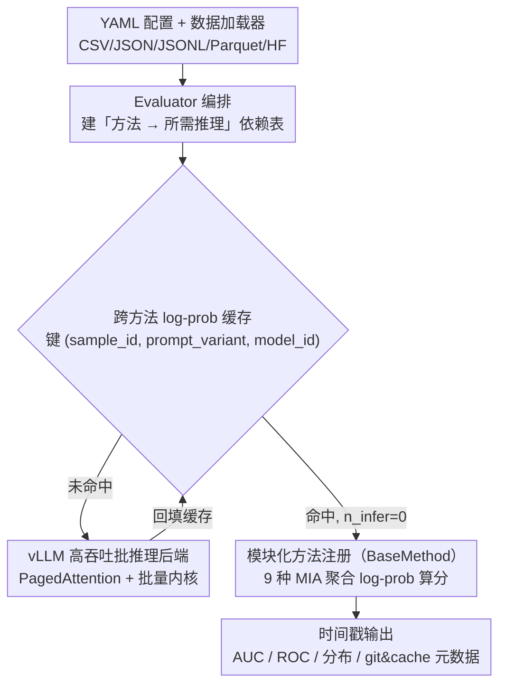

# Fast-MIA: Efficient and Scalable Membership Inference for LLMs

**会议**: ACL 2026  
**arXiv**: [2510.23074](https://arxiv.org/abs/2510.23074)  
**代码**: https://github.com/Nikkei/fast-mia (有)  
**领域**: LLM 安全 / 隐私 / 成员推理攻击 / 评测工具  
**关键词**: Membership Inference、vLLM、跨方法缓存、WikiMIA、MIMIR

## 一句话总结
Fast-MIA 把 9 种主流 LLM 成员推理攻击（MIA）方法塞进同一个 vLLM 批量推理引擎，并加一层跨方法 log-prob 缓存，使评测在 LLaMA-30B / WikiMIA 上整体加速约 5×（SaMIA 单方法加速 19.5×）、AUC 几乎不变，让大规模 MIA 审计第一次变得真的"跑得起"。

## 研究背景与动机
**领域现状**：LLM 记忆训练数据会带来隐私泄漏、版权侵权、benchmark 污染三类风险。MIA（Membership Inference Attack）是审计这些风险的标准武器：给定模型 $f$ 和样本 $x$，判断 $x$ 是否在训练集里。围绕 LLM 已有 LOSS、Min-K% Prob、DC-PDD、ReCaLL、Con-ReCaLL、PAC、SaMIA 等十多种方法。

**现有痛点**：1) 新方法越来越"重"——文本扰动类（ReCaLL/Con-ReCaLL）一个样本要跑多次 prefix；黑盒类（SaMIA）要采样多次生成；Puerto 等人证明只有把 MIA 推到 dataset 级聚合才真正有用，这都推高了算力门槛。2) 每篇论文自带的实现互相独立，PPL/zlib、Min-K%、DC-PDD 这些其实共享同一份 log-prob，却被各自重复算了一遍。3) 已有 toolkit（LLM-Sanitize 等）要么停更要么没缓存。

**核心矛盾**：MIA 评测是"重计算 × 多方法 × 大规模 dataset"的三重外积，而现有实现把后两维都按线性串起来，根本跑不动；缺一个能在系统层共享中间结果、又用 vLLM 把单次推理打满的统一框架。

**本文目标**：做一个开源 Python 库，让"同一模型 × 同一数据 × 多种 MIA 方法"这个常见 sweep 跑一次推理就够。

**切入角度**：作者注意到 MIA 方法在数学上的"shared substrate"——绝大多数 token-distribution / text-alternation 方法本质上只是在 $\log p(c_t \mid c_{1..t-1})$ 上做不同的聚合 / 比较；只要把每条样本的 token-level log-prob 缓存一次，几乎所有方法的"第一遍推理"就免费了。

**核心 idea**：vLLM 高吞吐批推理 + 跨方法 log-prob 缓存 + 模块化方法注册，统一在 YAML 里配置就能跑 9 种 MIA。

## 方法详解

### 整体框架
Fast-MIA 是个 YAML-config-driven 的评测库，由六块拼起来：(1) Data Loader 吃 CSV/JSON/JSONL/Parquet/HF 五种格式；(2) Model Loader 通过 vLLM 加载 HF 模型或 LoRA adapter（支持量化）；(3) Evaluator 负责按需触发推理 + 维护缓存 + 调方法；(4) MIA Method Registry 用 `BaseMethod` 基类登记每种攻击；(5) YAML Config Interface 把 model / data / methods / sampling 全部声明化；(6) 输出 timestamped 目录，含 metrics、ROC、score 分布、git/cache 元数据。串起来看，Evaluator 先按方法声明的"所需推理类型"查缓存，命中就免推理、未命中才落到 vLLM 后端跑一遍并回填缓存，最后各方法只需把缓存里的 log-prob 聚合成分数。

### 关键设计

**1. vLLM 高吞吐批推理后端：把单样本串行的推理换成工业级批量内核**

原作者的 MIA 实现普遍用 HF Transformers 一条样本一条样本地跑，而 `generate` 在 batch 之外几乎没有吞吐红利，这正是大规模评测跑不动的第一道瓶颈。Fast-MIA 直接换上 vLLM：它的 PagedAttention 把 KV cache 切页存储并配合 dynamic batching，让一条样本的 prompt 能和上百条样本共池推理。针对方法的不同需求做两种适配——对 LOSS / Min-K / DC-PDD 这类只要 prompt log-prob 的方法，设上 `max_tokens=1, prompt_logprobs=0` 一次性把所有 token-level log-prob 算完；对 SaMIA 这种要多次生成的方法，把原来"per-sample loop + 多次生成"重写成 vLLM 的 batched multi-output generation，避免每条样本独立 spawn。选 vLLM 而非自己造轮子，是因为它是现成的工业级 serving 内核，迁移成本低、收益直接——实测整体约 $5\times$，generation-heavy 的 SaMIA 高达 $19.5\times$。

**2. 跨方法 log-prob 缓存：让所有共享同一份 log-prob 的方法只算一次推理**

作者注意到一个被所有旧 toolkit 漏掉的浪费：PPL/zlib、各种 Min-K%、DC-PDD 这些方法在数学上其实共用同一份 $\log p(c_t \mid c_{1..t-1})$，只是在它上面做不同的聚合或比较，却被各篇实现各自重算了一遍；尤其 Min-K%（$K \in \{0.1, 0.2, 0.3, 0.5, 0.8, 1.0\}$）这种超参 sweep，跑 6 次推理纯属重复劳动。Fast-MIA 在 Evaluator 里建一张"方法 → 所需 inference 类型"的依赖表，把 inference 的输入输出按 $(\text{sample\_id}, \text{prompt\_variant}, \text{model\_id})$ 三元组键化缓存——LOSS / PPL/zlib / 所有 Min-K%-$K$ / DC-PDD 共享同一份原文 log-prob，Lowercase 只触发一个 "lowercased prompt" 新缓存键，ReCaLL/Con-ReCaLL 触发"加 prefix"版本；命中缓存时该方法的推理调用次数 $n_\text{infer}=0$，第二遍起几乎免费。本质上它把评测从 $O(\text{方法数} \times \text{样本数})$ 次推理压到 $O(\text{独立 prompt 变体数} \times \text{样本数})$。

**3. 模块化方法注册 + 多语言支持：让社区一周内就能贴一个新攻击上来**

MIA 还在快速演化，硬编码一套固定方法集很快就过时。Fast-MIA 把"调推理 + 用缓存 + 算分"三步抽进 `BaseMethod` 基类，新方法只要实现 `process_output` 和 `run` 两个函数、再到 `factory.py` 注册就能挂上 pipeline——方法作者只需关心怎么把缓存的中间结果聚合成 membership score，底层的推理和缓存逻辑都不用碰。同时暴露一个 `space_delimited_language` flag 处理中文、日文这类不以空格分词的语言，这是因为作者此前的工作已经证明日文 MIA 呈现出与英文不同的 trend，多语言开关是必要而非锦上添花。

### 损失函数 / 训练策略
没有训练，所有方法都是 inference-only。评测指标包括 AUC、FPR@95（95% TPR 时的 FPR）和 TPR@5（5% FPR 时的 TPR），后两者按 Carlini 2022 的建议给出 low-FPR 端表现。

## 实验关键数据

### 主实验
LLaMA-30B、WikiMIA、token length=32、NVIDIA A100 80GB，左 = Fast-MIA / 右 = HF Transformers：

| 方法 | AUC (FM / Tr) | 时间 (FM / Tr) | 加速 | FPR@95 |
|------|---------------|----------------|------|--------|
| LOSS | 69.4 / 69.4 | 12s / 57s | ×4.75 | 84.3 / 84.3 |
| Min-K% Prob (K=0.2) | 69.3 / 69.3 | 12s / 57s | ×4.75 | 82.3 / 82.3 |
| DC-PDD | 67.4 / 67.4 | 12s / 57s | ×4.75 | 84.8 / 84.8 |
| Lowercase | 64.1 / 64.1 | 25s / 1m59s | ×4.76 | 83.5 / 83.8 |
| PAC | 73.3 / 73.4 | 1m17s / 6m24s | ×4.99 | 82.3 / 77.9 |
| ReCaLL | 90.7 / 90.3 | 55s / 2m10s | ×2.36 | 28.5 / 34.7 |
| Con-ReCaLL | 96.8 / 96.1 | 1m53s / 3m30s | ×1.86 | 10.8 / 12.9 |
| SaMIA | 65.5 / 64.5 | 2h3m / 40h10m | **×19.5** | 90.5 / 90.7 |

AUC 几乎完全一致（baseline/token-distribution 类 0 差异；生成类有 <1 点波动来自采样随机性）。

### 消融实验
关掉跨方法缓存只剩 vLLM 加速 vs 全开 vs HF baseline（不含 SaMIA，因为太慢）：

| 配置 | 总时间 | 总推理次数 | 说明 |
|------|--------|------------|------|
| Fast-MIA w/ cache | **3m54s** | **10** | 完整方案 |
| Fast-MIA w/o cache | 5m18s | 17 | 只剩 vLLM 加速 |
| Transformers (per-paper impl) | 17m51s | 17 | 原始 baseline |

可以拆出来看：vLLM batch 推理把 17m51s → 5m18s（≈3.4× 系统级加速），跨方法 cache 把 17 次推理压到 10 次、5m18s → 3m54s（≈1.4× 算法级加速）。两者乘起来才是端到端 ≈4.6×。

### 关键发现
- **PPL/zlib / Min-K%-(0.1..1.0) / DC-PDD 在 cache 命中时全是 0 秒** — 这五大方法跟 LOSS 共用同一份原文 log-prob，缓存把"hyperparameter sweep × 方法 sweep"两条维度同时摊平。
- **SaMIA 加速最猛（×19.5）**，因为它把"每条样本生成 5 次"的串行循环换成了 vLLM 的 batched multi-output——这种 generation-heavy 方法收益远超 prompt-only 方法。
- **AUC 基本无损失**，说明加速纯粹来自系统/缓存而非数值近似，可放心做大规模重做。

## 亮点与洞察
- "跨方法 cache" 的思路看似无聊，本质上把 MIA 评测从 "$O(\text{方法数} \times \text{样本数})$ 次推理" 压到 "$O(\text{独立 prompt 变体数} \times \text{样本数})$"。一旦你做 hyperparameter sweep 收益会被进一步放大，这点对所有跑评测的库都是可迁移 trick。
- 用 vLLM 而不是 HF Transformers 做评测后端是个少有人正视的工程现实——以前评测库大多懒得迁，Fast-MIA 直接证明这一步是 free lunch。
- YAML 单文件 = 一次实验 + 自动 timestamped 输出 + git/cache 元数据，这套规范化让 MIA 这种容易陷入"reproducibility crisis"的领域第一次有了 reasonable baseline 工具。

## 局限与展望
- 方法覆盖只到 9 种，dataset 级 MIA（Maini/Puerto 等）还没接进来。
- 模型支持依赖 vLLM 后端，encoder-only / encoder-decoder 模型用不了；闭源 API 模型也仅在理论上可做黑盒方法。
- 评测维度只跑了 1 模型 × 1 dataset × 1 长度，没有刻意 sweep 模型规模 / context length / hardware，加速比泛化到其他配置时可能波动。
- 实现仍是"自定义 plug-and-play"，自定义 metric / report 还需要改主循环代码，未来计划接进 YAML。

## 相关工作与启发
- **vs LLM-Sanitize (Ravaut 2025)**: 同样是多方法 toolkit，但 LLM-Sanitize 锁死 vLLM 0.3.3 且 2024 年起停更；Fast-MIA 用 vLLM 0.15.1 并显式做了 cross-method cache，可维护性差了一代。
- **vs MIMIR (Duan 2024) / Privacy Meter (Murakonda 2020)**: 这些是研究项目自带的 batch 实现，未做 vLLM + cache 集成；Fast-MIA 把它们作为参考接进同一框架做对比。
- **vs Chen 2025 综述实现**: 论文做了最全的方法对比但没开源，Fast-MIA 等于把那个对比矩阵真正"跑得起来"。

## 评分
- 新颖性: ⭐⭐⭐ 工程整合为主，没引入新攻击方法或新 metric，但跨方法 cache 这一点确实之前没人做。
- 实验充分度: ⭐⭐⭐ 单模型单数据集足以证明加速比，但缺少在不同 backbone / 不同 dataset 上的 scaling 曲线。
- 写作质量: ⭐⭐⭐⭐ 表 1 把同类库的能力点对比一清二楚，YAML 例子直接可复制。
- 价值: ⭐⭐⭐⭐⭐ 工具论文里少见的"装上就比之前快 5 倍"的实用品，对 MIA / 数据污染审计研究社区是即时收益。

<!-- RELATED:START -->

## 相关论文

- [\[ACL 2026\] Membership Inference Attacks on In-Context Learning Recommendation](membership_inference_attacks_on_llm-based_recommender_systems.md)
- [\[ACL 2026\] Do Multimodal RAG Systems Leak Data? A Comprehensive Evaluation of Membership Inference and Image Caption Retrieval Attacks](do_multimodal_rag_systems_leak_data_a_comprehensive_evaluation_of_membership_inf.md)
- [\[ICLR 2026\] Membership Inference Attacks Against Fine-tuned Diffusion Language Models (SAMA)](../../ICLR2026/llm_safety/membership_inference_attacks_against_fine-tuned_diffusion_language_models.md)
- [\[NeurIPS 2025\] CryptoMoE: Privacy-Preserving and Scalable Mixture of Experts Inference via Balanced Expert Routing](../../NeurIPS2025/llm_safety/cryptomoe_privacy-preserving_and_scalable_mixture_of_experts_inference_via_balan.md)
- [\[ICLR 2026\] No Caption, No Problem: Caption-Free Membership Inference via Model-Fitted Embeddings](../../ICLR2026/llm_safety/no_caption_no_problem_caption-free_membership_inference_via_model-fitted_embeddi.md)

<!-- RELATED:END -->
