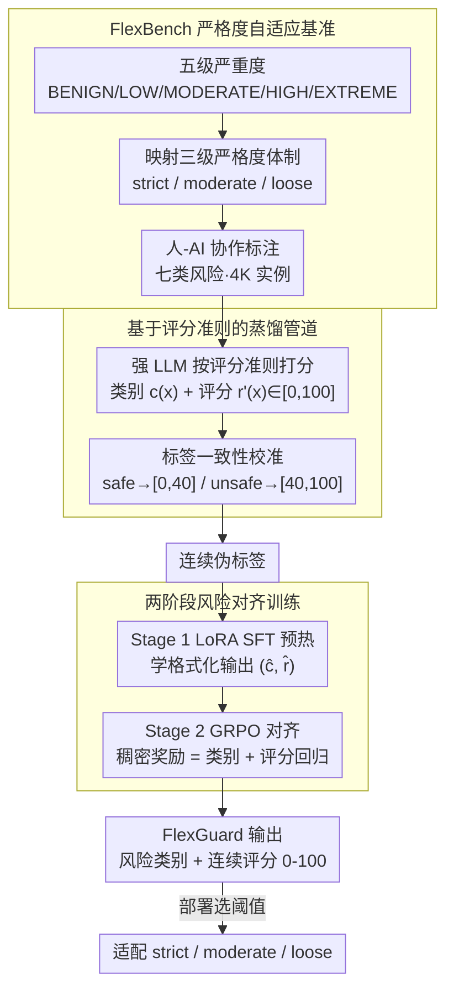

# FlexGuard: Continuous Risk Scoring for Strictness-Adaptive LLM Content Moderation

**会议**: ACL 2026  
**arXiv**: [2602.23636](https://arxiv.org/abs/2602.23636)  
**代码**: [GitHub](https://github.com/)  
**领域**: AI 安全 / 内容审核  
**关键词**: 内容审核, 连续风险评分, 严格度自适应, LLM 安全, 强化学习

## 一句话总结

FlexGuard 提出了一种输出连续风险评分（0-100）而非二元安全/不安全判断的 LLM 审核模型，通过基于评分准则的蒸馏和 GRPO 风险对齐训练，在不同严格度部署场景下实现了 SOTA 的鲁棒性和准确率。

## 研究背景与动机

**领域现状**：LLM 内容审核模型（LlamaGuard、WildGuard 等）已发展出多代产品，广泛用于检测用户输入和模型输出中的有害内容。绝大多数现有审核模型将内容审核定义为固定的二元分类任务。

**现有痛点**：执法严格度（enforcement strictness）——即平台对"有害"的保守程度——在不同平台和不同时期显著不同。例如 X 平台允许适当标注的成人内容，而某些 Reddit 社区要求全年龄内容。二元审核模型隐式绑定于训练数据的安全定义，无法适应变化的严格度需求，导致跨严格度性能不一致：Qwen3Guard 在 prompt 审核中从 strict 到 loose 下降 19.2%。

**核心矛盾**：审核决策的"安全/不安全"边界不是固定的，而是随部署环境变化的，但现有模型和基准都假设单一固定的安全定义。

**本文目标**：(1) 构建能在不同严格度下评估审核模型的基准（FlexBench）；(2) 设计能适应严格度变化的审核模型（FlexGuard）。

**切入角度**：将二元分类替换为连续风险评分，严格度适配退化为简单的阈值选择问题。通过评分准则引导的蒸馏获取连续标签，再用 GRPO 强化学习优化评分-严重度一致性。

**核心 idea**：输出校准的连续风险分数 + 部署时选择阈值 = 严格度自适应审核。

## 方法详解

### 整体框架

FlexGuard 想解决的核心问题是：不同平台、不同时期对"有害"的执法严格度并不一样，而二元审核模型把安全边界焊死在了训练数据里，换个严格度就失灵。它的破题思路是把"安全/不安全"的二分类换成 0-100 的连续风险评分，这样严格度适配就退化成一次阈值选择。整套工作分两半：一半是 **FlexBench**——一个带严格度标注的基准，4K 实例覆盖七类风险和五级严重度，支持 strict/moderate/loose 三种评估模式；另一半是 **FlexGuard**——基于 Qwen3-8B 的审核模型，先用评分准则蒸馏出连续标签，再经 SFT 预热 + GRPO 对齐两阶段训练，学会输出风险类别和连续评分，部署时只需调阈值就能贴合不同严格度。

### 关键设计

**1. FlexBench 严格度自适应基准：把"严格度"这个变量第一次显式拉进评测**

现有审核基准都用固定的二元标签，模型在严格度变化时到底稳不稳，根本无从评估。FlexBench 的做法是先定义五级严重度（BENIGN/LOW/MODERATE/HIGH/EXTREME），再把它映射成三种严格度体制——strict（只有 BENIGN 算安全）、moderate（BENIGN+LOW 安全）、loose（BENIGN+LOW+MODERATE 安全）。这样同一条数据在不同体制下的安全/不安全标签会变，于是就能量出一个模型从 strict 到 loose 掉多少分。数据覆盖七类风险（暴力/违法/色情/隐私/歧视/虚假信息/越狱），含 2K prompt 和 2K 响应实例，标注走人-AI 协作：LLM 先生成候选标签，五名人工标注者验证修正，不一致的交由高级标注者终裁，保证严重度分级的可靠性。

**2. 基于评分准则的蒸馏管道：用准则把强模型的判断"翻译"成连续分，还得跟旧标签对齐**

公开审核语料几乎只有二元标签，直接人工标连续分成本太高，所以 FlexGuard 让强 LLM（如 GPT-5）在专家设计的评分准则引导下，为每条实例生成风险类别 $c(x)$、评分 $r'(x)\in[0,100]$ 和推理过程。但 LLM 自由打分会和源数据集已有的二元标签打架，于是关键的一步是**标签一致性校准**：把原始分数 $r'(x)$ 线性映射到与标签一致的区间（safe 落 $[0,40]$、unsafe 落 $[40,100]$），并压掉那些跨过边界的异常值。这一步既保住了 LLM 大规模产标的便利，又让伪标签不和已有监督信号冲突。

**3. 两阶段风险对齐训练：SFT 给个稳的起点，GRPO 直接拧紧"分数贴合严重度"**

光靠 SFT 模型只学会了格式、学不深评分一致性，而直接上强化学习又容易不稳，所以拆成两段。Stage 1 用 LoRA SFT 预热，教模型跟着准则推理并输出格式化的 $(\hat{c}(x),\hat{r}(x))$；Stage 2 用 GRPO 强化学习，设计稠密奖励 $R(x)=s_{\text{category}}(x)+s_{\text{score}}(x)$，其中类别准确性奖励 $s_{\text{category}}\in\{-1,+1\}$，评分回归奖励

$$s_{\text{score}}=2-\frac{4}{E_{\max}}\,|\hat{r}(x)-r(x)|\in[-2,2]$$

用 $E_{\max}$ 归一化让不同目标分数下的误差可比。这种线性回归式的稠密奖励比二元奖励能给出更丰富的梯度信号——模型不只是知道"判错了"，还知道"差了多远、往哪个方向修"，这正是评分质量能被持续打磨的来源。

### 损失函数 / 训练策略

两阶段训练：Stage 1 标准 SFT with LoRA，Stage 2 GRPO 使用类别准确性 + 评分回归的组合稠密奖励。在 8×H20 GPU 上训练。

## 实验关键数据

### 主实验

**FlexBench 严格度自适应审核（Harmfulness F1 %）**

| 方法 | Prompt Avg | Prompt Worst | Response Avg | Response Worst |
|------|-----------|-------------|-------------|---------------|
| GPT-5 | 73.26 | 70.95 | 77.43 | 74.07 |
| Qwen3Guard-8B | 75.10 | 67.06 | 76.61 | 69.16 |
| BingoGuard-8B | 74.22 | 68.31 | 76.59 | 74.80 |
| **FlexGuard (校准阈值)** | **81.78** | **78.26** | **80.29** | **75.81** |

### 消融实验

| 配置 | 关键指标 | 说明 |
|------|---------|------|
| FlexGuard 完整 | Avg 81.78 / Worst 78.26 | 最优 |
| 仅 SFT（无 GRPO） | 下降 | 评分-严重度一致性不足 |
| 无标签一致性校准 | 下降 | 跨边界异常值增多 |
| 准则阈值（无校准） | 80.29 / 76.63 | 仍竞争力强 |

### 关键发现

- FlexGuard 的跨严格度性能下降显著低于竞品：Prompt 上 best-worst 差仅 5.73%，而 Qwen3Guard 为 15.95%，BingoGuard 为 13.52%
- 准则阈值不需要验证集即可获得竞争力强的性能（Prompt Avg 80.29），校准阈值进一步提升约 1.5%
- 在公开基准（无严格度变化）上，FlexGuard 也达到或超过 SOTA（Prompt Avg 85.36，Response Avg 87.85）
- GRPO 阶段显著提升评分质量：评分的 MAE 下降，跨严重度的评分分布更加分离

## 亮点与洞察

- 将内容审核从"分类问题"重新定义为"风险评估问题"，连续评分+阈值选择的设计优雅地将模型能力与部署需求解耦
- 标签一致性校准是关键技术细节——将 LLM 蒸馏的分数与已有二元标签对齐，解决了伪标签质量问题
- 稠密的线性回归奖励设计（而非常见的二元奖励）为 GRPO 提供了更丰富的梯度信号

## 局限与展望

- FlexBench 目前仅支持英文，多语言场景下的严格度适配行为未知
- 三级严格度可能不够精细——实际部署中可能需要更连续的调控
- 连续评分的可解释性有待加强——用户可能需要理解分数的含义
- 未测试对抗性输入（越狱攻击）下的评分稳定性

## 相关工作与启发

- **vs LlamaGuard/WildGuard**: 这些模型输出二元标签，通过 logit 阈值适配严格度效果不佳；FlexGuard 原生输出连续分数
- **vs BingoGuard/PKU-SafeRLHF**: 输出离散严重度级别，粒度有限；FlexGuard 的连续评分提供更精细的风险区分

## 评分

- 新颖性: ⭐⭐⭐⭐ 问题定义（严格度自适应审核）新颖且实用，连续评分方案自然合理
- 实验充分度: ⭐⭐⭐⭐⭐ 自建基准+公开基准，多基线对比，消融完整
- 写作质量: ⭐⭐⭐⭐ 结构清晰，问题动机充分，部分细节可更简洁
- 价值: ⭐⭐⭐⭐⭐ 直接面向产业部署痛点，FlexBench 可成为审核评估的新标准

<!-- RELATED:START -->

## 相关论文

- [\[ACL 2026\] CarO: Chain-of-Analogy Reasoning Optimization for Robust Content Moderation](caro_chain-of-analogy_reasoning_optimization_for_robust_content_moderation.md)
- [\[ACL 2026\] Making MLLMs Blind: Adversarial Smuggling Attacks in MLLM Content Moderation](making_mllms_blind_adversarial_smuggling_attacks_in_mllm_content_moderation.md)
- [\[ICLR 2026\] ExpGuard: LLM Content Moderation in Specialized Domains](../../ICLR2026/llm_safety/expguard_llm_content_moderation_in_specialized_domains.md)
- [\[ACL 2026\] RISK: A Framework for GUI Agents in E-commerce Risk Management](risk_a_framework_for_gui_agents_in_e-commerce_risk_management.md)
- [\[ACL 2026\] Rethinking Jailbreak Detection of Large Vision Language Models with Representational Contrastive Scoring](rethinking_jailbreak_detection_of_large_vision_language_models_with_representati.md)

<!-- RELATED:END -->
