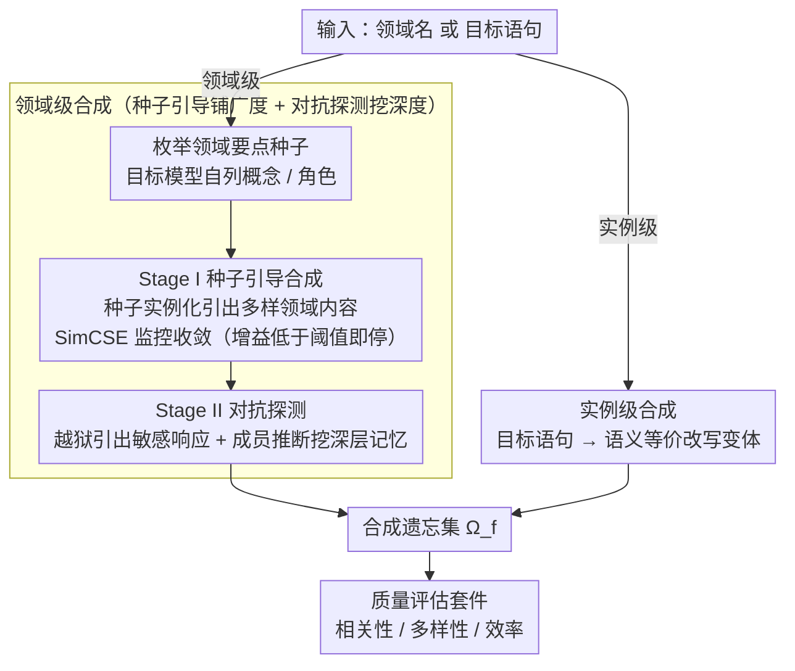

# From Domains to Instances: Dual-Granularity Data Synthesis for LLM Unlearning

**会议**: ACL 2026  
**arXiv**: [2601.04278](https://arxiv.org/abs/2601.04278)  
**代码**: [GitHub](https://github.com/XiaoyuXU1/Biforget)  
**领域**: LLM评测  
**关键词**: 机器遗忘, 遗忘集合成, 领域级遗忘, 实例级遗忘, 对抗探测

## 一句话总结

本文形式化定义了领域级和实例级两种 LLM 遗忘粒度，提出 BiForget 框架——利用目标模型自身（而非外部强模型）通过种子引导合成和对抗探测两阶段生成高质量遗忘数据集，在 Harry Potter 领域将相关性提升约 20、多样性提升约 0.05 同时数据量减半。

## 研究背景与动机

**领域现状**：LLM 训练在海量语料上容易记忆隐私、有害或版权内容。机器遗忘通过微调方法（梯度上升、NPO 等）在定义好的遗忘集和保留集上优化，使模型行为接近从未见过目标数据的状态。

**现有痛点**：(1) 现有遗忘基准的遗忘集往往不能准确反映模型的真实内部知识——可能高估或低估遗忘效果；(2) 基准构建高度依赖人工策划（如 WMDP 需要手动收集领域文本），难以扩展；(3) 现有工作（如 TOFU）使用模板化 QA 对，模型只需抑制表面模式就能"通过"遗忘评估，但换个措辞就能恢复目标知识；(4) 依赖外部强模型（如 GPT-4o-mini）生成遗忘数据会导致合成数据与目标模型知识边界不匹配。

**核心矛盾**：有效的遗忘必须针对底层信息而非表面形式——语义等价变体（改写、重排序）即使在逐字样本被移除后仍可能泄露。但现有遗忘集仅覆盖训练语料中的原始文本 $D^{real}_f$，未扩展到理想遗忘集 $D^{ideal}_f$。

**本文目标**：(1) 形式化定义领域级和实例级两种遗忘粒度；(2) 设计自动化框架生成与目标模型内部知识分布对齐的高质量遗忘数据集；(3) 提出统一的质量评估套件。

**切入角度**：让目标模型自己生成遗忘数据——这样合成数据天然与模型的知识边界对齐，避免外部模型引入的分布不匹配问题。

**核心 idea**：通过"种子引导合成（广覆盖）+ 对抗探测（挖深层知识）"两阶段策略，让目标模型自己暴露其记忆的知识，构建出更忠实于模型真实知识分布的遗忘数据集。

## 方法详解

### 整体框架

BiForget 支持领域级和实例级两种遗忘粒度。领域级采用两阶段设计：Stage I 种子引导合成（用模型生成的领域要点实例化提示模板，引出多样领域内容）+ Stage II 对抗探测（越狱和成员推断攻击挖掘深层记忆内容）。实例级采用信息改写策略（生成目标语句的多样语义等价变体）。两条粒度路径产出的内容汇成统一的合成遗忘集 $\Omega_f$，再交给质量评估套件度量。输入是领域名或目标语句，输出是高质量合成遗忘集 $\Omega_f$。

### 关键设计

**1. 领域级合成：种子引导先铺广度，对抗探测再挖深度**

领域级遗忘要覆盖整个目标领域，但仅靠启发式提示会漏掉隐含知识和风格变体——模型记住的东西远比"直接问"问出来的多。BiForget 把它拆成两个互补阶段。预处理时先让目标模型自己枚举领域要点种子（概念、角色等），Stage I 再用 QA 风格和信息综合模板把种子实例化，从目标模型引出多样领域内容；其间靠温度变化促进多样性，用 SimCSE 监控语义收敛，当新增内容带来的增量收益低于阈值 $\epsilon=0.001$ 时停止扩张。光有广度还不够，Stage II 接着用越狱提示引出安全敏感响应，再用成员推断（Min-k% token 概率超过阈值 $\tau$ 即判为"被记住"）识别那些标准提示触及不到的深层编码知识。两阶段缺一不可——消融里去掉越狱或成员推断中的任一个，隐私泄露都会显著回升（分别 +7.58 / +6.59）。

**2. 实例级合成：用语义等价改写逼遗忘对准内容而非措辞**

实例级针对的是具体语句，难点在于 TOFU 这类基准用模板化 QA 对，模型只要抑制表面模式就能"通过"评估，换个措辞知识就漏回来了。BiForget 把目标语句当种子，提示模型从不同视角、结构和风格生成改写变体 $x^* \sim q_{inst}$，让遗忘算法被迫去对齐底层语义而非字面形式。由于改写引入的语义偏移很小、收敛很快（通常一轮内完成），这里反而要靠设置较大的多样性批次 $d_{inst}$ 来延迟收敛检查，避免过早停下导致变体覆盖不足。

**3. 统一质量评估套件：用三个客观指标替代有偏的 LLM 判断**

先前工作常让 LLM 来判断合成数据相关不相关，既引入偏差又忽略了生成效率，且依赖根本拿不到的"理想遗忘集"做参照。BiForget 改用三个无需金标准的客观指标：相关性采样 1,000 实例、计算样本到领域关键词质心的 t-SNE 距离（越小越贴题）；多样性用 remote-clique 捕获语义层面的变化，比只看表面 n-gram 重叠的 Self-BLEU 更能反映真实多样性；效率直接数 128-token chunk 的数量（越少说明同等信息更紧凑）。三者合起来给出一套可复现、可横向对比的质量标尺。

### 损失函数 / 训练策略

BiForget 本身是数据合成框架，不涉及模型训练。合成数据用于下游遗忘算法（GA、NPO、OBLIVIATE 等）的 fine-tuning。静态提示模板由 GPT-5 离线生成一次，所有合成数据由目标模型自身产出。

## 实验关键数据

### 主实验

**Harry Potter 领域数据质量对比**

| 数据集 | 相关性 (Centroid Dist.↓) | 多样性 (Remote-Clique↑) | 效率 (#Chunks↓) |
|-------|------------------------|----------------------|----------------|
| HP book | 36.44 | 0.5277 | 8,401 |
| Textbook | 48.11 | 0.5324 | 20,806 |
| **BiForget** | **14.94** | **0.5824** | **4,122** |

**WMDP-bio 遗忘效果对比（RMU 算法）**

| 数据集 | WMDP-bio↓ | MMLU↑ | GSM8K↑ |
|-------|----------|-------|--------|
| Official | 28.42(↓60.0%) | 59.09(↓7.3%) | 72.59(↓0.7%) |
| Textbook | 32.99(↓53.6%) | 45.03(↓29.4%) | 71.49(↓2.2%) |
| **BiForget** | **26.54(↓62.7%)** | **62.70(↓1.7%)** | **72.58(↓0.7%)** |

### 消融实验

**BiForget 组件消融（Harry Potter, GA, PrivLeak）**

| 配置 | PrivLeak (∈[-5%,5%]) | Δ vs BiForget |
|------|---------------------|---------------|
| w/o Jailbreaking | -22.66 | -7.58 |
| w/o MI | -21.67 | -6.59 |
| w/o Both | -24.46 | -9.38 |
| **BiForget (完整)** | **-15.08** | **0.00** |

### 关键发现

- BiForget 在 Harry Potter 上相关性提升约 20（14.94 vs 36.44），多样性提升 0.05（0.5824 vs 0.5277），数据量减半（4,122 vs 8,401 chunks）
- 在 WMDP-bio 上 BiForget + RMU 实现最强遗忘（↓62.7%）同时保留最多通用能力（MMLU 仅↓1.7%）——对比 Textbook 的 MMLU ↓29.4%
- TOFU 上 OBLIVIATE + BiForget 实现最优遗忘-效用平衡（F.Q.=0.92, M.U.=0.65），远优于 Official 的 F.Q.=0.08
- 对抗组件的消融证实两者都重要：去掉越狱隐私泄露增加 7.58，去掉成员推断增加 6.59
- 网络安全领域效果较弱——因为目标模型在该领域知识较薄弱，导致合成质量受限

## 亮点与洞察

- "让模型自己暴露知识"的思路非常精妙——目标模型引导合成天然解决了分布对齐问题，避免了外部模型的知识边界不匹配
- 领域级 vs 实例级的形式化区分为遗忘研究提供了清晰的问题框架——之前这两种粒度经常被混淆讨论
- 对抗探测阶段的设计直接将红队技术整合进数据构建流程——不仅提升了遗忘鲁棒性，也为其他数据合成场景提供了思路

## 局限与展望

- 合成质量受限于目标模型的领域知识——在模型知识薄弱的领域（如网络安全）效果打折
- 当前仅针对单次遗忘请求，未扩展到持续或多领域动态遗忘
- 提示质量和采样随机性可能导致语义漂移或领域覆盖不均
- 安全关键领域可能需要更强的黄金标准参考（如重训练模型）来验证合成质量

## 相关工作与启发

- **vs Textbook-style (Zhu et al.)**: Textbook 依赖外部生成器（GPT-4o-mini），BiForget 用目标模型自身，避免分布不匹配且数据量减半
- **vs TOFU**: TOFU 用模板化 QA 对，遗忘后换个措辞就能恢复知识。BiForget 的改写变体迫使遗忘真正针对语义内容
- **vs MUSE/HP Book**: 官方数据集相关性高但未覆盖语义等价变体，BiForget 扩展了遗忘范围

## 评分

- 新颖性: ⭐⭐⭐⭐⭐ 首次形式化双粒度遗忘 + 目标模型引导合成 + 对抗探测整合
- 实验充分度: ⭐⭐⭐⭐⭐ 三领域(HP/WMDP/TOFU) + 五种遗忘算法 + 组件消融 + 对抗鲁棒性
- 写作质量: ⭐⭐⭐⭐ 形式化定义清晰，实验全面但部分表格密度高
- 价值: ⭐⭐⭐⭐⭐ 为遗忘数据质量问题提供了系统性解决方案，直接可用

<!-- RELATED:START -->

## 相关论文

- [\[ICLR 2026\] ExpGuard: LLM Content Moderation in Specialized Domains](../../ICLR2026/llm_safety/expguard_llm_content_moderation_in_specialized_domains.md)
- [\[ACL 2026\] Know Thy Enemy: Securing LLMs Against Prompt Injection via Diverse Data Synthesis and Instruction-Level Chain-of-Thought Learning](know_thy_enemy_securing_llms_against_prompt_injection_via_diverse_data_synthesis.md)
- [\[ICML 2026\] Differentially Private Preference Data Synthesis for Large Language Model Alignment](../../ICML2026/llm_safety/differentially_private_preference_data_synthesis_for_large_language_model_alignm.md)
- [\[ACL 2026\] AGSC: Adaptive Granularity and Semantic Clustering for Uncertainty Quantification in Long-text Generation](agsc_adaptive_granularity_and_semantic_clustering_for_uncertainty_quantification.md)
- [\[ACL 2026\] Representation-Guided Parameter-Efficient LLM Unlearning](representation-guided_parameter-efficient_llm_unlearning.md)

<!-- RELATED:END -->
