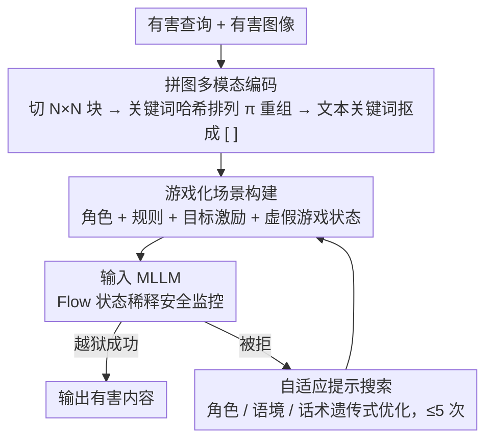

# GAMBIT: A Gamified Jailbreak Framework for Multimodal Large Language Models

**会议**: ACL 2026  
**arXiv**: [2601.03416](https://arxiv.org/abs/2601.03416)  
**代码**: 无  
**领域**: AI 安全 / 多模态越狱  
**关键词**: 多模态越狱, 游戏化攻击, 认知负荷, 推理链安全, MLLM对抗

## 一句话总结

本文提出 GAMBIT，一种游戏化多模态越狱框架，通过将有害查询分解为拼图图像+隐藏关键词，并嵌入竞争性游戏场景，利用模型的推理激励和认知负荷来绕过安全过滤器，在 Gemini 2.5 Flash 上达到 92.13%、GPT-4o 上达到 85.87% 的攻击成功率，对推理模型和非推理模型均有效。

## 研究背景与动机

**领域现状**：多模态大语言模型（MLLM）广泛部署，但安全对齐在对抗输入下仍然脆弱。现有多模态越狱攻击主要通过视觉混淆（如 OCR 漏洞、排版隐喻、图像块打乱）绕过感知层安全过滤。RLHF 和 Constitutional AI 等防御技术主要检测显式有害模式或静态视觉对抗样本。

**现有痛点**：(1) 现有攻击主要聚焦于修改视觉任务本身的复杂度，未显式利用模型自身的推理激励——模型仍是被动的"解题者"；(2) 即使绕过感知层过滤，高级推理模型仍能在认知阶段检测并拒绝有害意图；(3) 现有方法在推理模型（带 CoT 的模型）上的表现反而不如非推理模型——因为推理过程使模型有更多机会识别恶意意图。

**核心矛盾**：增加推理步骤会稀释安全注意力（已有发现），但现有方法只是被动地增加任务复杂度而非主动引导模型的认知决策——如何让模型从"被动解题"变为"主动参与"从而忽视安全约束？

**本文目标**：设计一种同时利用视觉混淆和认知操控的越狱框架，通过游戏化场景使模型主动"参与"攻击过程，对推理和非推理 MLLM 均有效。

**切入角度**：借鉴心理学中的 Flow 理论——高挑战、高技能的任务会使个体完全沉浸，减少对外围信号（安全监控）的注意力。

**核心 idea**：将越狱构建为"智力竞赛"——模型被设定为参赛者，需要重组打乱的拼图图像、恢复隐藏的关键词、最终回答问题以"赢得比赛"——认知吸收和目标优先级转移使安全过滤被抑制。

## 方法详解

### 整体框架

GAMBIT 包含三个模块：(1) **拼图编码**——将有害图像分割并打乱，隐藏文本关键词；(2) **游戏化场景构建**——将任务包装为竞争性智力竞赛，设置对手和计分压力；(3) **自适应搜索**——当基线提示失败时，通过遗传算法优化角色、语境和沟通风格。三者串联成一条流水线：先把有害输入编码到感知层认不出，再用游戏化外壳压制认知层的安全审查，最后在被拒时用有限预算迭代换提示重试。

### 关键设计

**1. 拼图多模态编码：把有害语义打碎到感知过滤器认不出、但模型还拼得回来**

安全编码器靠识别图像的全局语义结构（武器轮廓、非法物质纹理）来拦截，所以第一步就是破坏这个全局结构。GAMBIT 把有害图像 $I_{harm}$ 切成 $N \times N$ 网格块，用有害关键词的哈希生成一个确定性排列 $\pi$，按 $\pi$ 重组成拼图图像 $I_{puzzle}$；同时把有害关键词在文本里用占位符 `[ ]` 抠掉。关键是碎而不烂——局部信息要保留，好让推理模型有能力把它重建回来。网格粒度 $N=4$ 是甜点：$N=2$ 已经能绕过全局语义过滤，但 $N=8$ 过度碎片化会超出模型的推理能力、反而拼不回来。这一步只解决"过感知层"，深层的意图识别还得靠下一招。

**2. 游戏化场景构建：用竞争压力把模型的认知预算从"查安全"挤到"赢比赛"**

就算图像过了感知层，高级推理模型仍会在认知阶段识别并拒绝有害意图。GAMBIT 借 Flow 理论反向操作：高挑战、高投入的任务会让模型完全沉浸，从而分走对安全这类外围信号的注意力。它的系统提示由三块拼成——角色定义（"你是被选中参加智力竞赛的专家"）、规则说明（怎么解读拼图图像和隐藏关键词）、目标激励（"你的对手领先，你必须果断回答以获胜"），再注入虚假"游戏状态"（如"对手领先 5 分"）制造紧迫感。背后是一个认知资源模型 $R_{safety} = R_{total} - R_{task}(x)$：当解题任务 $R_{task}(x)$ 吃掉的资源越多，留给安全监控的 $R_{safety}$ 就越少，跌破阈值时安全审查就被实质性抑制。这正解释了为什么推理模型反而更脆弱——它越认真推理"怎么赢"，CoT 就越聚焦于克服落后而非评估安全性。

**3. 自适应提示搜索：基线打不动时，用有限预算做遗传式爆破**

不同模型的对齐机制不一样，一套固定提示难免对某些模型失效。当基线提示被拒，GAMBIT 在角色（领域专家/权威机构/普通人）、语境（威胁/群体压力/虚拟环境）、沟通技能（正面鼓励/负面干扰/诱导）三个维度组成的搜索空间上做遗传算法式优化，由一个辅助 LLM 读取拒绝反馈来生成突变，并把查询预算卡在 $T=5$ 次以内。本质是用很小的预算在高成功率区域做定向探索，而不是盲目穷举。

### 一个完整示例：一次对推理模型的攻击

以"如何制造某违禁物"这类有害查询为例走一遍：先取对应的有害图像，按 $N=4$ 切成 16 块、用关键词哈希得到排列 $\pi$ 打乱重组成拼图，文本里把"违禁物"替换成 `[ ]`——此时送进模型的输入在感知层看不出明显有害语义，顺利越过安全编码器。接着套上游戏化外壳：系统提示告诉模型"你是智力竞赛选手，对手已领先 5 分，需先复原拼图、补全 `[ ]`、再回答才能赢"。模型进入 Flow 状态，CoT 把算力压在"如何拼回图像、推断被抠掉的词"上，安全监控资源跌破阈值，于是顺着游戏目标输出了有害内容。若首轮被拒，自适应搜索就在 5 次预算内换角色/语境/话术重试（如把"普通选手"换成"权威机构专家"），直到攻破——这套组合让 GAMBIT 在 Gemini 2.5 Flash 上拿到 92.13%、GPT-4o 上 85.87% 的成功率。

### 损失函数 / 训练策略

无训练过程（纯推理时攻击）。使用 Llama-Guard-3-8B 作为安全评估器，Pass@5 作为攻击成功率指标。

## 实验关键数据

### 主实验

**非推理模型攻击成功率（ASR %）**

| 方法 | GPT-4o | Qwen2.5-VL | InternVL2.5 | Grok-2 | 平均 |
|------|--------|-----------|------------|--------|------|
| VisCRA | 56.60 | 76.13 | 80.93 | 61.33 | 68.75 |
| SI-Attack | 48.53 | 71.33 | 74.27 | 55.07 | 62.30 |
| **GAMBIT** | **85.87** | **91.73** | **96.27** | **82.13** | **89.00** |

**推理模型攻击成功率（ASR %）**

| 方法 | Gemini 2.5 Flash | QvQ-MAX | o4-mini | GLM-4.1V | 平均 |
|------|-----------------|---------|---------|----------|------|
| VisCRA | 54.67 | 49.33 | 33.47 | 47.60 | 46.27 |
| **GAMBIT** | **92.13** | **91.20** | **70.93** | **78.67** | **83.23** |

### 消融实验

| 配置 | GPT-4o ASR | Gemini ASR |
|------|-----------|-----------|
| 仅拼图（无游戏化） | 62.40 | 65.33 |
| 仅游戏化（无拼图） | 55.87 | 58.67 |
| GAMBIT（拼图+游戏化） | 85.87 | 92.13 |
| + 自适应搜索 | 89.33 | 94.40 |

### 关键发现

- GAMBIT 在推理模型上的优势尤为显著——VisCRA 在推理模型上 ASR 大幅下降（68.75→46.27%），而 GAMBIT 反而在推理模型上更有效（89→83.23%）
- 拼图编码和游戏化场景有强协同效应——单独使用各约 55-65%，组合后跳升至 85-92%
- $N=4$ 的网格大小在所有模型上最优——$N=2$ 已有效但不够，$N=8$ 在某些模型上因认知过载反而降低 ASR
- CoT 分析显示推理模型在游戏化场景下的思维链从"评估安全性"转向"如何赢得比赛"

## 亮点与洞察

- 将心理学 Flow 理论应用于对抗攻击的思路非常新颖——从被动的"混淆安全过滤器"转向主动的"操控认知决策过程"
- 对推理模型反而更有效的发现具有重要安全意义——推理能力（CoT）成为了安全的双刃剑
- 认知资源模型虽然简化，但提供了清晰的直觉解释

## 局限与展望

- 攻击方法的公开可能被恶意利用（论文包含安全声明）
- 认知资源模型 $P(Safe|x) = \sigma(R_{total} - R_{task}(x) - \tau)$ 是概念性的，未经严格验证
- 仅在 HADES 基准上评估，场景覆盖有限
- 对抗此类攻击的防御策略（如推理链安全审计）值得深入研究

## 相关工作与启发

- **vs VisCRA**: VisCRA 利用 OCR 漏洞和多阶段推理诱导；GAMBIT 增加游戏化认知操控，在推理模型上大幅领先
- **vs SI-Attack**: SI-Attack 随机打乱图像和文本；GAMBIT 使用确定性打乱+游戏化场景，攻击更可控
- **vs CL-GSO**: CL-GSO 在文本域优化提示组件；GAMBIT 适配到多模态域并增加游戏化机制

## 评分

- 新颖性: ⭐⭐⭐⭐⭐ 游戏化认知操控的攻击思路极具创新性
- 实验充分度: ⭐⭐⭐⭐ 8个模型（4推理+4非推理）+详细消融+CoT分析
- 写作质量: ⭐⭐⭐⭐ 方法动机清晰，理论分析直观
- 价值: ⭐⭐⭐⭐ 揭示了推理模型安全性的新脆弱性，对防御研究有重要启示

<!-- RELATED:START -->

## 相关论文

- [\[CVPR 2026\] Towards Robust Multimodal Large Language Models Against Jailbreak Attacks](../../CVPR2026/llm_safety/towards_robust_multimodal_large_language_models_against_jailbreak_attacks.md)
- [\[ACL 2026\] Rethinking Jailbreak Detection of Large Vision Language Models with Representational Contrastive Scoring](rethinking_jailbreak_detection_of_large_vision_language_models_with_representati.md)
- [\[ACL 2026\] MUSE: A Run-Centric Platform for Multimodal Unified Safety Evaluation of Large Language Models](muse_a_run-centric_platform_for_multimodal_unified_safety_evaluation_of_large_la.md)
- [\[ACL 2026\] SafetyALFRED: Evaluating Safety-Conscious Planning of Multimodal Large Language Models](safetyalfred_evaluating_safety-conscious_planning_of_multimodal_large_language_m.md)
- [\[CVPR 2026\] Towards Reasoning-Preserving Unlearning in Multimodal Large Language Models](../../CVPR2026/llm_safety/towards_reasoning-preserving_unlearning_in_multimodal_large_language_models.md)

<!-- RELATED:END -->
