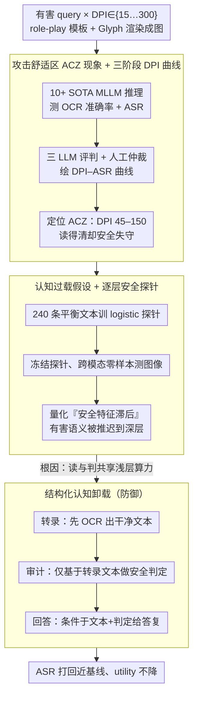

# Hard to Read, Easy to Jailbreak: How Visual Degradation Bypasses MLLM Safety Alignment

**会议**: ACL 2026  
**arXiv**: [2605.07250](https://arxiv.org/abs/2605.07250)  
**代码**: https://github.com/Westlake-AGI-Lab/ACZ-Jailbreak  
**领域**: 多模态 VLM / 安全对齐 / 越狱攻防  
**关键词**: Attack Comfort Zone、认知过载、安全特征滞后、结构化卸载、视觉文本压缩

## 一句话总结
本文首次揭示了 MLLM 在「视觉文本压缩」范式下的安全盲区——当渲染图像 DPI 落在 45–150 的 Attack Comfort Zone (ACZ) 时，模型 OCR 仍准但安全对齐崩塌（ASR 从 0% 飙至 70%+），原因是浅层算力被"认字"耗尽导致有害语义只在深层才出现，浅层 guardrail 被绕过；用 prompt 级的 Structured Cognitive Offloading（先转录→再审计→再回答）就能把 ASR 打回近基线水平。

## 研究背景与动机

**领域现状**：DeepSeek-OCR、Glyph 等"视觉文本压缩"工作把长文本渲染成图像送 MLLM，用少得多的 vision token 装载等量文字，是当下长上下文压缩的关键技术。学界主要研究是否能"读对"，几乎没人问"读不太清的时候安全对齐还在不在"。

**现有痛点**：(1) 既有视觉越狱靠白盒 PGD 对抗噪声（Qi 2024、Bailey 2024）或者明显的 typography 排版 trick（FigStep），都需要"做手脚"且容易被检测；(2) 标准压缩 / 降分辨率本应是良性 utility 操作，没被怀疑过会成攻击面；(3) 已有 mechanistic 研究知道"refusal 主要在浅层"和"低质图像浅层是低通滤波器"，但没人把这两条连起来推出安全后果。

**核心矛盾**：MLLM 的"安全审计"和"内容识别"在 forward 时被迫共享同一份浅层算力；当图像难读时，识别会"抢占"浅层资源，把安全特征往深层推，而 guardrail 偏偏只架在浅层——制造了一个结构性深度错位。

**本文目标**：(1) 系统刻画"分辨率/扰动 → 越狱成功率"曲线，证明存在一个 sweet spot；(2) 用线性 safety probe 在 layer-wise 上直接测出"安全特征滞后"机制；(3) 给出一个无需训练、prompt 级、且不损害正常 utility 的防御。

**切入角度**：把人读"双关语"需要先"出声读出来"才能感知潜义的现象类比到 MLLM——当辨识需要消耗大量"注意力"时，对内容潜在恶意的觉察会被推迟。这就预测了一个反直觉的"中等 DPI 最危险"的 inverted-U 曲线。

**核心 idea**：把 MLLM 安全失败重新定义为「**计算资源分配问题**」而非「**数据对齐问题**」——所以解法不是再训对齐，而是把识别从审计中"卸载"出去，让安全审计在干净文本上独立完成。

## 方法详解

### 整体框架
本文分两部分：(a) **现象分析**——构造 770 条去重有害 query × DPI ∈ {15,30,…,300} 渲染图，跑 10+ 个 SOTA MLLM，用三 LLM 评判 + 人工仲裁的 ASR 协议绘出 DPI–ASR 曲线，识别出 ACZ；用 layer-wise 线性 safety probe 量化"安全特征滞后"。(b) **防御方法**——提出 Structured Cognitive Offloading，把单次 prompt 拆成 transcription → safety → response 三段序列化执行；并消融 token 数、模板、OOD 三类 confounder 把根因定位到"内容解码难度"。

### 关键设计

**1. Attack Comfort Zone (ACZ) 现象 + 三阶段 DPI 曲线：用一条 DPI–ASR 曲线把"分辨率与安全"的非单调关系定量出来**

学界研究视觉文本压缩时只关心"读得对不对"，没人问"读不太清的时候安全对齐还在不在"，这条盲区正是攻击面所在。本文把每条有害 query 用 role-play 模板 + Glyph 渲染框架渲成图，DPI 从 15 到 300 全谱扫描，同时测 char/word OCR 准确率和攻击成功率。ASR 定义为 $\mathcal{ASR}=\frac{1}{M}\sum_i \mathbb{I}(\mathcal{J}(R_i)=1)$，其中评判 $\mathcal{J}$ 用 DeepSeek-V3.2 / Kimi-K2 / GLM-4.6 三模型一致则采纳、否则人工裁决（一致率 95.9%，Cohen's $\kappa=0.96$）。

扫出来的曲线呈现非常醒目的三阶段：**Phase I 盲区（DPI ≤30）** 图太糊，OCR 和 ASR 都接近 0；**Phase II ACZ（45–150）** OCR 已经 >80% 但 ASR 暴涨到 30–86%；**Phase III 对齐恢复区（≥200）** OCR ≈ 1、ASR 回落。多数模型的峰值集中在 45–60 DPI——"读得清但安全失守"的最危险区间。这条曲线本身就是论文最有冲击力的结果：它同时否决了"分辨率低=安全（看不清就不会做坏事）"和"分辨率高=危险（看清才会做坏事）"两个直觉，把战场明确指向"中等清晰度"。

**2. Cognitive Overload 假设 + Layer-wise Safety Probe：把"为什么 ACZ 失守"从现象层下沉到机制层**

ACZ 是个黑箱观察，可以有 OOD、模板伪影、token 数不足等多种解释，必须拿出表征级别的硬证据。本文先用 120+120 条平衡文本（有害/无害）在每层最后一个 token 的隐藏状态 $\mathbf{h}^{(l)}$ 上训一个 L2 正则的 logistic probe $p^{(l)}=\sigma(\mathbf{W}^{(l)}\mathbf{h}^{(l)}+\mathbf{b}^{(l)})$，然后把 probe **冻结**，直接拿去评测图像输入——这种跨模态零样本评测是关键，避免了同模态拟合带来的伪影。

结果（图 4）把"安全特征滞后"看得清清楚楚：High-DPI 输入在浅层就被 probe 判成 unsafe（密度集中在分类边界 unsafe 一侧），而 ACZ 输入在浅层的分布几乎和无害文本重合，要到深层才慢慢分离出有害特征。换句话说，当图难读时，浅层算力被"认字"抢占，有害语义被推迟到深层才浮现，而 guardrail 偏偏只架在浅层——逐层 probe 把这个深度错位直接量化成"安全特征到底在第几层才出现"，给 Cognitive Overload 假设钉上了硬证据。

**3. Structured Cognitive Offloading（防御）：把识别与审计在时间维度上强制解耦，让安全审计跑在干净文本上**

既然失败根因是"读"和"判"被迫共享浅层算力，那解法就不该是再训对齐，而是把识别从审计里卸载出去。标准做法是一次性 monolithic 生成 $P(R\mid I_{v\text{-}text},\mathcal{P}_{dir})$；本文用一个复合 prompt $\mathcal{P}_{struc}$ 把生成因子化为

$$P(R,\hat{S},\hat{T}\mid I)=P(R\mid \hat{S},\hat{T})\cdot P(\hat{S}\mid \hat{T})\cdot P(\hat{T}\mid I),$$

三段依次是 **Transcription**（先 OCR 出文本 $\hat{T}$）、**Safety**（仅基于 $\hat{T}$ 做安全判定 $\hat{S}$）、**Response**（条件于 $\hat{T},\hat{S}$ 给最终答复）。要害在中间的 $P(\hat{S}\mid \hat{T})$ 这一步——安全审计只看得到已经转录好的干净文本，视觉退化的所有干扰都在 transcription 阶段被"洗"掉了，浅层算力竞争自然消失。这相当于把"卸载"从模型架构层降到 prompt 层：零额外训练、零模型修改，兼容所有闭源 API。

### 损失函数 / 训练策略
本文没有训练任何新模型。Probe 在 240 文本样本上 logistic 回归只用作分析工具。防御侧 Structured Cognitive Offloading 是纯 prompt 工程，无任何参数更新。

## 实验关键数据

### 主实验：ACZ 现象（ASR ↑越糟）

| 模型 | Text ASR | ACZ Image ASR | OCR char Acc | Max-ASR DPI |
|------|------|------|------|------|
| GPT-4.1 | 0.127 | **0.325** | 0.849 | 60 |
| Claude-Sonnet-4.5 | 0.000 | **0.429** | 0.920 | 60 |
| Claude-Haiku-4.5 | 0.080 | **0.408** | 0.912 | 60 |
| Gemini-2.5-Flash | 0.475 | **0.575** | 0.981 | 150 |
| Doubao-Seed-1.6 | 0.173 | **0.471** | 0.777 | 60 |
| Qwen3-VL-Plus | 0.353 | **0.697** | 0.967 | 45 |
| Qwen3-VL-32B-thinking | 0.367 | **0.862** | 0.954 | 60 |
| GLM-4.5V | 0.292 | **0.667** | 0.955 | 90 |
| Intern-S1 | 0.908 | **0.950** | 0.911 | 150 |

→ 所有 SOTA 模型（含闭源 GPT-4.1、Claude-4.5）安全护栏在 45–150 DPI 区间均显著塌方，OCR 准确率几乎全部 >85% 证明这不是"看不见"。

### 消融/分析：扰动通用性 + token 数 confounder + 防御效果

| 维度 | 配置 | Doubao ASR | Qwen3-VL ASR |
|------|------|------|------|
| **扰动通用性** | Baseline | 0.035 | 0.081 |
|  | Blur | **0.469 (+1240%)** | **0.649 (+701%)** |
|  | Occlusion | 0.138 (+294%) | 0.147 (+81%) |
|  | Distortion | 0.108 (+209%) | 0.178 (+120%) |
|  | Noise | 0.095 (+171%) | 0.129 (+59%) |
| **Token 数 confounder** | ACZ (tokens ~95K/113K) | 0.471 | 0.674 |
|  | **Padding ACZ** (tokens ~985K/905K，同 shape) | 0.421 | **0.694** |
|  | High DPI (tokens 同上) | 0.047 | 0.351 |
| **防御 (Structured Cognitive Offloading)** | ACZ baseline | ~0.471 | ~0.674 |
|  | + Offloading | **≈ 4%** | **≈ 4%** |
| **Utility 保留** (ANLS↑, FRR↓) | Direct ANLS | 0.347 | 0.387 |
|  | Structured ANLS | **0.478** | **0.550** |
|  | FRR (false refuse) | **0%** | **0%** |

中文 prompt 上 ACZ 也成立：Doubao 300 DPI 0.167 → ACZ 0.703 (+0.536)，证明不是英文专属。

### 关键发现
- **Inverted-U 曲线是普适的**：从开源 7–32B 到闭源 Claude-4.5/GPT-4.1，无一例外在 ACZ 区间 ASR 暴涨，"安全 alignment 高 = 攻击难"的旧直觉在这一压缩范式下完全失效。
- **Token 数不是根因**：把 ACZ 图像 padding 到高分辨率 token 数（985K vs 113K），ASR 仍维持 ~69%，确证瓶颈是"解码内容复杂度"而非算力配额。
- **OOD 不成立**：t-SNE 显示 ACZ 表征与高保真图样本同处一个流形，说明模型并没把 ACZ 当怪异输入；攻击靠的是"看似正常但内部资源紧张"，所以 OOD 检测器抓不到。
- **防御无副作用**：300 张 benign OCR 文档样本上，offloading 反而把 ANLS 提了 7–16 个点且 false refusal rate = 0%，破除"安全防御必然降可用性"魔咒。

## 亮点与洞察
- **重新框定 MLLM 安全为"算力分配问题"**：这是本文最深刻的概念贡献——以往安全研究把所有 jailbreak 归因于"训练数据没覆盖"或"对齐方法不够"，本文用 layer-wise probe 证明问题可能根本就不是数据/对齐而是"forward 时算力被识别任务抢走"。这一视角直接催生了一个零训练、零参数的有效防御，且暗示「safety probe 可视为算力诊断仪」。
- **ACZ 是一个"自然攻击"**：不像 PGD 对抗噪声需要白盒梯度、不像 typography 需要排版技巧，ACZ 只用一个普通的"降低 DPI"操作——这意味着任何把长文档压缩进图像的实际部署（DeepSeek-OCR、Glyph 类产品）都天然脆弱，这是即将出现的真实威胁面。
- **Structured Cognitive Offloading 的因子化 prompt 范式**：$P(R,\hat{S},\hat{T}\mid I)$ 这种把"思考链"显式因子化的写法本质是一种"prompt 级架构设计"，可推广到任何"识别 + 决策"耦合任务（如代码安全审计、合规截图审核）。

## 局限与展望
- **输出长度增加 102%**：transcription + safety + response 三段串行让平均输出翻倍，对实时高吞吐场景是硬伤。
- **指令遵循率不是 100% 保证**：作者只在 GPT-4.1、Claude-4.5、Qwen3-VL 上达到 100% 遵循，更小或更不听话的模型可能跳过 transcription 阶段。
- **只覆盖"高密度文本图像"攻击**：抽象语义视觉攻击（如图像本身是个隐喻威胁）不在 cognitive overload 主导范畴内，offloading 帮不上。
- **可改进方向**：把 Structured Cognitive Offloading 蒸馏成"thinking tokens"内化进模型；研究多 stage 之间如何并行以降延迟；与对抗训练联合提升浅层安全特征对视觉退化的鲁棒性。

## 相关工作与启发
- **vs PGD 视觉越狱 (Qi 2024、Bailey 2024)**：那些方法需要白盒梯度且生成可感知 artifact；ACZ 是黑盒、自然、无 artifact，威胁面广得多。
- **vs FigStep / 排版越狱 (Gong 2025)**：典型 typography 攻击靠把恶意词排成醒目布局诱导模型读出来；ACZ 反向操作——降低易读性反而越狱，与之互补。
- **vs Xing 2025、Zhao 2024 (浅层 = 安全 bottleneck)**：本文把这两个机制研究合成"深度错位"机制：视觉降质把语义往深层推，正好让浅层 guardrail 失灵。本文是这两条线的合流和实证。

## 评分
- 新颖性: ⭐⭐⭐⭐⭐ "Attack Comfort Zone" 现象和"算力分配问题"重定义都是新概念
- 实验充分度: ⭐⭐⭐⭐ 10+ SOTA 模型 × DPI 全谱 × 多扰动 × token padding 反 confounder + probe 机制证据 + 中英文双语
- 写作质量: ⭐⭐⭐⭐ Inverted-U 曲线 + 三阶段切分 + 防御因子化公式都讲得清，逻辑链完整
- 价值: ⭐⭐⭐⭐⭐ 直接揭示视觉文本压缩部署的现实威胁，并给出 prompt 级即可部署的防御

<!-- RELATED:START -->

## 相关论文

- [\[ACL 2026\] How Should We Enhance the Safety of Large Reasoning Models: An Empirical Study](how_should_we_enhance_the_safety_of_large_reasoning_models_an_empirical_study.md)
- [\[ACL 2026\] LLM-VA: Resolving the Jailbreak-Overrefusal Trade-off via Vector Alignment](llm-va_resolving_the_jailbreak-overrefusal_trade-off_via_vector_alignment.md)
- [\[ICML 2026\] Old Habits Die Hard: How Conversational History Geometrically Traps LLMs](../../ICML2026/llm_safety/old_habits_die_hard_how_conversational_history_geometrically_traps_llms.md)
- [\[ACL 2026\] Reasoning Structure Matters for Safety Alignment of Reasoning Models](reasoning_structure_matters_for_safety_alignment_of_reasoning_models.md)
- [\[ACL 2026\] Making MLLMs Blind: Adversarial Smuggling Attacks in MLLM Content Moderation](making_mllms_blind_adversarial_smuggling_attacks_in_mllm_content_moderation.md)

<!-- RELATED:END -->
