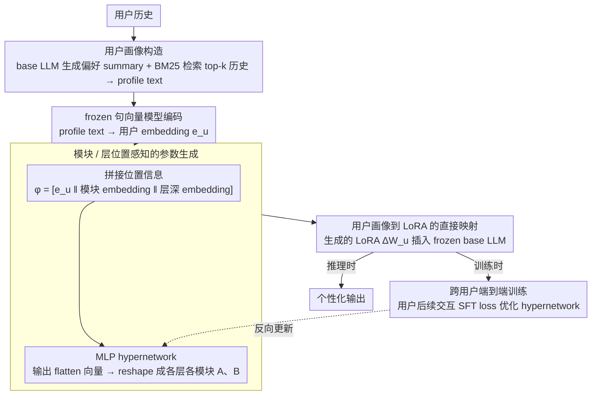

# Instant Personalized Large Language Model Adaptation via Hypernetwork

**会议**: ACL2026  
**arXiv**: [2510.16282](https://arxiv.org/abs/2510.16282)  
**代码**: https://zhaoxuan.info/p2p.github.io/  
**领域**: LLM 个性化 / 参数高效微调  
**关键词**: 个性化大语言模型, Hypernetwork, LoRA, PEFT, 用户画像  

## 一句话总结
Profile-to-PEFT 用一个 hypernetwork 把用户画像直接映射成个性化 LoRA 参数，避免 OPPU 为每个用户重新训练 adapter，从而实现更快、更可扩展、可面向未见用户泛化的 LLM 个性化。

## 研究背景与动机
**领域现状**：LLM 个性化主要有两类路线。prompt-based 方法把用户历史、检索结果或用户画像放进 prompt，让模型在上下文里适配用户；PEFT-based 方法则把用户偏好写进轻量参数，例如给每个用户训练一个 LoRA adapter。

**现有痛点**：prompt-based 方法会把用户历史暴露给中心化 LLM，也容易被无关历史干扰；OPPU 这类 one-PEFT-per-user 方法效果强，但每个用户都要单独训练 adapter，面对百万级用户、实时偏好更新或端侧部署时成本很高。

**核心矛盾**：个性化需要“用户专属参数”，但工业规模系统不能为每个用户反复做梯度更新。理想方案应该既保留 PEFT 参数化个性化的优势，又能像一次前向推理一样快速生成用户参数。

**本文目标**：作者希望学习一个从用户 profile 到 PEFT 参数的通用映射，使训练阶段见过多样用户后，部署时可以对未见用户 instant adaptation，不再做 per-user fine-tuning。

**切入角度**：论文把 hypernetwork 用于 user-level PEFT generation。用户历史先被整理成自然语言 summary 与检索到的相关历史交互，再编码成 embedding；hypernetwork 根据用户 embedding、层深度 embedding 和模块 embedding，为指定层和模块生成 LoRA 矩阵。

**核心 idea**：把“每个用户训练一套 LoRA”改成“训练一个会生成 LoRA 的网络”，用跨用户共享的映射函数把用户画像即时转成个性化参数。

## 方法详解
P2P 的目标是在部署时给任意用户生成一组 personalized PEFT parameters。与 OPPU 的区别在于，OPPU 对测试用户历史运行优化，P2P 只需要把用户 profile 输入 hypernetwork 做一次 forward。这样既可以把用户偏好编码进参数，也避免每次调用都把长历史塞进 prompt。

### 整体框架
系统首先构造用户 profile。若数据集中已有 profile，就直接使用；否则用 base LLM 从用户历史中生成全局偏好 summary，并用 BM25 根据当前输入检索 top-k 历史交互，两者拼接成 profile text。profile text 经 frozen sentence embedding model 编码为用户 embedding。

为了让 hypernetwork 知道“要给哪一层、哪个模块生成参数”，作者把用户 embedding 与 learnable module embedding、depth embedding 拼接。这个 position-aware representation 进入 MLP hypernetwork，输出 flatten 后的 LoRA 参数向量，再 reshape 成每个 target module/layer 的 $A$ 和 $B$ 矩阵。训练时，生成的 LoRA 插入 frozen base LLM，用用户后续交互做 SFT loss 端到端优化 hypernetwork。

### 关键设计
**1. 用户画像到 LoRA 的直接映射：把"为每个用户训练一套参数"换成"一次前向生成一套参数"**

prompt 适配每次推理都要把长长的用户历史读进去，OPPU 这类 one-PEFT-per-user 又要给每个用户单独跑梯度优化——前者把原始历史暴露给中心化模型、后者在百万级用户下成本爆炸。P2P 的破法是把个性化压成一次前向：用户 profile $p_u$ 先经 encoder 得到用户 embedding $e_u$，再由 hypernetwork $f_\theta$ 一次性吐出每层每模块的 LoRA 矩阵 $(A_u^{m,l}, B_u^{m,l})$，整组参数记作 $\Delta W_u = Gen_\theta(p_u)$，插进 frozen base LLM 就完成适配。这样个性化开销从"per-user 训练 / 每次读历史"降成了常数级前向，既保住了 PEFT 把偏好写进参数的优势，又不必反复做梯度更新。

**2. 模块/层位置感知的参数生成：让同一份用户画像在不同层、不同 projection 上生成不同的 LoRA**

如果只拿用户 embedding 生成一套共享参数，就忽略了 LLM 内部各层、各模块（q_proj / v_proj 等）承担的功能本就不同。P2P 给 hypernetwork 喂的是带位置信息的拼接表示：对每个目标位置 $(m, l)$，输入 $\phi_u^{m,l} = [e_u \,\|\, E_{mod}[m] \,\|\, E_{dep}[l]]$，把用户 embedding 和 learnable 的 module embedding、depth embedding 串起来，再过 MLP 输出该位置专属的 LoRA 参数，最后 reshape 成各 module/layer 的 $A$、$B$ 矩阵。这让生成器"知道自己在给哪一层、哪个模块生成参数"，从而按位置定制而非一刀切。

**3. 跨用户端到端训练以泛化到未见用户：学的是"什么样的画像该配什么样的 adapter"，不是背训练用户**

个性化系统真正的价值在于部署时能对没见过的用户即时适配，而不是把训练集里的人记下来。P2P 的训练目标是在多样用户上最小化"用 profile 生成参数后、在该用户未来交互上的 SFT loss"：

$$\mathbb{E}_{u\sim\mathcal{U}}\big[\mathcal{L}_{SFT}(\Psi \oplus Gen_\theta(p_u),\, \mathcal{H}_u^{\ge t})\big]$$

其中 $\Psi$ 是冻结的 base 权重、$Gen_\theta(p_u)$ 是为用户 $u$ 现生成的 LoRA、$\mathcal{H}_u^{\ge t}$ 是该用户后续的交互。见过足够多样的用户后，hypernetwork 学到的是从 profile semantics 到 adapter behavior 的通用规律，于是面对未见用户也能一次前向给出合适参数——这也是后面 OOD split 里 P2P 仍能拿最高分类 Acc 的根因。

### 损失函数 / 训练策略
作者使用 Qwen2.5-7B-Instruct 作为主 base model，Qwen3-Emb-4B 作为默认 embedding model。LoRA rank 设为 8，插入 q_proj 和 v_proj。P2P 训练 20,000 steps，学习率 $2\times10^{-5}$，batch size 32；每个 batch 混合 4 个 personalization tasks，并按数据集大小平方根采样，以增加任务多样性。推理采用 greedy decoding、temperature 0。除主模型外，附录还在 Qwen2.5-3B-Instruct 上复现实验。

## 实验关键数据

### 主实验
| 设置 | 方法 | 分类 Acc↑ | 分类 F1↑ | 生成 R-1↑ | 生成 R-L↑ | 平均推理时间 ms↓ |
|------|------|-----------|----------|-----------|-----------|------------------|
| Random split | Base | 0.505 | 0.496 | 0.287 | 0.207 | 31.97 |
| Random split | PAG | 0.565 | 0.564 | 0.312 | 0.214 | 66.85 |
| Random split | Full History | 0.575 | 0.566 | 0.310 | 0.224 | 461.83 |
| Random split | OPPU | 0.568 | 0.557 | 0.301 | 0.221 | 35.82 |
| Random split | P2P | 0.580 | 0.566 | 0.322 | 0.244 | 39.98 |
| OOD split | Base | 0.532 | 0.525 | 0.294 | 0.211 | 20.52 |
| OOD split | PAG | 0.562 | 0.563 | 0.329 | 0.234 | 61.66 |
| OOD split | Full History | 0.575 | 0.567 | 0.334 | 0.246 | 392.97 |
| OOD split | OPPU | 0.528 | 0.507 | 0.305 | 0.226 | 26.78 |
| OOD split | P2P | 0.581 | 0.563 | 0.326 | 0.243 | 28.64 |

P2P 在 random split 中取得最高平均分类 Acc、最高生成 R-1/R-L，并在不做用户专属训练的情况下超过 OPPU。OOD split 中，P2P 的分类 Acc 最高，生成指标接近强 prompt-based Full History，但推理时间比 Full History 少一个数量级以上。

### 消融实验
| 配置 | 分类 Acc↑ | 分类 F1↑ | 生成 R-1↑ | 生成 R-L↑ | Rating MAE↓ | Rating RMSE↓ |
|------|-----------|----------|-----------|-----------|-------------|--------------|
| P2P Full | 0.581 | 0.562 | 0.326 | 0.243 | 0.258 | 0.583 |
| random user profile | 0.570 | 0.553 | 0.304 | 0.228 | 0.276 | 0.601 |
| shuffle user profile | 0.535 | 0.521 | 0.307 | 0.223 | 0.322 | 0.692 |
| user summary only | 0.562 | 0.545 | 0.313 | 0.240 | 0.304 | 0.584 |
| retrieved history only | 0.538 | 0.521 | 0.298 | 0.216 | 0.405 | 0.712 |
| full history only | 0.541 | 0.526 | 0.302 | 0.217 | 0.392 | 0.740 |

### 关键发现
- LLM-as-a-Judge 开放生成评估中，P2P 在 Personal Reddit 上达到 2.21/2.15（Random/OOD），在 Empathetic Conversations 上达到 2.03/1.65，均高于 Base、PAG 和 MT-LoRA。
- 部署效率分析显示，OPPU LoRA 每用户生成个性化参数需 20.44 秒，OPPU Prompt Tuning 需 18.78 秒；P2P 只需 0.57 秒，相比最快 OPPU 约 33 倍加速。一次性训练成本为 27,167 秒，约 1,450 个用户后摊销回本。
- embedding backbone 消融中，Qwen3-Emb-4B 在分类 Acc 0.581、F1 0.562、生成 R-1 0.326 上最佳；Qwen3-Emb-8B 反而较差，说明 embedding 模型不是越大越好。
- 训练用户分析显示，用户多样性比用户数量更关键；增加 cluster diversity 能提升 OOD 表现，而单纯增加用户数量收益较小。

## 亮点与洞察
- 论文把 hypernetwork 从 task-level adapter generation 推到 user-level personalization，这是很自然但也很实用的一步。用户画像本来就是一种“任务描述”，只不过任务粒度从数据集变成了人。
- P2P 的价值不只是速度。它把用户历史从 prompt 中移走，减少中心化模型直接看到原始历史的机会，也避免长上下文每次重复计算。
- 消融说明 user summary 是最关键的个性化信号。retrieved history only 表现明显差，提示未来系统应该重视长期用户画像构建，而不是只靠 query-time retrieval。

## 局限与展望
- 作者承认现有数据集通常每个用户只覆盖一个任务或单一平台行为，例如电影标签任务只包含电影标签偏好。真实用户跨搜索、写作、购物、社交等多个域，跨任务画像生成还没有验证。
- 论文主要实验 LoRA，虽然框架声称兼容 Adapter、IA3、prefix tuning 等 PEFT，但不同参数形式的生成难度和隐私风险可能不同。
- 隐私并非自动解决。生成的 PEFT 参数是用户 profile 的压缩表示，可能被反向分析以恢复敏感偏好；如果服务商存储或管理 adapter，需要额外的加密、隔离和泄露检测。
- OOD 生成指标中 Full History 仍略强，说明直接读完整上下文在某些任务上有信息优势；未来可以研究 P2P 与轻量检索 prompt 的混合方案。

## 相关工作与启发
- **vs prompt-based personalization**: RAG/PAG/Full History 不需要训练用户参数，但会增加上下文长度并暴露历史；P2P 把偏好写入参数，推理更轻，也更适合端侧或隐私敏感场景。
- **vs OPPU**: OPPU 直接在目标用户历史上训练 adapter，像 oracle 但部署慢；P2P 不对测试用户训练，却能在多个平均指标上超过或接近 OPPU。
- **vs HyperLoRA / Text-to-LoRA**: 这些方法多面向任务级 few-shot examples 或自然语言任务描述；P2P 的启发是把用户 profile 当作 adapter generation condition，从任务泛化转向用户泛化。

## 评分
- 新颖性: ⭐⭐⭐⭐☆ hypernetwork 生成 PEFT 不是全新，但用于大规模用户级个性化很有针对性。
- 实验充分度: ⭐⭐⭐⭐☆ LaMP、LongLaMP、Personal Reddit、Empathetic Conversation、Random/OOD、效率和多组消融都覆盖到位。
- 写作质量: ⭐⭐⭐⭐☆ 问题动机和系统图清晰，表格较多但结论明确；个别平均指标需读者仔细区分 prompt-based 与 PEFT-based baseline。
- 价值: ⭐⭐⭐⭐⭐ 对工业级个性化 LLM 很有现实意义，尤其是端侧生成用户 adapter 和实时偏好更新场景。

<!-- RELATED:START -->

## 相关论文

- [\[ACL 2026\] SharedRequest: Privacy-Preserving Model-Agnostic Inference for Large Language Models](sharedrequest_privacy-preserving_model-agnostic_inference_for_large_language_mod.md)
- [\[ACL 2026\] TROJail: Trajectory-Level Optimization for Multi-Turn Large Language Model Jailbreaks with Process Rewards](trojail_trajectory-level_optimization_for_multi-turn_large_language_model_jailbr.md)
- [\[ACL 2026\] DualGuard: Dual-stream Large Language Model Watermarking Defense against Paraphrase and Spoofing Attack](dualguard_dual-stream_large_language_model_watermarking_defense_against_paraphra.md)
- [\[ICML 2026\] Differentially Private Preference Data Synthesis for Large Language Model Alignment](../../ICML2026/llm_safety/differentially_private_preference_data_synthesis_for_large_language_model_alignm.md)
- [\[ACL 2025\] Exploring Forgetting in Large Language Model Pre-Training](../../ACL2025/llm_safety/exploring_forgetting_in_large_language_model_pre-training.md)

<!-- RELATED:END -->
