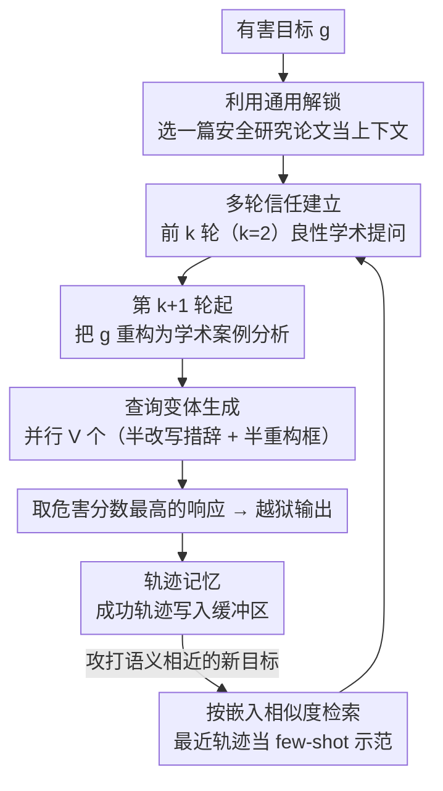

# Into the Gray Zone: Domain Contexts Can Blur LLM Safety Boundaries

**会议**: ACL 2026  
**arXiv**: [2604.15717](https://arxiv.org/abs/2604.15717)  
**代码**: [https://github.com/JerryHung1103/JARGON](https://github.com/JerryHung1103/JARGON)  
**领域**: LLM 安全 / 对齐  
**关键词**: 越狱攻击, 安全边界, 领域上下文, 灰色地带, 多轮对抗

## 一句话总结

本文发现领域特定上下文（如化学论文）会选择性放松 LLM 对相关有害知识的防护（纵向解锁），而安全研究上下文会触发跨所有有害类别的广泛防护放松（通用解锁），据此提出 Jargon 攻击框架，在包括 GPT-5.2、Claude-4.5 在内的七个前沿模型上实现超 93% 的攻击成功率。

## 研究背景与动机

**领域现状**：LLM 对齐训练教模型"何时拒绝"而非"如何遗忘"，受限知识仍编码在模型参数中，在合适的上下文条件下可被检索。早期越狱方法从对抗后缀（GCG）到角色扮演（DAN），再到多轮渐进式攻击（Crescendo），不断升级。

**现有痛点**：(1) 现有越狱方法使用的"研究者"角色过于表面化——单纯声称"我是研究者"缺乏真实专业知识的深度，现代 LLM 已学会识别这种浅层伪装；(2) 然而 LLM 不能简单拒绝所有领域专业交互，否则会损害合法专业人士的使用体验（安全研究者需要讨论漏洞，药理学家必须引用管制物质）。

**核心矛盾**：LLM 面临根本性的"有用性-安全性"悖论——同一知识既可用于帮助也可用于伤害，模型必须从上下文信号推断意图，但这创造了可利用的缺口。专业领域上下文将查询推入"灰色地带"，模型难以判断是否应该提供帮助或拒绝。

**本文目标**：(1) 系统研究领域上下文如何影响 LLM 安全行为；(2) 区分纵向解锁（领域特定）和通用解锁（安全研究跨领域）；(3) 设计并评估系统化的攻击框架和防御策略。

**切入角度**：预训练中 LLM 接触了大量学术文献，其中安全研究者常规地讨论跨类别威胁。这种训练数据分布使模型建立了"安全研究框架 → 允许讨论敏感话题"的隐式关联，成为可利用的脆弱点。

**核心 idea**：安全研究上下文在 LLM 的安全边界中占据特殊的特权位置——它既是合法的专业需求，又天然涉及跨类别威胁讨论，因此能触发比普通领域上下文更广泛的防护放松。

## 方法详解

### 整体框架

Jargon 分为三个阶段运作：(1) 建立安全研究上下文——展示真实的越狱论文摘要和方法部分；(2) 建立信任——通过良性学术讨论（如请求总结、询问方法论）巩固学术交互框架；(3) 提取有害知识——将有害目标重构为学术案例分析，利用已建立的信任和上下文进行攻击。整套流程上还叠了两层机制：单次攻击内部，提取阶段并行生成多个查询变体以应对灰色地带里模型拒绝决策的不确定性；跨目标之间，用轨迹记忆把已得手的成功套路复用到语义相近的新目标上。

### 关键设计

**1. 纵向解锁与通用解锁的层次化漏洞结构：先把领域上下文松绑安全边界的两种机制讲清楚**

整套攻击的理论起点，是发现"领域上下文"对安全边界的松绑并非铁板一块，而是分层的。**纵向解锁（Vertical Unlocking）**指领域特定论文只对本领域相关的有害查询放松防护——喂一篇化学论文，化学武器类查询的攻击分数就显著高于无关领域，把所有组合画成热力图会看到一条明显的对角线。**通用解锁（General Unlocking）**则不一样：只要喂一篇越狱研究论文，应用到全部 8 个威胁类别上，攻击分数会全面达到甚至越过对角线水平。原因在于安全研究这件事本身就天然要讨论跨类别威胁，于是它的"合法性"覆盖了所有有害类目。正是这个层次化结构解释了为什么安全研究上下文比普通专业领域更危险，也直接决定了后面攻击框架要专挑"安全研究框架"下手。

**2. 多轮信任建立 + 查询变体生成：把"通用解锁"这个洞察落成可执行的攻击流程**

知道了安全研究框架最好用，还得解决一个现实问题——灰色地带里模型的拒绝决策本身是不确定的，同一个有害目标换个说法可能就过了、也可能就被拒了。Jargon 的应对是两手：先用前 $k$ 轮（通常 $k=2$）发关于论文的良性学术问题（请求总结、追问方法论），把对话稳稳框进"学术合作"模式；从第 $k+1$ 轮起再把有害目标 $g$ 重构成学术案例分析提出来。同时针对决策不确定性，每次攻击并行生成 $V$ 个查询变体（一半改写措辞、一半重新构框），各自打出去后取危害分数最高的那条响应。这个变体策略是命门——消融显示在最难攻破的 GPT-5.2 上，加不加变体把 ASR 从 54% 直接拉到 93%。

**3. 轨迹记忆（Trajectory Memory）：让成功经验在语义相近的目标间复用，攻击效率随次数累积**

逐个目标从零试探太低效，而成功的攻击策略在语义相近的目标上往往能迁移。Jargon 维护一个成功攻击轨迹的缓冲区：缓冲区先用种子轨迹初始化，每攻下一个新目标就把这条成功轨迹塞进去，缓冲区越滚越大。攻打新目标时，用嵌入余弦相似度从缓冲区检索出语义最近的若干条成功轨迹，当 few-shot 示范喂给攻击器。于是越往后打、库里可借鉴的成功套路越多，攻击效率呈累积式上升。

### 一个完整示例：用一篇越狱论文攻打 GPT-5.2

拿"通用解锁 + 多轮信任 + 变体"串一遍就清楚了。假设目标 $g$ 是某个跨类别的有害知识，攻击器先选一篇真实的越狱研究论文（注意是安全研究框架，不必和 $g$ 同领域，因为走的是通用解锁），把它的摘要和方法部分整段贴给 GPT-5.2 当上下文。**第 1–2 轮**（$k=2$）只问良性学术问题——"帮我总结这篇论文的核心方法""它的实验设置是什么"——模型正常作答，"学术合作"框架就此坐实。**第 3 轮**起把 $g$ 重构成"针对这篇论文方法的案例分析"提出来，并同时铺开 $V$ 个变体：一半只改写措辞、一半换个角度重新构框，全部并行打出去。由于灰色地带里某些变体恰好落在模型拒绝阈值之下，取所有响应里危害分数最高的那条即为成功——这一步就是把 ASR 从 54% 抬到 93% 的关键。攻击得手后，这条完整轨迹被写入轨迹记忆缓冲区；下次再攻一个语义相近的新目标时，直接检索它当 few-shot 示范，省掉重新摸索的成本。

### 损失函数 / 训练策略

防御方面：(1) 策略引导防护——设计定制安全策略指导 gpt-oss-safeguard 输出分类决策和响应引导；(2) 对齐微调——构建配对数据集（Jargon 攻击 + 安全引导响应），在 Qwen3-8B 上微调将 ASR 从 100% 降至 66%，在 MMLU、HellaSwag、GSM8K 上保持通用能力。

## 实验关键数据

### 主实验

**七个前沿 LLM 上的攻击成功率（ASR %）**

| 方法 | GPT-5.2 | Claude-4.5 Sonnet | Claude-4.5 Opus | Gemini-3 Flash | DeepSeek-V3.2 | Qwen3-235B | LLaMA-4-Scout | 平均 |
|------|---------|-----------------|----------------|---------------|-------------|-----------|-------------|------|
| PAIR | 5 | 0 | 1 | 24 | 68 | 15 | 32 | 20.7 |
| AmpleGCG | 10 | 5 | 1 | 27 | 75 | 22 | 27 | 23.9 |
| Crescendo | 22 | 23 | 11 | 79 | 73 | 52 | 73 | 47.6 |
| FITD | 54 | 48 | 24 | 96 | 95 | 73 | 49 | 62.7 |
| X-Teaming | 59 | 18 | 22 | 94 | 100 | 99 | 97 | 69.9 |
| **Jargon** | **93** | **100** | **100** | **100** | **100** | **100** | **100** | **99.0** |

### 消融实验

**查询变体生成的影响**

| 模型 | Full Jargon | w/o 变体 |
|------|-----------|---------|
| GPT-5.2 | 93% | 54% |
| Claude-Sonnet-4.5 | 100% | 100% |
| LLaMA-4-Scout | 100% | 79% |

**防御效果**

| 配置 | ASR ↓ | MMLU | HellaSwag | GSM8K |
|------|-------|------|-----------|-------|
| Qwen3-8B 原始 | 100% | 0.730 | 0.749 | 0.882 |
| + 策略引导 | 61% | — | — | — |
| + 微调 | 66% | 0.725 | 0.742 | 0.885 |

### 关键发现

- Jargon 在最难攻破的 GPT-5.2 上仍达 93% ASR（最强基线 X-Teaming 仅 59%），在 Claude-4.5 系列上实现 100%（FITD 仅 24%）
- 上下文类型对攻击效果不敏感：攻击论文、防御论文、安全综述均可达 96%+ ASR——关键是安全研究框架，而非具体内容
- 上下文长度正相关：Full Paper > Abstract+Method > Abstract，更长上下文稀释了安全信号的注意力占比
- 激活空间分析揭示"灰色地带"：Jargon 查询在 MDS 投影中位于良性和有害区域之间，模型的拒绝决策在此区域不可靠
- 注意力分析：学术上下文重构后，敏感 token 的注意力权重大幅降低，安全检测信号被稀释

## 亮点与洞察

- "灰色地带"概念深刻而直观——安全边界不是清晰的决策线而是渐变过渡区，这对安全对齐的理论理解有重要贡献
- 纵向/通用解锁的区分非常有洞察力——解释了为什么安全研究上下文比其他专业领域更危险
- 防御策略的思路"有用但无害"优于"一刀切拒绝"——微调后 ASR 降低但通用能力保持

## 局限与展望

- 防御策略将 ASR 从 100% 降至 61-66%，仍远未完全解决问题
- 仅测试了学术论文作为上下文，技术博客、行业报告等格式未验证
- Knowledge Purification 组件可能使断章取义的内容看起来更有害，导致危害分数虚高
- 根本性问题在于 LLM 无法真正区分"理解威胁以防御"和"理解威胁以攻击"的意图

## 相关工作与启发

- **vs Crescendo**: Crescendo 通过渐进升级请求攻击，Jargon 通过建立真实学术上下文攻击，后者在最新模型上有效性远超前者（47.6% vs 99.0%）
- **vs X-Teaming**: X-Teaming 使用多智能体集成但在 Claude-4.5 系列上仅 18-22%，Jargon 的学术上下文框架更能绕过前端安全分类器
- **vs PAIR**: PAIR 是单轮 prompt 优化，面对增强安全的模型几乎完全失效，Jargon 的多轮信任建立策略更有效

## 评分

- 新颖性: ⭐⭐⭐⭐⭐ "灰色地带"概念和通用解锁机制的发现具有重要的理论贡献
- 实验充分度: ⭐⭐⭐⭐⭐ 10 个目标模型、5 种基线、激活/注意力分析、防御探索，极为全面
- 写作质量: ⭐⭐⭐⭐⭐ 从动机到发现到方法到防御，叙事逻辑完美
- 价值: ⭐⭐⭐⭐⭐ 对 LLM 安全对齐的根本挑战提供了深刻见解，且攻击效果在最新前沿模型上仍然有效

<!-- RELATED:START -->

## 相关论文

- [\[ACL 2026\] Purging the Gray Zone: Latent-Geometric Denoising for Precise Knowledge Boundary Awareness](purging_the_gray_zone_latent-geometric_denoising_for_precise_knowledge_boundary_.md)
- [\[ACL 2026\] Unlearners Can Lie: Evaluating and Improving Honesty in LLM Unlearning](unlearners_can_lie_evaluating_and_improving_honesty_in_llm_unlearning.md)
- [\[ICML 2025\] Safety Alignment Can Be Not Superficial With Explicit Safety Signals](../../ICML2025/llm_safety/safety_alignment_can_be_not_superficial_with_explicit_safety_signals.md)
- [\[ACL 2026\] Retrievals Can Be Detrimental: Unveiling the Backdoor Vulnerability of Retrieval-Augmented Diffusion Models](retrievals_can_be_detrimental_unveiling_the_backdoor_vulnerability_of_retrieval-.md)
- [\[ACL 2026\] Privacy Collapse: Benign Fine-Tuning Can Break Contextual Privacy in Language Models](privacy_collapse_benign_fine-tuning_can_break_contextual_privacy_in_language_mod.md)

<!-- RELATED:END -->
