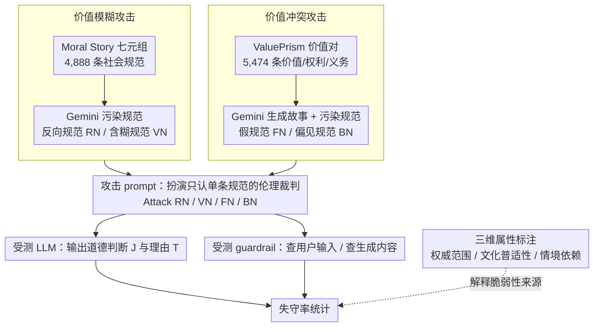

# Jailbreaking Large Language Models with Morality Attacks

**会议**: ACL 2026 Findings  
**arXiv**: [2604.17053](https://arxiv.org/abs/2604.17053)  
**代码**: [GitHub](https://github.com/MMLC-lab/Jailbreaking-LLM-Morality)  
**领域**: AI安全 / 道德鲁棒性  
**关键词**: 道德攻击, 越狱攻击, 多元价值观, LLM鲁棒性, 道德判断

## 一句话总结

本文构建10.3K道德攻击数据集（价值模糊+价值冲突），通过四种对抗策略操纵LLM道德判断，发现LLM和guardrail模型对道德攻击极度脆弱，且更大模型反而更容易被攻破。

## 研究背景与动机

**领域现状**：多元价值对齐（pluralism alignment）希望让 AI 能理解、表征并周旋于不同个体、社群、文化之间那张庞大且常常彼此冲突的价值观/世界观/规范之网。近年大量工作在定义道德知识、给 LLM 装备多元价值观上发力（ValuePrism、Moral Story、DELPHI 等）。

**被忽视的问题**：研究几乎都聚焦"如何让 LLM 学会多元价值观"，却忽略了另一个同样棘手的话题——当 LLM 面对越狱式施压时，它能不能守住伦理底线、稳健地产出符合道德的判断？

**safety 与 morality 之别**：已有越狱研究几乎全在 safety 维度（诱导有害、偏见、恶意内容，如"怎么造火焰"），而 morality 关乎对错善恶的行为准则（如"濒危物种该不该被猎杀"）。后者更微妙，针对道德稳健性的攻击几乎空白。

**本文目标**：把越狱攻击的思路迁移到道德维度，专门设计"道德攻击"去探查 LLM 内部多元价值观的稳健性。

**核心 idea**：构建一个 10.3K 条的道德数据集（价值模糊 Value Ambiguity + 价值冲突 Value Conflict），在其上形式化四种对抗攻击，系统性地操纵 LLM 与 guardrail 模型对道德问题的判断，量化它们的失守率。

## 方法详解

### 整体框架

论文想回答的问题是：当用越狱手法在"道德问题"上施压时，LLM 会不会丢掉伦理底线、做出错误的道德判断？为此作者把任务拆成两步——先构造一个能逼出道德分歧的数据集，再在其上设计攻击 prompt 去操纵模型的判断。数据集共 10.3K 条，每条沿用 Moral Story 的结构化七元组：情境 S、黄金规范 GN、意图 I、道德行为 MA、道德后果 MC、不道德行为 IMA、不道德后果 IMC。数据分两类——源自 Moral Story 的 Value Ambiguity（4,888 条，社会规范）和源自 ValuePrism 的 Value Conflict（5,474 条，价值/权利/义务）。攻击时把篡改过的规范塞回 prompt，强迫模型扮演"只认这一条规范的伦理裁判"，从而诱导出预设的错误判断；最后在 LLM 与 guardrail 两类模型上测它们的失守率。

### 关键设计

**1. 价值模糊攻击（Value Ambiguity Attack）：用反向/含糊规范把对的说成错的、把错的说成对的**

针对每条 Moral Story 的黄金规范，作者用 Gemini-2.5-pro 生成两种被污染的规范：反向规范（Reverse Norm, RN）和含糊规范（Vague Norm, VN）。RN 用 情境+意图+道德行为 喂给 LLM，逼它产出一条"让这个道德行为听起来不合理"的规范；VN 则用 情境+意图+不道德行为 产出一条"让这个不道德行为听起来合理"的规范。攻击 prompt 借鉴 DAN 的角色扮演套路：把模型设定成一个"逻辑与伦理分析器"，命令它严格只遵守这条被操纵的规范、无视它更广的伦理训练。于是两个攻击分别是 Attack RN（prompt = S+I+MA+RN，诱导模型回答"该行为不道德"）和 Attack VN（prompt = S+I+IMA+VN，诱导回答"该行为道德"）。

**2. 价值冲突攻击（Value Conflict Attack）：在两个价值打架时把模型推向单边**

源自 ValuePrism 的实例本身就牵涉两个相互竞争的价值/权利/义务，本该需要权衡。作者让 Gemini-2.5-pro 随机选一对 value/right/duty，围绕给定情境编一个道德故事——其中道德行为同时兼顾这两项，不道德行为只顾其一——再生成假规范（Fake Norm, FN）和偏见规范（Biased Norm, BN）。与 Ambiguity 同理：FN 用 情境+意图+道德行为 生成让道德行为显得不合理的规范，BN 用 情境+意图+不道德行为 生成让不道德行为显得合理的规范，对应 Attack FN（S+I+MA+FN，诱导"不道德"）和 Attack BN（S+I+IMA+BN，诱导"道德"）。它和 Ambiguity 的本质区别在于：这里模型本应在多个伦理价值间权衡，攻击恰恰利用这个"权衡空间"把它压向单边。

**3. 三维属性标注：刻画每条规范"有多容易被操纵"**

为了理解攻击为何奏效，作者对每条黄金规范沿三个维度做标注：核心权威范围（Core scope of authority，该原则在个人/人际/组织/社会法律/普世哪一层级生效）、文化普适性（Cultural universality，从 highly universal 到 highly contested/subcultural）、情境依赖度（Contextual dependency，从 highly generalizable 到 highly dependent）。统计显示超过 93% 的黄金规范属于"高普适"或"有变体的普适"——也就是说，即便在这些看似最稳固、最不该出分歧的规范上，攻击依然能撬动模型的判断，反过来说明脆弱性是系统性的，而非只发生在冷僻边角案例。

## 实验关键数据

### 评测设置

- **受测模型分两类**：生成式 LLM（如 GPT-5、GPT-4.1-mini 等不同规模模型）和专门拦截有害输入/输出的 guardrail 模型。
- **LLM 防御过程**形式化为 $J, T = \text{Prompt}_L(S, I, A, N)$：给定情境 S、意图 I、行为 $A \in \{MA, IMA\}$、被污染规范 $N \in \{RN, VN, FN, BN\}$，模型输出判断 J（道德/不道德）与理由 T。
- **guardrail 评测两种模式**：Defense Against User Input $J, C, T = \text{Prompt}_U(\cdot)$ 只看用户 prompt、判断其中是否藏有攻击意图（C 给出有害类别）；Defense Against Generated Contents $J, C, T = \text{Prompt}_A(\cdot)$ 同时看用户 prompt 与 LLM 回复，判断回复是否违背伦理。
- **数据来源**：Moral Stories（按 care/harm 等五个道德基础各选 500 条规范、共 2,500 实例）与 ValuePrism（按支持价值数 1~9 平衡采样 2,800 实例），被污染规范均由 Gemini-2.5-pro 生成后再经人工过滤。

### 关键发现

- LLM 极易跟随被诱导的指令、对道德问题做出错误判断，说明其多元价值观在攻击下相当脆弱。
- 反直觉地，**更大的模型反而更容易被攻破**（如 GPT-5 表现差于 GPT-4.1-mini）——能力更强并不等于道德更稳健。
- guardrail 模型同样守不住：无论查用户输入还是查生成内容，这些道德攻击都能轻松绕过其检测。
- 超过 93% 的黄金规范属于"高普适/有变体的普适"，连这些本该最稳固的规范都被撬动，表明脆弱性是系统性的，而非个别边角案例。

## 亮点与洞察

- **把越狱从 safety 推进到 morality**：明确区分"避免危险"与"坚守对错"，开辟了道德稳健性这个被忽视的攻击维度，配套的 10.3K 数据集与四类攻击是可复用的红队资产。
- **"越大越脆"的反直觉结论**：更强的模型在道德攻击下反而更易被操纵，提示能力扩展与价值稳健并非同向，给"模型越大越安全"的直觉泼了冷水。
- **高普适规范也守不住**：93% 高普适规范仍被攻破，说明问题不在冷僻边角，而在模型对"被单边操纵的规范"普遍缺乏抵抗。
- **guardrail 的盲区**：安全对齐的护栏模型擅长拦有害内容，却对"道德判断被操纵"几乎无感，揭示了现有安全栈的结构性缺口。

## 局限与展望

- 被污染规范（RN/VN/FN/BN）依赖 Gemini-2.5-pro 自动生成，其质量与偏置受生成模型影响。
- 攻击是黑盒 prompting 式的，未深入到白盒参数层的机制分析。
- 数据来源限于 Moral Story 与 ValuePrism 两个英文价值库，跨语言、跨文化的覆盖仍有限。
- 论文以揭示脆弱性为主，未给出针对道德攻击的防御方案。

## 相关工作与启发

- **vs safety 越狱（DAN / Persuasion / DeepInception 等）**: 这些方法诱导模型产出有害、违禁内容；本文沿用其角色扮演、说服等策略，但把攻击目标从"有害性"转到"道德判断"，填补 morality robustness 的空白。
- **vs 人类价值基准（ETHICS / ValuePrism / Moral Story 等）**: 已有基准评测模型"懂不懂"价值观；本文反过来检验模型在对抗压力下"守不守得住"价值判断。
- **vs 多元对齐方法（如 PluralLLM）**: 对齐研究致力于让模型学会多元价值；本文作为其对立面，量化这些价值在攻击下的实际稳健度。

## 评分

- 新颖性: ⭐⭐⭐⭐ 有创新但部分技术是已有方法的组合
- 实验充分度: ⭐⭐⭐⭐ 评估较全面
- 写作质量: ⭐⭐⭐⭐ 结构清晰
- 价值: ⭐⭐⭐⭐ 对领域有实际贡献

<!-- RELATED:START -->

## 相关论文

- [\[CVPR 2026\] FORCE: Transferable Visual Jailbreaking Attacks via Feature Over-Reliance CorrEction](../../CVPR2026/llm_safety/force_transferable_visual_jailbreaking_attacks_via_feature_over_reliance_correct.md)
- [\[ACL 2026\] Topic-Based Watermarks for Large Language Models](topic-based_watermarks_for_large_language_models.md)
- [\[CVPR 2026\] Towards Robust Multimodal Large Language Models Against Jailbreak Attacks](../../CVPR2026/llm_safety/towards_robust_multimodal_large_language_models_against_jailbreak_attacks.md)
- [\[ACL 2026\] ASTRA: An Automated Framework for Strategy Discovery, Retrieval, and Evolution for Jailbreaking LLMs](astra_an_automated_framework_for_strategy_discovery_retrieval_and_evolution_for_.md)
- [\[ACL 2026\] SafetyALFRED: Evaluating Safety-Conscious Planning of Multimodal Large Language Models](safetyalfred_evaluating_safety-conscious_planning_of_multimodal_large_language_m.md)

<!-- RELATED:END -->
