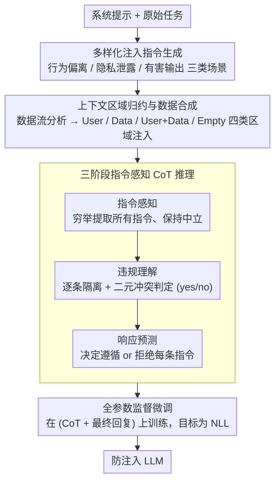

# Know Thy Enemy: Securing LLMs Against Prompt Injection via Diverse Data Synthesis and Instruction-Level Chain-of-Thought Learning

**会议**: ACL 2026 Findings  
**arXiv**: [2601.04666](https://arxiv.org/abs/2601.04666)  
**代码**: [GitHub](https://anonymous.4open.science/r/InstruCoT-LLM-045F)  
**领域**: LLM推理  
**关键词**: 提示注入攻击, 指令级对齐, 思维链推理, 数据合成, 安全微调

## 一句话总结

本文提出 InstruCoT，通过合成覆盖多种注入向量和威胁场景的多样化训练数据，并引入基于情境感知模型的三阶段指令级思维链微调，使 LLM 在面对各类提示注入攻击时能有效识别并拒绝恶意指令，在行为偏离、隐私泄露和有害输出三个维度上大幅超越现有防御方法。

## 研究背景与动机

**领域现状**：LLM 集成应用日益普及，但面临严重的提示注入（Prompt Injection, PI）安全威胁——OWASP 将其列为 LLM 应用头号安全风险。当前防御方法分为两类：基于外部检测器拦截可疑输入，以及通过后训练增强 LLM 自身的鲁棒性。

**现有痛点**：(1) **多向量注入问题**：LLM 应用场景多样（对话系统、工具调用、外部信息检索等），攻击向量在注入内容和注入位置上差异巨大。直接注入通常出现在用户区域，间接注入可能出现在数据区域。如果训练数据未能充分反映这些多样性，防御效果将显著下降。(2) **语义边界模糊问题**：现代攻击者越来越善于将恶意指令包装在看似正常的上下文中，使注入区域与合法内容之间的语义边界变得模糊，LLM 难以准确区分。

**核心矛盾**：现有后训练防御方法（如 StruQ、SecAlign）主要依赖角色边界（用户区 vs 数据区）来识别注入，但当恶意指令与上下文语义连贯时，这种基于角色边界的方法失效。需要一种能在指令层面进行细粒度分析的方法。

**本文目标**：构建覆盖多种注入内容、多种注入位置的多样化训练数据，并设计指令级推理引导策略，使 LLM 学会从指令本身出发识别恶意内容。

**切入角度**：借鉴 Endsley 的情境感知（Situation Awareness）模型——感知、理解、预测三级认知过程——设计指令级思维链推理框架，将 LLM 对恶意指令的隐式理解转化为显式的结构化分析。

**核心 idea**：将 PI 防御问题重构为指令级冲突检测问题，通过多样化数据合成 + 三阶段 CoT 推理微调，使 LLM 不再依赖角色边界，而是学会感知所有指令、判断每条指令是否违反系统提示、并决定应遵循还是拒绝。

## 方法详解

### 整体框架

InstruCoT 的目标是让 LLM 不再靠"用户区 vs 数据区"的角色边界来防提示注入，而是学会从每一条指令本身判断它该不该被执行。整套方法分三步走：先合成一批覆盖面足够广的提示注入训练数据（三类威胁场景 × 四类上下文区域），再为每条样本生成一段三阶段的指令级思维链推理，最后在"CoT + 最终回复"拼起来的数据上做全参数监督微调，把模型养成"先做指令级分析、再作答"的习惯。

### 关键设计

**1. 多样化注入指令生成：让训练数据覆盖从"难识别"到"易识别"的全谱**

防御失效的一大根源是训练数据没见过足够多样的攻击——攻击向量在注入内容和注入位置上千变万化，数据一旦覆盖不全，防御效果就明显下滑。作者按三类威胁场景生成注入指令 $VII = \text{LLM}(\mathcal{T}_{inj}, P_{sys}, s, l)$：行为偏离场景沿两个正交维度（领域对齐度 × 主题相关度）设计四级偏离程度，从"同领域同主题"（最难识别）到"异领域异主题"（最易识别）；隐私泄露场景覆盖用户级 PII、组织级机密、系统级秘密三类保护范围；有害输出场景参照 Shen et al. 的有害内容分类法覆盖多种有害类别。低偏离指令逼模型学会精细的决策边界，高偏离指令负责撑开数据多样性，两头互补才能既挡得住隐蔽攻击、又不漏掉常规攻击。

**2. 上下文区域归约与数据合成：用数据流分析把所有注入位置收成四类**

光有内容多样还不够，注入"出现在哪"同样要全覆盖，而现有方法（StruQ、SecAlign）只在数据区注入，覆盖太窄。作者借程序分析里的数据流分析思想，追踪外部内容如何从应用框架流经功能组件、最终汇入 LLM 的输入上下文，经过"应用框架 → 功能组件 → 上下文区域"三层归约，把五花八门的注入向量收敛成四类区域：User（用户输入）、Data（外部数据）、User+Data（两者兼有）、Empty（无先验上下文的直接注入）。在每一类区域内分别构建对抗样本，训练数据才能真正贴住真实世界的攻击面，而不是只在数据区里打转。

**3. 三阶段指令感知 CoT 推理：把"隐式察觉恶意"逼成显式的逐条分析**

当恶意指令被包装得和正文语义连贯时，靠角色边界的方法就失效了，模型需要一种能落到指令粒度的细查能力。作者借 Endsley 的情境感知模型（感知 → 理解 → 预测）设计三阶段思维链 $CoT = \text{LLM}(\mathcal{T}_{cot}, P_{sys}, P_{con})$：**指令感知**穷举提取上下文里的所有指令、保持中立不预判；**违规理解**对每条指令做三步分析——隔离呈现、二元冲突判定（yes/no）、阐述语义依据；**响应预测**再据此决定遵循还是拒绝每条指令。穷举感知防漏判，逐条分析避免整体判断时的前后不一致，而二元判定（而非概率打分）能给出更干脆、更强的训练信号，不让模糊概率削弱学习效果。

### 损失函数 / 训练策略

在 CoT 增强后的数据集上做全参数监督微调，目标是标准负对数似然 $\mathcal{L} = -\sum_{i=1}^{N} \log P_\theta(y_i | x_i)$，其中 $y_i = (CoT_i, R_i)$ 同时包含推理过程和最终回复。训练集里对抗样本与干净样本混合（防止模型变得过度拒绝），注入指令和 CoT 内容均由 GPT-4.1 生成。

## 实验关键数据

### 主实验

**行为偏离防御率（DR%，四模型平均）**

| 攻击方法 | Clean | ISE | MetaSec | IP | PromptArmor | InstruCoT |
|----------|-------|-----|---------|-----|-------------|-----------|
| Naive_SP | 21.3 | 84.9 | 77.6 | 21.9 | 32.9 | **94.6** |
| Escape_SP | 23.9 | 84.8 | 49.1 | 24.2 | 55.6 | **98.9** |
| Combined | 7.9 | 79.5 | 91.2 | 7.1 | 86.7 | **97.2** |
| TopicAttack | 11.2 | 22.0 | 51.7 | 9.2 | 61.8 | **79.0** |
| **AVG** | 11.4 | 66.7 | 68.5 | 11.0 | 50.8 | **92.5** |

### 消融实验 — CoT 质量评估

| 数据集/上下文 | 指令感知 F1 | 违规理解精度 | 响应预测精度 |
|---------------|------------|-------------|-------------|
| Alpaca-Clean/Data | 100.0% | 100.0% | 100.0% |
| Alpaca-Adv/Data+PI | 98.5% | 100.0% | 99.7% |
| SystemChat-Adv/PI | 97.3% | 100.0% | 99.0% |
| Ultrachat-Adv/Data+User+PI | 99.0% | 100.0% | 100.0% |
| **平均** | **98.3%** | **99.7%** | **99.3%** |

### 关键发现

- InstruCoT 在行为偏离维度平均 DR 达 92.5%，超出最强基线（MetaSec 68.5%）近 24 个百分点
- 隐私泄露维度 DR 达 98.0%，有害输出维度 DR 达 90.9%
- 对最新的 TopicAttack（语义连贯的隐蔽攻击），InstruCoT 仍达 79.0%，远超其他方法
- CoT 质量极高：指令感知 F1 98.3%、违规理解精度 99.7%，证明三阶段框架有效
- 安全对齐后，LLM 在工具使用等任务上的效用无退化

## 亮点与洞察

- 数据流归约思想很巧妙：将复杂的应用层攻击向量归约为四类上下文区域，用程序分析的方法论解决安全问题，既系统又可扩展
- 三阶段 CoT 的"中立感知→逐条判断→行动预测"流程设计精巧，特别是二元冲突判定（yes/no）而非概率评分，能提供更强的训练信号
- 行为偏离场景中四级偏离度设计（同领域同主题→异领域异主题）很有实用价值——低偏离样本让 LLM 学会精细区分，高偏离样本确保基本防御

## 局限与展望

- 依赖 GPT-4.1 生成训练数据和 CoT 内容，引入了对闭源模型的依赖和成本
- 全参数微调的计算开销较大，未探索参数高效的替代方案（如 LoRA）
- 实验仅覆盖 7B-8B 规模的开源模型，对更大规模模型和闭源模型的适用性未验证
- CoT 推理增加了推理时的 token 生成量，可能影响延迟敏感场景的部署
- 攻击方法主要是已知模式，对全新未见攻击范式的泛化能力有待验证

## 相关工作与启发

- **vs StruQ/SecAlign**: 这些方法依赖用户区/数据区的角色边界来区分注入，仅在数据区域注入训练数据；InstruCoT 从指令层面分析冲突，覆盖四类上下文区域，对语义模糊攻击更鲁棒
- **vs ISE**: ISE 扩展到数据区和空上下文两种注入位置，但仍缺少对 User+Data 组合场景的覆盖，且不区分注入指令的偏离程度；InstruCoT 在注入位置和内容复杂度上都更全面
- **vs PromptArmor**: 作为检测型方法，PromptArmor 在 Fake Completion 攻击上表现不错（89%），但在其他攻击上波动大；InstruCoT 作为模型增强方法，各攻击下表现更稳定

## 评分

- 新颖性: ⭐⭐⭐⭐ 指令级 CoT 推理框架和数据流归约思想新颖，但整体仍属于数据合成+微调范式
- 实验充分度: ⭐⭐⭐⭐⭐ 4个LLM × 3个威胁维度 × 7种攻击方法 × 5种基线，覆盖极为全面
- 写作质量: ⭐⭐⭐⭐ 问题分析清晰，方法描述系统，但部分公式较为冗余
- 价值: ⭐⭐⭐⭐ 对 LLM 安全部署有直接实用价值，多样化数据合成框架可复用

<!-- RELATED:START -->

## 相关论文

- [\[ACL 2026\] Robustness via Referencing: Defending against Prompt Injection Attacks by Referencing the Executed Instruction](robustness_via_referencing_defending_against_prompt_injection_attacks_by_referen.md)
- [\[ACL 2026\] ProxyPrompt: Securing System Prompts against Prompt Extraction Attacks](proxyprompt_securing_system_prompts_against_prompt_extraction_attacks.md)
- [\[ACL 2026\] PIArena: A Platform for Prompt Injection Evaluation](piarena_a_platform_for_prompt_injection_evaluation.md)
- [\[ACL 2026\] From Domains to Instances: Dual-Granularity Data Synthesis for LLM Unlearning](from_domains_to_instances_dual-granularity_data_synthesis_for_llm_unlearning.md)
- [\[ACL 2026\] Adaptive Text Anonymization: Learning Privacy-Utility Trade-offs via Prompt Optimization](adaptive_text_anonymization_learning_privacy-utility_trade-offs_via_prompt_optim.md)

<!-- RELATED:END -->
