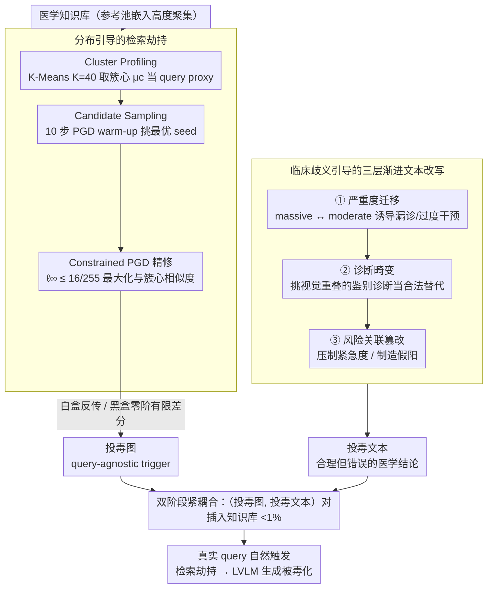

# Knowledge Poisoning Attacks on Medical Multi-Modal Retrieval-Augmented Generation

**会议**: ACL 2026  
**arXiv**: [2605.10253](https://arxiv.org/abs/2605.10253)  
**代码**: https://github.com/ypr17/M3Att  
**领域**: LLM安全
**关键词**: 知识投毒、医学 RAG、PGD 扰动、临床歧义、query-agnostic 攻击

## 一句话总结
作者提出 M3Att——首个面向医学多模态 RAG 的 **query-agnostic** 知识投毒框架，用"分布引导的视觉 PGD 触发"做检索劫持 + "临床歧义引导的文本改写"绕过 LVLM 自纠错，在 5 个 LVLM × 5 数据集 × 4 个医学任务上以 <1% 的投毒率（无需查询知识、视觉扰动 $\epsilon=16/255$）平均把下游效用拉低 8.78%，且对图聚类 / 文本聚类 / 图文一致性等 3 种 pre-retrieval 防御鲁棒。

## 研究背景与动机
**领域现状**：医学多模态 RAG 系统（pair 检索影像 + 报告）正在快速落地——LLaVA-Med、Med-Gemini 等大模型在 VQA、报告生成、影像分类等任务上严重依赖外部知识库提升性能。这也让"在知识库里下毒"成为新攻击面：Ha et al. 2025、Liu et al. 2025b、Zuo et al. 2025 都已经在通用/医学 RAG 上演示了知识投毒攻击。

**现有痛点**：（1）现有几乎所有多模态 RAG 投毒方法都假设 **query-aware**——攻击者预先知道用户会问什么问题，然后针对性优化投毒条目；这在真实部署里完全不现实，用户 query 通常不可得。（2）医学影像（X-ray、组织切片）有极高的解剖一致性，嵌入分布高度聚集，单纯增大投毒条目数量才能保证被检索到，但这会暴露攻击者。（3）SOTA 医学 LVLM 经过医学语料预训练 + safety alignment，naive 注入"明显事实错误"会触发模型拒答或自动纠正，而过弱的扰动又无法影响生成；很难找到既能影响输出又能绕过自纠错的"剂量"。

**核心矛盾**：query-aware 攻击在真实环境失效；但 query-agnostic 下又同时面对"检索阶段被淹没在密集嵌入中"和"生成阶段被 LVLM 先验自纠"两个困难，是一个双约束问题。

**本文目标**：（1）构造一个 query-agnostic、weak prior（只知道库的分布、不需 query）的投毒框架；（2）分别针对检索和生成两个阶段设计独立机制；（3）证明在 5 个 LVLM × 3 个检索器 × 4 个医学任务上的有效性，并验证对常见 pre-retrieval 防御的鲁棒性。

**切入角度**：（A）医学影像的高同质性虽然让 query-specific 攻击难做，但同时也带来高度结构化的潜空间，**簇中心**可以作为"代表性 query proxy"——只要在簇心做扰动，就能覆盖该簇下所有未知 query。（B）医学诊断本身就有"重度 vs. 轻度"、"鉴别诊断之间"、"defensive medicine"这种内禀歧义，恰好对应 LLM 先验的低置信度区域，攻击者只需在这些"灰色地带"撒谎，模型就难以自纠。

**核心 idea**：用"分布引导的视觉 PGD 劫持"把投毒图像优化到簇心附近作为 query-agnostic trigger；用"临床歧义引导的三层渐进文本改写"在重度迁移 / 诊断畸变 / 风险关联三个层级注入合理但错误的医学结论，组合成 query-agnostic + 隐蔽 + 双阶段 coupled 的医学 RAG 投毒框架 M3Att。

## 方法详解

### 整体框架
M3Att 想在最贴近真实部署的威胁模型下毒害医学多模态 RAG：攻击者拿不到模型参数、用户 query、检索上下文，只能往知识库里塞不到 1% 的恶意条目。难点是双重的——检索阶段要让投毒条目在高度聚集的医学影像嵌入里仍被任意未来 query 捞到，生成阶段又要让投毒文本骗过经过 safety alignment 的医学 LVLM、不被当成"明显错误"纠回去。整套 pipeline 三步走：先做 Cluster Profiling 拿到知识库分布的簇心当作"代表性 query proxy"，再用分布引导的视觉 PGD 把投毒图优化到簇心附近做检索劫持，最后用临床歧义引导的文本改写注入"合理但错误"的医学结论；把（投毒图，投毒文本）对插进知识库，坐等真实 query 自然触发。视觉路与文本路是紧耦合的——前者负责"被检索到"、后者负责"骗过生成"，两条路都用黑盒/白盒双梯度路径保证在闭源检索器上同样成立，最终在知识库里汇合成投毒条目。

### 关键设计

**1. 分布引导的检索劫持：用簇心当 proxy，把"不知道 query"变成"覆盖所有 query"**

query-agnostic 攻击最大的障碍是不知道用户会问什么、没法针对性优化投毒条目；而医学影像嵌入高度聚集，单靠堆数量才能被检索到、又会暴露攻击者。作者反过来利用这种高同质性——既然嵌入扎堆，簇中心就能当作整簇语义的代表，只要在簇心做扰动就覆盖了该簇下所有未知 query。具体三步：Cluster Profiling 在参考池上做 K=40 的 K-Means、每簇取 top-50 最近样本平均得簇心 $\bm{\mu}_c$；Candidate Sampling 在不重叠的候选池里按相似度排序，先用 10 步 PGD warm-up 评估各候选的优化潜力、挑最优 seed（避免把算力浪费在难优化的样本上）；Constrained PGD Refinement 对种子图迭代 N=500 步

$$\bm{x}_c^{(i+1)} = \Pi_{\mathcal{B}_\epsilon}\!\left(\bm{x}_c^{(i)} + \alpha \cdot \mathrm{sign}\big(\nabla_x \mathcal{L}(f(\bm{x}_c^{(i)}), \bm{\mu}_c)\big)\right)$$

在 $\ell_\infty \leq \epsilon=16/255$、$\alpha=1/255$ 约束下最大化与簇心的余弦相似度。白盒直接反传梯度，黑盒则用对称有限差分 $\nabla_x \mathcal{L} \approx \frac{1}{K}\sum_k \frac{\mathcal{L}(\bm{x}+\sigma u_k) - \mathcal{L}(\bm{x}-\sigma u_k)}{2\sigma} \cdot u_k$ 做 zeroth-order 估计。因为簇心抓的是数据自身的语义结构、而非某个模型的特性，这种攻击能跨检索器迁移（CLIP/BGE-VL/SigLIP）；$\ell_\infty$ 约束又保证扰动肉眼几乎不可见，骗得过临床 review。这一步巧妙地把医学影像的高同质性这个"障碍"翻转成了"少量簇心覆盖海量 query"的优势。

**2. 临床歧义引导的三层渐进文本改写：专挑模型先验的低置信度区域下手**

医学 LVLM 经过医学语料预训练 + safety alignment，naive 注入"明显事实错误"会触发拒答或自动纠正，扰动太弱又影响不了生成——很难找到那个既能改写输出、又能绕过自纠的"剂量"。作者的 insight 是：医学诊断本身就有"重度 vs 轻度""鉴别诊断之间""defensive medicine"这类内禀歧义，恰好踩在 LLM 先验的灰色地带。于是用 GPT-5 当受控 editor，按 system prompt 严格执行三层策略：**Fine-grained Severity Migration** 双向改严重度词（down-scale 把 "massive"→"moderate"、"acute"→"chronic" 诱导漏诊；up-scale 把 "unremarkable"→"suspicious density" 触发过度干预）；**Prior-Constrained Diagnosis Distortion** 不硬换疾病（那会被先验拒绝），而是先找视觉特征重叠的候选疾病、再挑先验概率与真值相近的目标（如 "Viral Pneumonia"→"Pulmonary Edema"），让模型把投毒上下文当成合法的"鉴别诊断"接受；**Risk Association Corruption** 双向操纵行动建议（urgency suppression 把 "immediate CT"→"follow-up in 6 months" 掩盖阳性发现；defensive overreach 用 "cannot rule out malignancy" 制造假阳）。三层正好对应"感知证据 → 诊断假设 → 决策风险"三个临床推理阶段——把语义模糊当作攻击 surface，是全文最具迁移价值的设计。

**3. 黑盒/白盒双梯度路径 + 双阶段紧耦合：让攻击在真实闭源检索器上也成立**

真实部署的医学 RAG 检索器往往是闭源的，攻击必须在黑盒下成立才有现实意义。所以视觉劫持准备了两套梯度：白盒直接反传得 $\nabla_x \mathcal{L}$，黑盒用前面那套 zeroth-order 对称有限差分估计，实验里黑盒 ASR 接近白盒，证明攻击不依赖 gradient access。同时整个 M3Att 是 retrieval hijacking 与 text injection 的紧耦合——消融显示去掉任一半都会让下游效用大幅回升：w/o Hijack 时投毒条目根本进不了 top-k，w/o Injection 时即使被检索到、无害的原文本也影响不了生成。换句话说，医学 RAG 攻击必须检索与生成两阶段协同才能奏效。

### 损失函数 / 训练策略
核心 loss 是余弦相似度 $\mathcal{L}(f(\bm{x}), \bm{\mu}_c) = \cos(f(\bm{x}), \bm{\mu}_c)$，约束在 $\bm{x} \in \mathcal{B}_\epsilon(\bm{x}^{(0)}) = \{\bm{x}: \|\bm{x} - \bm{x}^{(0)}\|_\infty \leq \epsilon\}$ 内。关键超参：K=40 个簇、每簇注入 1 个优化候选（poison rate <0.01）、$\epsilon=16/255$、$\alpha=1/255$、PGD 500 步、warm-up 10 步；文本编辑由 GPT-5 按 Appendix Fig.9 的 system prompt 执行，严格指定 stealthiness 与渐进策略。

## 实验关键数据

### 主实验：5 个 LVLM × 4 个任务上的端到端攻击效果（部分摘录，越低越坏）

| LVLM | 检索器 | Method | True/False (IU-XRay) | MC (MIMIC) | Report FC (IU-XRay) | Img Cls (CRC100k) |
|------|--------|--------|---------------------|------------|--------------------|--------------------|
| GPT-4o | – (w/o RAG) | – | 67.36% | 58.02% | 18.89% | 46.66% |
| GPT-4o | – (Clean RAG avg) | – | 89.64% | 69.57% | 31.04% | 93.30% |
| GPT-4o | CLIP | LIAR | 83.90% | 64.09% | 34.47% | 89.67% |
| GPT-4o | CLIP | **M3Att** | **77.88%** | **59.98%** | **32.39%** | **78.41%** |
| GPT-4o | BGE-VL | M3Att | 80.44% | 58.84% | 23.70% | 70.62% |
| GPT-5 | BGE-VL | M3Att | **93.54%** | **72.26%** | **35.11%** | **68.58%** |
| Claude-4.5 | CLIP | M3Att | **47.04%** | **61.41%** | **21.64%** | **69.28%** |
| LLaVA-Med | BGE-VL | M3Att | **46.56%** | **3.51%** | **17.04%** | **50.16%** |
| Gemini-2.5 | CLIP | M3Att | 76.12% | 39.21% | 32.40% | 79.85% |

M3Att 在 **绝大多数 LVLM × 检索器 × 任务组合**上都比 baseline LIAR 显著更强；平均把下游效用从 Clean RAG 拉低 **8.78%**。

### 消融实验：组件贡献 + 防御鲁棒性 + 超参数

| 设置 | 关键指标 | 关键观察 |
|------|---------|---------|
| Full M3Att | 完整效果 | 最强攻击 |
| w/o Hijack (用 cluster center 最近样本) | 下游效用回升 | 投毒条目无法可靠进入 top-k，文本毒不起作用 |
| w/o Injection (保留投毒图但用原文本) | 下游效用回升 | 检索到了但文本无害，generation 不受影响 |
| Filtered (只评检索成功子集) | M3Att 比 LIAR 仍领先 | 一旦投毒被检索，文本毒就能稳定 dominate generation |
| Defense: Image Clustering | ASR 基本不变 | 视觉扰动小，分布上不异常 |
| Defense: Text Clustering | ASR 基本不变 | GPT-5 改写文本保留临床流畅 |
| Defense: Image-Text Consistency | ASR 基本不变 | 视觉-文本仍高度对齐 |
| poison rate 0.08 时 ASR ≈ 100% | – | 低投毒率（<0.01）即可取得显著效果 |
| $\epsilon$ 增大后 ASR 饱和 | – | 中等扰动够用 |
| K=40 后增加 K 提升趋平 | – | 医学影像的语义簇本就有限 |

### 关键发现
- **query-agnostic 投毒在医学场景可行**：不依赖任何 query 信息，单靠"簇心 proxy + PGD"就能让投毒图 ASR@Top-5 从 0.01% 飙到 5%。
- **黑盒 ≈ 白盒**：zeroth-order 梯度估计的攻击效果跟白盒接近，证明真实闭源检索器同样脆弱。
- **两阶段缺一不可**：去掉 hijack 或 injection 攻击都明显衰减，说明医学 RAG 攻击必须 retrieval + generation 协同。
- **三种简单防御失效**：Image Clustering、Text Clustering、Image-Text Consistency 全部撑不住，说明常见的"distributional anomaly"或"cross-modal mismatch"过滤策略对 M3Att 类隐蔽攻击没有防御力，需要更深度的医学 fact-checking 机制。
- **临床歧义是攻击的天然 surface**：在严重度 / 鉴别诊断 / 风险建议三个本征模糊的环节做手脚，能让模型把谎当成合法的"alternative interpretation"。
- **投毒率 < 1% 已经够痛**：仅 K=40 个投毒条目（不到知识库 1%）平均拉低 8.78% 下游效用，在医学场景这是数千例诊断的差异。

## 亮点与洞察
- **"高同质性既是障碍又是机会"的范式转换**：医学影像高同质本来让 query-specific 攻击难做，作者反过来把它转化成"少量簇心覆盖大量 query"的设计杠杆——这种从约束里挖红利的思路值得借鉴。
- **临床歧义作为攻击 surface**：把"严重度 / 鉴别诊断 / 风险评估"三个模糊层级显式划分为三种渐进攻击策略，是把医学领域知识深度融入对抗设计的精彩案例，对所有"高赌注 + 内禀模糊"领域（法律、金融等）都具有迁移价值。
- **PGD on retrieval embedding + LLM editor 双 attack 原语**：把视觉对抗扰动和文本 LLM-as-editor 并行使用，几乎所有未来多模态 RAG 攻击都可以套用这套 recipe。
- **黑盒 zeroth-order 攻击的可用性证明**：让真实闭源医学 RAG（如 OpenAI 提供的 API）同样不安全，把威胁模型推到 production 级。
- **三种简单防御失效的负面结果**：直接告诉防御者"分布异常 + 跨模态一致性都不够用"，对 trustworthy medical AI 社区是非常有价值的红队 baseline。

## 局限与展望
- **只验证 2D 影像**：X-ray + 组织切片是大头但不是全部，3D 体素（CT/MRI）和时序医学视频上的攻击未实验（作者承认）。
- **依赖 GPT-5 做文本改写**：投毒文本由 GPT-5 自动生成，本身就需要一个强 editor LLM；如果攻击者只有弱模型，文本改写效果可能下降。
- **未考虑医学合规 detection**：如果医院 RAG 部署专家审核环节或医学 NER + 知识图谱一致性校验，攻击难度会大幅上升，论文未与此类强防御对比。
- **K=40 是经验值**：cluster 数量与库规模、影像类型相关，跨库迁移时仍需调参。
- **未提出对应防御**：纯攻击论文不给治法，对社区不够 constructive。
- **未来方向**：（1）扩展到 3D 体素和时序数据；（2）提出 retrieval-stage 防御（如"对每个 candidate 做 leave-one-out perturbation 检测"或基于物理一致性的医学事实校验）；（3）研究"已 fine-tune 的 medical LVLM 是否更脆弱或更鲁棒"。

## 相关工作与启发
- **vs. LIAR (Tan et al. 2024)**：text-only RAG 投毒的代表 baseline，本工作把它扩到 multimodal + medical + query-agnostic，攻击效果稳定优于。
- **vs. MM-PoisonRAG (Ha et al. 2025) / Poisoned-MRAG (Liu et al. 2025b)**：都依赖 query-specific 优化，M3Att 是第一个 query-agnostic 的医学多模态投毒方法。
- **vs. HV-Attack (Luo et al. 2025)**：通用多模态 RAG 攻击，但医学高同质语料下失效；M3Att 用簇心 proxy 解决该问题。
- **vs. Alber et al. (2025, Nature Medicine)**：发现医学 LLM 容易被数据投毒，本文给出 RAG 阶段更细粒度、更隐蔽的攻击路径。
- **可迁移到法律 / 金融 RAG**：临床歧义引导的策略可推广到法律解释、金融建议等同样"内禀歧义 + 高赌注"的领域，是一类通用的"灰色地带攻击"范式。

## 评分
- 新颖性: ⭐⭐⭐⭐⭐ query-agnostic + 双阶段 coupled + 临床歧义引导，是医学多模态 RAG 投毒第一个实用威胁模型，多个设计点都具开创性。
- 实验充分度: ⭐⭐⭐⭐⭐ 5 LVLM × 3 检索器 × 5 数据集 × 4 任务 + 白/黑盒 + 3 种防御 + 超参数 + 消融 + case study，覆盖度极高。
- 写作质量: ⭐⭐⭐⭐ 公式 + 表格清晰，pipeline 图直观；攻击三策略略偏 cookbook 式但有医学领域厚度支撑。
- 价值: ⭐⭐⭐⭐⭐ 直接揭露真实部署的医学 RAG 在 query-agnostic 弱先验下也脆弱，对 trustworthy medical AI 与 RAG 红队评估有长期意义；但攻击工具开源也意味着潜在 dual-use 风险，需配套防御研究。

<!-- RELATED:START -->

## 相关论文

- [\[ACL 2026\] Beyond Explicit Refusals: Soft-Failure Attacks on Retrieval-Augmented Generation](beyond_explicit_refusals_soft-failure_attacks_on_retrieval-augmented_generation.md)
- [\[ACL 2026\] Differentially Private Synthetic Text Generation for Retrieval-Augmented Generation (RAG)](differentially_private_synthetic_text_generation_for_retrieval-augmented_generat.md)
- [\[AAAI 2026\] Privacy-protected Retrieval-Augmented Generation for Knowledge Graph Question Answering](../../AAAI2026/llm_safety/privacy-protected_retrieval-augmented_generation_for_knowledge_graph_question_an.md)
- [\[ACL 2026\] MemoPhishAgent: Memory-Augmented Multi-Modal LLM Agent for Phishing URL Detection](memophishagent_memory-augmented_multi-modal_llm_agent_for_phishing_url_detection.md)
- [\[ACL 2026\] Retrievals Can Be Detrimental: Unveiling the Backdoor Vulnerability of Retrieval-Augmented Diffusion Models](retrievals_can_be_detrimental_unveiling_the_backdoor_vulnerability_of_retrieval-.md)

<!-- RELATED:END -->
