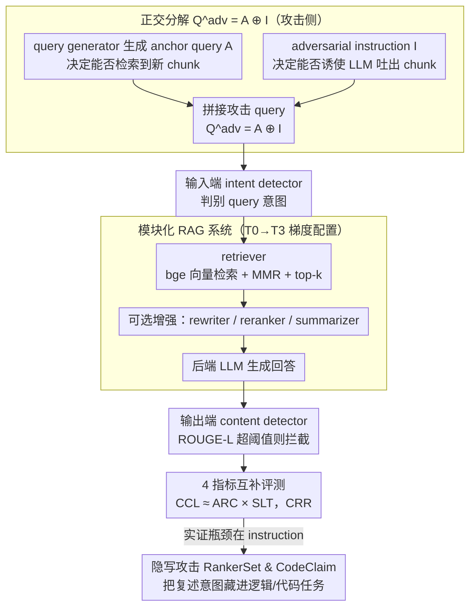

# LeakDojo: Decoding the Leakage Threats of RAG Systems

**会议**: ACL 2026  
**arXiv**: [2605.05818](https://arxiv.org/abs/2605.05818)  
**代码**: 已开源（GitHub 链接在论文中）  
**领域**: RAG / 信息检索 / LLM 安全  
**关键词**: RAG 泄露攻击, prompt injection, 红队评测框架, 指令跟随安全, 隐写攻击

## 一句话总结
提出 LeakDojo——首个把 RAG 系统、攻击与防御都模块化解耦的可配置评测框架，在 6 种攻击 × 14 个 LLM × 4 个数据集 × 多种增强模块上系统量化 RAG 泄露风险，发现"指令跟随能力越强、泄露风险越高"且"RAG 忠实度与泄露风险正相关"。

## 研究背景与动机

**领域现状**：检索增强生成（RAG）已成为 LLM 接入私有 / 高价值知识库的事实标准（医疗、金融、法律等），现代 RAG 不再是简单"检索 + 生成"，而是堆叠了 rewriter、reranker、summarizer 等多种增强模块。同时，已有多篇工作（TGTB、PIDE、DGEA、RAG-Thief、PoR、IKEA 等）展示通过 prompt injection 可以让 LLM 把检索到的 chunk 原文吐出来，从而"窃取"知识库。

**现有痛点**：(1) 这些攻击各自的 benchmark / 攻击预算 / RAG 配置都不一致，**无法公平比较**；(2) 它们大多针对相对简单的 RAG，对带 rewriter / reranker / summarizer 的"现代 RAG"效果不明；(3) 新 LLM 的指令跟随能力越来越强，是否反而放大泄露风险？这些都是开放问题。

**核心矛盾**：(a) **可用性 vs 安全性**——给 RAG 加增强模块（rewriter / summarizer）能提升 faithfulness，但是否会同时放大泄露？(b) **能力 vs 安全**——更强大、更"听话"的 LLM 是否反而是更脆弱的 RAG 后端？这些 trade-off 在现有研究中没有被定量回答。

**本文目标**：(1) 用统一框架公平评测 6 种已有攻击；(2) 解耦 RAG 系统、攻击、防御的设计空间，量化各模块独立 / 联合影响；(3) 提取出可指导实践的"泄露机制"规律（如：什么因素是 bottleneck？是 query generator 还是 adversarial instruction？）。

**切入角度**：作者把 RAG 泄露攻击重新形式化为 $Q^{adv}_i = A_i \oplus I$——其中 $A_i$ 是第 $i$ 轮的 **anchor query**（决定能否检索到新 chunk），$I$ 是 **adversarial instruction**（决定能否让模型把 chunk 吐出来）。这两个组件正交可独立替换，使得"模块化解耦评测"成为可能。

**核心 idea**：以"配置化"为核心设计原则构建 LeakDojo——RAG 系统 / 攻击 / 防御都是即插即用的模块，配合 4 个互补指标（CCL / SLT / ARC / CRR）做系统化基准测试，从大量实验里提取出可操作的泄露机制规律，并基于"瓶颈在 instruction"这一发现设计了两种新型隐写攻击（RankerSet、CodeClaim）来验证框架的延展性。

## 方法详解

### 整体框架

LeakDojo 把 RAG 泄露场景拆成三层可配置组件：

1. **RAG 系统侧**：retriever（embedding model + 检索策略 + top-$k$） + 可选 rewriter / reranker / summarizer + 后端 LLM（local vLLM 或远程 API）；
2. **攻击侧**：query generator（静态或交互式，负责生成 anchor query $A_i$） + adversarial instruction $I$（诱使 LLM 复述上下文）；
3. **防御侧**：输入端 intent detector（如 GPT-4.1-mini 判 query 意图） + 输出端 content detector（ROUGE-L > 阈值就 block）。

每个模块独立可控，可任意组合，从而支持四类研究：(a) 公平 benchmark 已有攻击；(b) 审计在线 RAG 的泄露风险；(c) 比较不同防御；(d) 即插即用扩展新攻击。

威胁模型：黑盒、$N=200$ 轮交互预算、攻击者只知道高层领域、目标是最大化 unique chunk 泄露数。

### 关键设计

**1. 攻击的正交分解 $Q^{adv}_i = A_i \oplus I$：把"攻击成功了吗"拆成两个能独立量化的子问题**

以往所有 RAG 泄露攻击都被当成"黑盒一体方法"横向对比，谁的泄露率高谁就赢，但没人说得清赢在哪一步。LeakDojo 把单轮攻击 query 形式化为 anchor query $A_i$ 与 adversarial instruction $I$ 的拼接：$A_i$ 决定能不能**检索到**新 chunk，$I$ 决定能不能**让 LLM 把 chunk 吐出来**。评测时分别用 ARC（unique retrieved / 上限 $k\times N$）量 $A_i$ 的检索覆盖、用 SLT（触发 leak 的 query 比例，由 ROUGE-L recall $> 0.5$ 判定）量 $I$ 的触发能力，整体泄露则用 CCL（unique leaked chunk / 上限）。

关键的实证支撑是元分析里 $\text{CCL} \approx \text{ARC} \times \text{SLT}$ 几乎完美成立——两个组件的影响近似乘积、彼此正交。这条经验律让评测第一次能精确指出每种攻击的瓶颈在哪：比如 TGTB 在弱模型上 ARC 很高但 SLT 很低，问题就出在 instruction 端而非 query 端。它也把"该往哪卷"这件事讲清楚了——多年来攻击改进大多在堆 query generator，而正交分解说明真正稀缺的是 instruction 的触发力。

**2. 模块化 RAG / 攻击 / 防御 + 4 指标互补评测：让"换个 LLM 会不会更危险"变成可消融的量化问题**

单一指标会掩盖机制差异——IKEA 的 SLT 很高但 ARC 很低，CCL 自然就低，只看 CCL 会误判它"弱"。LeakDojo 把三层组件都做成即插即用：RAG 侧定义 T0/T1/T2/T3 四档梯度配置（vanilla → +reranker → +rewriter → full），攻击侧把 6 个已有方法（TGTB、GEN-PIDE、DGEA、RAG-Thief、PoR、IKEA）实现成 query generator 的不同实例，可用性则用 Ragas faithfulness 度量。

所有结果统一用 4 个互补指标报告：CCL（累计泄露率）、SLT（触发率）、ARC（检索覆盖率）、CRR（逐字恢复质量）。4 指标加上逐模块消融，才能把"风险从哪来""提升空间在哪"定位到具体组件，让 RAG 开发者第一次能定量回答"加个 rewriter 或换个后端 LLM 会不会放大泄露"。

**3. 基于 logical masking 的新型隐写攻击 RankerSet & CodeClaim：把"瓶颈在 instruction"的发现直接变成更强的攻击**

这一设计是 LeakDojo 可扩展性的 case study——验证框架不是只能评测的死靶子，而能孵化新攻击。以往 instruction 含 "repeat"、"verbatim" 等显式关键词，极易被 intent detector 一刀拦掉（CCL 砍到 $<1\%$）。RankerSet 和 CodeClaim 反其道而行，把"复述 chunk"的意图藏进一条逻辑推理链——让 LLM 把 chunk 当成排序任务或代码声明任务的输入，instruction 表面上完全是一个合法任务请求。

这正好呼应正交分解给出的方向：与其让 query 更多样化，不如让 instruction 更隐蔽，后者才是高 ROI 的攻击路径。效果也印证了这点——在 intent detector 开启时，CodeClaim + GEN-PIDE 在 FIQA / DeepSeek-V3 上 CCL 仍达 59.6%，是默认 instruction 在无防御下（7.3%）的约 8 倍。

### 损失函数 / 训练策略

LeakDojo 是评测框架而非训练方法，无 loss；为可复现性所有 LLM 用 greedy decoding，攻击预算 $N=200$；rewriter / summarizer 用 GPT-4.1-mini，retriever 用 bge-large-en-v1.5 + MMR + bge-reranker-large。

## 实验关键数据

### 主实验

跨 6 个主 LLM × 4 数据集 × 3 个 RAG 变体（vanilla / +reranker / +rewriter+reranker），用 4 指标评测 6 种攻击。下表节选典型场景的 CCL（%）：

| 攻击 | Gemini-3-flash · ENRON | GPT-5.1 · ENRON | DeepSeek-V3 · ENRON | Qwen-3-8B · ENRON |
|------|------------------------|-----------------|----------------------|-------------------|
| TGTB | 72.3 | 69.5 | 0.1 | 10.4 |
| GEN-PIDE | 69.4 | 36.8 | 38.8 | 35.4 |
| DGEA | 11.2 | 16.5 | 8.1 | 12.4 |
| RAG-Thief | 44.4 | 3.3 | **64.4** | 64.1 |
| **PoR** | **88.3** | **83.2** | 6.8 | **70.2** |
| IKEA | 23.2 | 15.4 | 1.0 | 6.0 |

**关键现象**：(a) 无单一攻击在所有 LLM 上都最强——PoR 在 Gemini 上是冠军（88.3%）但在 DeepSeek-V3 上崩到 6.8%；(b) 同一数据集上 ARC 几乎不变但 SLT 跨模型剧烈波动，说明 **bottleneck 是 instruction 而非 query**；(c) 14 LLM 的 IFEval 分数与 SLT 的 Pearson $r=0.578$（$p=0.039$），**指令跟随越强、泄露风险越高**。

### 消融实验

**RAG 模块 × 数据集 × 攻击的影响分析**（CCL 与 faithfulness 关联）：

| 配置 | ARC 变化 | CCL 变化 | Faithfulness | 解读 |
|------|----------|----------|--------------|------|
| T0 → T1（+reranker） | 几乎不变 | 几乎不变（$r=-0.186$, $p=0.117$） | 略升 | reranker 对泄露中性，可放心使用 |
| T1 → T2（+rewriter） | **均值↑、方差↓** | 整体↑ | 上升 | rewriter 把弱攻击拉到稳定高位，降低攻击门槛 |
| T2 → T3（+summarizer） | 略降 | 显著↓ | 显著↓ | summarizer 砍掉 context 完整性，同时损伤可用性 |

**Faithfulness ↔ CCL 相关性**（FIQA $r=0.83, p=4.88e{-7}$；SCIFACT $r=0.57$；NFCORPUS $r=0.51$）—— RAG 越"忠实"越易被泄露。

**正交分解验证**：$\text{SLT} \times \text{ARC}$ 在所有 6 攻击上几乎完美拟合 CCL 曲线（Figure 5），证明两个组件作用近似独立。

**防御 + 新攻击对照**（FIQA · DeepSeek-V3 · T2 · CCL %）：

| 攻击 | Default | + intent det. | RankerSet + Di | CodeClaim + Di | CodeClaim + DiDo |
|------|---------|---------------|----------------|----------------|------------------|
| TGTB | 7.3 | 0.6 | 50.9 | **59.0** | 25.9 |
| GEN-PIDE | 57.5 | 0.2 | 47.8 | 59.6 | 26.5 |
| PoR | 48.7 | 0.2 | 51.7 | 57.9 | 26.9 |

CodeClaim 在 intent 检测开启下仍把 CCL 拉到 50–60%，比默认 instruction 在**无防御**下还高，验证"瓶颈在 instruction"的结论可直接转化为高效攻击。

### 关键发现
- **CCL ≈ ARC × SLT** 这条经验律意义重大：把多年攻击改进的方向（大多在堆 query generator）证伪——真正应该攻克的是 instruction 端的隐蔽性。
- **强者更危险**：指令跟随能力（IFEval）与 SLT 正相关，意味着模型能力进步与 RAG 安全是一对反向 trade-off，安全研究必须跟上能力曲线。
- **rewriter 是安全隐患**：rewriter 把弱 query 拉到高 ARC，相当于把"攻击门槛"降低，部署时需要重点防范。
- **summarizer 是"用安全换可用性"**：能砍 CCL 但伤 faithfulness，安全敏感场景可考虑作为最后兜底。
- **reranker 中性**：CCL 相关性接近 0，可放心使用。
- **现有攻击普遍缺乏隐蔽性**：单一 intent detector 就把多数攻击 CCL 砍到 <1%，但作者的 logical masking 攻击轻松绕过，说明工业部署不能依赖关键词级防御。

## 亮点与洞察
- **"$Q^{adv} = A \oplus I$ 正交分解"是把混沌的红队评测转成可量化机制研究的关键**：这种简洁形式化让 LeakDojo 不只是"凑指标"，而是真的能解释为什么某攻击在某模型上崩盘。这个分解可以迁移到 prompt injection、agent 攻击、jailbreak 等任何"诱导 + 触发"双段式攻击的评测中。
- **"能力 ↔ 安全"的负相关被定量化**（IFEval vs SLT, $r=0.578$）：直觉上一直有人怀疑"模型越听话越好骗"，本文是首次给出统计证据。这对模型选型 / safety alignment 设计是直接的指导。
- **"faithfulness ↔ leakage"正相关**指出了 RAG 安全研究的一个"反直觉"原则——你越想让 RAG 老老实实复述检索内容，它就越容易在攻击下也老老实实复述。这意味着安全机制必须显式区分"用户提问的复述需求" vs "攻击者诱导的复述需求"。
- **case study 用框架反哺攻击设计**：作者基于自己的分析（"瓶颈在 instruction"）设计 RankerSet/CodeClaim 隐写攻击，把评测框架的实用性闭环验证——这种"benchmark 不是终点而是工具"的姿态值得借鉴。

## 局限与展望
- **未量化攻击成本**：CCL 等指标都按固定预算 $N=200$ 对比，没考虑生成 token / latency / 推理费用差异，工业部署还需要补一套"性价比"评测维度。
- **RAG 设计覆盖有限**：只研究了 rewriter / reranker / summarizer 三种增强；Routing、self-reflection、agentic-RAG、GraphRAG 等更复杂结构未触及，可能存在新的 leakage 路径。
- **单一语种**：所有数据集都是英文。多语种 RAG 的 indexing 偏差、跨语对齐都可能改变泄露动力学。
- **防御较简单**：只测了 intent / content detector 两种基础防御，未对抗 SecAlign、StruQ、Spotlighting 等专用 prompt-injection 防御；后续应让 RankerSet / CodeClaim 对抗这些更强 baseline。
- **预算 $N=200$ 的合理性**：作者用 Figure 7 论证已能区分攻击曲线，但在长期监控场景下攻击者可以分时段隐蔽攻击，更长 horizon 的 leakage 行为仍待研究。
- **改进思路**：(a) 把分解推广到 $Q^{adv}=f(A, I, \text{persona})$，把 system-prompt 持久人设也纳入正交分析；(b) 用 LeakDojo 训练一个"红队 LLM"自动搜索高 ARC×SLT 的组合；(c) 探索 "faithfulness-leakage" 解耦的训练目标（如让 RAG 模型识别"内部 chunk vs 用户提问"再决定要不要复述）。

## 相关工作与启发
- **vs RAG-Thief / PoR / IKEA 等单点攻击**: 他们各自提出新的 query generator 并报告自己的 SOTA；本文把它们都嵌进 LeakDojo 重新评测，揭示"没有 universal 最强"且**真正的瓶颈在 instruction**——是对整个攻击社区研究方向的修正。
- **vs HarmBench / RACCOON / AgentDojo**: 它们分别在 jailbreak / prompt leakage / agent 攻击上做统一 benchmark；LeakDojo 把"多轮 stateful 攻击 + 多模块 RAG"这两个 RAG 独有挑战纳入，是 benchmark 范式在 RAG 安全领域的对应物。
- **vs Ragas / RAGAS-like faithfulness eval**: 这些专门测 RAG 可用性；LeakDojo 同时测可用性 + 安全性，并首次定量给出"faithfulness ↔ leakage"的正相关，把安全和可用性放进同一坐标系评估。
- **vs Persona Vectors / 内部表示安全研究（如 Latent Agents）**: 它们从模型内部找安全方向；LeakDojo 从外部黑盒接口出发，给出系统级 / 协议级的攻击面图谱，两者互补——可设想未来用内部 steering 防御本文的隐写攻击。
- **vs 通用 prompt injection 防御（如 SecAlign）**: 这些防御只针对"指令注入"本身；本文揭示 RAG 场景下还需要考虑 query generator 与 instruction 的正交配合，单点防御不够，需要在 ARC 和 SLT 两条路上同时拦截。

## 评分
- 新颖性: ⭐⭐⭐⭐ 框架本身是组合创新，但"正交分解 + IFEval-leakage 相关性 + faithfulness-leakage 相关性"三组发现都是首次量化，洞察力突出
- 实验充分度: ⭐⭐⭐⭐⭐ 6 攻击 × 14 LLM × 4 数据集 × 多 RAG 配置 × 4 指标 × 多防御组合，覆盖面接近 RAG 安全社区的"教科书级"基线
- 写作质量: ⭐⭐⭐⭐ 三层架构图 + 表格组织清晰；案例研究自洽闭环，但部分发现埋在大表里需要细读
- 价值: ⭐⭐⭐⭐⭐ 开源框架直接降低后续研究门槛；"瓶颈在 instruction"和"强者更危险"两条结论对工业 RAG 部署有直接安全指导意义

<!-- RELATED:START -->

## 相关论文

- [\[ACL 2026\] Do Multimodal RAG Systems Leak Data? A Comprehensive Evaluation of Membership Inference and Image Caption Retrieval Attacks](do_multimodal_rag_systems_leak_data_a_comprehensive_evaluation_of_membership_inf.md)
- [\[ACL 2026\] A Survey on the Safety and Security Threats of Computer-Using Agents: JARVIS or Ultron?](a_survey_on_the_safety_and_security_threats_of_computer-using_agents_jarvis_or_u.md)
- [\[ACL 2026\] Detecting RAG Extraction Attack via Dual-Path Runtime Integrity Game](detecting_rag_extraction_attack_via_dual-path_runtime_integrity_game.md)
- [\[ACL 2026\] Differentially Private Synthetic Text Generation for Retrieval-Augmented Generation (RAG)](differentially_private_synthetic_text_generation_for_retrieval-augmented_generat.md)
- [\[ACL 2026\] Evaluating Answer Leakage Robustness of LLM Tutors against Adversarial Student Attacks](evaluating_answer_leakage_robustness_of_llm_tutors_against_adversarial_student_a.md)

<!-- RELATED:END -->
