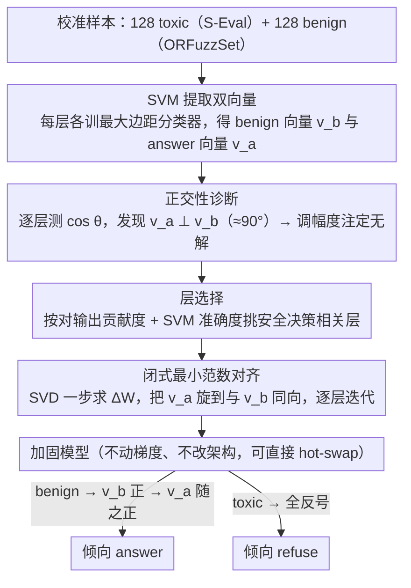

# LLM-VA: Resolving the Jailbreak-Overrefusal Trade-off via Vector Alignment

**会议**: ACL 2026  
**arXiv**: [2601.19487](https://arxiv.org/abs/2601.19487)  
**代码**: https://hotbento.github.io/LLM-VA-Web/  
**领域**: LLM 安全 / 对齐 / 表征工程  
**关键词**: jailbreak、over-refusal、vector steering、SVM probe、闭式权重更新

## 一句话总结
LLM-VA 发现 LLM 内部把"是否回答"（answer 向量 $v_a$）与"输入是否安全"（benign 向量 $v_b$）编码成几乎正交的两个方向，导致 jailbreak 与 over-refusal 之间的取舍永远此消彼长；它通过闭式最小范数权重更新把 $v_a$ 与 $v_b$ 对齐，让模型"愿不愿答"因果依赖于"输入安不安全"，在 12 个 LLM 上 F1 比最强 baseline 高 11.45%、效用仅掉 4.08%，且无需任何 fine-tuning 或架构改动。

## 研究背景与动机
**领域现状**：安全对齐 LLM 同时有两种失效模式——jailbreak（对 toxic query 给出有害回答）和 over-refusal（对 benign query 也拒答）。主流缓解路线有 RLHF / adversarial training / 规则过滤（贵）和 vector steering（廉价，操控隐空间方向，如 VectorSteer、AlphaSteer、SCANS、CAST）。

**现有痛点**：现有 vector steering 几乎都在"调 $v_a$ 的幅度"——减幅度 → 抑制 jailbreak 但放大 over-refusal；增幅度 → 反之。AlphaSteer 用 null-space 投影保 utility 但仍是 magnitude-based；SCANS/CAST 引入输入毒性信息但需要 hook 改架构、且把两类失效当独立目标硬调超参。

**核心矛盾**：本文用 SVM 在 12 个 LLM 上 layer-by-layer 提取 $v_a$ 与 $v_b$，发现它们在所有层都 **近乎正交** $(\sim 90^\circ)$。这意味着模型内部把"愿不愿答"和"输入危不危险"当作完全独立的判断；而幅度调节只能整体放大/缩小 $v_a$ 方向上的投影，必然对 benign 和 toxic 输入产生同向影响，无法同时抑制两种错误。

**本文目标**：把 $v_a$ 与 $v_b$ 对齐，使 $v_a$ 投影本身就承载"输入是否安全"的信息，从而让 toxic 输入自然被抑制、benign 输入自然被鼓励，**一次性**解决双失效模式。

**切入角度**：用 SVM 找方向 → 用闭式最小范数权重修改实现对齐，跳过梯度优化与 fine-tuning。

**核心 idea**：jailbreak/over-refusal 的根源是 $v_a \perp v_b$（结构性解耦）；解法是几何对齐而非幅度调节。

## 方法详解

### 整体框架
LLM-VA 分三步，全程不动梯度：
1. **向量识别**：对每一层用 SVM 在 128 toxic（S-Eval）+ 128 benign（ORFuzzSet）样本上训分类超平面，得到 $v_b$（benign vs toxic 法向）和 $v_a$（answer vs refuse 法向）；
2. **层选择**：用每层对最终输出的贡献度 + SVM 分类准确度选出"安全决策最相关"的层子集（避开早层歧义性强、晚层任务无关的层）；
3. **向量对齐**：通过最小范数权重更新 $\Delta W$ 把该层 MLP/attention 输出空间里 $v_a$ 旋转到与 $v_b$ 对齐，迭代至所有选中层完成。

贯穿这条流水线的枢纽是**向量识别之后的一次逐层正交性诊断**：正是测出 $v_a$ 与 $v_b$ 近乎正交（$\sim 90^\circ$）这一事实，才推断出"调幅度注定无解"、必须改用几何对齐，因此它既是方法的理论支点也是图中承上启下的一环。输入 $x$ 进入对齐后的模型时，若 $x$ benign → $v_b$ 投影为正 → $v_a$ 投影也正（已对齐）→ 模型倾向 answer；若 toxic → 反之 → 模型倾向 refuse。

### 关键设计

**1. SVM 提取双向量 $v_a$ 与 $v_b$：用真实样本在每层各训一个最大边距分类器，拿到几何意义最干净的"安全方向"和"回答方向"**

要在隐空间里操控行为，前提是先准确找到"愿不愿答"和"输入危不危险"这两个方向。本文对每个 transformer 层的输出 $h^{(\ell)}$ 分别训两个 SVM：一个用 toxic（S-Eval）/ benign（ORFuzzSet）样本的激活分类，法向就是 benign 向量 $v_b$；另一个用 answered / refused 样本分类，法向就是 answer 向量 $v_a$。两个 SVM 的决策边界都落在零附近（见 Figure 2 的三层投影分布）。

之所以用 SVM 而非 logistic regression，是因为最大边距超平面给出的方向几何意义最明确，且对样本量不敏感——每层只用 128+128=256 个样本就能训出高分离度的方向。用真实激活提取，也比 prompt-engineering 凑出来的"概念向量"更贴近模型实际编码的方式。

**2. 正交性诊断作为方法论支柱：先证明 $v_a \perp v_b$ 是结构性事实，再据此推出"调幅度注定无解"**

这是全文最关键的观察。作者横跨 4 个模型家族（Llama-3.1、Gemma-2、Mistral-v0.3、Qwen3）逐层用余弦相似度测量 $\cos\theta = \frac{v_a^\top v_b}{\|v_a\|\|v_b\|}$，结果在所有层都得到 $\angle(v_a, v_b) \approx 90^\circ$；同时验证两个方向各自分类准确率都很高，说明这不是噪声方向的高维偶然正交，而是真正的信息独立。

由此可以推出一个几何"不可能定理"：当 $v_a \perp v_b$ 时，$v_a$ 上的投影对 $v_b$ 携带的"输入是否安全"完全无信息，于是缩放 $v_a$ 的幅度对 benign 和 toxic 输入的效应是同向且一致的——减幅度同时压住 jailbreak 和正常回答（放大 over-refusal），增幅度则反之。这就把"为什么所有 magnitude-based 方法注定按下葫芦浮起瓢"从一堆零散的经验现象升级成了几何必然，也直接指明解法应该是几何对齐而非幅度调节。

**3. 闭式最小范数权重对齐：用一步 SVD 把 $v_a$ 旋到与 $v_b$ 同向，让"愿不愿答"因果依赖"输入安不安全"**

既然根源是两个方向解耦，那就把它们重新耦合起来。本文寻找一个最小的权重扰动 $\Delta W$，使该层输出空间里的 $v_a$ 旋转到与 $v_b$ 平行，形式化为 $\min \|\Delta W\|_F$ s.t. $(W+\Delta W)\,v_a \parallel v_b$。这个带正交约束的最小范数问题有闭式解（类似 Procrustes 旋转），可用 SVD 一步给出，再按层选结果迭代施加，全程不需要任何 LM loss 的反向传播。

三个约束各有用意：闭式解保证速度快、可复现；最小范数 $\|\Delta W\|_F$ 保证对模型一般能力的扰动尽量小；不改架构则保证加固后的 checkpoint 能直接塞进现成推理框架 ship 出去。对齐之后，benign 输入让 $v_b$ 投影为正、$v_a$ 投影随之为正、模型倾向 answer；toxic 输入则全部反号、模型倾向 refuse——两种失效模式被同一次对齐一并按住。

### 损失函数 / 训练策略
**无训练**。所有"训练"仅限两件事：(a) 每层 SVM 训练（标准 hinge loss + 256 样本，秒级完成）；(b) 闭式 $\Delta W$ 计算（SVD 一步出解）。整个过程在单卡上分钟级完成，作者把加固后的 12 个 LLM 权重直接开源。

## 实验关键数据

### 主实验
12 个 LLM × 5 个家族（Llama-3.1/3.2/3.3、Gemma-2、Mistral-v0.3、Qwen3、其它），对比 5 个 baseline（None、VectorSteer、AlphaSteer、SCANS、CAST）+ Finetuning，作者论文摘要给出的总体平均：

| 方法 | F1 (安全 trade-off 综合) | Utility 保留率 | 是否需 fine-tune | 是否改架构 |
|------|--------------------------|----------------|-------------------|-------------|
| None (原始) | 基准 | 100% | – | – |
| Finetuning | 高但贵 | 中 | ✗ 需 | ✓ 不需 |
| VectorSteer | 低（trade-off 严重） | 高 | ✓ 不需 | ✗ 需 |
| AlphaSteer (best baseline) | 中 | 100% | ✓ 不需 | ✗ 需 |
| CAST | 中 | 中 | ✓ 不需 | ✗ 需 |
| SCANS | 中 | 中 | ✓ 不需 | ✗ 需 |
| **LLM-VA (ours)** | **AlphaSteer + 11.45%** | **95.92%** | ✓ 不需 | ✓ 不需 |

LLM-VA 是唯一一个同时"不 fine-tune、不改架构、双向缓解 jailbreak + over-refusal"的方法（Table 1）。

### 消融实验（关键观察分项）

| 配置 / 观察 | 关键指标 | 说明 |
|-------------|---------|------|
| Full LLM-VA | F1 +11.45% vs AlphaSteer | 完整方法 |
| 仅调 $v_a$ 幅度（VectorSteer 路径） | 显著 trade-off | jailbreak↓ ↔ over-refusal↑ 强耦合 |
| $\angle(v_a,v_b)$ 测量 | $\sim 90°$ 全模型全层 | 证实结构正交 |
| 对模型偏置自适应 | 自动倾向修复主导失效 | 偏 jailbreak 的模型主要降 jailbreak；偏过保守的主要降 over-refusal，无需手调 |
| 层选择 vs 全层对齐 | 选择更优 | 早层方向歧义，盲对齐反而掉 utility |
| 闭式解 vs 梯度对齐 | 闭式更稳 + 快 | SVD 一步解，无超参 |

### 关键发现
- $v_a \perp v_b$ 是跨 5 个家族 12 个模型的普适现象，不是某模型的特例——说明 RLHF 类训练系统性把 helpfulness 和 harmlessness 优化成了正交目标。
- LLM-VA 自动适应每个模型的安全偏置：原本偏 jailbreak 的模型（如未经过强对齐的 base instruct 版）对齐后主要降 jailbreak；原本过保守的模型主要降 over-refusal——无需为每个模型手调超参，这是 magnitude-based 方法做不到的。
- 4.08% utility drop 换 11.45% F1 提升的 trade-off 优于所有 baseline，且对齐后的权重可以直接和原模型 hot-swap，部署成本极低。
- 早期层的 SVM 方向虽然存在但分离度低，对齐它们反而会破坏 utility——层选择不是"越多越好"。

## 亮点与洞察
- "正交性 → 几何不可能定理 → 对齐 not 缩放"这条推理链非常干净——把一个被反复经验观察的 trade-off 现象给出了几何理论解释，再对症下药。
- 闭式最小范数对齐是表征工程领域少有的"理论 + 实用"皆备的方法：单卡分钟级、不需要 calibration set 之外的数据、可与 RLHF 模型直接组合。
- 12 个模型 + 5 个家族的覆盖度在 vector steering 类工作里是顶级的，开源权重对社区直接可用。
- 对 RLHF 训练范式的隐含批评：把 helpful 和 harmless 当独立 reward 优化会自然导致正交化，未来对齐训练可能需要显式鼓励两个方向相关，从源头避免该 trade-off。

## 局限与展望
- 方法基于 *single-turn* benign/toxic 二分类；对 multi-turn jailbreak（如逐步诱导）、code/agent 上下文里的复杂攻击是否仍有效未测。
- $v_a/v_b$ 用线性 SVM 提取，假设了"安全/回答 = 线性方向"，对非线性编码的安全概念（角色扮演规避）覆盖有限。
- 在已经高度对齐的旗舰模型（GPT 系闭源）上没法用本方法（需要 hidden state 访问）；只能服务开源生态。
- 自己想到：把 $v_a$ 与 $v_b$ 对齐相当于让模型"无脑跟随安全分类器"，对边缘灰色 query（教育、研究用的危险信息）可能反而增加误杀；future work 可以引入"中性方向"做三方对齐。

## 相关工作与启发
- **vs VectorSteer (Zou 2023a)**：只调 $v_a$ 幅度，本文证明该路线几何上不可能解决 trade-off。
- **vs AlphaSteer (Sheng 2025)**：null-space 投影保 utility 但仍 magnitude-based；本文 F1 +11.45%。
- **vs SCANS / CAST (Cao 2025 / Lee 2024)**：引入输入毒性信息但需 hook 改架构 + 多超参；本文不改架构、自动适配。
- **vs Fine-tuning**：fine-tune 路线可解决 trade-off 但贵且可能破坏一般能力；本文几乎零成本达到接近效果。

## 评分
- 新颖性: ⭐⭐⭐⭐⭐ "正交性诊断 + 闭式对齐"是 vector steering 领域里少见的理论 + 实用双满分工作。
- 实验充分度: ⭐⭐⭐⭐ 12 模型 × 5 家族覆盖广，但 multi-turn / agent 场景未覆盖。
- 写作质量: ⭐⭐⭐⭐⭐ 动机推导（observation → theory → method）极其紧凑漂亮。
- 价值: ⭐⭐⭐⭐⭐ 同时解决 jailbreak + over-refusal、不 fine-tune、不改架构，部署友好，开源 12 个加固模型直接可用。

<!-- RELATED:START -->

## 相关论文

- [\[ICLR 2026\] Improving the Trade-off Between Watermark Strength and Speculative Sampling Efficiency for Language Models](../../ICLR2026/llm_safety/improving_the_trade-off_between_watermark_strength_and_speculative_sampling_effi.md)
- [\[ACL 2025\] From Trade-off to Synergy: A Versatile Symbiotic Watermarking Framework for Large Language Models](../../ACL2025/llm_safety/from_tradeoff_to_synergy_a_versatile.md)
- [\[ACL 2026\] Hard to Read, Easy to Jailbreak: How Visual Degradation Bypasses MLLM Safety Alignment](hard_to_read_easy_to_jailbreak_how_visual_degradation_bypasses_mllm_safety_align.md)
- [\[ACL 2026\] GAMBIT: A Gamified Jailbreak Framework for Multimodal Large Language Models](gambit_a_gamified_jailbreak_framework_for_multimodal_large_language_models.md)
- [\[ACL 2026\] Rethinking Jailbreak Detection of Large Vision Language Models with Representational Contrastive Scoring](rethinking_jailbreak_detection_of_large_vision_language_models_with_representati.md)

<!-- RELATED:END -->
