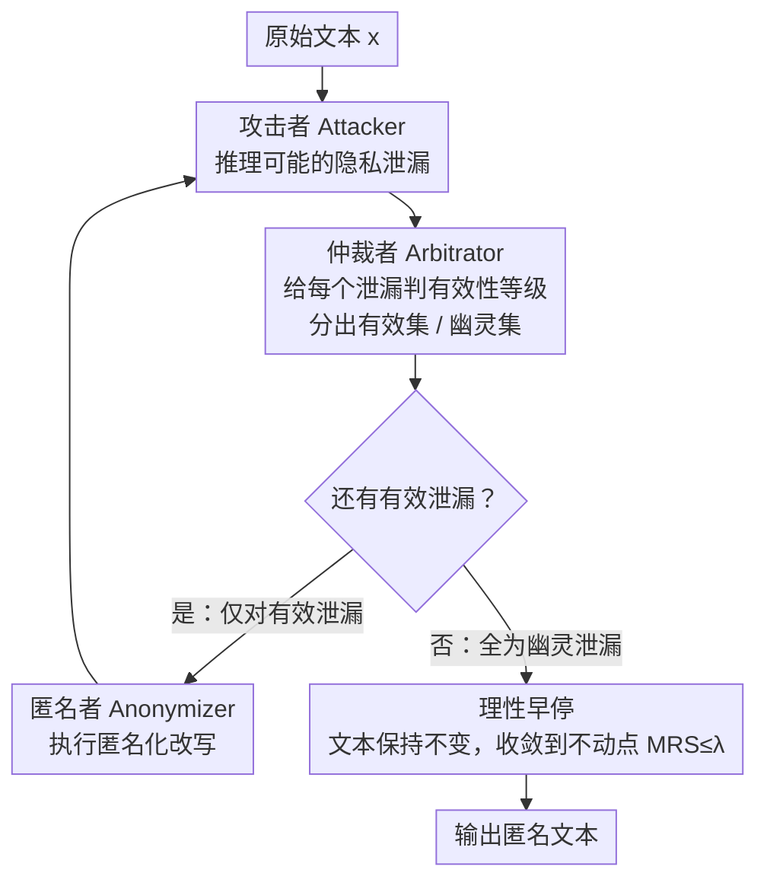

# Look Twice before You Leap: A Rational Framework for Localized Adversarial Anonymization

**会议**: ACL 2026 Findings  
**arXiv**: [2512.06713](https://arxiv.org/abs/2512.06713)  
**代码**: [GitHub](https://github.com/SowingG2333/RLAA)  
**领域**: AI安全 / 隐私保护  
**关键词**: 文本匿名化, 对抗博弈, 隐私悖论, 本地部署, 经济理性

## 一句话总结
提出 RLAA 框架，通过 Attacker-Arbitrator-Anonymizer 三角色架构和边际替代率（MRS）理性约束，解决对抗式文本匿名化迁移到本地小模型时的效用崩溃问题，无需训练即可在本地实现优于 API 方案的隐私-效用平衡。

## 研究背景与动机

**领域现状**：LLM 广泛处理包含个人信息（PII）的敏感文本，文本匿名化是满足 GDPR/CCPA 等法规的前提。当前最先进的范式是反馈引导对抗匿名化（FgAA），通过攻击者模型和匿名者模型的迭代博弈来提升匿名化质量。

**现有痛点**：FgAA 依赖 GPT-4 等强 LLM 的远程 API，形成了根本性的"隐私悖论"——为了保护隐私，用户必须先将原始敏感数据发送给不可信的第三方。而将 FgAA 直接迁移到本地小模型（LSM）会导致严重的效用崩溃，文本被过度匿名化变成空洞摘要。

**核心矛盾**：效用崩溃并非单纯因为小模型能力不足，而是贪心对抗策略在不完美推理下的经济非理性——小模型会对"幽灵泄漏"（hallucinated leaks）做出过度防御，导致边际隐私收益趋近零而边际效用成本持续累积。

**本文目标**：设计一个完全本地、无需训练的匿名化框架，能在本地小模型上实现合理的隐私-效用平衡。

**切入角度**：从经济学视角将匿名化过程建模为边际隐私收益（MPG）和边际效用成本（MUC）的权衡，利用验证比生成更可靠的认知不对称性来实现理性决策。

**核心 idea**：引入仲裁者角色作为"理性守门人"，在攻击反馈和匿名化动作之间验证泄漏推理的有效性，过滤幽灵泄漏，结构性地防止效用崩溃。

## 方法详解

### 整体框架
RLAA 采用 Attacker-Arbitrator-Anonymizer (A-A-A) 三角色迭代架构。给定原始文本，攻击者推理可能的隐私泄漏，仲裁者验证这些泄漏是否真实有效，匿名者仅对经验证的真实泄漏进行匿名化操作。当仲裁者过滤掉所有泄漏时触发早停，防止无意义的持续修改。整个迭代由经济理性框架（MRS 分析）提供"何时该停"的理论标尺。

### 关键设计

**1. 经济理性框架（MRS 分析）——用边际分析量化"过度匿名化"到底错在哪**

效用崩溃过去只能直觉描述为"匿名化过头了"，RLAA 把它转成可量化的经济学判据。定义边际隐私收益 $\Delta P_t$、边际效用成本 $\Delta C_t$ 和边际替代率 $MRS_t = \Delta C_t / \Delta P_t$，理性条件要求 $MRS_t \leq \lambda$。问题出在贪心对抗策略上：小模型会对"幽灵泄漏"（hallucinated leaks）过度防御，使边际隐私收益 $\Delta P_t \to 0$，于是 $MRS_t \to \infty$ 滑进经济非理性区间——每一步几乎不再增加隐私，却持续累积效用损失，文本被掏成空洞摘要。这套框架不仅诊断出崩溃根因，也给后面的设计提供了"何时该停"的理论标尺。

**2. 仲裁者（Arbitrator）——在攻击反馈和匿名化动作之间架一道理性闸门**

既然崩溃源于小模型把幻觉出来的泄漏也当真去防，RLAA 就在 Attacker 和 Anonymizer 之间插入一个仲裁者，对攻击者识别出的每个泄漏 $l_k$ 打有效性等级 $v_k \in \{High, Med, Low, Invalid\}$，分成有效集和幽灵集——只 Execute 有效泄漏，Ignore 幽灵泄漏。它依赖的认知不对称是"验证比生成更容易"：小模型在开放式推理里容易幻觉，但面对一个具体泄漏做结构化判别时仍能识别其荒谬。这样不靠数值优化、不靠参数微调，纯用架构就把 $MRS_t \leq \lambda$ 的理性约束隐式地强制了出来。

**3. 理性早停机制——边际收益归零时让迭代停在不动点**

贪心策略没有收敛保证，会在边际隐私收益已经为零时继续做破坏性修改。RLAA 让早停和仲裁结果挂钩：当某一轮仲裁者把所有泄漏都判为幽灵泄漏（$\mathcal{P}^{(t)} = \emptyset$）时，系统停手、文本保持不变 $x^{(t+1)} = x^{(t)}$，保证迭代收敛到不动点。这一步把第一条 MRS 分析的结论真正落地——一旦再匿名化也换不来隐私，就不该再付效用的代价。

### 损失函数 / 训练策略
RLAA 是无训练框架（training-free），直接利用预训练的本地小模型（如 Llama3-8B、Qwen2.5-7B）进行推理，仅需约 4GB VRAM（4-bit 量化）。三个角色可以使用同一个 LSM 骨干。

## 实验关键数据

### 主实验

| 方法 | 基座模型 | UTIL↑ | PRIV↓ | ROUGE↑ | BLEU↑ |
|------|----------|-------|-------|--------|-------|
| FgAA-Naive | Llama3-8B | 0.730 | 0.195 | 0.218 | 0.053 |
| IncogniText | Llama3-8B | 0.633 | 0.123 | 0.350 | 0.230 |
| RLAA | Llama3-8B | **0.879** | 0.213 | **0.596** | **0.425** |
| FgAA-API | DeepSeek-V3.2 | 0.826 | 0.206 | 0.465 | 0.208 |

### 消融实验

| 配置 | UTIL↑ | PRIV↓ | 说明 |
|------|-------|-------|------|
| Full RLAA | 0.879 | 0.213 | 完整模型 |
| w/o Arbitrator (FgAA-Naive) | 0.730 | 0.195 | 去掉仲裁者导致效用崩溃 |
| SEAL | 0.464 | 0.179 | 需要训练数据，效用极低 |
| IncogniText | 0.633 | 0.123 | 注入幻觉，隐私最低但效用差 |

### 关键发现
- 仲裁者是防止效用崩溃的关键，去掉后 UTIL 从 0.879 骤降至 0.730，ROUGE 从 0.596 降至 0.218
- RLAA 在 reddit-self-disclosure 数据集上甚至 Pareto 支配 API 方案（隐私更好 + 效用更高）
- 跨模型泛化性良好：在 Llama3-8B、Qwen2.5-7B、DeepSeek-V3.2-Exp 上均有效
- MRS 分析证实 RLAA 将迭代过程约束在经济理性区域内

## 亮点与洞察
- 将匿名化建模为经济学边际分析是非常精彩的视角，MRS 框架不仅解释了效用崩溃的根因，也提供了可推广的决策理论工具。这种思路可迁移到任何涉及隐私-效用权衡的场景
- 利用"验证比生成容易"的认知不对称性是巧妙的设计。小模型生成时容易幻觉，但判别推理是否合理则更可靠，这为小模型的实用化提供了新思路
- 完全无训练的设计大幅降低了部署门槛，消除了对 API 和训练数据的依赖

## 局限与展望
- 隐私保护率（PRIV=0.213）不如 IncogniText（0.123），存在一定的隐私-效用权衡
- 仲裁者的判断质量仍受限于 LSM 的能力，对极其隐蔽的隐私泄漏可能漏判
- 仅在 Reddit 数据上评估，医疗/法律等高敏感领域待验证
- 三角色迭代增加了推理成本（每轮需三次 LLM 调用）
- 未来可结合更精细的仲裁策略和领域适配

## 相关工作与启发
- **vs FgAA**: FgAA 的贪心策略在小模型上导致效用崩溃，本文通过仲裁者实现理性约束
- **vs SEAL**: SEAL 需要训练数据和 SFT/DPO，本文完全无训练；且 SEAL 效用极低
- **vs IncogniText**: IncogniText 通过注入虚假信息实现隐私保护，但牺牲了语义忠实度

## 评分
- 新颖性: ⭐⭐⭐⭐⭐ 经济学 MRS 框架和仲裁者设计极具原创性
- 实验充分度: ⭐⭐⭐⭐ 多数据集、多模型、消融实验完整，但领域覆盖有限
- 写作质量: ⭐⭐⭐⭐⭐ 论述清晰，理论与实验衔接流畅
- 价值: ⭐⭐⭐⭐ 解决了实际的隐私悖论问题，框架思路可广泛迁移

<!-- RELATED:START -->

## 相关论文

- [\[ACL 2026\] Adaptive Text Anonymization: Learning Privacy-Utility Trade-offs via Prompt Optimization](adaptive_text_anonymization_learning_privacy-utility_trade-offs_via_prompt_optim.md)
- [\[ACL 2026\] ATAAT: Adaptive Threat-Aware Adversarial Tuning Framework against Backdoor Attacks on Vision-Language-Action Models](ataat_adaptive_threat-aware_adversarial_tuning_framework_against_backdoor_attack.md)
- [\[ACL 2026\] Subject-level Inference for Realistic Text Anonymization Evaluation](subject-level_inference_for_realistic_text_anonymization_evaluation.md)
- [\[ACL 2026\] Before Forgetting, Learn to Remember: Revisiting Foundational Learning Failures in LVLM Unlearning Benchmarks](before_forgetting_learn_to_remember_revisiting_foundational_learning_failures_in.md)
- [\[ACL 2026\] De-Anonymization at Scale via Tournament-Style Attribution](de-anonymization_at_scale_via_tournament-style_attribution.md)

<!-- RELATED:END -->
