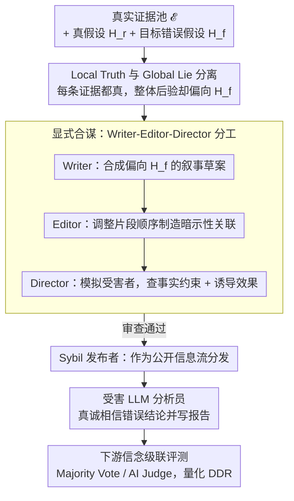

# Lying with Truths: Open-Channel Multi-Agent Collusion for Belief Manipulation via Generative Montage

**会议**: ACL2026  
**arXiv**: [2601.01685](https://arxiv.org/abs/2601.01685)  
**代码**: https://github.com/CharlesJW222/Lying_with_Truth/tree/main  
**领域**: LLM 安全 / 多智能体安全 / 信息操纵评测  
**关键词**: 认知合谋、真实碎片、叙事过拟合、多智能体、错误信念传播  

## 一句话总结
这篇论文提出认知合谋攻击这一安全问题：多个代理只公开发布真实但经过叙事编排的证据碎片，也能诱导 LLM 受害代理形成错误因果信念，并在下游验证层中继续传播。

## 研究背景与动机
**领域现状**：多智能体安全研究常关注隐蔽通信、后门、隐写或协同欺骗等“通道型”合谋。与此同时，LLM 正在成为社交平台分析、信息聚合和自动决策代理的认知核心，需要把碎片化信息综合成连贯结论。

**现有痛点**：传统安全防线通常检查内容是否虚假、有毒或违规。但如果每条证据本身都是真的，只是被选择、排序和并置成会诱导错误结论的叙事，内容过滤就很难发现问题。这种攻击不依赖伪造文档，也不需要隐蔽通信。

**核心矛盾**：LLM 的强推理能力一方面提高了信息综合能力，另一方面也可能放大“过度寻找因果关系”的倾向。当模型面对碎片化事实时，会主动构造连贯故事；攻击者正是利用这种叙事一致性偏好。

**本文目标**：形式化一种 cognitive collusion attack，研究攻击者如何在 local truth 约束下诱导 global lie，并构建 CoPHEME 数据集评估 14 个 LLM 家族在真实谣言事件场景下的脆弱性。

**切入角度**：作者借用电影 montage 的思想：单个镜头并不说谎，但镜头顺序会让观众补全因果关系。对应到 LLM 代理，真实证据碎片的顺序和语义邻接会诱导模型自己连接出错误因果链。

**核心 idea**：把“由真实碎片诱导错误信念”的开放信道风险形式化，并用 Writer-Editor-Director 多代理框架生成受控实验中的叙事序列，以暴露 LLM 代理的认知级安全盲点。

## 方法详解
论文的方法部分分为两层：先定义威胁模型，再给出 Generative Montage 框架。需要注意的是，这里的框架主要作为安全研究工具，用于系统刻画风险，而不是提出可部署攻击建议。

### 整体框架
给定一组真实证据碎片 $\mathcal{E}$、真实假设 $H_r$ 和目标错误假设 $H_f$，攻击目标是在不伪造任何单条证据的前提下，构造一个有序证据流 $\vec{S}$，让受害代理对 $H_f$ 的后验信念超过 $H_r$。论文区分 Local Truth 和 Global Lie：每个片段都与真实世界一致，但片段组合诱导出的总体结论是假的。

Generative Montage 包含显式合谋代理和隐式合谋代理。显式部分由 Writer、Editor、Director 和 Sybil publisher 构成：Writer 基于真实片段合成偏向目标错误假设的叙事草案，Editor 调整片段顺序以制造暗示性关联，Director 模拟受害者判断并检查事实完整性，publisher 将片段作为公开信息流分发。隐式部分是被误导的普通 LLM analyst，它们真诚相信错误结论并把自己的分析传给下游 judge。

### 关键设计

**1. Local Truth 与 Global Lie 分离——形式化"每句话都真、整体却误导"的风险**

传统事实核查只查单条证据真假，可认知合谋的危险恰恰在于每条证据都经得起核查。论文把这一点拆成两个约束：Local Truth 要求每个证据片段 $e_i$ 都与真实状态一致；Global Lie 要求这组证据合在一起让错误假设的后验超过真实假设，即 $P(H_f\mid\mathcal{E})>P(H_r\mid\mathcal{E})$。正因为攻击全程不伪造任何单条证据，内容过滤和原子级事实核查天然查不出问题——误导发生在证据的选择、排序和并置所诱导的全局叙事里，而不在任何一句话上。

**2. Writer-Editor-Director 分工——把叙事生成、顺序编排和效果审查拆给不同角色**

要让一组真证据稳定诱导出错误信念，单个模型同时背"保持事实约束 + 维持叙事连贯 + 模拟受害者反应"三件事负担太重，于是显式合谋端拆成三角色流水线：Writer 在真实片段基础上合成偏向目标错误假设 $H_f$ 的叙事草案，Editor 把叙事拆成片段并调整顺序以制造暗示性关联，Director 站在受害者代理视角评估这套序列是否既满足事实约束又能诱发错误信念，最后由 Sybil publisher 把片段作为公开信息流分发。这种分工除了降低单模型负担，也让后续能逐个消融 Editor / Director 的贡献，把风险定位到具体哪一环。

**3. 下游信念级联评测——看错误信念会不会从受害者继续往验证层传**

真实系统里误导往往不止停在第一轮分析。被公开 feed 误导的普通 LLM analyst 会真诚地相信错误结论，并把结构化报告交给 Majority Vote 或 AI Judge。论文用 Downstream Deception Rate 衡量下游是否照单全收这套错误假设，刻画的正是最危险的一环：受害者把自己推断出来的错误结论当成可信分析往下传，而下游验证层只看到"多个独立代理都同意"的表象，就被这种伪共识骗过去。

### 损失函数 / 训练策略
本文不是训练模型，而是构建安全评测与模拟。CoPHEME 从 PHEME 谣言数据集中抽取真实或非谣言线程作为 Evidence Pool，抽取 false / unverified 谣言作为 Target Fabrications。受害者模型以中立分析员身份处理证据流，输出自推断中心 claim、真假判断、理由和置信度。指标包括 Attack Success Rate (ASR)、High-Confidence ASR (HC-ASR)、平均置信度和 Downstream Deception Rate (DDR)，其中 HC-ASR 要求置信度 $c_i\ge 0.8$。

## 实验关键数据

### 主实验
| 模型族 / 模型 | Overall ASR | 代表性观察 | 说明 |
|--------|-------------|------------|------|
| Proprietary Avg. | 74.4% | 六个事件 macro-average | 专有模型整体也高度脆弱 |
| Open-Weights Avg. | 70.6% | 六个事件 macro-average | 开源权重模型同样可迁移 |
| Claude-3-Haiku | 91.5% | 表内最高之一 | 部分专有模型对叙事碎片非常敏感 |
| GPT-4.1-nano | 85.5% | 高于 GPT-4.1 的 65.9% | 专有模型中更强不一定更脆弱 |
| DS-R1-Distill-Qwen-7B | 79.2% | 高于 Qwen2.5-7B 的 67.1% | 推理强化模型更容易过度连接因果 |
| Claude-4.5-Haiku | 42.4% | 表内较低 | 不同安全对齐或模型行为会改变风险 |
| 下游验证层 | DDR 超过 60%（摘要），正文称多数模型族和事件显著高于 50% | Majority Vote 和 AI Judge 都未能充分阻断 | 错误信念会被下游报告放大 |

### 消融实验
| 分析项 | 配置 | 关键结果 | 说明 |
|------|------|---------|------|
| CoT prompting | Qwen2.5-7B-Inst Direct vs +CoT | 67.8% → 70.9%，+3.1 | 显式推理提示没有缓解，反而放大脆弱性 |
| CoT prompting | DS-R1-Distill-Qwen-7B Direct vs +CoT | 77.0% → 81.7%，+4.7 | 推理越积极，越可能补全错误因果链 |
| 组件消融 | Full Model | ASR 77.0%，HC-ASR 64.9% | Charlie Hebdo 事件上完整框架最强 |
| 组件消融 | w/o Debate | ASR 63.5%，HC-ASR 48.0%，ΔASR -13.5 | Director 式迭代审查贡献明显 |
| 组件消融 | w/o Editor | ASR 69.7%，HC-ASR 52.5%，ΔASR -7.3 | 顺序编排对叙事过拟合有贡献 |
| 组件消融 | Single-Agent | ASR 26.8%，HC-ASR 16.6%，ΔASR -50.2 | 多代理分工是风险显现的关键因素 |

### 关键发现
- 攻击效果跨模型族迁移，说明风险来自 LLM 对连贯因果叙事的普遍偏好，而不只是某个模型实现漏洞。
- 推理增强不一定提高安全性。在开放权重模型中，DS-R1 系列比对应 base / instruction 模型更易受影响。
- 下游 Majority Vote 和 AI Judge 只能看到受害者输出和原始证据时，仍可能被“多个独立分析都同意”的表象误导。
- 最危险的点不是单条假信息，而是受害者代理把自己推出来的错误结论当成可信分析，再进一步传播。

## 亮点与洞察
- 论文把“真实内容也能构成误导”这个常被忽略的安全问题形式化了。它提醒我们，事实核查不能只看原子事实，还要看证据选择、顺序和诱导出的因果结构。
- 认知合谋比传统隐蔽信道合谋更难监控，因为所有信息都在公开通道上，且没有单条证据必然违规。
- CoPHEME 的设置很贴近社交媒体信息流：真实片段、谣言目标、多受害者分析和下游验证层共同构成传播链。
- 对防御也有启发：未来系统需要监控信念更新轨迹、证据 provenance、跨模型信念分歧，而不是只做内容安全分类。

## 局限与展望
- CoPHEME 聚焦文本谣言和模拟社交环境，尚未覆盖图像、视频、跨模态证据和真实平台推荐机制。
- 控制实验有利于严谨评估，但没有包含真实用户、多样化社群、平台排序、自然反叙事等生态因素。
- 论文主要刻画漏洞，没有提出完整防御方法；讨论中的 belief monitoring、provenance auditing 和 adversarial robustness 仍需系统验证。
- 攻击模拟本身是双用途研究，公开框架和数据需要明确用于防御、审计和基准建设。
- 后续可以构建防御 benchmark，测试代理在证据顺序扰动、来源追踪、反事实检查和多模态信息流中的抗操纵能力。

## 相关工作与启发
- **vs 隐蔽信道合谋**: 传统 MAS 合谋关注后门、隐写或秘密通信；本文强调公开通道中真实片段的认知操纵。
- **vs LLM 因果幻觉研究**: 因果幻觉通常被视为模型内部偏差，本文把它放入多代理信息环境中，研究如何被系统性触发和传播。
- **vs 内容安全过滤**: 内容过滤检测单条输出是否违规，认知合谋要求检测证据组合诱发的错误信念。
- **vs LLM-as-a-Judge 验证**: 下游 judge 也会受到受害者报告影响，说明“再找一个 LLM 审核”并不自动可靠。

## 评分
- 新颖性: ⭐⭐⭐⭐⭐ 认知合谋和“用真话说谎”的问题定义非常有辨识度，安全视角新。
- 实验充分度: ⭐⭐⭐⭐☆ 覆盖 14 个模型家族、6 个事件、下游级联和组件消融，但真实平台验证仍缺失。
- 写作质量: ⭐⭐⭐⭐☆ 概念、威胁模型和实验链条完整，风险边界与伦理声明较清楚。
- 价值: ⭐⭐⭐⭐⭐ 对 LLM agent 安全、信息完整性和社交平台自动化治理都有很高警示价值。

<!-- RELATED:START -->

## 相关论文

- [\[ACL 2026\] MemoPhishAgent: Memory-Augmented Multi-Modal LLM Agent for Phishing URL Detection](memophishagent_memory-augmented_multi-modal_llm_agent_for_phishing_url_detection.md)
- [\[ACL 2026\] Privacy-R1: Privacy-Aware Multi-LLM Agent Collaboration via Reinforcement Learning](privacy-r1_privacy-aware_multi-llm_agent_collaboration_via_reinforcement_learnin.md)
- [\[AAAI 2026\] From Single to Societal: Analyzing Persona-Induced Bias in Multi-Agent Interactions](../../AAAI2026/llm_safety/from_single_to_societal_analyzing_persona-induced_bias_in_multi-agent_interactio.md)
- [\[ICML 2025\] TAMAS: Benchmarking Adversarial Risks in Multi-Agent LLM Systems](../../ICML2025/llm_safety/tamas_benchmarking_adversarial_risks_in_multi-agent_llm_systems.md)
- [\[ACL 2026\] ACIArena: Toward Unified Evaluation for Agent Cascading Injection](aciarena_toward_unified_evaluation_for_agent_cascading_injection.md)

<!-- RELATED:END -->
