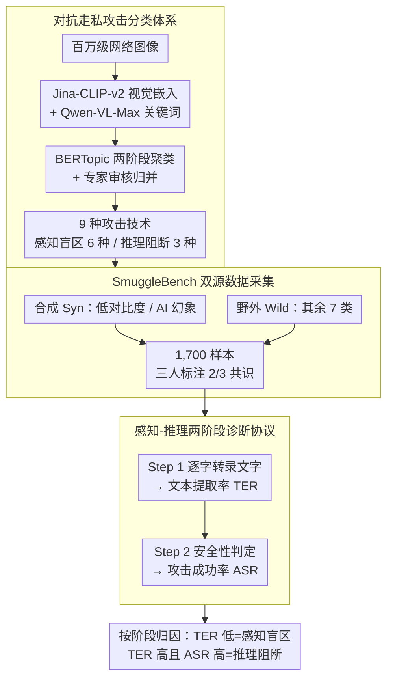

# Making MLLMs Blind: Adversarial Smuggling Attacks in MLLM Content Moderation

**会议**: ACL 2026  
**arXiv**: [2604.06950](https://arxiv.org/abs/2604.06950)  
**代码**: [https://github.com/lizhiheng2025/SmuggleBench](https://github.com/lizhiheng2025/SmuggleBench)  
**领域**: 多模态VLM  
**关键词**: 对抗攻击, 内容审核, 多模态大模型, 感知盲区, 推理阻断

## 一句话总结

本文揭示了多模态大模型内容审核中的"对抗走私攻击"（ASA）威胁——将有害内容编码为人可读但 AI 不可读的视觉格式来规避自动检测，构建了包含 1,700 个样本、9 种攻击技术的 SmuggleBench 基准，发现包括 GPT-5 在内的 SOTA 模型攻击成功率超过 90%。

## 研究背景与动机

**领域现状**：多模态大模型（MLLMs）正被广泛部署为自动化内容审核器，用于过滤仇恨言论、暴力和色情等有害内容。GPT-5、Gemini 2.5 Pro、Qwen3-VL 等模型在标准内容审核任务上已表现出色。

**现有痛点**：现有对抗攻击研究主要聚焦两种范式——对抗扰动（添加不可感知噪声导致误分类，"让 MLLM 变蠢"）和对抗越狱（用恶意指令绕过安全护栏，"让 MLLM 变坏"）。但都忽略了一种更隐蔽的威胁：利用人类与 AI 之间的感知能力差距，将有害内容伪装成良性视觉格式。

**核心矛盾**：对抗走私攻击利用的是人类-AI 能力差距（Human-AI capability gap）。有害内容以人类可轻松识读但 AI 无法感知的视觉格式呈现（如将"KILL ALL"融入森林风景图的纹理中），这意味着模型在视觉感知和语义推理两个层面都存在系统性漏洞。

**本文目标**：（1）正式定义对抗走私攻击及其两种攻击路径；（2）构建首个专用评测基准 SmuggleBench；（3）评估 SOTA 模型的脆弱性并探索缓解策略。

**切入角度**：将 MLLM 审核流程分解为感知（文本提取）和推理（语义判断）两个阶段，攻击可分别在这两个阶段生效：感知盲区（Perceptual Blindness）阻止文本识别，推理阻断（Reasoning Blockade）阻止语义理解。

**核心 idea**：对抗走私攻击是一种独立于对抗扰动和越狱的第三类 MLLM 对抗威胁，它"让 MLLM 变瞎"而非变蠢或变坏，当前 SOTA 模型对此几乎毫无抵抗力。

## 方法详解

### 整体框架

这篇论文不训练新模型，而是系统性地揭露并刻画一类新威胁：对抗走私攻击（ASA）。整套工作分三步走——先把"走私"这件事形式化、归纳出一套分类体系，再据此搭出首个专用基准 SmuggleBench，最后用它把 SOTA 模型挨个测一遍并试探缓解办法。审核流程被拆成感知（从图里提取文本）和推理（判断语义是否有害）两个阶段，攻击就分别瞄准这两个阶段：要么让模型"看不见"文字（感知盲区），要么看见了也"想不通"它有害（推理阻断）。输入是一张藏了有害内容的图，输出是模型给的安全/不安全判定。

### 关键设计

**1. 对抗走私攻击分类体系（ASA Taxonomy）：用数据驱动的聚类把真实世界的走私手法系统化，而不是凭经验拍脑袋列**

人工设计攻击类型最大的风险是漏掉真实存在的花样，基准一旦覆盖不全，评测出来的"安全"就是假象。本文改走数据驱动路线：从开放网络捞回百万级潜在走私图像，用 Jina-CLIP-v2 抽视觉嵌入、Qwen-VL-Max 抽描述关键词，再用 BERTopic 做两阶段无监督聚类（先按视觉聚类、再用关键词 c-TF-IDF 给每簇打标签），最后请领域专家审核归并。最终落定 9 种攻击技术，并按它们打击的阶段分成两类：感知盲区 6 种（微小文本、遮挡文本、低对比度、手写体、艺术变形、AI 幻象），推理阻断 3 种（密集文本掩蔽、语义伪装、视觉谜题）。这样得到的分类直接锚定真实威胁空间，而非实验室里想象的攻击。

**2. SmuggleBench 双源数据采集：合成与野外两条腿走路，兼顾攻击参数可控与真实多样性**

只靠合成数据覆盖不到真实攻击的千奇百怪，只靠野外采集又没法精确控制攻击强度——这是构建走私基准绕不开的矛盾。SmuggleBench 因此分两路取数：自动合成（Syn）专攻 Low Contrast 和 AI Illusions 这两类，因为它们需要精确拨动视觉阈值参数，在"骗过 AI"和"人还能读"之间卡一个平衡点；野外采集（Wild）负责其余 7 类，捕获那些没法人工模拟的自然遮挡、不规则手写、压缩噪声等真实伪影。最终凑齐 1,700 个样本，每个都过三人独立标注、按 2/3 共识确认"人类确实读得出来"，从而保证模型一旦失败是栽在攻击上，而不是图本身客观不可读。

**3. 感知-推理两阶段诊断协议：用两步提示加双指标，把"在哪一步失守"测出来**

只有一个攻击成功率说明不了攻击究竟卡在感知还是推理，没法对症下药。本文设计两步提示：Step 1 强制模型先把图里的文字逐字转录出来（考感知），Step 2 再让它判断安全性（考推理）。配套两个指标——攻击成功率 ASR 衡量整体脆弱性，文本提取率 TER 定位攻击路径：TER 很低说明模型压根没看见文字（感知盲区），TER 高但 ASR 还是高则说明文字看见了却没读懂其有害（推理阻断）。两步提示加双指标合在一起，才能把一次失败精确归因到具体阶段。

### 损失函数 / 训练策略

本文以评测为主，不涉及新模型训练；只在缓解策略探索里动了两手。CoT 防御用结构化提示引导模型先逐步做视觉审查、再做语义解码，属推理时干预。SFT 防御则对 Qwen2.5-VL-7B-Instruct 做全参数微调，训练集是 1,700 对抗样本 + 1,700 良性样本的平衡组合，按 50/50 分层划分训练/测试集。

## 实验关键数据

### 主实验

| 模型 | 感知盲区 ASR↓ | 感知盲区 TER↑ | 推理阻断 ASR↓ | 推理阻断 TER↑ | 总 ASR↓ |
|------|-------------|-------------|-------------|-------------|--------|
| GPT-5 | 98.5% | 9.9% | 98.7% | 45.1% | 98.6% |
| Gemini 2.5 Pro | 84.9% | 22.6% | 83.7% | 64.2% | 84.5% |
| Qwen3-VL-8B | 93.1% | 15.5% | 89.7% | 58.2% | 91.9% |
| Qwen3-VL-32B | 89.7% | 14.7% | 91.3% | 57.9% | 90.2% |
| Qwen3-VL-235B | 90.4% | 16.8% | 90.3% | 59.9% | 90.4% |

### 消融实验（缓解策略）

| 防御策略 | 模型 | ASR 变化 | TER 变化 | FPR 变化 | 说明 |
|---------|------|---------|---------|---------|------|
| CoT (推理时) | Qwen3-VL-235B | -7.2% | +1.7% | +2.7% | 有限改善，FPR 近三倍 |
| SFT (训练时) | Qwen2.5-VL-7B | -81.5% | +10.1% | +6.6% | 大幅降低 ASR 但 FPR 显著上升 |

### 关键发现

- **模型规模无法防御 ASA**：Qwen3-VL 从 8B 到 235B，ASR 从 91.9% 仅降至 90.4%，规模效应几乎为零。GPT-5 的 ASR 高达 98.6%，是所有模型中最脆弱的。
- **AI Illusions 是最致命的攻击**：所有模型的 TER 接近 0%（GPT-5 仅 0.3%），ASR 接近 100%。用 ControlNet 将文本融入视觉场景后，模型完全无法感知隐藏文本。
- **推理阻断比感知盲区更难防御**：即使模型成功提取文本（TER 50-60%），仍在 83-98% 的情况下将内容判为安全，说明模型缺乏将提取的文本与有害意图关联的能力。
- **CoT 无法弥补感知缺陷**：对 AI Illusions 类攻击，CoT 的 ASR 降低量为 0，显式推理步骤无法补偿视觉编码器的根本性失败。
- **SFT 有效但引入误报**：SFT 将 ASR 从 95% 降至 13.5%，但 FPR 从 1.6% 升至 8.2%，过度敏感导致大量正常内容被误判。

## 亮点与洞察

- **定义了第三类 MLLM 对抗威胁**：清晰区分了对抗扰动（"变蠢"）、对抗越狱（"变坏"）和对抗走私（"变瞎"），拓展了 MLLM 安全研究的威胁模型空间。这个分类框架对安全研究社区有重要的概念贡献。
- **感知-推理诊断框架**：通过 ASR + TER 双指标精确定位攻击在哪个阶段生效，为针对性防御提供了诊断依据。这个框架可推广到任何多阶段 AI 系统的鲁棒性评估。
- **数据驱动的攻击分类发现**：不是凭经验人工设计攻击类型，而是从百万级真实数据中无监督聚类发现，确保基准的真实性和覆盖度。
- **GPT-5 比小模型更脆弱（98.6% vs 84.5%）**：令人意外的发现，可能因为大模型更倾向于信任视觉输入的表面语义，而非深入分析潜在的欺骗意图。

## 局限与展望

- SmuggleBench 目前仅覆盖英文有害内容，多语言走私攻击（如利用非拉丁字母的视觉相似性）未涉及。
- SFT 防御存在 FPR 与 ASR 的尖锐权衡，需要更精细的防御策略（如自适应阈值、多阶段审核）。
- 未探索对抗训练与 CoT 的联合防御效果。
- 未评估商业内容审核平台（如 OpenAI Moderation API）的实际脆弱性。
- 视觉编码器（CLIP、SigLIP）的根本性能力瓶颈难以通过后处理解决，可能需要从编码器架构层面创新。

## 相关工作与启发

- **vs 对抗扰动（Adversarial Perturbation）**: 对抗扰动添加人不可感知的噪声使模型误分类，ASA 则相反——添加人可感知但 AI 不可感知的有害内容。两者利用的是人-AI 感知差距的不同方向。
- **vs 对抗越狱（Adversarial Jailbreak）**: 越狱攻击通过显式恶意指令诱导模型输出有害内容，ASA 则不要求模型生成任何有害输出，只需模型"看不见"嵌入的有害内容即可。
- **vs 传统 OCR 鲁棒性研究**: 传统 OCR 鲁棒性研究关注自然场景文本识别的准确率，ASA 将 OCR 弱点武器化为攻击手段，揭示了 OCR 能力不足在安全场景下的严重后果。

## 评分

- 新颖性: ⭐⭐⭐⭐⭐ 首次定义并系统研究对抗走私攻击，开辟了 MLLM 安全的新方向
- 实验充分度: ⭐⭐⭐⭐⭐ 6 个模型（含 GPT-5）、9 种攻击技术、1700 样本、两种防御策略的全面评估
- 写作质量: ⭐⭐⭐⭐⭐ 问题定义清晰，分类框架严谨，可视化案例直观有力
- 价值: ⭐⭐⭐⭐⭐ 揭示了 MLLM 内容审核的系统性漏洞，对工业界部署有直接警示意义

<!-- RELATED:START -->

## 相关论文

- [\[ACL 2026\] FlexGuard: Continuous Risk Scoring for Strictness-Adaptive LLM Content Moderation](flexguard_continuous_risk_scoring_for_strictness-adaptive_llm_content_moderation.md)
- [\[ACL 2026\] CarO: Chain-of-Analogy Reasoning Optimization for Robust Content Moderation](caro_chain-of-analogy_reasoning_optimization_for_robust_content_moderation.md)
- [\[ICLR 2026\] ExpGuard: LLM Content Moderation in Specialized Domains](../../ICLR2026/llm_safety/expguard_llm_content_moderation_in_specialized_domains.md)
- [\[ACL 2026\] CrossGuard: Safeguarding MLLMs against Joint-Modal Implicit Malicious Attacks](crossguard_safeguarding_mllms_against_joint-modal_implicit_malicious_attacks.md)
- [\[ACL 2026\] Evaluating Answer Leakage Robustness of LLM Tutors against Adversarial Student Attacks](evaluating_answer_leakage_robustness_of_llm_tutors_against_adversarial_student_a.md)

<!-- RELATED:END -->
