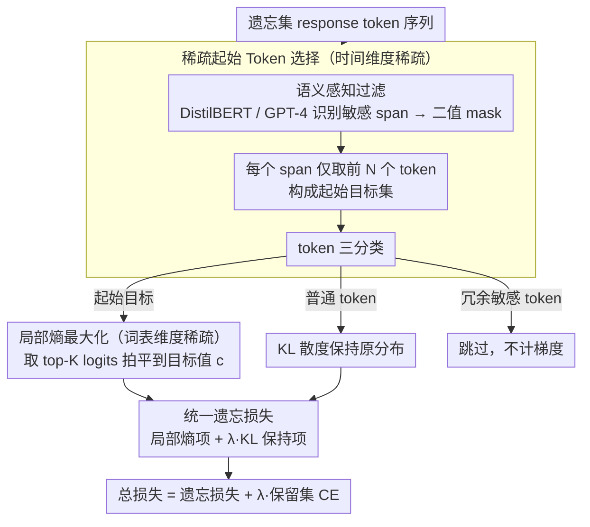

# Maximizing Local Entropy Where It Matters: Prefix-Aware Localized LLM Unlearning

**会议**: ACL 2026  
**arXiv**: [2601.03190](https://arxiv.org/abs/2601.03190)  
**代码**: [GitHub](https://github.com/nxZhai/PALU)  
**领域**: LLM 安全 / 机器遗忘  
**关键词**: LLM遗忘学习, 局部熵最大化, 前缀感知, 词表稀疏优化, 隐私保护

## 一句话总结

本文提出 PALU（Prefix-Aware Localized Unlearning），从时间和词表两个维度实现局部化的熵最大化遗忘：在时间维度仅对敏感前缀 token 施加遗忘目标，在词表维度仅对 top-K logits 进行平坦化，以最小的参数扰动实现高效遗忘并保持模型通用能力。

## 研究背景与动机

**领域现状**：LLM 不可避免地记忆了训练数据中的敏感、隐私和版权信息。机器遗忘（Machine Unlearning）旨在选择性地从模型中移除特定知识，而无需从头重新训练。现有方法主要基于负交叉熵（negated CE）及其变体。

**现有痛点**：(1) 负 CE 目标只抑制 top-1 token 的概率，但被抑制的概率质量可能转移到高度相关的同义词上，分布仍然尖锐（低熵），模型并未真正"遗忘"；(2) 现有方法对所有 response token 无差别施加遗忘梯度，包括"is"、"for"等内容无关的功能词，导致不必要的语言能力退化；(3) 全词表熵最大化方法（如 PDU）虽然理论上更优，但需要在 $|V|$ 维词表上计算梯度，计算代价过高。

**核心矛盾**：高效遗忘要求精准干预，但现有方法在时间维度（token 序列）和词表维度上都进行全局性、不加区分的优化——冗余的优化既浪费计算又损害模型通用能力。

**本文目标**：以最小必要扰动实现有效遗忘——在时间维度和词表维度同时实现稀疏化。

**切入角度**：两个关键观察——(i) 敏感语义由少量前缀 token 触发，仅对这些"起始 token"施加遗忘就足以偏转生成路径；(ii) 自回归解码由少量高概率候选主导，仅平坦化 top-K logits 即可有效引入不确定性。

**核心 idea**：双向局部化——时间维度只干预敏感前缀 token，词表维度只平坦化 top-K logits 使其趋近于统一值 $c$，实现以 $O(TK)$ 代替 $O(T|V|)$ 的遗忘复杂度。

## 方法详解

### 整体框架

PALU 想解决的是"遗忘要精准、别误伤"。它把遗忘干预同时压缩到两个维度的最小子集上：时间维度（token 序列）只盯敏感前缀，词表维度只动 top-K logits。具体分两层——Token 级先通过语义感知过滤识别出敏感 span，从每个 span 里只取前 N 个"起始 token"作为遗忘目标，其余 token 要么用 KL 散度钉住不变、要么干脆跳过；词表级则对这些起始 token 用局部熵最大化目标（只平坦化 top-K logits）来替换传统的负 CE。两层叠加，把遗忘复杂度从 $O(T|V|)$ 压到 $O(TK)$。

### 关键设计

**1. 稀疏起始 Token 选择（时间维度稀疏）：只干预每个敏感 span 的前几个 token，就能偏转整条生成轨迹**

现有方法对所有 response token 无差别施加遗忘梯度，连 "is""for" 这种功能词也一起压，白白损害语言能力。PALU 的依据是：即便在敏感 span 内部，通常也只有前几个 token 决定语义走向，后续 token 只是在已定的路径上展开——所以掐住起点就够偏转整条轨迹。实现上先用 DistilBERT 或 GPT-4 识别敏感 span 得到二值 mask $m_t$，再从每个 span 里只取前 N 个 token 组成起始目标集 $\mathcal{I}_{\text{init}}$。于是 token 被分成三类各司其职：起始目标（施加遗忘损失）、普通 token（用 KL 散度保持原分布）、冗余敏感 token（直接跳过、不算梯度）。

**2. 局部熵最大化（词表维度稀疏）：只在 top-K 这个解码关键子空间里制造不确定性，避开全词表的天价计算**

负 CE 只压 top-1，被挤掉的概率质量往往溜到高度相关的同义词上，分布还是尖的，模型并没真正"忘"；而理论上更优的全词表熵最大化又要在 $|V|$ 维上算梯度，代价高到不可接受。PALU 取其中间：对每个起始 token $t \in \mathcal{I}_{\text{init}}$，先从冻结参考模型里取出 top-K logit 索引 $V_{\text{top}}$，再把这些 logits 往目标值 $c$ 上拉平，最小化它们与 $c$ 的方差

$$\mathcal{L}_{\text{local}}(z_t) = \frac{1}{K}\sum_{i \in V_{\text{top}}}(z_{t,i} - c)^2$$

这一步既把 top-K 拍平（抬高局部熵），又因为 $c$ 取得较小而整体压低了 top-K 的概率质量。计算量只要 $O(TK)$，却在真正主导解码的那一小撮候选上注入了结构化不确定性。

**3. 统一遗忘损失：把 token 级和词表级两种稀疏拼成一个目标，遗忘与保持各管各的 token**

两个维度的稀疏化要合到一处才能一起优化。PALU 的遗忘损失写成

$$\mathcal{L}_f = \mathbb{E}_{t \in \mathcal{I}_{\text{init}}}[\mathcal{L}_{\text{local}}(z_t)] + \lambda \mathbb{E}_{t \notin \mathcal{I}_{\text{sens}}}[\text{KL}(P_{\theta_{\text{ref}}} \| P_\theta)]$$

梯度只在起始 token（拉平 top-K）和普通 token（KL 保持）上非零，冗余敏感 token 梯度恒为零。这等于把"遗忘"和"保持"分派到互不重叠的 token 子集上，严格落实最小干预原则。

### 损失函数 / 训练策略

总损失 $\mathcal{L}_{\text{all}} = \mathcal{L}_f + \lambda \mathcal{L}_r$，其中 $\mathcal{L}_r$ 是保留集上的标准 CE。基座模型用 Llama-2-7B 和 Llama-3.1-8B；top-K 索引从冻结参考模型一次性提取，并在整个遗忘过程中固定不变。

## 实验关键数据

### 主实验

**TOFU Forget 5% 基准（Llama-2-7B）**

| 方法 | FQ ↑ | MU ↑ | Fluency ↑ | EM ↓ |
|------|------|------|-----------|------|
| GA | 5.95E-11 | 0.5580 | 0.7423 | 0.9215 |
| NPO | 0.6284 | 0.5920 | 0.8115 | 0.6574 |
| TPO | 0.6284 | 0.5862 | 0.7929 | 0.6621 |
| PDU | 0.0021 | 0.5111 | 0.4834 | 0.6498 |
| **PALU** | **0.7126** | **0.6238** | 0.8122 | **0.5935** |
| Retain (理想) | 1.0000 | 0.6266 | 0.8889 | 0.6670 |

**TOFU Forget 5% 基准（Llama-3.1-8B）**

| 方法 | FQ ↑ | MU ↑ |
|------|------|------|
| NPO | 0.6284 | 0.6006 |
| TPO | 0.7216 | 0.5921 |
| **PALU** | **0.9238** | **0.6162** |
| Retain (理想) | 1.0000 | 0.6323 |

### 消融实验

**双稀疏性消融**

| 配置 | FQ ↑ | MU ↑ |
|------|------|------|
| 全局负 CE（baseline） | ~0.63 | ~0.59 |
| + Token 稀疏（仅前缀） | 提升 | 保持 |
| + 词表稀疏（仅 top-K） | 提升 | 保持 |
| + 双稀疏（PALU） | **最高** | **最高** |

**关键超参数影响**

- Top-K 截断大小：K=50 时 FQ/MU 平衡最优，过大（K→|V|）退化为全局熵最大化
- 前缀长度 N：N=3-5 即可有效打断敏感生成，过大反而损害 MU
- 目标值 c：Local Mean 策略优于 Uniform 和 Global Mean

### 关键发现

- PALU 在 Llama-3.1-8B 上 FQ 达到 0.9238，比最强基线 TPO（0.7216）提升 28%
- MU 达到 0.6162，几乎逼近理论上限 Retain 模型的 0.6323——打破了"遗忘越多通用能力越差"的 trade-off
- 在 Forget 1% 和 10% 设置下均保持稳定，其他方法（NPO、DPO）在 10% 设置下性能急剧退化
- 计算复杂度从 $O(T|V|)$ 降至 $O(TK)$，K=50 时约千倍加速

## 亮点与洞察

- "仅干预前缀即可偏转整条生成轨迹"的观察极具洞察力——揭示了自回归生成的因果链特性
- 局部熵最大化是对负 CE 和全局熵最大化的精巧折中——既避免概率转移问题，又保持计算效率
- PALU 在更强模型（Llama-3.1）上优势更大，说明方法随模型能力增长而 scalable

## 局限与展望

- 依赖外部模型（DistilBERT/GPT-4）识别敏感 span，引入额外计算和潜在误差
- Top-K 索引从冻结模型提取并固定，随着遗忘过程进行，logit 分布可能发生变化使得固定索引失准
- 主要在合成数据集 TOFU 上评估，真实世界的遗忘场景更加复杂
- 未讨论对抗性攻击下的鲁棒性——攻击者是否可以绕过前缀遗忘恢复敏感信息

## 相关工作与启发

- **vs GA/GD**: 负 CE 导致概率无界下降和灾难性崩溃；PALU 通过熵最大化实现有界、稳定的遗忘
- **vs PDU**: 全词表熵最大化理论最优但计算量 $O(T|V|)$ 不可接受；PALU 将其局部化到 top-K
- **vs TPO**: TPO 实现了 token 级稀疏但仍用负 CE 且在全词表计算；PALU 同时实现 token+词表双稀疏
- **vs SU (Selective Unlearning)**: SU 选择重要 token 但忽略词表冗余；PALU 在两个维度同时稀疏化

## 评分

- 新颖性: ⭐⭐⭐⭐⭐ 双向局部化的洞察精准，从"干预效率"角度重新定义遗忘问题
- 实验充分度: ⭐⭐⭐⭐ TOFU 多设置+MUSE+两种基座模型+详细消融，但缺少对抗性评估
- 写作质量: ⭐⭐⭐⭐⭐ 从两个稀疏性观察到方法设计的推导非常自然流畅
- 价值: ⭐⭐⭐⭐⭐ 打破了遗忘-通用能力的 trade-off，为实际部署 LLM 遗忘提供了可行方案

<!-- RELATED:START -->

## 相关论文

- [\[ACL 2026\] Forget What Matters, Keep the Rest: Selective Unlearning of Informative Tokens](forget_what_matters_keep_the_rest_selective_unlearning_of_informative_tokens.md)
- [\[ACL 2026\] STELA: A Linguistics-Aware LLM Watermarking via Syntactic Predictability](a_linguistics-aware_llm_watermarking_via_syntactic_predictability.md)
- [\[ACL 2026\] Reasoning Structure Matters for Safety Alignment of Reasoning Models](reasoning_structure_matters_for_safety_alignment_of_reasoning_models.md)
- [\[AAAI 2026\] ALTER: Asymmetric LoRA for Token-Entropy-Guided Unlearning of LLMs](../../AAAI2026/llm_safety/alter_asymmetric_lora_for_token-entropy-guided_unlearning_of.md)
- [\[ACL 2025\] Which Retain Set Matters for LLM Unlearning? A Case Study on Entity Unlearning](../../ACL2025/llm_safety/which_retain_set_matters_for_llm_unlearning_a_case_study_on_entity_unlearning.md)

<!-- RELATED:END -->
