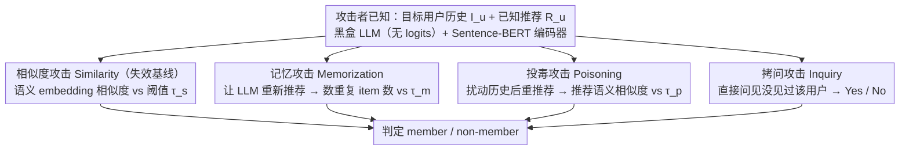

<!-- 由 src/gen_stubs.py 自动生成 -->
# Membership Inference Attacks on In-Context Learning Recommendation

**会议**: ACL 2026  
**arXiv**: [2508.18665](https://arxiv.org/abs/2508.18665)  
**代码**: 待确认  
**领域**: LLM 安全 / MIA / 推荐系统  
**关键词**: 成员推断攻击, ICL-RecSys, LLM 隐私, 提示注入, 记忆性

## 一句话总结
首次系统研究 LLM-based ICL 推荐系统的成员推断攻击（MIA），设计 Similarity / Memorization / Inquiry / Poisoning 四种攻击，发现基于 LLM 内在 **记忆** 的 Memorization 攻击在 MovieLens-1M 上 attack advantage ≥ 82%，且现有 prompt-based 防御（包括针对 Poisoning）几乎拦不住。

## 研究背景与动机
**领域现状**：随着 LLM 涌现能力（emergent abilities）兴起，工业界（Amazon, Google）开始用 In-Context Learning (ICL) 来做跨域推荐 —— 把若干"历史用户—交互—推荐"样例直接拼到 system prompt 里，让 LLM zero/few-shot 做推荐，省去了 P5/M6-Rec/TALLRec 这种 fine-tune 的训练成本，且效果可比甚至超过它们。

**现有痛点**：用户的历史交互被原样写入 prompt，等同于把"敏感行为日志"暴露给模型。一旦攻击者能判断"某个目标用户的交互是否出现在 prompt 里"，就是经典的成员推断攻击（MIA）—— 这对推荐系统是赤裸裸的隐私泄露（购物历史、电影口味、医药偏好都可能被拷问出来）。然而：

1. **传统 RecSys MIA 不适配**：以前的 MIA（Zhang et al. 2021 / Wang et al. 2022 / Zhong et al. 2024）依赖矩阵分解得到的 **item embedding** 来度量相似性，需要拿到大批历史交互去训练；而 LLM-RecSys 只在 prompt 里塞几条 demo，shadow model 无从训起；
2. **LLM 输出形态变了**：传统 MIA 用模型置信度/loss，LLM-RecSys 输出是自然语言列表，没有概率；
3. **LLM 有新特性可挖**：memorization（Carlini 2023）、reasoning 等行为在传统模型里没有，可能催生新型攻击。

**核心矛盾**：要让 LLM 个性化推荐就必须把用户历史塞进 prompt，但这本身就构成了"训练样本即输入"的极端情境 —— prompt 里的样本天然被强烈记忆。

**本文目标**：(i) 系统化设计针对 ICL-LLM-RecSys 的 MIA；(ii) 在没有概率输出 / 没有 shadow model 的黑盒下让攻击 work；(iii) 评估现有 prompt-based 防御的脆弱性，定位真实风险。

**切入角度**：把"传统 MIA 用 item 相似度"和"LLM 自带 memorization / 易受 prompt injection 影响"这三件事并列，从中各推导一个攻击。

**核心 idea**：与其拐弯抹角算 embedding 相似度，不如直接利用 LLM 在 prompt 里"过目不忘"的特性 —— 让模型自己把记住的推荐重复给我们听。

## 方法详解

### 整体框架
攻击者拥有：目标用户 $u$ 的历史交互 $I_u$ 和该用户的（已知）推荐 $R_u$、目标 LLM（black-box，无 token / 无 logits / 无 tokenizer）、以及第三方语义 embedding 模型（Sentence-BERT，不必是目标 LLM 的）。攻击者**不知道** $u$ 是否被 RecSys 维护者选中放进了 system prompt 的 $k$-shot demos 里。在此设定下，作者设计四种攻击：(1) Similarity（复刻传统 MIA，在 LLM 场景下沦为失效基线）、(2) Memorization（利用 LLM 把记住的 item 直接再吐出来）、(3) Poisoning（扰动历史、探测模型坚持记忆的固执程度）、(4) Inquiry（直接拷问 LLM "你见过这个用户吗？"）。四种攻击共享同一套黑盒查询范式：构造 prompt → 拿到 LLM 的自然语言输出 → 算出一个标量信号 → 用阈值 $\tau$ 把它映射为 member / non-member，全程不需要 logits、shadow model 或任何训练。

### 关键设计

**1. Memorization Attack：让模型把它记住的推荐再吐一遍**

传统 MIA 在 LLM-RecSys 上为什么直接失灵？根因是通用语义 embedding 和协同过滤的 interaction-matrix embedding 在向量空间里几何不兼容——作者用 T-SNE 展示 "Animal House" 的协同过滤近邻和语义近邻几乎完全不重合，所以拿 Sentence-BERT 算相似度根本对不上号。但作者顺手发现了一条更直接的路：LLM 对 member 和 non-member 用户的**重复项数量分布**差异巨大，这本身就是现成的判别信号。具体做法是向 LLM 提交 prompt "The user has watched the following movies: $I_u$. Based on this watch history, please recommend the top 10 movies…"，拿到推荐集 $R_u^{\text{new}}$ 后比对它和已知历史推荐的交集大小 $|R_u^{\text{new}} \cap R_u^{\text{historical}}|$，只要重叠超过阈值 $\tau_m \in [6, 10]$ 个就判 $u$ 是 member。

它之所以又稳又强，是因为当 $u$ 真的躺在 prompt 的 $k$-shot demos 里时，LLM 的「次 token 预测 + 上下文最近性」会强烈倾向于把 prompt 里出现过的 item 原样复述出来，而 non-member 没有这种偏置——整个过程绕开了所有 embedding 兼容性问题，也反过来说明 LLM 的 memorization 不是 bug，而是攻击者的金矿。

**2. Poisoning Attack：扰动历史，看模型有多"固执"**

Memorization 和 Inquiry 本质都是"问 LLM 你记不记得"，模型容易识破并按规拒答；Poisoning 换了个间接路子——不问记忆，而是探测模型坚持记忆的执着程度，伪装成一个正常推荐请求，让规则化的 prompt-injection 防御难以识别。它把 $u$ 的历史 $I_u = (i_1, \ldots, i_n)$ 中若干 $i_k$ 替换成语义最远的 $i_k' = \arg\min_{j \in I} \text{sim}(i_k, j)$（例如把 "Star Wars" 换成 "Cooking Recipe"），让 LLM 基于这份"被毒过的历史"重新输出 $R_u'$，再算 $\text{Sim}(R_u, R_u') = \text{sim}(\text{con}(R_u), \text{con}(R_u'))$，即两组推荐各自拼接后的语义余弦，阈值 $\tau_p \in [0.6, 0.85]$。

直觉很干净：模型若在 system prompt 里见过 $u$ 的真实推荐，就会固执地坚持记忆，即便历史被扰动 $R_u'$ 仍贴近 $R_u$（高相似 = member）；没见过则只能跟着扰动走，$R_u'$ 会和 $R_u$ 跑偏（低相似 = non-member）。作者还抓到一个反直觉现象——**毒得越多，攻击效果反而下降**：扰动 item 一旦过多，模型就从"被记忆主导"切换到"被新上下文主导"（与 Xiong et al. 2025 的 "recent memory overrides old memory" 一致），所以毒的剂量是个对攻防双方都要紧的 dial。

**3. Inquiry Attack：直接问模型见没见过这个用户**

这是最"懒"的一招，用来测 LLM 对自身 prompt 历史的 self-disclosure 程度：直接 prompt "Have you seen a user interacted with the item set $I_u$? Only answer Yes or No"，把模型的 Yes/No 当判别结果。结果显示 GPT-OSS-120b 仍会被诱导泄露（advantage ≥ 78%），但不少最新模型已对这类直球质询加了一层 jailbreak prevention（"我不能透露 system prompt 内容"），所以表现并不稳定。它主要起 baseline 作用，证明即便最 naive 的攻击在最新大模型上也可能 work。

### 损失函数 / 训练策略
**完全无训练**，所有攻击都是 zero-shot 黑盒查询。每个攻击核心只是：阈值 $\tau \in \{\tau_s, \tau_m, \tau_p\}$ + 单一标量信号（embedding 相似度 / 重复 item 数）。Sentence-BERT 用作 item 文本编码器（仅 Similarity 和 Poisoning 用到）。Prompt demo 由 LightGCN（dim=64, 3-layer, lr=1e-3）离线生成 ground-truth 推荐，再随机抽 1/5/10 shots 进 prompt。每组实验跑 100 次成对评估，按 member/non-member 各 50。

## 实验关键数据

### 主实验

**MovieLens-1M / Amazon Book / Amazon Beauty 上的 attack advantage（= 2 × (Acc − 0.5)）**，下表为 Llama4-109B, Mistral-7B, GPT-OSS-120B 的最佳设置：

| 攻击 | Movie (Llama4 / Mistral / GPT-OSS:120b) | Book | Beauty |
|------|----------------------------------------|------|--------|
| Similarity | ~0.05 / 0.34 / 0.42 | ~0 / 0.34 / 0.34 | ~0.04 / 0.21 / 0.34 |
| **Memorization** | **0.95 / 0.99 / 1.00** | 0.84 / 1.00 / 0.95 | 0.02 / 0.71 / 0.85 |
| Inquiry | 0.82 / 0.48 / 0.92 | 0.83 / 0.48 / 1.00 | 0.52 / 0.44 / 0.98 |
| Poisoning | 0.92 / 0.91 / 1.00 | 0.77 / 0.97 / 0.88 | 0.44 / 0.73 / 0.80 |

**F1 摘要**（节选）：

| 模型 | Memorization-Movie | Memorization-Book | Poisoning-Movie |
|------|-------------------|-------------------|-----------------|
| Llama3:8b | 1.00 | 0.97 | 1.00 |
| Llama4:109b | 0.97 | 0.92 | 0.96 |
| GPT-OSS:120b | **1.00** | 0.97 | **1.00** |
| Mistral:7b | 0.99 | 1.00 | 0.95 |

Movie 数据集上 Memorization 几乎是满分 attack。

### 消融实验 / 关键因素分析

| 因素 | Memorization | Inquiry | Poisoning |
|------|--------------|---------|-----------|
| Shots 1 → 10 | 几乎不掉 | 大幅下降（context 稀释信号） | 中等敏感，小模型尤甚 |
| 攻击 shot 位置 | 各位置稳定，最后一位略升 | 小模型不稳，大模型稳定 | 各位置稳定，最后一位略升 |
| Poisoned items 1 → 10 | — | — | **单调下降**（毒过多 → 模型转向新上下文） |
| Instruction-based 防御 | GPT-OSS 上削 0.5；Mistral 反而被加剧 | GPT-OSS 上削 0.5；多模型不稳 | **几乎拦不住，部分模型还反向加剧** |

**预训练记忆对攻击的污染**（验证 attack 不是因为 LLM 早就背熟了 MovieLens）：给 LLM $k-1$ 条交互让它续写第 $k$ 条，Llama3 / Mistral / GPT-OSS:120b 在 ML-1M 的命中率仅 0.03% / 0.18% / 0.22%，Book / Beauty 上 0%。**结论**：所观察到的 Memorization 信号确实来自 prompt 而非 pretraining，攻击有效性是 ICL 本身的缺陷。

### 关键发现
- **LLM 越新越脆弱**：Llama4、GPT-OSS-120B 在所有攻击上都比 Llama3、Gemma3 更易受攻击，作者推测大模型 in-context 记忆更强（capability ↔ privacy trade-off）。
- **Similarity 全军覆没**：通用语义 embedding 与协同过滤 embedding 在向量空间几何上不一致，使传统 RecSys MIA 在 LLM 时代直接失灵；这本身就是一个有意义的负结果。
- **Defense 是双刃剑**：对 Mistral 加 "请勿提及 prompt 中的样例" 反而让攻击 advantage 提高 —— 与 Wen et al. 2024 在 prompt injection 防御上的观察一致，说明显式提示 LLM "保护这些内容" 会反向引导模型聚焦它们。
- **Poisoning items 数量存在最优值**：约 3-5 个最佳，过多则丢失 member signal。

## 亮点与洞察
- **"利用 LLM 缺陷做攻击"是一类新范式**：以前的 MIA 是数学统计游戏，这篇直接把 memorization、reasoning、jailbreak resistance 这些 LLM 行为学特性变成可量化的攻击工具。这种"行为学攻击"思路可以迁移到 prompt extraction、训练数据泄露、对齐绕过等多个安全方向。
- **黑盒 + 无 logits + 无 shadow model 仍能 ≥0.9 F1**：这极具实战意义 —— 攻击者不需要任何模型内部访问权，光打 API 就能拷问出 prompt 里有没有目标用户。
- **Poisoning 攻击有"模型偏见探针"潜力**：本质是测量模型 "stubbornness"，可以推广用于检测训练数据偏差、检测 RLHF 后的行为差异。
- **干净的负结果**：作者诚实给出 Similarity 攻击的失败和 embedding 不兼容图（T-SNE），为后续研究排除了"换 embedding 就能救活老攻击"的弯路。

## 局限与展望
- **作者承认**：只测 6 个开源模型（最大 GPT-OSS-120B），未测 GPT-4 / Claude / Gemini 等闭源旗舰；shots 配置只测 1/5/10，位置只测 5 位中前 4 + 末位；DP-based 防御未做。
- **自查**：(1) 评估方式是平衡 50/50 抽样，**实际部署中 non-member 远多于 member**，PR-AUC 才是更现实的指标，本文用 advantage / Acc 略有 inflate；(2) 提示设计偏好可能影响攻击迁移性，作者只用一个 prompt template；(3) Memorization 攻击需要攻击者知道目标用户的 **真实历史推荐**，对真实世界对手是个不弱的假设；(4) 没探讨 user-level 而非 interaction-level 的攻击粒度。
- **改进方向**：(1) 用差分隐私 DP-ICL 系统化设计 prompt-level DP；(2) 用 **secret-sharer 风格的 canary** 度量泄露速率；(3) 把 Poisoning 升级为自适应攻击 —— 让 attacker 动态调整 perturbation strength 直到达到稳定信号；(4) 探索 LLM-RecSys 在 retrieval-augmented 模式下（不把历史进 prompt 而用外部 KV store）的隐私属性。

## 相关工作与启发
- **vs 传统 RecSys MIA (Zhang 2021 / Wang 2022 DL-MIA / Yuan 2023 federated MIA / Zhong 2024 KG-RecSys MIA)**：他们靠 matrix-factorization embedding + shadow model，本文证明在 LLM-RecSys 上整套机制失效；本文提出的"无 embedding"路线（Memorization、Inquiry）才是 LLM 场景的正解。
- **vs Wen et al. 2024 (MIA on ICL classification)**：他们针对分类任务，依赖 logits / loss；本文是首个针对 ICL **生成式推荐** 的 MIA，纯输出文本即可，对 API-only LLM 更现实。
- **vs Carlini 2021 / 2023 (LLM training data extraction)**：他们针对 pretraining data，靠 prefix completion；本文针对 prompt 内 data，机制不同但都印证 "LLM 记得太多" 是系统性风险。
- **vs Di Palma et al. 2025 (LLM memorizes MovieLens)**：作者特意做 pretraining-memorization control（0.22% recall）排除该因素，验证攻击的信号确实来自 prompt。
- **启发**：(1) 一切将"敏感数据放进 prompt"的系统都应该假定 prompt 内容可被推断；(2) "防御加固反而暴露" 的现象提示 RLHF / safety prompt 也是攻击面；(3) Poisoning 思路可以推广为通用的"模型固执度"测度，用于检测 prompt-injection 防御实效。

## 评分
- 新颖性: ⭐⭐⭐⭐ 首个 ICL-LLM-RecSys MIA 系统研究，Memorization / Poisoning 攻击设计简洁而出人意料地强；不算革命性创新但开了一类新场景。
- 实验充分度: ⭐⭐⭐⭐ 6 模型 × 3 数据集 × 4 攻击 × 3 shot 数 × 5 位置 × 多种 poison 数 + 防御评估 + 预训练记忆 control，配置非常充分。
- 写作质量: ⭐⭐⭐⭐ 攻击直觉清晰、负结果坦诚、消融可读性强；T-SNE embedding 对比图很有说服力；个别符号定义略松散。
- 价值: ⭐⭐⭐⭐⭐ 在 LLM-RecSys 进入工业部署的窗口期（Amazon/Google 已采用），及时把隐私漏洞暴露出来，对真实系统设计有警钟意义；Memorization / Poisoning 攻击代码思路简单可即时复现。

<!-- RELATED:START -->

## 相关论文

- [\[ACL 2026\] Fast-MIA: Efficient and Scalable Membership Inference for LLMs](fast-mia_efficient_and_scalable_membership_inference_for_llms.md)
- [\[ICLR 2026\] Membership Inference Attacks Against Fine-tuned Diffusion Language Models (SAMA)](../../ICLR2026/llm_safety/membership_inference_attacks_against_fine-tuned_diffusion_language_models.md)
- [\[NeurIPS 2025\] Exploring the Limits of Strong Membership Inference Attacks on Large Language Models](../../NeurIPS2025/llm_safety/exploring_the_limits_of_strong_membership_inference_attacks_on_large_language_mo.md)
- [\[ACL 2026\] Do Multimodal RAG Systems Leak Data? A Comprehensive Evaluation of Membership Inference and Image Caption Retrieval Attacks](do_multimodal_rag_systems_leak_data_a_comprehensive_evaluation_of_membership_inf.md)
- [\[ACL 2026\] XOXO: Stealthy Cross-Origin Context Poisoning Attacks against AI Coding Assistants](xoxo_stealthy_cross-origin_context_poisoning_attacks_against_ai_coding_assistant.md)

<!-- RELATED:END -->
