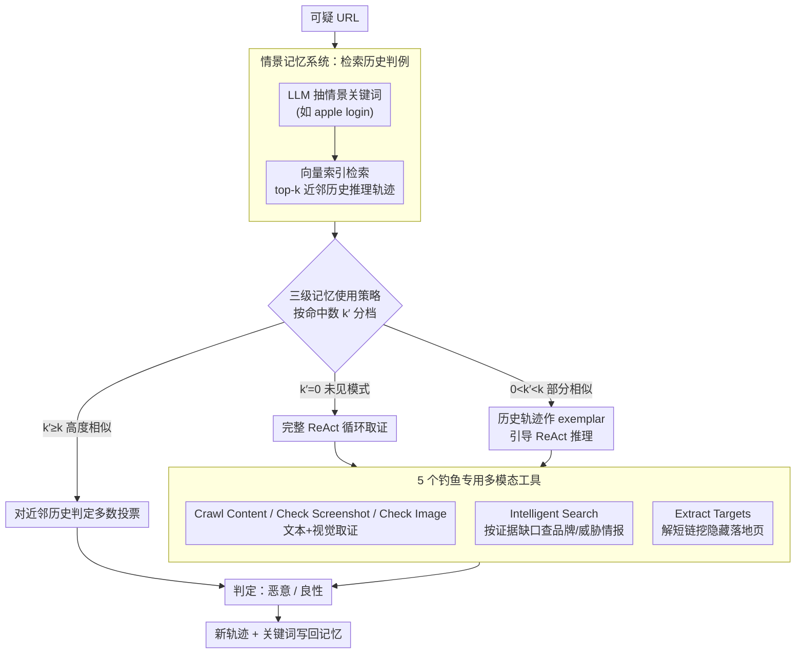

# MemoPhishAgent: Memory-Augmented Multi-Modal LLM Agent for Phishing URL Detection

**会议**: ACL 2026  
**arXiv**: [2602.21394](https://arxiv.org/abs/2602.21394)  
**代码**: [GitHub](https://github.com/XuanChen-xc/MemoPhishAgent)  
**领域**: 安全AI  
**关键词**: 钓鱼检测, LLM智能体, 情景记忆, 多模态推理, 工具调用

## 一句话总结

提出 MemoPhishAgent（MPA），首个专为钓鱼URL检测设计的记忆增强多模态LLM智能体，通过5个专用工具的动态编排和情景记忆系统复用历史推理轨迹，在公开基准上召回率提升13.6%，在真实社交媒体数据上提升20%，并已部署生产环境每周处理约6万高风险URL。

## 研究背景与动机

**领域现状**：钓鱼攻击持续演变，传统防御（静态黑名单、手工启发式规则）对新域名和新手法覆盖不足。基于品牌-域名映射的参考方法改进了鲁棒性但维护成本高，对新品牌和子域名反应滞后。

**现有痛点**：（1）现有LLM方案多为提示式确定性流水线，缺乏自适应证据收集能力；（2）工具使用固定流程（如先OCR再品牌匹配再域名验证），不能根据当前证据状态动态调整；（3）无记忆系统，无法复用历史调查经验，重复分析类似钓鱼模式效率低。

**核心矛盾**：钓鱼攻击是非平稳的——攻击者不断变换策略，但防御系统是无记忆的，每次从零开始分析。

**本文目标**：构建一个能动态调整证据收集策略、从历史调查中学习、并适用于生产环境的钓鱼检测智能体。

**切入角度**：将钓鱼检测建模为多步推理过程——模拟人类专家的调查行为，动态选择工具收集证据。

**核心idea**：5个钓鱼专用多模态工具 + ReAct推理循环 + 情景记忆系统（存储/检索历史推理轨迹），三者结合实现自适应、可学习的钓鱼检测。

## 方法详解

### 整体框架

MPA接收可疑URL列表，每个URL通过Agent处理：（1）动态选择5个专用工具收集多模态证据（文本+视觉+外部知识）；（2）在ReAct循环中进行多步推理，基于当前证据状态决定下一步行动；（3）利用情景记忆检索相似历史案例，加速判断或提供exemplar引导。最终输出"恶意"或"良性"判定。

### 关键设计

**1. 5 个钓鱼专用多模态工具：把人类专家的取证手段拆成可调度的原子动作**

通用 agent 工具不贴钓鱼场景——它们不会去读全页截图里的伪造登录框，也不会顺着短链挖出隐藏的重定向目标。MPA 因此自造了 5 个工具，覆盖文本、视觉、外部知识、嵌套攻击面四个维度：Crawl Content 把页面正文抽成 Markdown 文本，Check Screenshot 对全页截图做整体分析，Check Image 做细粒度图像检查（如比对品牌 logo 真伪），这三者构成多模态证据；Intelligent Search 不是傻搜域名，而是基于当前已收集到的证据动态拼出查询语句去拿最新的品牌/威胁情报；Extract Targets 则专门提取重定向目标和子链接，把 URL shortener、`sites.google.com` 这类平台托管路径背后的真实落地页挖出来做深层检查。

工具之所以这样切分，是因为钓鱼的证据天然散落在不同模态：纯文本检测漏掉视觉仿冒，纯视觉又读不懂跳转逻辑。五个工具各管一摊、互补成网，agent 就能按当前线索缺口去补对应那一类证据，而不是被钉死在固定取证顺序上。

**2. 情景记忆系统：把重复的调查变成可复用的判例**

钓鱼攻击的一大特点是高度重复——同一套攻击模板会被反复套用到不同受害者身上，每次都从零分析既慢又浪费。情景记忆系统就是为吃掉这部分重复而设计：每处理完一个页面，用 LLM 把它压成一组紧凑关键词（如 "apple login"、"wallet connect"）作为 episodic key，连同完整推理轨迹一起嵌入向量索引。来新 URL 时先抽同样的关键词、检索 top-$k$ 近邻，命中的历史轨迹就成了现成判例。随着部署时间拉长，记忆库越攒越厚，能直接复用的旧案例比例越来越高，这也是它几乎零额外算力却能大幅提速的来源。

**3. 三级记忆使用策略：让记忆当顾问，而不是当法官**

记忆若用得太狠会反客为主——直接拿旧结论拍板，遇到变种攻击就会误判。MPA 因此按检索命中数 $k'$（top-$k$ 里真正相似的条数）分三档收放：$k'=0$ 说明是没见过的新模式，走完整 ReAct 循环从头取证；$0 < k' < k$ 是部分相似，把检索到的历史轨迹当 in-context exemplar 喂进去引导推理，但仍让 agent 自己下结论；$k' \ge k$ 才是高度相似，直接对这些近邻的历史判定做多数投票快速出结果。这条梯度的核心是把记忆定位成"上下文指导"而非"思考替身"，既靠投票吃掉重复模式的速度红利，又靠完整推理兜住未见模式的可靠性。

### 一个完整示例：一条仿冒 Apple 登录的短链怎么被判死

假设来了一条 `bit.ly/xxx` 短链。Agent 先调 Extract Targets 顺着短链解出真实落地页 `apple-id-verify.weebly.com`；再调 Crawl Content 抽出正文，发现满屏 "Sign in to Apple ID" 字样；Check Screenshot 对全页截图一看，登录框、Apple logo 排版高度仿真；Check Image 进一步比对 logo，发现像素级瑕疵和官方资源对不上。此时 agent 用这些证据抽出关键词 "apple login / weebly host / id verify" 去查情景记忆——若命中数 $k' \ge k$（之前已存过多条同模板的 Apple 仿冒判例），直接多数投票判"恶意"，省掉 Intelligent Search 那一步外部查询；若只部分命中（$0<k'<k$），就把旧轨迹当 exemplar，再补一次 Intelligent Search 确认 `weebly.com` 不是 Apple 官方域名后下判定；若完全没命中（$k'=0$），则走满整套 ReAct 取证后判定，并把这条新轨迹连同关键词写回记忆，供后续同模板攻击直接复用。

## 实验关键数据

### 主实验

| 方法 | TR-OP Recall | DynaPD Recall | 速度(s/URL) |
|------|------------|-------------|-----------|
| MPA | **93.4%** | **93.6%** | **4.46** |
| PhishLLM | ~80% | ~88% | 14.2 |
| MLLM | ~82% | ~85% | 5.1 |
| URLTran | ~86% | — | 2.8(含训练) |

### 消融实验

| 配置 | 关键指标 | 说明 |
|------|---------|------|
| 完整MPA | 93.4% Recall | 所有组件 |
| - 记忆系统 | -27% Recall | 记忆贡献最大 |
| - 工具设计 | 性能下降 | 专用工具优于通用工具 |
| 提示式基线 | 较差 | 固定流程不如自适应选择 |

### 关键发现
- 情景记忆贡献高达27%的召回率提升，且不增加额外计算开销
- MPA是所有方法中最快的（4.46s/URL），因为记忆系统跳过了大量重复分析
- 在真实社交媒体数据（SocPhish）上召回率提升20%，说明在真实场景中优势更大
- 生产部署每周处理~60K高风险URL，实现91.44%召回率
- URL shorteners和平台托管路径（如sites.google.com）是传统方法的盲区，MPA通过多模态工具克服

## 亮点与洞察
- **已部署生产环境**：不仅是学术工作，已在Amazon生产环境中保护百万用户，说服力强
- **情景记忆的效果惊人**：27%召回率提升且不增加计算——因为对重复模式直接投票，减少了LLM调用
- **工具设计专业且互补**：5个工具从文本/视觉/搜索/链接四维度收集证据
- **三级记忆策略平衡了效率和准确性**：对未见模式完整分析，对已见模式快速决策

## 局限与展望
- **依赖外部LLM API**：Claude-3-Sonnet的延迟和成本
- **记忆系统可能被污染**：如果早期错误判断被存入记忆，可能影响后续决策
- **仅关注钓鱼URL**：其他安全威胁（如恶意软件分发）未覆盖
- 未来方向：记忆自我修正机制、扩展到更多安全威胁类型、轻量化本地模型替代API

## 相关工作与启发
- **vs PhishLLM**：使用LLM做品牌提取+意图识别，但仍是固定流程；MPA动态选择工具
- **vs Cao et al. (2025)**：多模态LLM钓鱼检测但固定证据获取流程，无记忆
- **vs 通用Agent框架**：使用通用工具和推理，MPA的钓鱼专用工具更有效

## 评分
- 新颖性: ⭐⭐⭐⭐ 首个钓鱼专用的记忆增强LLM Agent，情景记忆系统设计精巧
- 实验充分度: ⭐⭐⭐⭐⭐ 两个公开基准+真实社交媒体数据+生产部署验证，消融全面
- 写作质量: ⭐⭐⭐⭐ 威胁模型定义清晰，系统架构图直观
- 价值: ⭐⭐⭐⭐⭐ 已在生产环境验证，对安全AI有直接应用价值

<!-- RELATED:START -->

## 相关论文

- [\[ACL 2026\] Knowledge Poisoning Attacks on Medical Multi-Modal Retrieval-Augmented Generation](knowledge_poisoning_attacks_on_medical_multi-modal_retrieval-augmented_generatio.md)
- [\[ACL 2026\] Privacy-R1: Privacy-Aware Multi-LLM Agent Collaboration via Reinforcement Learning](privacy-r1_privacy-aware_multi-llm_agent_collaboration_via_reinforcement_learnin.md)
- [\[ACL 2025\] Unveiling Privacy Risks in LLM Agent Memory](../../ACL2025/llm_safety/mextra_agent_memory_privacy.md)
- [\[ACL 2026\] XMark: Reliable Multi-Bit Watermarking for LLM-Generated Texts](xmark_reliable_multi-bit_watermarking_for_llm-generated_texts.md)
- [\[ACL 2026\] Rethinking LLM Watermark Detection in Black-Box Settings: A Non-Intrusive Third-Party Framework](rethinking_llm_watermark_detection_in_black-box_settings_a_non-intrusive_third-p.md)

<!-- RELATED:END -->
